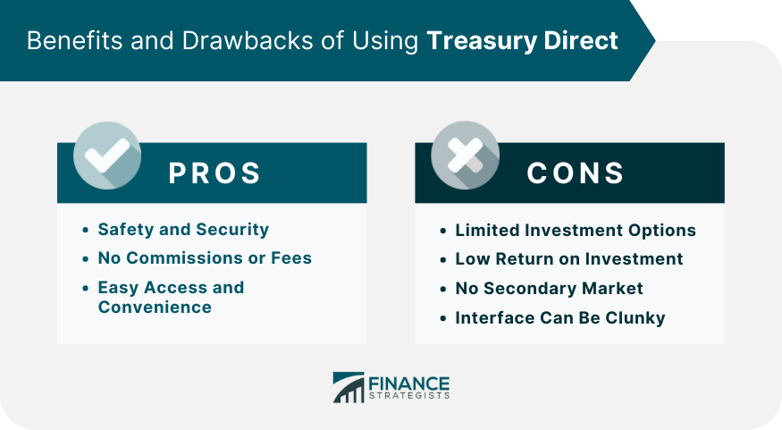

## Table of Contents

## What is TreasuryDirect?

TreasuryDirect is a website run by the U.S. Department of the Treasury. It lets people buy and manage U.S. government securities like savings bonds and Treasury bills directly from the government. You don't need to go through a bank or a broker. This makes it easier and cheaper for people to invest in these safe investments.

Using TreasuryDirect, you can set up an account for free and buy different types of securities. You can choose how much you want to invest and when you want your money back. The website is user-friendly and helps you keep track of your investments. It's a good option for anyone looking to save money safely over time.

## How does one set up an account on TreasuryDirect?

To set up an account on TreasuryDirect, you need to visit their website and click on the "Open an Account" button. You'll need to provide some personal information like your name, address, Social Security number, and email address. Make sure you have a valid U.S. address because TreasuryDirect only serves U.S. residents. You'll also need to create a username and password, and set up security questions to keep your account safe.

After you enter your information, you'll need to verify your identity. TreasuryDirect will send you a one-time passcode to your email or phone. Enter this code on the website to confirm it's really you. Once your identity is verified, you can log into your new account and start buying securities. The whole process is pretty straightforward and should only take a few minutes if you have all your information ready.

## What types of securities can be purchased through TreasuryDirect?

Through TreasuryDirect, you can buy different types of U.S. government securities. The main ones are Treasury bills, Treasury notes, Treasury bonds, and savings bonds. Treasury bills, or T-bills, are short-term securities that mature in a few weeks to a year. Treasury notes, or T-notes, last from two to ten years. Treasury bonds, or T-bonds, are long-term and can go up to 30 years. Savings bonds are meant for long-term saving and come in two types: Series EE and Series I.

Each type of security has its own features. T-bills are sold at a discount and don't pay interest until they mature. T-notes and T-bonds pay interest every six months until they mature. Series EE savings bonds earn a fixed rate of interest, while Series I savings bonds have a rate that changes with inflation. All these securities are backed by the U.S. government, which makes them very safe investments. You can buy them directly on TreasuryDirect without needing a bank or broker, which can save you money on fees.

## How does the bidding process work on TreasuryDirect?

When you want to buy Treasury securities on TreasuryDirect, you can choose between two types of bids: non-competitive and competitive. A non-competitive bid is the easier way to go. You just tell TreasuryDirect how much money you want to invest, and you're guaranteed to get the securities. You'll get them at the same [interest rate](/wiki/interest-rate-trading-strategies) everyone else gets, which is set at the auction. This is good if you just want to invest without worrying about the details.

A competitive bid is a bit more complicated. You have to say what interest rate you're willing to accept. If your rate is lower than or the same as the rate set at the auction, you'll get the securities. But if your rate is too high, you might not get any. Competitive bidding is for people who want to try to get a better deal, but it's riskier because you might not get the securities if your bid is too high. Most people on TreasuryDirect use non-competitive bids because they're simpler and safer.

## What are the minimum and maximum investment limits on TreasuryDirect?

On TreasuryDirect, the minimum amount you can invest depends on the type of security you want to buy. For Treasury bills, notes, and bonds, the minimum is $100. For savings bonds, it's even less - you can start with just $25 for Series EE and Series I bonds. This makes it easy for almost anyone to start investing, no matter how much money they have.

The maximum amount you can invest also varies. For non-competitive bids, you can buy up to $10 million in Treasury bills, notes, and bonds at each auction. For savings bonds, you can buy up to $10,000 in electronic Series EE and Series I bonds each year. If you want to invest more than these limits, you might need to use competitive bids or spread your investments over time.

## How are payments and interest handled on TreasuryDirect?

When you buy securities on TreasuryDirect, you can pay using a bank account that you link to your TreasuryDirect account. You can set up automatic payments so your money goes straight to TreasuryDirect when it's time to buy more securities. Once you've paid, your money is safe and you'll get it back when your security matures. If you need to take your money out early, you might have to pay a penalty depending on the type of security you have.

For interest, it depends on the kind of security you buy. Treasury bills don't pay interest until they mature, so you get all your interest at once. Treasury notes and bonds pay interest every six months. You can choose to have this interest added to your TreasuryDirect account or sent to your bank. Savings bonds are different. Series EE bonds pay a fixed rate, and Series I bonds change with inflation. The interest on savings bonds is added to the bond every six months, but you don't get the money until you cash in the bond.

## What are the fees associated with using TreasuryDirect?

Using TreasuryDirect is really cheap. There are no fees to open an account or to buy securities. This makes it a good choice for people who want to save money on fees. You can buy all kinds of U.S. government securities without paying any extra money to a bank or a broker.

The only time you might have to pay a fee is if you need to take your money out early from certain securities like Treasury notes or bonds. This is called a penalty. But if you hold onto your securities until they mature, you won't have to pay any fees at all. So, if you can wait until your investment is ready, you can keep all your money.

## How does TreasuryDirect ensure the security of investments?

TreasuryDirect takes a lot of steps to keep your investments safe. They use strong security measures like encryption to protect your personal information and your money. When you log in, you have to use a password and answer security questions. They also send you a one-time passcode to your email or phone to make sure it's really you. This helps stop anyone else from getting into your account.

All the securities you buy on TreasuryDirect are backed by the U.S. government. This means they are very safe investments. The government promises to pay you back when your securities mature. So, even if something goes wrong with the website, your money is still safe because it's guaranteed by the government.

## Can TreasuryDirect accounts be managed by multiple users?

Yes, TreasuryDirect accounts can be managed by multiple users. You can set up a linked account for someone else, like a family member or a friend. This lets them see your account and do things like buy securities or check on your investments. But you have to be careful because they will be able to see everything in your account.

To set up a linked account, you need to go into your TreasuryDirect account and add the other person. You'll need their personal information like their name and Social Security number. Once you add them, they can log in with their own username and password. This way, you can both manage the account together, but you should only do this with people you trust completely.

## What are the tax implications of investing through TreasuryDirect?

When you invest through TreasuryDirect, you need to know about taxes. The interest you earn from Treasury securities like bills, notes, bonds, and savings bonds is usually taxable at the federal level. This means you have to report this interest on your federal tax return and pay taxes on it. But there's good news: the interest from these securities is not taxed by state and local governments. So, you don't have to worry about state or local taxes on your TreasuryDirect earnings.

For savings bonds, there's a special rule. If you use the money from Series EE or Series I savings bonds to pay for higher education, you might not have to pay federal taxes on the interest. This is called the education tax exclusion. To use this, you need to meet certain rules, like using the money for tuition and fees at an eligible school. It's a good idea to talk to a tax professional to make sure you're doing everything right and taking advantage of all the tax benefits you can.

## How does TreasuryDirect compare to other investment platforms in terms of functionality and benefits?

TreasuryDirect is different from other investment platforms because it lets you buy U.S. government securities directly from the government. This means you don't have to pay fees to banks or brokers, which can save you money. Other platforms might charge you for buying and selling investments, but TreasuryDirect is free to use. Also, TreasuryDirect is very safe because all the securities are backed by the U.S. government. This makes it a good choice if you want a safe place to save your money over time.

Compared to other platforms, TreasuryDirect is simpler and more focused. Other investment platforms might offer a lot more options, like stocks, mutual funds, and cryptocurrencies. These platforms can be good if you want to try different kinds of investments and take more risks. But if you just want to invest in safe, government-backed securities, TreasuryDirect is easier to use and understand. It's perfect for people who want to save money without worrying about complicated investments or high fees.

## What advanced features does TreasuryDirect offer for experienced investors?

TreasuryDirect offers some advanced features that can be useful for experienced investors. One of these is the ability to make competitive bids on Treasury securities. This means you can try to get a better interest rate by bidding on what rate you're willing to accept. It's a bit riskier because you might not get the securities if your bid is too high, but it can be a good way to try to get a better deal. Experienced investors who understand how auctions work might find this feature helpful.

Another advanced feature is the option to reinvest interest and principal automatically. When your securities mature or pay interest, you can set up your account to automatically buy more securities with that money. This can help you keep your money growing without having to do anything extra. It's a good tool for investors who want to keep their investments going without having to check on them all the time.

## References & Further Reading

[1]: ["TreasuryDirect: Home"](https://www.treasurydirect.gov/). U.S. Department of the Treasury. 

[2]: Murcko, T. (n.d.). ["Investopedia - Government Bonds"](https://www.investopedia.com/terms/g/government-bond.asp). Investopedia.

[3]: Murphy, C. (n.d.). ["Investopedia - Algorithmic Trading"](https://www.fool.com/terms/a/algorithmic-trading/). Investopedia.

[4]: Lopez de Prado, M. (2018). ["Advances in Financial Machine Learning"](https://www.amazon.com/Advances-Financial-Machine-Learning-Marcos/dp/1119482089). John Wiley & Sons.

[5]: McKinlay, A.C., & Campbell, J.Y. (1997). ["The Econometrics of Financial Markets"](https://archive.org/details/econometricsoffi0000camp). Princeton University Press.

[6]: Chan, E. P. (2009). ["Quantitative Trading: How to Build Your Own Algorithmic Trading Business"](https://github.com/ftvision/quant_trading_echan_book). John Wiley & Sons.

[7]: Shiller, R. J. (n.d.). ["Yale School of Management - Financial Markets (Open Course)"](https://oyc.yale.edu/economics/econ-252). Yale University. 

[8]: Jansen, S. (2020). ["Machine Learning for Algorithmic Trading: Second Edition"](https://www.amazon.com/Machine-Learning-Algorithmic-Trading-alternative/dp/1839217715). Packt Publishing.