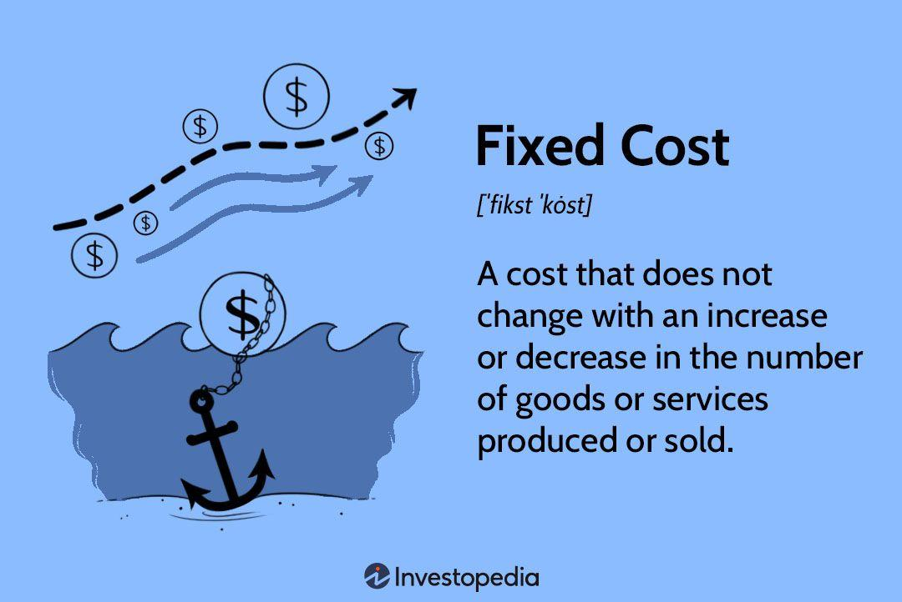

## Table of Contents

## What are fixed costs in cost accounting?

Fixed costs in cost accounting are expenses that do not change with the level of production or sales. These costs stay the same whether a company makes a lot of products or just a few. Examples of fixed costs include rent for a factory, salaries for employees, and insurance. These costs are important for businesses to know because they need to cover them no matter how much they produce.

Understanding fixed costs helps businesses plan better. For example, if a company knows its fixed costs, it can figure out how many products it needs to sell to start making a profit. This is called the break-even point. By managing fixed costs well, a business can become more stable and predictable, which is good for long-term planning and growth.

## How are fixed costs different from variable costs?

Fixed costs and variable costs are two types of expenses that businesses have. Fixed costs are the costs that stay the same no matter how much a business produces or sells. For example, if a company pays $1,000 a month for rent, that cost doesn't change whether they make 100 products or 1,000 products. Fixed costs include things like rent, salaries for employees, and insurance. These costs are important because a business has to pay them even if it doesn't make any sales.

On the other hand, variable costs change depending on how much a business produces or sells. If a company makes more products, its variable costs go up. For example, the cost of materials like wood or metal will increase if a company decides to make more furniture. Variable costs include things like raw materials, direct labor, and shipping costs. Understanding the difference between fixed and variable costs helps businesses plan better and figure out how to make a profit.

## Why is the treatment of fixed costs important in cost accounting?

The treatment of fixed costs is important in cost accounting because it helps businesses understand their basic expenses. Fixed costs are the costs that stay the same no matter how much a business produces or sells. Knowing these costs helps a company figure out how much money it needs to make just to cover these expenses. This is called the break-even point. If a business knows its fixed costs, it can plan better and make sure it doesn't lose money.

Also, understanding fixed costs helps businesses make decisions about pricing and production. If a company knows its fixed costs, it can set prices that will cover these costs and still make a profit. It can also decide if it's worth it to produce more or less of a product. By managing fixed costs well, a business can become more stable and predictable, which is good for long-term planning and growth.

## How are fixed costs typically allocated in a business?

Fixed costs are usually spread out across different parts of a business. This is called allocation. For example, if a company pays $1,000 a month for rent, it might decide to split that cost between different departments like sales, production, and administration. This helps the company understand how much each part of the business is really costing to run.

Sometimes, fixed costs are allocated based on how much each department uses the resources. For example, if the production department uses more space in the building, it might be given a bigger share of the rent cost. Other times, fixed costs might be split evenly among departments, especially if it's hard to figure out who uses what. This way, everyone shares the cost fairly and the business can keep track of expenses more easily.

## What methods are used to allocate fixed costs to products or services?

One way to allocate fixed costs to products or services is by using the direct method. This means you look at how much each product or service uses the fixed costs. For example, if a factory makes two products and one product takes up more space in the factory, it might get a bigger share of the rent cost. This helps the business see how much each product really costs to make.

Another way is to use the step-down method. This method starts by allocating costs to the departments that use them the most and then moves on to other departments. For example, if the maintenance department uses a lot of the factory's space, it might get a big share of the rent first. Then, the costs are spread to other departments like production and sales based on how much they use the maintenance services. This method tries to be fair by giving costs to the departments that use them the most first.

A third way is the activity-based costing (ABC) method. This method looks at the activities that cause costs and then allocates the costs to products based on how much they use those activities. For example, if setting up machines is a big activity in the factory, the costs of setting up machines would be spread to products based on how often they need to be set up. This method can be more accurate but also more complicated because it needs a lot of information about what each product does.

## Can fixed costs impact pricing strategies? How?

Fixed costs can impact pricing strategies because they are the costs that a business has to pay no matter how much it sells. If a business knows its fixed costs, it can figure out the lowest price it can charge for its products and still make enough money to cover those costs. This is called the break-even price. If the business sets its prices too low, it won't make enough money to pay for the fixed costs, and it might lose money. So, understanding fixed costs helps a business set prices that will keep it from losing money.

Also, fixed costs can affect how a business decides to grow or change its products. If a business wants to make more products, it needs to think about how the fixed costs will spread out over more items. This can lower the cost per item, which might let the business lower its prices and sell more. But if the business can't sell enough to cover the fixed costs, it might need to raise prices instead. By understanding fixed costs, a business can make smart choices about pricing that help it grow and stay profitable.

## How do fixed costs affect the break-even analysis?

Fixed costs are really important when a business does a break-even analysis. Break-even analysis helps a business figure out how many products it needs to sell to cover all its costs and start making a profit. Fixed costs are the costs that don't change no matter how much the business sells, like rent or salaries. When a business knows its fixed costs, it can add them up and then figure out how many products it needs to sell at a certain price to cover those costs. This helps the business set goals and plan better.

For example, if a business has fixed costs of $1,000 a month and it sells a product for $10, it needs to sell at least 100 products to break even. That's because $1,000 divided by $10 is 100. If the business sells fewer than 100 products, it won't make enough money to cover the fixed costs. But if it sells more than 100 products, it will start making a profit. Understanding fixed costs helps the business know exactly how many products it needs to sell to avoid losing money.

## What challenges do businesses face when managing fixed costs?

Managing fixed costs can be tough for businesses because these costs stay the same no matter how much the business sells. If a business doesn't sell enough products, it might struggle to pay for things like rent and salaries. This can be a big problem, especially for new businesses or during times when sales are low. It's hard to cut down on fixed costs quickly because they are often tied to long-term agreements, like leases or contracts.

Another challenge is that fixed costs can make it hard for a business to grow. If a business wants to make more products, it might need to spend more on fixed costs, like renting a bigger space or hiring more staff. This can be risky because the business needs to sell a lot more to cover these higher costs. If it can't, it might end up losing money. So, businesses need to plan carefully and make sure they can handle the fixed costs before they decide to grow.

## How does the treatment of fixed costs vary in different industries?

The way businesses handle fixed costs can be different depending on the industry they are in. For example, in the manufacturing industry, fixed costs like rent for factories and salaries for workers are really important. These costs stay the same no matter how many products the company makes. So, a manufacturing business needs to make sure it sells enough to cover these costs. If it doesn't, it might lose money. On the other hand, in the service industry, like a restaurant, fixed costs might include things like rent for the space and salaries for the staff. But these businesses can sometimes change their hours or the number of staff to manage these costs better.

In the tech industry, fixed costs might include things like office rent and salaries for developers. But tech companies often have high fixed costs because they need to keep investing in research and development. This means they need to plan carefully to make sure they can cover these costs and still make a profit. In the retail industry, fixed costs like rent for stores and salaries for employees are also important. But retail businesses can sometimes move to smaller spaces or use online sales to manage these costs better. Each industry has its own way of dealing with fixed costs, and businesses need to understand these differences to stay successful.

## What are some advanced techniques for analyzing fixed costs?

One advanced technique for analyzing fixed costs is called regression analysis. This method helps businesses figure out how their fixed costs might change over time or with different levels of production. By looking at past data, businesses can use regression analysis to predict future fixed costs. This can be really helpful for planning and making sure the business can cover its costs. For example, if a business sees that its rent costs are going up every year, it can use regression analysis to predict how much rent will cost next year and plan its budget accordingly.

Another technique is cost-volume-profit (CVP) analysis. This method looks at how changes in costs and volume of sales affect a business's profit. By understanding fixed costs, a business can use CVP analysis to see how many products it needs to sell to break even or make a certain amount of profit. This helps the business set goals and make smart decisions about pricing and production. For example, if a business knows its fixed costs and uses CVP analysis, it can figure out if it should lower prices to sell more products or raise prices to make more profit per product.

## How can fixed costs be optimized to improve profitability?

Fixed costs can be optimized to improve profitability by carefully managing and reducing them where possible. One way to do this is by negotiating better deals on long-term contracts, like rent or insurance. If a business can lower its rent by moving to a smaller space or finding a cheaper location, it can save money on fixed costs. Another way is by using technology to automate some tasks, which can reduce the need for as many employees and lower salary costs. By finding ways to cut down on fixed costs, a business can keep more of its money and improve its profits.

Another approach to optimizing fixed costs is by spreading them out over more products or services. If a business can increase its production without increasing its fixed costs, it can lower the cost per item. For example, if a factory makes more products but doesn't need a bigger space or more staff, the fixed costs like rent and salaries are spread out over more items. This can help the business lower its prices and sell more, which can lead to higher profits. By understanding and managing fixed costs well, a business can become more efficient and profitable.

## What role do fixed costs play in long-term strategic planning?

Fixed costs are really important for long-term strategic planning because they help businesses know how much money they need to make just to stay open. These costs, like rent and salaries, don't change no matter how much a business sells. So, when a business is planning for the future, it needs to think about how it will cover these costs. If a business wants to grow, it might need to spend more on fixed costs, like renting a bigger space or hiring more staff. This means the business needs to plan carefully to make sure it can sell enough to cover these higher costs and still make a profit.

Understanding fixed costs also helps businesses make smart decisions about where to spend their money. For example, if a business knows its fixed costs, it can decide if it's worth it to invest in new equipment or open a new location. By managing fixed costs well, a business can become more stable and predictable, which is good for long-term planning. This way, the business can focus on growing and making more profit without worrying about not being able to pay its basic expenses.

## References & Further Reading

Bergstra, J., Bardenet, R., Bengio, Y., & Kégl, B. (2011). Algorithms for Hyper-Parameter Optimization. This paper discusses methods to optimize hyper-parameters, crucial for enhancing algorithmic trading models' performance. The optimization of hyper-parameters is a critical aspect of tuning trading algorithms for improved accuracy and efficiency.

Lopez de Prado, M. (2018). Advances in Financial Machine Learning. This book covers the intersection of machine learning and finance, providing insights into developing, optimizing, and applying sophisticated algorithms in financial markets. It includes practical strategies for managing costs related to technology and infrastructure in algorithmic trading.

Kaplan, R. S., & Anderson, S. R. (2007). Time-Driven Activity-Based Costing: A Simpler and More Powerful Path to Higher Profits. This work introduces time-driven activity-based costing, offering a simplified approach to cost management which can be highly beneficial for trading firms aiming to balance fixed and variable costs effectively.

Further resources are available from industry publications and academic journals on financial management and algorithmic trading. These additional resources can guide trading firms in developing strategies that integrate cost accounting principles with technological innovation, ensuring firms remain competitive and financially sustainable in dynamic market environments.

