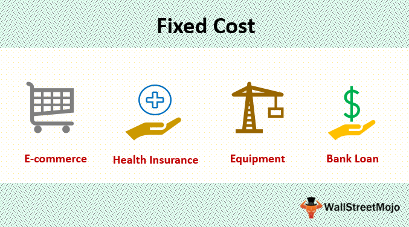

In the rapidly evolving financial landscape, understanding the nuances of cost accounting is essential for businesses, particularly in algorithmic trading. Fixed costs play a pivotal role in shaping budgetary strategies and financial planning. In algorithmic trading, where precision and speed are paramount, managing fixed costs can significantly influence a firm's ability to sustain operations and invest in the necessary technology and infrastructure.

Cost management, which involves analyzing and controlling expenditures, is crucial for maintaining profitability and a competitive edge. It encompasses both fixed and variable costs; however, fixed costs remain constant regardless of production levels, making them a critical factor in financial planning. These costs, which include items such as rent, salaries, and insurance, provide a stable foundation for businesses, but they also require careful management to ensure they do not hinder financial flexibility.



This article explores the intersection of cost management, fixed costs, and algorithmic trading, emphasizing their collective importance in maintaining profitability and competitive edge. Algorithmic trading, characterized by the use of advanced computational models and algorithms, incurs substantial fixed costs. These are associated with the acquisition and maintenance of high-performance computing systems, software development, and adherence to regulatory requirements. Efficient management of these costs is essential for optimizing trade execution and ensuring long-term sustainability.

Understanding and strategically managing fixed costs can lead to enhanced financial outcomes. Businesses that effectively allocate resources towards the management of fixed costs can maintain agility and ensure resilience in dynamic financial markets. By exploring these financial concepts, we aim to provide comprehensive insights and actionable strategies for enhancing financial outcomes through effective cost management.

## Table of Contents

## Understanding Cost Accounting and Fixed Costs

Cost accounting is a critical component in the framework of financial management, providing businesses with the analytical capability to assess, manage, and optimize production costs, thereby enhancing profitability. The core objective of cost accounting is to equip organizations with the tools needed to control and reduce costs, facilitate decision-making, and formulate strategic plans for sustainable growth. 

Primarily, cost accounting involves the detailed examination of both fixed and variable costs. Variable costs, such as raw materials and production supplies, fluctuate with the level of output and directly impact the cost of goods sold. In contrast, fixed costs are those consistent expenses necessary for maintaining operations, irrespective of production levels. Examples of fixed costs include rent, salaries of permanent staff, and insurance premiums. These costs remain unchanged over a specific period, offering stability in financial projections and facilitating long-term budget planning. 

Fixed costs are critical to effective cost management as they provide a predictable baseline for financial planning. An understanding of fixed costs enables businesses to allocate resources more effectively, ensuring that core operational expenses are covered regardless of variations in production volumes. Successfully managing these costs also allows for accurate break-even analysis, a vital tool in financial strategy that determines the level of sales necessary to cover total fixed and variable costs, thereby informing pricing and production decisions.

In cost accounting, the distinction between fixed and variable costs assists in crafting strategies to enhance operational efficiency. By identifying and categorizing these expenses, businesses can prioritize their efforts on cost control measures that either minimize fixed costs or optimize variable costs relative to output. For example, engaging in lease negotiation to reduce rental expenses, or implementing energy efficiency initiatives to lower utility bills, can result in tangible cost savings.

The strategic management of fixed costs, alongside variable costs, is foundational to maintaining competitive advantage. Organizations must implement effective cost-control measures, emphasizing both the monitoring and analysis of fixed costs to ensure they remain aligned with business objectives and market conditions. This allows for proactive adjustments in operational strategies, adapting to changes in external economic environments while maintaining profitability.

In summary, understanding and managing fixed costs within the domain of cost accounting is a vital practice for enhancing financial accuracy and strategic planning. By ensuring consistent expense analysis and implementing focused cost management strategies, businesses can achieve financial stability, reduce unnecessary expenditures, and enhance their overall economic performance.

## The Role of Fixed Costs in Algorithmic Trading

Algorithmic trading involves executing orders using automated and programmable trading instructions to account for variables such as time, price, and [volume](/wiki/volume-trading-strategy). The automation of trading strategies introduces significant fixed costs, particularly connected to the necessary technology infrastructure, software, and regulatory compliance. These costs remain constant regardless of the volume of transactions executed.

A crucial aspect of managing fixed costs in [algorithmic trading](/wiki/algorithmic-trading) involves investing in robust technology infrastructure. This encompasses high-performance computing servers to process complex algorithms at high speeds and with low latency, which is vital for effective trading in competitive markets. The associated expenses for these servers constitute a substantial proportion of a firm's fixed costs. For instance, the acquisition and maintenance of servers, along with the associated power and cooling costs, represent ongoing expenditures that require careful planning and budgeting.

Software licenses associated with advanced trading platforms and analytics tools also contribute significantly to fixed costs. These platforms are essential for developing and [backtesting](/wiki/backtesting) algorithms, processing large datasets, and executing trades. Moreover, the need for continual updates and maintenance of this software to keep pace with technological advancements and regulatory changes further solidifies these expenses as fixed costs.

Another layer of fixed costs in algorithmic trading arises from regulatory compliance. Trading firms must adhere to a plethora of regulations, necessitating investments in compliance infrastructure, which includes software for trade surveillance and reporting, as well as personnel costs for compliance officers. These regulatory requirements ensure market integrity but can impose significant financial burdens on trading firms.

Effectively managing these fixed costs is vital for optimizing trading operations. By ensuring a stable financial infrastructure, trading firms can focus resources on algorithm development and execution, aiming to enhance trading performance and profitability. Implementing cost-effective measures, such as scaling up technology infrastructure as trading volumes increase or using cloud services to minimize upfront capital expenditures, can alleviate the financial pressure exerted by fixed costs.

Strategically managing fixed costs also enables trading firms to maintain operational efficiency and a competitive advantage. For example, by optimizing server utilization and investing in scalable software solutions, firms can adapt more readily to market changes and client demands without incurring additional fixed costs. Furthermore, regulatory technology solutions (RegTech) can automate compliance processes, reducing the cost burden while maintaining adherence to regulatory requirements.

In summary, while fixed costs in algorithmic trading present significant challenges, effective management of these expenses is integral to ensuring sustained operational efficiency and maintaining competitiveness in the fast-paced trading environment.

## Cost Management Strategies in Trading

To enhance operational efficiency, trading firms must employ robust cost management strategies that address both fixed and variable costs. Strategically managing these expenses ensures optimal use of resources and maximizes profitability.

One effective strategy is investing in high-performance technology. Trading systems rely heavily on computational power and data processing capabilities. By investing in advanced technology infrastructure and optimizing both server and software usage, firms can achieve lower latency and higher processing speeds, thereby reducing unnecessary expenditures. This approach not only augments performance but also contributes to significant operational cost savings. For instance, cloud computing solutions can offer scalable resources that align with trading demands, ensuring cost-effectiveness and flexibility.

Incorporating cost drivers into algorithmic trading frameworks is another crucial approach. Cost drivers are the various factors that cause costs to change, and identifying these within the trading ecosystem allows for better resource allocation. By understanding the relationship between specific trading activities and their associated costs, firms can develop more efficient algorithms that enhance financial outcomes. For example, analyzing historical trading data to forecast transaction costs can help in adapting trading strategies that minimize expenses.

Additionally, employing predictive analytics and [machine learning](/wiki/machine-learning) techniques can further refine cost management strategies. By leveraging data-driven insights, firms can forecast market trends and adjust their trading algorithms accordingly, ensuring cost efficiency while maintaining or improving trading profitability. Implementing machine learning models to predict [volatility](/wiki/volatility-trading-strategies) or transaction costs can lead to better decision-making regarding trade execution and timing.

In summary, robust cost management in trading involves strategic investment in technology and the integration of cost drivers into trading algorithms. These practices not only optimize resource allocation but also contribute to improved financial outcomes and competitive advantages in the fast-paced trading environment.

## Challenges and Considerations in Fixed Cost Management

Fixed costs, while predictable, necessitate careful management to avert financial challenges, particularly as market dynamics shift. Businesses operating in algorithmic trading face the complexity of managing fixed expenses like technology infrastructure, software licensing, and regulatory compliance fees. These costs, although not directly affected by trading volume, are vital to the firm's operational framework.

Technological advancements present both opportunities and challenges. As new technologies emerge, they can potentially lower operational costs or enhance trading capabilities, thereby altering the structure of fixed costs. Firms must stay abreast of these developments to optimize their cost structures effectively. For example, investing in cloud-based solutions might initially appear costly but could reduce IT overhead in the long run by minimizing on-premise hardware expenses.

Regulatory developments also play a significant role, as they can introduce new compliance costs or change existing ones. Businesses must proactively monitor regulatory changes and adjust their financial strategies accordingly. Maintaining a nimble organizational structure can help absorb these changes without significant financial stress.

Balancing fixed and variable costs is another critical aspect of cost management. To achieve this balance, businesses must strategically allocate resources, ensuring that expenditures align with financial goals and market conditions. This often involves assessing the cost-benefit relationship of fixed investments, such as technology upgrades, against their potential to drive variable cost efficiencies. For example, automated systems may represent a substantial fixed cost initially but can lower variable costs over time by reducing manual intervention in trading processes.

Here's a basic Python simulation example to illustrate balancing costs:

```python
# Simulating cost management
def calculate_costs(fixed_costs, variable_cost_per_trade, num_trades):
    total_variable_cost = variable_cost_per_trade * num_trades
    total_cost = fixed_costs + total_variable_cost
    return total_cost

# Define costs
fixed_costs = 100000  # annual fixed costs in dollars
variable_cost_per_trade = 50  # cost per trade in dollars

# Calculate costs for various trade volumes
trade_volumes = [1000, 5000, 10000]
for trades in trade_volumes:
    total = calculate_costs(fixed_costs, variable_cost_per_trade, trades)
    print(f"Total cost for {trades} trades: ${total}")
```

Continuously evaluating both technological and regulatory landscapes, alongside strategic resource allocation, ensures businesses maintain financial health and agility. This vigilance enables firms to adapt to changes swiftly, preserving competitiveness and promoting sustainable growth despite the inherently stable nature of fixed costs.

## Conclusion

Cost accounting is a fundamental element of financial planning and decision-making, providing businesses with the necessary tools to optimize resources and enhance profitability. Fixed costs, constituting a significant portion of many companies' budgets, require precise management to ensure financial stability and agility. Their consistent nature, unlike variable costs which fluctuate with production levels, allows businesses to develop more predictable and robust financial strategies.

In algorithmic trading, the strategic management of fixed costs is crucial. These costs typically include expenditures on technology infrastructure, such as servers and high-speed connections, specialized software for developing and executing trading algorithms, and compliance-related expenses. By effectively overseeing these fixed costs, firms can channel more resources towards innovation, enabling the development of more sophisticated trading strategies and technologies. This not only improves profitability but also strengthens the firm's competitive position in the market.

The continuous refinement of cost management strategies is essential for maintaining long-term operational success and growth in algorithmic trading. This involves integrating technological advancements and established cost accounting principles. By doing so, firms can enhance resource allocation and decision-making processes, leading to improved financial outcomes. For instance, employing cutting-edge data analytics tools can facilitate the identification of cost drivers, allowing for a more efficient allocation of resources within trading operations.

Adapting to technological changes and evolving regulatory landscapes further emphasizes the need for agile cost management practices. Businesses must remain vigilant in recalibrating their strategies to mitigate risks and capitalize on new opportunities. This perpetual cycle of assessment and adjustment ensures firms are well-equipped to sustain growth and maintain their market position amidst a competitive and fast-paced trading environment.

Ultimately, effective management of fixed costs, supported by robust cost accounting practices, forms the backbone of successful financial planning and operational efficiency. It not only enhances profitability but also positions businesses for sustained growth and innovation, particularly in sectors as dynamic as algorithmic trading.

## References & Further Reading

Bergstra, J., Bardenet, R., Bengio, Y., & Kégl, B. (2011). Algorithms for Hyper-Parameter Optimization. This paper discusses methods to optimize hyper-parameters, crucial for enhancing algorithmic trading models' performance. The optimization of hyper-parameters is a critical aspect of tuning trading algorithms for improved accuracy and efficiency.

Lopez de Prado, M. (2018). Advances in Financial Machine Learning. This book covers the intersection of machine learning and finance, providing insights into developing, optimizing, and applying sophisticated algorithms in financial markets. It includes practical strategies for managing costs related to technology and infrastructure in algorithmic trading.

Kaplan, R. S., & Anderson, S. R. (2007). Time-Driven Activity-Based Costing: A Simpler and More Powerful Path to Higher Profits. This work introduces time-driven activity-based costing, offering a simplified approach to cost management which can be highly beneficial for trading firms aiming to balance fixed and variable costs effectively.

Further resources are available from industry publications and academic journals on financial management and algorithmic trading. These additional resources can guide trading firms in developing strategies that integrate cost accounting principles with technological innovation, ensuring firms remain competitive and financially sustainable in dynamic market environments.

