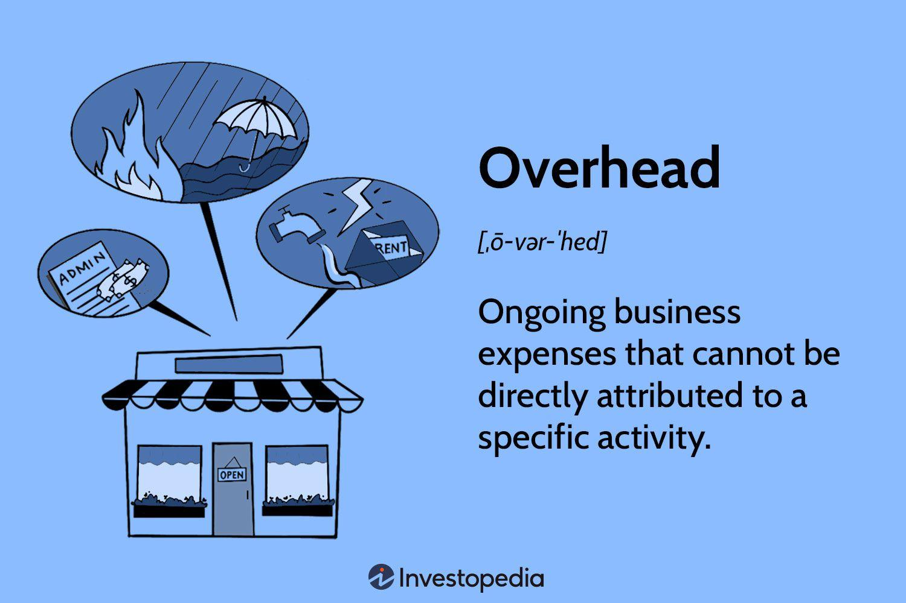

## Table of Contents

## What are overhead expenses in cost accounting?

Overhead expenses in cost accounting are the costs that a business has to pay, but they are not directly linked to making a specific product or service. These costs are necessary for the business to keep running smoothly. Examples of overhead expenses include rent for the office, utilities like electricity and water, and salaries for employees who do not work directly on the products, like managers and administrative staff.

Understanding overhead expenses is important because they affect the overall cost of running a business. Even though these costs do not directly contribute to making a product, they still need to be managed carefully. If overhead expenses are too high, they can reduce the profit the business makes. Therefore, businesses often try to keep these costs under control by finding ways to save money on things like rent or utilities.

## How are overhead expenses different from direct costs?

Overhead expenses and direct costs are two different types of costs in a business. Direct costs are the expenses that you can easily link to making a specific product or service. For example, if you are making a cake, the cost of the flour, sugar, and eggs you use are direct costs because they are directly used to make the cake.

On the other hand, overhead expenses are costs that are not directly tied to making a specific product or service. These are the costs that keep the business running but do not go into the product itself. For instance, the rent for the bakery where you make the cake, the electricity to run the ovens, and the salary of the manager who oversees the bakery are all overhead expenses. They are necessary for the business to operate, but you cannot directly connect them to the cost of making one specific cake.

## What are the common types of overhead expenses in a business?

Common types of overhead expenses in a business include rent or mortgage payments for the office or factory space. This is the cost of having a place to work. Another big overhead expense is utilities, like electricity, water, and gas. These are needed to keep the lights on and the machines running. Businesses also have to pay for office supplies, like paper, pens, and computers. These are things that employees use every day but are not directly part of making a product.

Another type of overhead expense is salaries for employees who do not work directly on the products, like managers, administrative staff, and janitors. These people help keep the business running smoothly. Insurance is another overhead cost. This includes things like health insurance for employees and property insurance to protect the business's buildings and equipment. Finally, there are costs for things like advertising and marketing, which help bring in customers but are not directly tied to making a specific product.

## Why is it important to treat overhead expenses correctly in cost accounting?

Treating overhead expenses correctly in cost accounting is important because it helps a business understand its true costs. If a business does not account for overhead expenses properly, it might think it is making more money than it really is. This can lead to bad decisions, like setting prices too low or thinking a product is more profitable than it actually is. By including all overhead costs in the total cost of running the business, a company can make better decisions about pricing, budgeting, and where to cut costs.

Also, correctly treating overhead expenses helps in setting accurate budgets and forecasts. When a business knows exactly how much it spends on things like rent, utilities, and salaries, it can plan better for the future. This helps the business stay financially healthy and avoid surprises. If overhead costs are not managed well, they can grow out of control and eat into the profits, making it hard for the business to succeed in the long run.

## What are the methods used to allocate overhead expenses to products or services?

One common method to allocate overhead expenses to products or services is called the traditional method. This method uses a single rate, like the number of labor hours or machine hours, to spread the overhead costs across all products. For example, if a business spends a lot of money on electricity and uses machine hours to allocate this cost, it would divide the total electricity cost by the total machine hours used in the period. Then, it would add a part of this cost to each product based on how many machine hours it took to make that product. This method is simple but can be unfair if some products use more overhead resources than others.

Another method is called activity-based costing (ABC). This method is more detailed and tries to be fairer by linking overhead costs to specific activities that cause them. For example, if setting up machines is a big part of the overhead cost, ABC would find out how often each product needs the machines to be set up and then allocate the setup cost based on that. This method can give a better picture of how much each product really costs to make, but it takes more time and effort to set up and use.

Both methods have their place, and the choice between them depends on the business's needs and resources. The traditional method is easier and quicker to use but might not be as accurate. Activity-based costing is more accurate but requires more work. By choosing the right method, a business can better understand its costs and make smarter decisions.

## How does the traditional costing method handle overhead expenses?

The traditional costing method handles overhead expenses by using a single rate to spread these costs across all products. This rate could be based on something like the number of labor hours or machine hours used to make the products. For example, if a business has a lot of overhead costs from electricity, it might divide the total electricity cost by the total number of machine hours used in a month. Then, it would add a part of this cost to each product based on how many machine hours it took to make that product. This method is simple and easy to use because it doesn't need a lot of detailed information about each product.

However, the traditional costing method can sometimes be unfair. It treats all products the same, even if some products use more overhead resources than others. For instance, if one product needs a lot of machine setup time and another doesn't, the traditional method would still allocate the same amount of overhead cost to both products based on machine hours. This can make it hard for a business to know the true cost of making each product, which can lead to setting prices too low or thinking a product is more profitable than it really is.

## What is activity-based costing and how does it treat overhead expenses differently?

Activity-based costing, or ABC, is a way to figure out how much it costs to make different products by looking at the activities that go into making them. Instead of using a single rate like machine hours or labor hours to spread overhead costs, ABC looks at what specific activities cause these costs. For example, if setting up machines is a big part of the overhead cost, ABC would find out how often each product needs the machines to be set up and then add that cost to the product based on how much setup time it uses. This method tries to be fairer by linking costs to the activities that cause them.

ABC treats overhead expenses differently from the traditional method because it gives a more detailed and accurate picture of costs. With the traditional method, all products might get the same overhead cost added, even if some products use more overhead resources. But with ABC, if one product needs a lot of setup time and another doesn't, the product with more setup time will have more of the setup cost added to it. This helps businesses understand the true cost of making each product, which can lead to better pricing and more accurate profit calculations.

## Can you explain the concept of overhead absorption and its importance?

Overhead absorption is a way to spread the overhead costs of a business across the products or services it makes. It means figuring out how much of the overhead costs should be added to each product. This is important because it helps a business know the true cost of making each thing it sells. If a business does not add overhead costs to its products correctly, it might think it is making more money than it really is. This can lead to bad decisions, like setting prices too low or thinking a product is more profitable than it actually is.

The way a business does overhead absorption can affect how it understands its costs and makes decisions. There are different methods to do this, like using a single rate based on labor hours or machine hours, or using activity-based costing to link costs to specific activities. By choosing the right method, a business can make sure it is adding the right amount of overhead costs to each product. This helps the business stay financially healthy, set accurate prices, and plan better for the future.

## How do variances in overhead expenses affect cost accounting?

Variances in overhead expenses are the differences between what a business planned to spend on overhead and what it actually spent. These variances can be good or bad. If a business spends less on overhead than it planned, that's a good variance because it means the business saved money. But if it spends more, that's a bad variance because it means the business spent more than it expected. In cost accounting, it's important to keep track of these variances because they can affect how much profit the business makes.

When there are variances in overhead expenses, it can change how a business understands its costs. If the overhead costs are higher than planned, the business might think its products cost more to make than they really do. This can lead to setting prices too high, which might make customers go to other businesses. On the other hand, if the overhead costs are lower than planned, the business might set prices too low and miss out on making more profit. By keeping a close eye on these variances, a business can make better decisions about pricing, budgeting, and where to cut costs to stay financially healthy.

## What are the challenges in accurately allocating overhead expenses?

Accurately allocating overhead expenses can be tricky because these costs are not directly tied to making a specific product. One big challenge is figuring out a fair way to spread these costs across different products. If a business uses a simple method like dividing overhead costs by the number of labor hours or machine hours, it might not be fair to all products. Some products might use more overhead resources than others, but they all get the same overhead cost added. This can make it hard for the business to know the true cost of making each product, which can lead to setting prices too high or too low.

Another challenge is that overhead costs can change a lot from month to month. For example, the cost of electricity might go up in the summer because it's hotter and the business needs more air conditioning. If the business does not keep track of these changes, it might not allocate the right amount of overhead costs to its products. This can make the business think it is making more or less money than it really is. To deal with these challenges, businesses need to keep a close eye on their overhead costs and use methods like activity-based costing to make sure they are spreading these costs fairly across all their products.

## How do different industries approach the treatment of overhead expenses?

Different industries handle overhead expenses in ways that make sense for their type of business. In manufacturing, where making products is the main thing, businesses often use methods like activity-based costing to spread overhead costs across their products. They look at activities like setting up machines or running quality checks to figure out how much overhead each product should get. This helps them understand the true cost of making each product, which is important for setting prices and planning budgets.

In service industries, like restaurants or consulting firms, overhead costs might be treated differently because they don't make physical products. Instead of spreading costs across products, these businesses might spread them across the services they offer or even across time, like by the hour. For example, a restaurant might include overhead costs in the price of each meal, while a consulting firm might add overhead to the hourly rate they charge clients. This way, they can cover their overhead costs while still making a profit.

## What advanced techniques or software can be used to manage and analyze overhead expenses in cost accounting?

Businesses can use special software to help them manage and analyze overhead expenses in cost accounting. This software can track all the costs a business has, like rent, utilities, and salaries, and show how these costs change over time. It can also help businesses figure out how to spread these costs across their products or services in a fair way. Some popular software options include QuickBooks, SAP, and Oracle NetSuite. These tools make it easier for businesses to keep an eye on their overhead costs and make sure they are not spending too much money.

Another advanced technique is using data analytics to look at overhead expenses in more detail. Data analytics can help businesses find patterns in their costs and see where they might be able to save money. For example, if a business sees that its electricity costs go up every summer, it might decide to invest in better air conditioning to save money in the long run. By using data analytics, businesses can make smarter decisions about how to manage their overhead expenses and stay financially healthy.

## References & Further Reading

Drury, C. (2018). 'Management and Cost Accounting (10th Edition)'. Cengage Learning EMEA.

Kaplan, R. S., & Atkinson, A. A. (2014). 'Advanced Management Accounting (3rd edition)'. Pearson Publishing.

Harris, L. (2003). 'Trading and Exchanges: Market Microstructure for Practitioners.' Oxford University Press.

Cartea, A., Jaimungal, S., & Penalva, J. (2015). 'Algorithmic and High-Frequency Trading.' Cambridge University Press.

