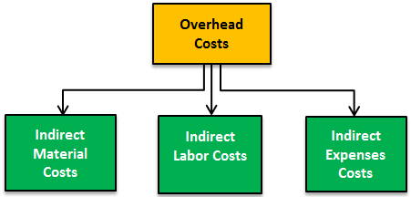

In today's dynamic financial environment, companies are continuously seeking ways to enhance profitability while managing expenses. Key elements at the intersection of finance and accounting include overhead expenses, expense management, cost accounting, and algo trading. Understanding and effectively navigating these areas can open up significant opportunities for businesses and investors alike.

Overhead expenses, while not directly tied to revenue-generating activities, are integral to business operations. They encompass costs such as accounting, human resources, and regulatory compliance. Managing these expenses efficiently can lead to improved financial health as they significantly impact the overall cost structure of an organization. For instance, strategically managing human resources and regulatory compliance can prevent financial losses and legal issues.



Cost accounting plays a critical role in identifying and managing these overhead expenses. By accurately allocating these costs, companies can ensure that their financial statements correctly reflect the true cost of production. This, in turn, influences pricing strategy, profitability analysis, and budgeting. Properly implemented, cost accounting can aid in identifying cost-saving opportunities and enhancing operational efficiency.

Algorithmic trading, commonly known as algo trading, represents another crucial domain requiring efficient management of overhead expenses. This form of trading heavily relies on technology infrastructure and incurs substantial transaction costs. If these costs are not managed effectively, they can erode profitability. According to Harris (2003), understanding the microstructure of trading markets is crucial for developing algorithms that minimize costs while maximizing returns.

This article aims to explore the synergies between overhead expense management, cost accounting, and algo trading. By synthesizing these areas, it provides insights into optimizing operations and financial performance. Mastery of these interconnected aspects is vital for businesses and investors striving to maintain a competitive advantage in today’s rapidly evolving markets.

## Table of Contents

## Understanding Overhead Expenses in Cost Accounting

Overhead costs are essential components in the financial structure of any business, supporting operations without directly linking to specific product or service sales. These expenses include necessary operational costs such as rent, insurance, utilities, and salaries for administrative staff. Overhead costs, while not generating revenue directly, enable the core operational activities that do.

In cost accounting, overhead expenses are classified into three categories: fixed, variable, and semi-variable. Fixed overheads remain constant regardless of the level of business activity. Examples include rent and salaries for permanent staff. These costs are predictable and stable, aiding in reliable financial forecasting. Variable overheads, on the other hand, fluctuate with the level of production or business activity. Costs such as utility expenses or raw materials change depending on production [volume](/wiki/volume-trading-strategy). Semi-variable costs exhibit characteristics of both fixed and variable costs, remaining stable up to a certain level of activity, after which they vary. Telephone bills with base charges plus usage fees are typical semi-variable costs.

Accurate allocation of overhead costs is crucial for precise financial reporting. This allocation impacts profit measurement and pricing strategies and is generally executed using either job costing or process costing methods. Job costing is employed when products or services are distinct or customized, allowing businesses to allocate overhead to specific projects. Process costing, conversely, is used for homogeneous products produced on a continuous basis, assigning overhead costs evenly across all output units.

Effective expense management in this context aims to control and contain overhead costs, ensuring that only necessary expenses are incurred. This involves establishing systematic procedures for tracking overhead spending, setting budgets, and conducting regular reviews to compare actual expenses against budgeted figures. A disciplined approach to overhead management helps to prevent excessive and unnecessary resource allocation, fostering a more financially viable operation.

## Basics of Cost Accounting

Cost accounting is a critical aspect of financial management that helps organizations track, manage, and control the costs associated with manufacturing and operations. This field involves identifying, measuring, and analyzing all expenses related to production processes, enabling companies to maintain efficient operations and ensure accurate financial reporting.

The primary purpose of cost accounting is to provide detailed cost information that aids management in budgeting, performance evaluation, and strategic decision making. By gaining insights into cost structures, businesses can identify areas for improvement, optimize resource allocation, and enhance profitability.

One of the fundamental methodologies in cost accounting is absorption costing. This method assigns all manufacturing costs to products, including both fixed and variable overheads. Absorption costing ensures that each unit of production bears a share of all incurred costs, resulting in comprehensive product cost data. This approach aids businesses in setting appropriate pricing strategies and ensuring that all production costs are recovered through sales revenue.

Variable costing, another essential methodology, differs from absorption costing by focusing solely on variable costs. This method excludes fixed overheads, attributing only variable manufacturing expenses to products. By emphasizing the contribution margin, variable costing provides clearer insights into how costs behave with changes in production volume, thus guiding short-term decision making and pricing strategies.

These methodologies in cost accounting facilitate a deeper understanding of cost behavior. They enable organizations to analyze how different costs impact profitability and support informed decisions about pricing, product lines, and production volumes. By implementing effective cost accounting practices, companies can enhance their competitive position, optimize their operations, and drive long-term financial success.

Overall, cost accounting serves as a foundational tool for organizations to manage and control production expenses, providing the cost transparency necessary to navigate the complexities of modern business environments.

## The Role of Algo Trading in Financial Markets

Algo trading, or [algorithmic trading](/wiki/algorithmic-trading), is the process of executing trades using pre-programmed instructions that consider a multitude of variables such as timing, price, and volume. This method serves to exploit market inefficiencies by making rapid trading decisions that would be difficult or impossible to execute manually.

The infrastructure for algo trading is a critical component, requiring substantial investment in technology. High-speed internet and robust server infrastructure are essential to minimize latency, which can impact the success of trades. Advanced software platforms are needed to develop and backtest algorithms, as well as to provide real-time data for effective decision-making.

Effective cost management is crucial in algo trading since technology overhead can significantly influence profitability. Utilizing cost accounting strategies facilitates a detailed understanding of these overheads, enabling traders to make informed decisions about resource allocation. This ensures that resources are distributed efficiently without impairing trading performance.

In algorithmic trading, optimizing resource allocation involves balancing the costs of technological investments with the potential returns from algorithmic strategies. A well-structured cost analysis allows traders to determine which elements of their trading system provide the most value and where to cut costs without jeopardizing trading efficiency.

For instance, the choice between owning high-frequency trading servers or utilizing cloud-based solutions can impact both operational costs and trading efficiency. Moreover, the integration of predictive analytics and [machine learning](/wiki/machine-learning) can be used to enhance the effectiveness of trading algorithms while simultaneously identifying areas where costs can be reduced without affecting trade execution times.

In essence, algorithmic trading represents a sophisticated intersection of finance and technology. By harnessing effective cost accounting practices, traders can manage overhead costs strategically, thus safeguarding profitability while maintaining a competitive edge in increasingly complex financial markets.

## Strategies for Managing Overhead Costs in Algo Trading

In algorithmic trading, managing overhead costs is essential to maintain profitability due to the [high frequency](/wiki/high-frequency-trading) and volume of trades executed. A critical aspect of controlling these costs involves choosing the right venues for transactions. Traders can benefit from using less expensive venues, which may charge lower fees, thus directly reducing transaction costs. Additionally, optimizing trading algorithms to execute trades with minimum latency and maximum efficiency can further drive down costs associated with slippage and execution delays.

Investment in technology is crucial, but it must be targeted to ensure optimization without superfluous spending. Emphasizing systems that enhance both speed and reliability is vital to maintaining an edge over competitors. The hardware should be selected for processing high-speed data streams efficiently and executing complex algorithms quickly, often requiring high-quality servers and network systems that balance cost and performance.

Incorporating comprehensive expense management frameworks and regular audits plays a vital role in uncovering and addressing inefficient operational processes. By systematically reviewing and evaluating all cost components, organizations can identify unnecessary or redundant expenditures that can be eliminated or minimized. This approach helps in maintaining a lean operational setup, ensuring that resources are directed towards value-adding activities.

Leveraging predictive analytics and machine learning technologies enables the fine-tuning of trading strategies while managing overheads effectively. These advanced analytic tools can process large volumes of historical and real-time market data, identifying patterns that may inform better decision-making and strategy refinement. Machine learning models can optimize strategy parameters dynamically, ensuring that trades are executed at the best possible times with minimal cost implications.

Python, a popular language for developing algo trading strategies due to its extensive libraries and frameworks, can be utilized to implement these strategies efficiently.

```python
import numpy as np
import pandas as pd
from sklearn.linear_model import LinearRegression

# Example function to forecast trading signal with a predictive analytical model
def forecast_signal(data):
    data['Lag'] = data['price'].shift(1)
    data = data.dropna()

    # Features and target variable
    X = data[['Lag']]
    y = data['price']

    # Train linear regression model
    model = LinearRegression()
    model.fit(X, y)

    # Predict next price
    predicted_signal = model.predict(X)
    return predicted_signal
```

This simple model can be part of a much larger system aimed at forecasting market movements and adjusting trading strategies accordingly, allowing traders to act on data-driven insights and manage overhead effectively through informed execution. As the landscape of algorithmic trading continues to evolve, constant analysis and adaptation of strategies and cost structures will be necessary to stay competitive and profitable.

## Conclusion

Mastering overhead expense management, cost accounting, and their application in algorithmic trading is crucial for businesses aiming to sustain a competitive edge. In an increasingly fast-paced and technologically driven financial landscape, effective management of overhead costs not only enhances operational efficiency but also significantly contributes to improved profitability and strategic financial planning. By understanding the true cost of operations through meticulous tracking and allocation of overhead expenses, companies can make informed decisions that align with their financial goals.

Integrating cost accounting principles with algorithmic trading offers a deeper understanding of cost dynamics, allowing strategic allocation of resources and optimization of trade execution. For instance, accurately understanding and predicting transaction costs can aid in tailoring trading algorithms to maximize returns. Cost accounting methods, such as activity-based costing, enable a more detailed analysis of costs that are indirectly associated with trading activities, thus assisting in identifying areas where efficiencies can be improved without compromising trading performance.

As financial markets continue to evolve, driven by advances in technology and shifts in economic paradigms, the importance of these practices is expected to grow. This dynamic environment necessitates continuous learning and adaptation to new financial instruments, regulatory requirements, and market conditions. Businesses that invest in ongoing education and adapt to emerging trends will likely find themselves better equipped to harness opportunities and mitigate risks.

Through strategic expenditure on technology and infrastructure, coupled with effective expense management and cost accounting, businesses can thrive even amidst market [volatility](/wiki/volatility-trading-strategies). As such, cultivating these competencies will be increasingly vital for navigating the complexities of modern financial markets and achieving long-term success.

## References & Further Reading

Drury, C. (2018). 'Management and Cost Accounting (10th Edition)'. Cengage Learning EMEA.

Kaplan, R. S., & Atkinson, A. A. (2014). 'Advanced Management Accounting (3rd edition)'. Pearson Publishing.

Harris, L. (2003). 'Trading and Exchanges: Market Microstructure for Practitioners.' Oxford University Press.

Cartea, A., Jaimungal, S., & Penalva, J. (2015). 'Algorithmic and High-Frequency Trading.' Cambridge University Press.