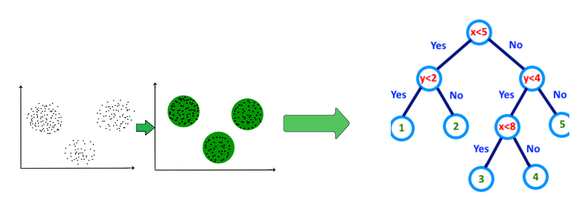

## Table of Contents

## What is tree clustering and why is it important?

Tree clustering, also known as hierarchical clustering, is a way to group similar things together by organizing them into a tree-like structure. Imagine you have a bunch of fruits, and you want to sort them into groups based on how similar they are. You start by comparing each fruit to every other fruit and then you join the most similar ones together. You keep doing this, joining more and more fruits into bigger and bigger groups, until you have one big group at the top of the tree. This tree shows how all the fruits are related to each other.

This method is important because it helps us understand and see patterns in data that might not be obvious at first. For example, in biology, scientists can use tree clustering to see how different species are related to each other. In business, companies might use it to group customers with similar buying habits so they can target their marketing better. By showing the relationships between different items in a clear, visual way, tree clustering helps people make better decisions and find new insights in their data.

## Can you explain the basic concept of hierarchical clustering?

Hierarchical clustering is a way to group things together based on how similar they are. Imagine you have a bunch of toys, and you want to organize them. You start by looking at each toy and deciding which ones are most alike. You then put the most similar toys into a group. Next, you look at these groups and join the ones that are most similar to each other. You keep doing this, making bigger and bigger groups, until all the toys are in one big group. This process creates a tree-like structure, called a dendrogram, that shows how all the toys are related.

This method is useful because it helps you see patterns in your data. For example, if you are a teacher, you might use hierarchical clustering to group students based on their test scores. By looking at the tree, you can see which students are performing similarly and which ones need more help. This can help you plan your lessons better. Hierarchical clustering is used in many fields, like biology to study species relationships, or in business to understand customer behavior. It's a powerful tool for making sense of complex data.

## What are the main types of tree clustering methods?

There are two main types of tree clustering methods: agglomerative and divisive. Agglomerative clustering, also called bottom-up clustering, starts with each item as its own group. Then, it joins the most similar groups together, step by step, until all items are in one big group. It's like building a tree from the leaves up to the trunk. This method is popular because it's easy to understand and works well with different kinds of data.

Divisive clustering, or top-down clustering, does the opposite. It begins with all items in one big group and then splits this group into smaller ones. It keeps dividing the groups until each item is in its own group. This method can be more complex because it has to decide the best way to split the groups at each step. Both methods create a tree that shows how items are related, but they approach the problem from different directions.

## How does agglomerative clustering differ from divisive clustering?

Agglomerative clustering and divisive clustering are two ways to group things together, but they work in opposite ways. Agglomerative clustering starts with each item by itself and then slowly joins the most similar items into groups. It keeps joining groups together until everything is in one big group. Imagine you have a bunch of stickers, and you start by putting the most similar stickers together, then you join those groups, and keep going until you have one big group of stickers. This method is like building a tree from the bottom up, starting with the leaves and working towards the trunk.

Divisive clustering does the opposite. It begins with all the items in one big group and then splits this group into smaller ones. It keeps splitting the groups until each item is by itself. Using the sticker example, you start with all the stickers in one big pile and then you divide them into smaller piles based on how similar they are. You keep dividing until each sticker is in its own pile. This method is like starting with the trunk of a tree and working your way down to the leaves. Both methods create a tree that shows how items are related, but they approach the problem from different directions.

## What is a dendrogram and how is it used in tree clustering?

A dendrogram is like a family tree for data. It's a diagram that shows how different items are grouped together in tree clustering. Imagine you have a bunch of toys and you want to see which ones are most similar. You start by comparing each toy and grouping the most alike ones together. As you keep doing this, you create a tree where the branches show how the toys are related. The bottom of the tree has all the individual toys, and as you move up, the branches join together, showing bigger and bigger groups until you reach the top where everything is in one big group.

In tree clustering, the dendrogram is really helpful because it lets you see the relationships between all the items at once. It's like a map that shows you how to group things based on how similar they are. Scientists, teachers, and businesses use dendrograms to understand patterns in their data. For example, a teacher might use a dendrogram to see which students are performing similarly on tests. By looking at the tree, they can figure out which students need more help and plan their lessons better. It's a powerful tool for making sense of complex information.

## What are some common distance metrics used in tree clustering?

In tree clustering, we use distance metrics to figure out how similar or different things are. One common metric is the Euclidean distance. Imagine you have two points on a map. The Euclidean distance is like drawing a straight line between those points and measuring how long that line is. It's simple and works well when the things you're comparing are in a straight line. Another common metric is the Manhattan distance, which is like measuring how far you would have to walk if you could only move along the streets of a city, not diagonally. This is useful when you want to consider how things are connected in a grid-like way.

Another important distance metric is the cosine similarity. Instead of looking at the distance between points, cosine similarity looks at the angle between them. It's like comparing how two lines are pointing. This is really useful when you're dealing with things like text or images, where the direction matters more than the distance. Lastly, there's the Jaccard distance, which is used when you're comparing sets of things. It looks at how many things two sets have in common compared to how many things they don't have in common. This is great for things like comparing lists of items or groups of people.

## How do you determine the optimal number of clusters in a tree clustering approach?

Finding the best number of clusters in tree clustering is like trying to figure out the right number of groups for a bunch of toys. One way to do this is by looking at something called the dendrogram, which is a tree-like diagram that shows how the toys are grouped together. You can draw a line across the dendrogram at different heights and see how many groups it cuts the tree into. The trick is to find a height where the line cuts through long vertical lines in the tree. These long lines mean that the groups are very different from each other, so it's a good place to stop and say, "This is the right number of groups."

Another way to find the best number of clusters is by using a method called the silhouette score. This method looks at how well each toy fits into its group compared to other groups. If a toy fits really well in its group and not so well in other groups, it gets a high score. You try different numbers of groups and see which number gives the highest average score. This tells you that the toys are grouped in a way that makes the most sense. Both the dendrogram and the silhouette score help you decide the best number of groups for your toys, making sure each group is as similar as possible inside and as different as possible from the others.

## Can you describe the process of linkage criteria in hierarchical clustering?

Linkage criteria in hierarchical clustering is like deciding how to connect groups of toys together. When you're grouping toys, you need a way to figure out which groups should be joined next. There are different ways to do this, and they're called linkage methods. The most common ones are single linkage, complete linkage, and average linkage. Single linkage looks at the closest pair of toys between two groups and joins the groups based on that. Complete linkage does the opposite; it looks at the farthest pair of toys between two groups and joins the groups based on that. Average linkage takes the average distance between all pairs of toys in the two groups and joins the groups based on that average.

Each method can give you a different tree, or dendrogram, because they look at the groups in different ways. Single linkage tends to create long, stretched-out groups because it focuses on the closest toys. This can be good for finding long chains of similar toys but might miss out on other patterns. Complete linkage, on the other hand, creates tighter, more compact groups because it focuses on the farthest toys. This can be good for finding clear, distinct groups but might split up toys that are actually pretty similar. Average linkage tries to find a middle ground by looking at all the toys and can be a good choice when you want a balance between the other two methods. Choosing the right linkage method depends on what you're trying to find in your data.

## What are some advantages and disadvantages of using tree clustering?

Tree clustering is really helpful because it shows you how things are related in a clear, visual way. It's like a family tree for your data. You can see which things are most similar and how they fit into bigger groups. This makes it easier to find patterns and understand your data better. For example, a teacher might use tree clustering to see which students are doing well and which ones need more help. Scientists can use it to study how different species are related. It's a powerful tool that works with all kinds of data, from numbers to words to pictures.

But tree clustering also has some problems. It can be slow and tricky to use, especially if you have a lot of data. It takes a long time to compare everything and build the tree. Also, the results can be different depending on which method you use to join the groups together. This means you might get different trees if you use different ways of measuring how similar things are. Sometimes, it can be hard to decide how many groups you should have, and the tree might not always show the most useful way to group things. Even with these challenges, tree clustering is still a great way to explore and understand your data.

## How can tree clustering be applied in real-world scenarios, such as biology or market research?

In biology, tree clustering is used to understand how different species are related to each other. Scientists collect data about different animals or plants, like their DNA or physical traits. They use tree clustering to group these species into a tree, called a phylogenetic tree, which shows how they evolved over time. This helps scientists see which species are closely related and how they might have changed from a common ancestor. For example, if you're studying different types of birds, tree clustering can show you which birds are most similar and how they might be related to each other. This information is important for understanding evolution and can help with things like conservation efforts.

In market research, tree clustering helps businesses understand their customers better. Companies collect data about what people buy, how much they spend, and other information. They use tree clustering to group customers with similar buying habits together. This creates a clear picture of different types of customers, which helps businesses target their marketing better. For example, a company might find that some customers buy a lot of sports equipment while others buy more books. By understanding these groups, the company can create ads that are more likely to appeal to each group, making their marketing more effective and helping them sell more products.

## What are some advanced techniques for improving the efficiency of tree clustering algorithms?

One way to make tree clustering faster and better is by using something called "nearest neighbor chain." Imagine you're trying to find the closest toy to another toy in a big pile. Instead of looking at every single toy, you can start with one toy and then look at the toys closest to it, and then the toys closest to those toys, and so on. This makes it quicker to find the most similar toys without checking everything. Another technique is "fast cluster algorithms" which use shortcuts to group things together faster. These shortcuts help the computer do less work and still get good results, making the whole process quicker.

Another advanced method is "approximate nearest neighbor search." This technique doesn't find the exact closest toy, but it finds one that's close enough. By being a little less precise, it can save a lot of time. Also, "parallel processing" can help by using more than one computer at the same time. Imagine if you had a bunch of friends helping you sort toys into groups. You could all work together and finish much faster. These methods help make tree clustering more efficient, so you can handle bigger piles of data and still get good results in less time.

## How do you evaluate the performance of tree clustering models and what metrics should be considered?

To evaluate how well a tree clustering model is working, you need to look at how good the groups it makes are. One way to do this is by using the silhouette score. This score tells you how well each item fits into its group compared to other groups. A high silhouette score means the items are grouped well, with items in a group being more similar to each other than to items in other groups. Another way to check is by using the dendrogram. You can draw a line across the dendrogram and see how many groups it makes. The best place to draw the line is where it cuts through long vertical lines, showing that the groups are very different from each other.

Another important metric is the cophenetic correlation coefficient. This measures how well the tree clustering model matches the actual distances between items. A high cophenetic correlation means the tree is a good representation of the data. You can also use the Davies-Bouldin index, which looks at how compact the groups are and how far apart they are from each other. A lower Davies-Bouldin index means the groups are well-separated and tight, which is good. By looking at these different metrics, you can get a good idea of how well your tree clustering model is working and make sure it's grouping things in a way that makes sense.

## How can we evaluate and compare clustering models?

Evaluating the effectiveness of clustering models in algorithmic trading is vital for optimizing strategies. The quality of a clustering solution can directly impact trading performance, thus necessitating the use of robust evaluation metrics. Common metrics include silhouette scores, Davies-Bouldin index, and Dunn index.

The silhouette score measures how similar an object is to its own cluster compared to other clusters. A silhouette value near +1 suggests that the data point is well matched to its own cluster and poorly matched to neighboring clusters, while values near 0 indicate overlapping clusters. The silhouette score $s(i)$ for a sample $i$ is defined as:

$$
s(i) = \frac{b(i) - a(i)}{\max(a(i), b(i))}
$$

where $a(i)$ is the average dissimilarity of $i$ to all other points in its cluster, and $b(i)$ is the smallest average dissimilarity of $i$ to any other cluster of which $i$ is not a member.

The Davies-Bouldin index assesses the compactness of data points within a cluster and the separation between clusters. Lower values indicate better clustering. It is defined as:

$$
DB = \frac{1}{N} \sum_{i=1}^{N} \max_{j \neq i} \left( \frac{\sigma_i + \sigma_j}{d_{ij}} \right)
$$

where $\sigma_i$ and $\sigma_j$ are the average distances of all points in clusters $i$ and $j$, respectively, to their centroids, and $d_{ij}$ is the distance between the centroids of clusters $i$ and $j$.

The Dunn index evaluates the compactness and separation of a set of clusters by examining the ratio of the minimum distance between two clusters to the maximum intra-cluster distance. A higher Dunn index indicates better clustering.

In trading, performance evaluation extends beyond these metrics to include the impact of clustering on returns and risk management. Clustering can reveal hidden data structures that, when leveraged, enhance the accuracy of pair trades, improve risk management strategies, and contribute positively to the trading strategy's overall performance.

Furthermore, comparing different clustering methods can disclose the most effective approach for specific scenarios. For instance, hierarchical clustering may excel in depicting nested data structures, while k-means may be more suited for large-scale datasets due to its computational efficiency.

In summary, evaluating clustering models requires balancing traditional metrics with trading-specific criteria to ensure that clustering enhances strategic decision-making.

## References & Further Reading

[1]: Hastie, T., Tibshirani, R., & Friedman, J. (2009). ["The Elements of Statistical Learning: Data Mining, Inference, and Prediction."](https://link.springer.com/book/10.1007/978-0-387-84858-7) Springer Series in Statistics.

[2]: Breiman, L. (2001). ["Random Forests."](https://link.springer.com/article/10.1023/A:1010933404324) Machine Learning, 45(1), 5-32.

[3]: Lopez de Prado, M. (2018). ["Advances in Financial Machine Learning."](https://www.amazon.com/Advances-Financial-Machine-Learning-Marcos/dp/1119482089) Wiley.

[4]: Rokach, L., & Maimon, O. (2005). ["Clustering Methods."](https://link.springer.com/chapter/10.1007/0-387-25465-X_15) In: Data Mining and Knowledge Discovery Handbook. Springer.

[5]: Kaufman, L., & Rousseeuw, P.J. (2009). ["Finding Groups in Data: An Introduction to Cluster Analysis."](https://onlinelibrary.wiley.com/doi/book/10.1002/9780470316801) Wiley.