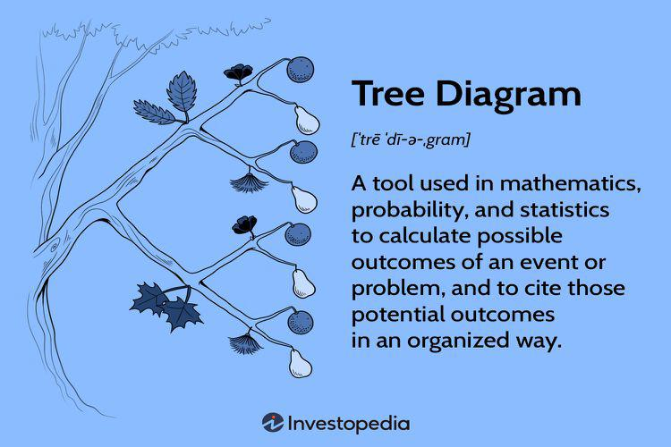

In the evolving landscape of data analytics and algorithmic trading, the creation of diagrams, particularly tree diagrams, and the application of data visualization techniques play critical roles. The complexities inherent in trading data underscore the importance of visual tools that can transform abstract figures into comprehensible formats. This article focuses on the integration of tree diagrams within algorithmic trading and data visualization, providing insights into how these tools enhance understanding and decision-making processes involved in developing trading strategies.

Tree diagrams represent a structured method for visualizing outcomes and decisions, thereby assisting traders in evaluating potential paths and outcomes. By presenting information in a clear, visual format, tree diagrams serve to simplify complex datasets, making it easier for traders to grasp essential details. This simplification is crucial in environments where rapid and accurate decision-making is necessary.



Additionally, tree diagrams offer practical applications by supporting traders in automated environments. Automated trading heavily relies on data-driven strategies, and the capacity to visualize and interpret data effectively can bridge the gap between theoretical models and real-world execution. By emphasizing their practical applications, this article aims to connect conceptual understanding with tangible utility in trading operations.

## Table of Contents

## Understanding Tree Diagrams

Tree diagrams serve as a vital tool in probability and decision analysis, providing a structured visual representation of multiple outcomes and decisions. Their utility spans several fields, notably in finance, where they facilitate the modeling of securities' price movements, such as options. By illustrating various potential paths, tree diagrams help traders and analysts map out possible financial scenarios and make strategic decisions.

In the context of finance, tree diagrams are particularly instrumental in options pricing. For instance, they can be utilized to model the Binomial or Trinomial tree methods, which are discrete-time models to evaluate options. These trees represent the different states or paths that an option's price can take until expiration. For example, a Binomial Tree Model assumes that the price of the underlying asset can either increase (up move) or decrease (down move) over a time interval, thereby forming a branching, tree-like structure. This method is widely used for its simplicity and the intuitive visual depiction of the paths.

$$
C = \frac{1}{(1 + r)^n} \sum_{i=0}^{n} \binom{n}{i} p^i (1-p)^{n-i} C_i
$$

where:
- $C$ is the call option price,
- $r$ is the risk-free rate,
- $n$ is the total number of steps,
- $p$ is the probability of an up move,
- $C_i$ is the payoff at node $i$.

The graphical nature of tree diagrams enhances their appeal to visual learners and strategic planners. They offer a means to break down complex decision-making processes into comprehensible, visual formats. This capability is especially valuable in trading, where swift, well-informed decisions can significantly influence profitability. By abstracting complex data into an easily interpretable form, tree diagrams reduce cognitive load and enhance focus on strategic insights.

Moreover, tree diagrams assist in transforming voluminous and intricate datasets into visually manageable constructs. This simplification becomes crucial when dealing with [algorithmic trading](/wiki/algorithmic-trading) environments where large sets of data must be assessed quickly for making automated trading decisions. They enable more precise decision-making by illustrating the potential risk and return of various trading strategies through an intuitive format, which supports traders in identifying optimal paths and mitigating risks.

Overall, tree diagrams simplify complex financial data, making it accessible and actionable. This ability to distill complexity into a clear visual form makes tree diagrams an indispensable tool for enhancing strategic analysis and decision-making accuracy in trading scenarios.

## Role of Tree Diagrams in Data Visualization

Data visualization plays a critical role in transforming complex datasets into understandable and actionable insights, a necessity in the fast-paced world of trading and financial analysis. Tree diagrams are essential tools in this translation process due to their ability to simplify the presentation of multiple outcomes and branching scenarios. This capability is particularly useful for traders who need to analyze complex market dynamics and various strategy outcomes.

Tree diagrams provide a branched structure that visually represents decisions and their related probabilities, enabling traders to assess potential market scenarios thoroughly. Each branch of a tree diagram can signify a possible decision path or future event, allowing traders to evaluate and predict outcomes effectively. This visual clarity is instrumental in understanding intricate market strategies, thereby mitigating risks associated with trading activities. By visualizing hypothetical scenarios, traders can identify the most promising strategies and make informed decisions swiftly, a crucial aspect in an environment where market conditions change rapidly.

The structured setup of tree diagrams helps organize data logically, which is crucial for algorithmic trading models that rely on precise and systematic data analysis. Algorithmic trading often utilizes complex mathematical models to execute trades at speeds and frequencies unachievable by human traders. Tree diagrams complement these models by providing a clear visual representation of data relationships and decision-making processes. They help traders and analysts understand the cascading effects of market events and leverage this knowledge to optimize algorithmic strategies.

Several techniques and tools are available for constructing effective tree diagram visualizations, ensuring that traders and analysts have a wide range of options to fit their specific needs. Software such as Lucidchart and SmartDraw offers user-friendly interfaces with drag-and-drop functionalities, allowing the design of complex tree diagrams with ease. These tools often include seamless integration capabilities with various data sources and trading platforms, an essential feature in a highly interconnected and data-driven trading landscape.

To create a tree diagram in Python, one can utilize libraries such as Matplotlib and NetworkX. Here's a simple example using NetworkX:

```python
import matplotlib.pyplot as plt
import networkx as nx

# Create a directed graph
G = nx.DiGraph()

# Add nodes and edges
G.add_edge('Start', 'Decision 1')
G.add_edge('Start', 'Decision 2')
G.add_edge('Decision 1', 'Outcome A')
G.add_edge('Decision 1', 'Outcome B')
G.add_edge('Decision 2', 'Outcome C')
G.add_edge('Decision 2', 'Outcome D')

# Draw the graph
pos = nx.spring_layout(G)
nx.draw(G, pos, with_labels=True, node_size=2000, node_color='lightblue', font_size=10, font_weight='bold', arrows=True)

# Display the plot
plt.title('Simple Tree Diagram')
plt.show()
```

This code generates a basic tree diagram that illustrates two decisions stemming from a starting point, each leading to distinct outcomes. Such visualizations offer significant insights into potential future scenarios, complementing quantitative analyses in trading.

Overall, tree diagrams are crucial in data visualization due to their simplicity and effectiveness in representing complex information comprehensibly. They offer a strategic advantage in algorithmic trading by enabling traders to visualize and evaluate numerous decision paths simultaneously, ultimately improving decision-making processes and optimizing trading strategies.

## Algorithmic Trading and Tree Diagrams

Algorithmic trading leverages automated systems to execute orders at speeds and frequencies unimaginable to a human trader. This environment demands clarity and precision in decision-making processes, and tree diagrams serve as crucial tools in this context. These diagrams facilitate the visualization of various market scenarios and enable traders to determine optimal strategies based on probabilistic outcomes.

Tree diagrams represent decisions, potential outcomes, and alternative paths in a structured way, making them invaluable in analyzing the contingencies in market movements. For instance, in option pricing models, such tree diagrams can map the multitude of possible future stock prices at different time intervals, guiding the calculation of derivative prices. The use of models like the binomial options pricing model is a testament to the utility of tree diagrams, as they allow the discrete mapping of time and price for effective computational analysis.

Implementing tree diagrams within trading algorithms helps refine strategy development by allowing simulations of various decision paths. These paths account for the myriad choices algorithmic systems must evaluate instantaneously. By visually and mathematically portraying choices, traders can better grasp the potential impacts of various strategies, thereby enabling precise tweaking to improve performance metrics such as return rates or risk management.

Examining case studies where tree diagrams have successfully informed trading algorithms reveals their substantial impact. For example, in high-frequency trading environments where latency is critical, tree diagrams enable rapid scenario analysis and adjustment of trading strategies. These visualizations aid in preemptively identifying adverse scenarios and reacting swiftly, possibly through automated triggers or alerts.

Modern trading platforms often integrate diagrammatic tools that capitalize on real-time data feeds. This integration ensures that tree diagrams are not static representations but dynamic tools reflecting current market conditions. Through APIs and sophisticated software features, traders can input real-time data into their decision trees, adjusting strategies dynamically as new data streams in. This capability ensures that traders are consistently aligned with market movements, reducing downtime and maximizing opportunity.

In summary, tree diagrams are not merely educational tools but are central to developing advanced algorithmic trading strategies. By simplifying complex decision-making processes into visual formats, they enable traders to maintain clarity, speed, and precision across their operations. As algorithmic trading continues to evolve, the role of tree diagrams in enhancing strategic clarity and profitability will undoubtedly grow, supported by the continuous advancement of diagrammatic software and integration capabilities.

## Tools for Creating Tree Diagrams

Various online and offline tools are available to facilitate the creation of tree diagrams, ranging from Lucidchart to SmartDraw. These platforms are designed to offer intuitive interfaces that allow both novice and expert traders to design complex diagrams with relative ease. This ease of use is critical, especially when dealing with algorithmic trading, where the ability to quickly conceptualize and analyze different strategies can offer a competitive edge.

Lucidchart is a widely recognized tool in the domain of diagram creation due to its user-friendly interface and extensive library of shapes and templates. It enables seamless collaboration through cloud-based sharing features, making it a suitable choice for teams working on trading strategies. One of its key strengths is its integration capability with other data sources and tools, including Google Sheets and Microsoft Excel, which allows traders to import and utilize data in real-time.

SmartDraw, on the other hand, is known for its powerful automation features. It offers automatic formatting, which can significantly reduce the time required to produce a tree diagram. SmartDraw also includes a comprehensive set of templates that can be customized according to the specific needs of a trading strategy. The software’s ability to integrate with other platforms, such as Microsoft Office, G Suite, and even Atlassian's Confluence and Jira, enhances its utility for creating detailed, presentation-ready diagrams efficiently.

Another notable tool is Microsoft Visio, which is favored for its precision and professional-grade outputs. Visio provides advanced formatting options and supports integration with other Microsoft products, which is beneficial for users already embedded within the Microsoft ecosystem. However, Visio tends to be less intuitive for beginners compared to Lucidchart or SmartDraw, and its cost may be prohibitive for individual users or small businesses.

When selecting a tree diagram tool, traders should consider factors such as usability, feature set, and compatibility with existing trading systems. Usability is particularly important, as simpler interfaces can lead to quicker mastery and reduced error rates. Feature sets should include the ability to handle large volumes of data and provide dynamic, real-time updates. Compatibility ensures that the tool can be easily integrated with existing software and data sources, minimizing disruptions in workflow.

For those seeking more technical customizations, software like R or Python can be used to programmatically create tree diagrams. Python’s `graphviz` and `networkx` libraries, for example, allow for the creation of highly customized and scalable visualizations. Here is a simple Python example using `networkx` to create a basic tree diagram:

```python
import matplotlib.pyplot as plt
import networkx as nx

# Create a directed graph
G = nx.DiGraph()

# Add edges to the graph
G.add_edges_from([
    ('Start', 'Decision 1'),
    ('Decision 1', 'Outcome A'),
    ('Decision 1', 'Outcome B'),
    ('Outcome B', 'Sub-decision 1'),
    ('Sub-decision 1', 'Outcome C'),
    ('Sub-decision 1', 'Outcome D')
])

# Draw the graph
pos = nx.spring_layout(G)
nx.draw(G, pos, with_labels=True, arrows=True)
plt.show()
```

Selecting the right tool involves balancing the complexity of diagramming needs with the ease of use and integration capabilities. As the use of complex data visualization continues to grow in the trading industry, leveraging these tools effectively can lead to more informed trading decisions and enhanced strategic clarity.

## Conclusion

Tree diagrams have become essential tools in data visualization, particularly in algorithmic trading, due to their capacity to transform intricate decisions into clear, visual representations. This conversion significantly enhances strategic clarity and contributes to increased profitability by allowing traders to quickly analyze and interpret different decision paths. As contemporary data sets continue to expand in scale and complexity, the necessity for effective visualization tools like tree diagrams is anticipated to rise.

The integration of tree diagrams into trading operations not only facilitates better decision-making but also supports the use of automated trading strategies. This article emphasizes the importance of selecting appropriate tools and methodologies for optimizing trading efficiency. By incorporating tree diagrams, traders are better equipped to handle complex datasets and derive actionable insights, thereby improving their competitive edge.

Looking ahead, advancements in visualization technology are expected to produce more integrated and sophisticated tools. These enhancements will likely reinforce the function of visualization in trading, enabling more streamlined and efficient operations. As these tools evolve, they will undoubtedly provide traders with greater capabilities to adapt to rapidly changing market conditions, ultimately contributing to more informed and successful trading strategies.

## References & Further Reading

[1]: Hull, J. C. (2012). ["Options, Futures, and Other Derivatives"](https://www.semanticscholar.org/paper/Options%2C-Futures%2C-and-Other-Derivatives-Hull/89bdee500c8623864fc9eb7a471546aa713acc44). Pearson Education.

[2]: Lopez de Prado, M. (2018). ["Advances in Financial Machine Learning"](https://www.amazon.com/Advances-Financial-Machine-Learning-Marcos/dp/1119482089). Wiley.

[3]: Jansen, S. (2020). ["Machine Learning for Algorithmic Trading - Second Edition"](https://www.amazon.com/Machine-Learning-Algorithmic-Trading-alternative/dp/1839217715). Packt Publishing.

[4]: Chan, E. P. (2008). ["Quantitative Trading: How to Build Your Own Algorithmic Trading Business"](https://github.com/ftvision/quant_trading_echan_book). Wiley.

[5]: Aronson, D. R. (2006). ["Evidence-Based Technical Analysis: Applying the Scientific Method and Statistical Inference to Trading Signals"](https://www.amazon.com/Evidence-Based-Technical-Analysis-Scientific-Statistical/dp/0470008741). Wiley.

[6]: Keim, D. A., Kohlhammer, J., Ellis, G., & Mansmann, F. (Eds.). (2010). ["Mastering the Information Age - Solving Problems with Visual Analytics"](https://www.researchgate.net/publication/277007765_Mastering_The_Information_Age_-_Solving_Problems_with_Visual_Analytics). Eurographics Association.