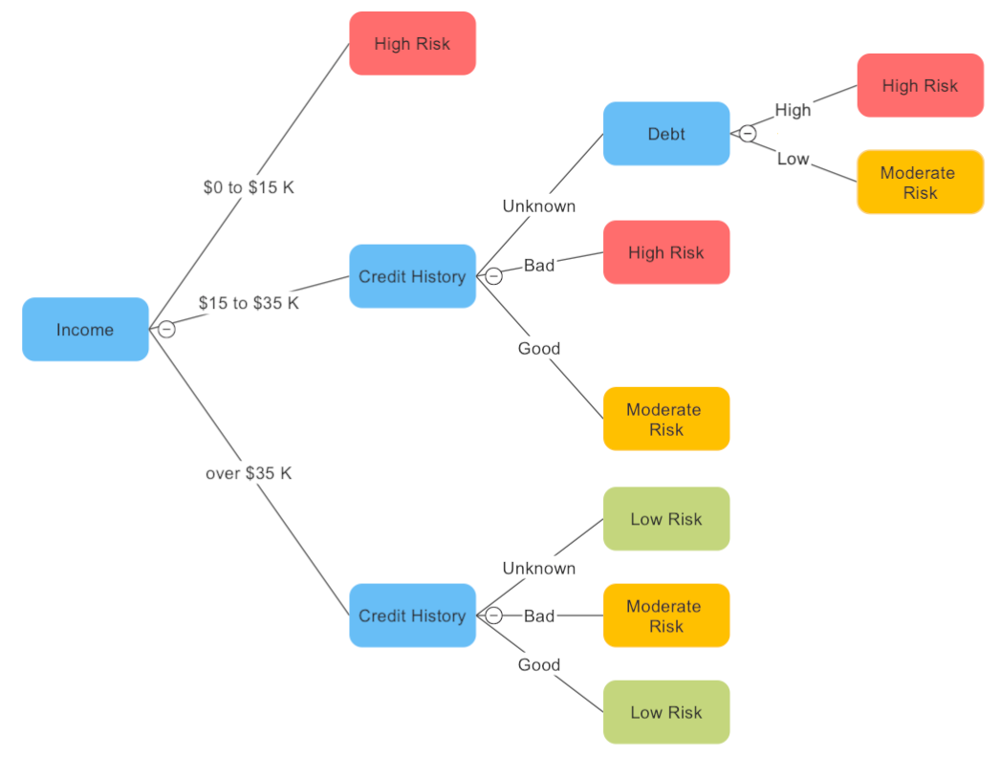

## Table of Contents

## What is a tree diagram?

A tree diagram is a way to show how things are organized or how decisions can be made. It looks like a tree turned on its side, with a main line that splits into branches. Each branch can split into more branches. This helps to break down big ideas into smaller parts. For example, you can use a tree diagram to show all the different kinds of animals and how they are related to each other.

Tree diagrams are also useful for making choices. Imagine you have to decide what to do on a weekend. You can draw a tree diagram starting with the main choice, like "stay home" or "go out." From there, you can add branches for each option, like "watch a movie" or "go to a park." This helps you see all your choices clearly and think about what might happen with each one. It's a simple but powerful tool for organizing thoughts and making plans.

## What are the basic components of a tree diagram?

The main parts of a tree diagram are the root, the branches, and the leaves. The root is where the diagram starts. It shows the main idea or the first decision you need to make. From the root, lines called branches spread out. Each branch shows a different choice or a part of the main idea. If you're deciding what to do on a weekend, the root might say "weekend plans," and the branches could be "stay home" or "go out."

The branches can split into more branches, showing more choices or details. These smaller branches help break down the bigger choices into smaller ones. For example, if one branch says "go out," it might split into "go to a park" or "visit a friend." At the end of each branch, you might find leaves. The leaves show the final results or the smallest parts of your choices. In our weekend plan example, a leaf at the end of "go to a park" might say "have a picnic." Together, the root, branches, and leaves help you see all your options clearly and understand how they connect.

## How do you create a simple tree diagram?

To create a simple tree diagram, start with a piece of paper or a blank space on your computer. Draw a straight line across the middle of your page. This line is called the root. At one end of the root, write down the main idea or the big decision you want to think about. For example, if you're planning a birthday party, you might write "birthday party" at the end of the root.

Next, draw lines branching out from the root. These branches show the different choices or parts of your main idea. If you're planning a birthday party, one branch might say "location," another might say "food," and another could say "activities." From each of these branches, you can draw more branches to show more details. For example, under "location," you might have branches for "home" or "park." At the end of each branch, you can write down the final choices or details, like "cake" under "food" or "games" under "activities." This way, you can see all your options clearly and how they connect.

## What are common software tools used for creating tree diagrams?

Many people use software tools to make tree diagrams because they are easy to use and can make the diagrams look nice. Some popular tools are Microsoft Visio, Lucidchart, and SmartDraw. These programs let you draw lines and add text to make your tree diagram. They have lots of shapes and lines you can use, and they help you keep everything neat and organized. You can also save your work and share it with others easily.

Another tool that people like is MindMeister. It's great for making tree diagrams that show ideas and how they connect. You can add branches and leaves just by clicking and typing. MindMeister works on the internet, so you can use it from any computer and work with others at the same time. If you want something simple and free, you can use Google Drawings. It's part of Google Drive and lets you draw lines and add text to make your tree diagram.

## What are the different types of tree diagrams?

Tree diagrams come in different types depending on what you want to show. One common type is the decision tree. This kind of tree diagram helps you make choices. It starts with a big decision and then branches out to show all the different choices you can make. Each branch can lead to more branches, showing what might happen next. Decision trees are great for planning and thinking about what to do.

Another type is the probability tree. This one is used to show how likely different things are to happen. It starts with an event and then branches out to show all the possible outcomes. Each branch has a number that tells you how likely that outcome is. Probability trees are helpful in math and science to figure out chances and risks. Both decision trees and probability trees help break down big ideas into smaller parts, making it easier to understand and work with them.

## In what fields are tree diagrams commonly used?

Tree diagrams are used in many different fields because they help break down big ideas into smaller parts. In business, people use tree diagrams to make decisions and plan projects. They start with a big goal, like launching a new product, and then draw branches to show all the steps and choices they need to make. This helps everyone see the plan clearly and work together better. In education, teachers use tree diagrams to explain hard ideas to students. For example, a science teacher might use a tree diagram to show how different animals are related to each other, making it easier for students to understand.

In computer science, tree diagrams are used to design and understand how programs work. They show how different parts of a program connect and depend on each other. This helps programmers see the whole picture and find problems more easily. In math, tree diagrams are used to solve problems about probability. They show all the possible outcomes of an event and how likely each one is. This helps people figure out chances and make better predictions. Tree diagrams are a simple but powerful tool that can be used in many different ways.

## How can tree diagrams be applied in decision making?

Tree diagrams are very helpful when you need to make a decision. Imagine you have a big choice to make, like choosing what to do on a weekend. You can start with a tree diagram by drawing a line and writing "weekend plans" at the end. Then, you can draw branches from that line for each choice, like "stay home" or "go out." If you choose "go out," you can draw more branches for things like "go to the park" or "visit a friend." This way, you can see all your options and think about what might happen with each one. It makes the decision easier because you can see everything clearly.

Tree diagrams also help you think about the results of your choices. For each branch, you can add more lines to show what might happen next. If you choose "go to the park," you might add branches for "have a picnic" or "play games." This helps you see not just the first choice, but all the steps that come after it. By looking at the whole tree, you can decide which path is best for you. It's like having a map for your decisions, making it easier to pick the right way to go.

## What are the steps to create a detailed tree diagram for project management?

To create a detailed tree diagram for project management, start by identifying the main goal of your project. Write this goal at the end of a straight line on your paper or software. This line is called the root of your tree diagram. Next, think about the big steps or tasks you need to do to reach your goal. Draw branches from the root for each of these steps. For example, if your goal is to launch a new product, your branches might be "market research," "product design," and "marketing plan." Each branch represents a major part of your project.

Now, for each of these big steps, think about the smaller tasks or decisions that need to be made. Draw more branches from each main branch to show these details. For "market research," you might add branches for "surveys," "focus groups," and "data analysis." Keep going until you have broken down each step into as many smaller parts as you need. At the end of each branch, you can write the final tasks or results, like "complete survey" or "analyze data." This detailed tree diagram helps everyone on your team see all the parts of the project and how they connect, making it easier to plan and manage your work.

## How can tree diagrams help in understanding probability and statistics?

Tree diagrams are a great way to understand probability and [statistics](/wiki/bayesian-statistics) because they show all the possible outcomes of an event and how likely each one is. Imagine you're flipping a coin twice. You can draw a tree diagram starting with the first flip. If it's heads, you draw a branch for heads and another for tails. From each of those branches, you draw more branches for the second flip. This way, you can see all four possible outcomes: heads-heads, heads-tails, tails-heads, and tails-tails. Each branch can have a number to show how likely it is, like 1/2 for heads or tails on each flip. This helps you see the whole picture and figure out the chances of each result.

In statistics, tree diagrams can help you break down complex data into smaller parts. For example, if you're studying how different factors affect a result, you can use a tree diagram to show all the combinations. Let's say you're looking at the factors that influence whether students pass or fail a test. You can start with a branch for "studied" or "didn't study," then add more branches for other factors like "attended class" or "didn't attend class." By the end, you can see all the different paths and how each one leads to passing or failing. This makes it easier to understand which factors are most important and how they work together.

## What advanced techniques can be used to enhance tree diagrams?

To make tree diagrams even better, you can add colors and shapes to help show different parts of your diagram. For example, you can use different colors for different choices or steps. This makes it easier to see the big picture and understand how everything fits together. You can also use special shapes, like circles or squares, to show important points or decisions. This can make your tree diagram more interesting and easier to read. Another way to enhance your tree diagram is to add notes or comments next to the branches. These notes can explain why you made certain choices or what you need to think about. This helps everyone understand your thinking and makes the diagram more useful.

Another advanced technique is to use software that lets you add links or other documents to your tree diagram. For example, you can link a branch to a file with more details about that part of your project. This can make your tree diagram a lot more powerful because it connects to all the information you need. You can also use software to make your tree diagram interactive. This means people can click on different parts of the diagram to see more details or make changes. This can be really helpful in meetings or when you're working with a team because everyone can see and understand the plan better.

## How do tree diagrams assist in algorithm design and analysis?

Tree diagrams help in designing and understanding algorithms by breaking down the steps and choices an algorithm needs to make. Imagine you are writing a program to sort a list of numbers. You can start with a tree diagram showing the first decision, like "is the list empty?" From there, you can draw branches for "yes" and "no." If the answer is "no," you can add more branches to show the next steps, like "compare the first two numbers" or "split the list." This way, you can see all the paths the algorithm might take and make sure you cover all the possibilities. It's like having a map that helps you plan the best route for your algorithm.

Tree diagrams are also useful for analyzing how well an algorithm works. By looking at all the branches, you can see how many steps the algorithm might take in different situations. For example, in a sorting algorithm, you can use a tree diagram to count the number of comparisons needed for different lists. This helps you understand the algorithm's efficiency and find ways to make it faster. By seeing the whole tree, you can spot patterns and make better decisions about how to improve your algorithm. It's a simple but powerful tool that helps you think through all the details and make your algorithms work better.

## What are the limitations and challenges of using tree diagrams in complex systems?

Tree diagrams can be very helpful, but they have some limits when you use them for complex systems. One big problem is that they can get very big and hard to read if you have a lot of choices or steps. Imagine trying to plan a big project with many parts. Your tree diagram might end up with so many branches and leaves that it's hard to see the whole thing at once. This can make it tough to understand how everything fits together. Also, tree diagrams can be hard to change once you've made them. If you need to add new parts or take out old ones, it can be a lot of work to fix the diagram.

Another challenge is that tree diagrams might not show all the connections between different parts of a system. In a complex system, things can be linked in many ways, and a tree diagram might not be able to show all these links clearly. For example, in a business, different departments might work together in ways that a simple tree can't show. This can make it hard to see the big picture and understand how changes in one part might affect others. Despite these challenges, tree diagrams are still a useful tool, but you might need to use them along with other methods to get a full understanding of a complex system.

## What is the understanding of Tree Diagrams?

Tree diagrams serve as a vital tool in probability and decision analysis, providing a structured visual representation of multiple outcomes and decisions. Their utility spans several fields, notably in finance, where they facilitate the modeling of securities' price movements, such as options. By illustrating various potential paths, tree diagrams help traders and analysts map out possible financial scenarios and make strategic decisions.

In the context of finance, tree diagrams are particularly instrumental in options pricing. For instance, they can be utilized to model the Binomial or Trinomial tree methods, which are discrete-time models to evaluate options. These trees represent the different states or paths that an option's price can take until expiration. For example, a Binomial Tree Model assumes that the price of the underlying asset can either increase (up move) or decrease (down move) over a time interval, thereby forming a branching, tree-like structure. This method is widely used for its simplicity and the intuitive visual depiction of the paths.

$$
C = \frac{1}{(1 + r)^n} \sum_{i=0}^{n} \binom{n}{i} p^i (1-p)^{n-i} C_i
$$

where:
- $C$ is the call option price,
- $r$ is the risk-free rate,
- $n$ is the total number of steps,
- $p$ is the probability of an up move,
- $C_i$ is the payoff at node $i$.

The graphical nature of tree diagrams enhances their appeal to visual learners and strategic planners. They offer a means to break down complex decision-making processes into comprehensible, visual formats. This capability is especially valuable in trading, where swift, well-informed decisions can significantly influence profitability. By abstracting complex data into an easily interpretable form, tree diagrams reduce cognitive load and enhance focus on strategic insights.

Moreover, tree diagrams assist in transforming voluminous and intricate datasets into visually manageable constructs. This simplification becomes crucial when dealing with [algorithmic trading](/wiki/algorithmic-trading) environments where large sets of data must be assessed quickly for making automated trading decisions. They enable more precise decision-making by illustrating the potential risk and return of various trading strategies through an intuitive format, which supports traders in identifying optimal paths and mitigating risks.

Overall, tree diagrams simplify complex financial data, making it accessible and actionable. This ability to distill complexity into a clear visual form makes tree diagrams an indispensable tool for enhancing strategic analysis and decision-making accuracy in trading scenarios.

## References & Further Reading

[1]: Hull, J. C. (2012). ["Options, Futures, and Other Derivatives"](https://www.semanticscholar.org/paper/Options%2C-Futures%2C-and-Other-Derivatives-Hull/89bdee500c8623864fc9eb7a471546aa713acc44). Pearson Education.

[2]: Lopez de Prado, M. (2018). ["Advances in Financial Machine Learning"](https://www.amazon.com/Advances-Financial-Machine-Learning-Marcos/dp/1119482089). Wiley.

[3]: Jansen, S. (2020). ["Machine Learning for Algorithmic Trading - Second Edition"](https://www.amazon.com/Machine-Learning-Algorithmic-Trading-alternative/dp/1839217715). Packt Publishing.

[4]: Chan, E. P. (2008). ["Quantitative Trading: How to Build Your Own Algorithmic Trading Business"](https://github.com/ftvision/quant_trading_echan_book). Wiley.

[5]: Aronson, D. R. (2006). ["Evidence-Based Technical Analysis: Applying the Scientific Method and Statistical Inference to Trading Signals"](https://www.amazon.com/Evidence-Based-Technical-Analysis-Scientific-Statistical/dp/0470008741). Wiley.

[6]: Keim, D. A., Kohlhammer, J., Ellis, G., & Mansmann, F. (Eds.). (2010). ["Mastering the Information Age - Solving Problems with Visual Analytics"](https://www.researchgate.net/publication/277007765_Mastering_The_Information_Age_-_Solving_Problems_with_Visual_Analytics). Eurographics Association.