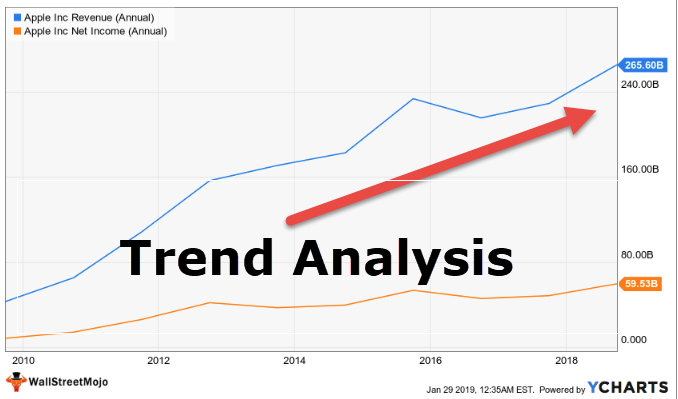

## Table of Contents

## What is trend analysis in trading?

Trend analysis in trading is a way to look at past price movements of stocks, currencies, or other financial items to guess where their prices might go next. Traders use charts and graphs to spot patterns over time. If they see that prices have been going up steadily, they might think the trend will keep going up. If prices have been dropping, they might expect them to keep falling. This helps traders decide when to buy or sell.

It's important to know that trend analysis isn't perfect. Sometimes, the market can change direction suddenly because of news or other events that are hard to predict. Even so, many traders find trend analysis useful because it gives them a way to make more informed guesses about the market. By understanding trends, traders can try to make better decisions and hopefully make more money.

## How can beginners identify trends in financial markets?

Beginners can start identifying trends in financial markets by looking at charts. These charts show how the price of a stock, currency, or other financial item has changed over time. The most common type of chart is a line chart, which connects the closing prices of each day with a line. If the line is going up over time, it means the price is trending up. If the line is going down, the price is trending down. Another useful chart is the candlestick chart, which shows more details like the highest and lowest prices of the day, and whether the price went up or down from the opening to the closing.

To make it easier, beginners can use tools like moving averages. A moving average is a line on the chart that smooths out the price data over a certain number of days. For example, a 50-day moving average shows the average price over the last 50 days. If the price is above the moving average, it might mean the trend is up. If it's below, the trend might be down. Watching where the price crosses the moving average can help spot when a trend might be starting or ending. It's also helpful to look at longer-term moving averages, like the 200-day moving average, to see the bigger picture.

Remember, identifying trends is not just about looking at charts and lines. It's also important to pay attention to news and events that can affect the market. For example, if a company announces good news, its stock price might go up. By combining chart analysis with an understanding of what's happening in the world, beginners can get a better sense of where the market might be headed. It takes practice, but over time, beginners can become better at spotting trends and making smarter trading decisions.

## What are the basic tools used for trend analysis?

The main tools for trend analysis are charts and moving averages. Charts show how the price of something has changed over time. The most common types are line charts and candlestick charts. Line charts connect the closing prices with a line, making it easy to see if the price is going up or down. Candlestick charts give more details, showing the highest and lowest prices of the day, and whether the price went up or down from the start to the end of the day. By looking at these charts, you can see if there's a pattern or trend in the price movement.

Moving averages are another important tool. They help smooth out the price data over a certain number of days. For example, a 50-day moving average shows the average price over the last 50 days. If the current price is above the moving average, it might mean the trend is up. If it's below, the trend might be down. Watching where the price crosses the moving average can help you spot when a trend might be starting or ending. Using longer-term moving averages, like the 200-day moving average, can give you a bigger picture of the trend.

## What are the different types of trading strategies based on trend analysis?

There are a few main trading strategies that use trend analysis. One common strategy is called [trend following](/wiki/trend-following). In this strategy, traders buy when they see a trend starting to go up and sell when they see it starting to go down. They believe that once a trend starts, it will keep going for a while. So, they try to jump on the trend early and ride it until it changes direction. This can be done by watching moving averages or other signs on charts that show when a trend might be starting or ending.

Another strategy is called trend reversal. Traders who use this strategy try to guess when a trend is about to change direction. They look for signs that the current trend might be getting weak. For example, if a price has been going up but starts to slow down, it might mean the trend is about to reverse. These traders will sell before the price starts to go down, or buy before it starts to go up again. This strategy can be riskier because it's hard to predict when a trend will actually change, but it can also be very rewarding if you get it right.

A third strategy is called [breakout](/wiki/breakout-trading) trading. This is when traders look for times when the price breaks out of a certain range. For example, if a price has been moving between $10 and $12 for a while, a breakout happens when it suddenly moves above $12 or below $10. Traders using this strategy will buy when the price breaks above the range, hoping the trend will continue up, or sell when it breaks below, hoping the trend will continue down. This strategy relies on the idea that big moves often happen after a period of calm, and traders try to catch these big moves early.

## How does trend analysis help in developing a trading strategy?

Trend analysis helps in developing a trading strategy by giving traders a way to see where prices might be going. By looking at charts and using tools like moving averages, traders can spot patterns in how prices move over time. If they see that prices have been going up, they might decide to buy, hoping the trend will keep going up. If prices have been going down, they might decide to sell, expecting the trend to keep falling. This helps traders make decisions based on what they see happening in the market, rather than just guessing.

Using trend analysis also helps traders pick the right strategy for their goals. For example, if a trader wants to follow trends, they will buy when they see a trend starting to go up and sell when it starts to go down. If they want to catch big moves, they might use a breakout strategy, buying when the price breaks out of a range. By understanding trends, traders can choose the strategy that fits best with what they want to achieve. This makes their trading more planned and can help them make more money over time.

## What are the common indicators used in trend analysis?

Common indicators used in trend analysis are moving averages, trend lines, and the Relative Strength Index (RSI). Moving averages smooth out price data over a certain number of days to show the overall direction of the trend. For example, a 50-day moving average shows the average price over the last 50 days. If the current price is above the moving average, it might mean the trend is up. If it's below, the trend might be down. Trend lines are drawn on charts to connect the highs or lows of the price, helping traders see the direction of the trend more clearly. The RSI measures how fast and how much prices are changing to see if a stock is overbought or oversold, which can signal when a trend might be about to change.

Another useful indicator is the Moving Average Convergence Divergence (MACD). The MACD shows the relationship between two moving averages of a stock's price. It helps traders spot changes in the strength, direction, [momentum](/wiki/momentum), and duration of a trend. When the MACD line crosses above the signal line, it might mean the trend is getting stronger and it's a good time to buy. When it crosses below, it might mean the trend is getting weaker and it's a good time to sell. By using these indicators together, traders can get a better picture of what the market is doing and make smarter trading decisions.

## How can one differentiate between a short-term and a long-term trend?

To tell the difference between a short-term and a long-term trend, you need to look at how long the trend lasts. A short-term trend might only last for a few days or weeks. You can see it on a chart by looking at the price movements over a short time, like a daily or weekly chart. For example, if a stock's price goes up for a few days and then goes back down, that's a short-term trend. Short-term trends can be caused by news or events that affect the market quickly but don't last long.

On the other hand, a long-term trend lasts much longer, often months or even years. You can spot it by looking at charts that show price movements over a longer time, like monthly or yearly charts. If a stock's price keeps going up for several months or years, that's a long-term trend. Long-term trends are usually driven by bigger changes in the economy or in the company itself, like growth in the industry or major new products. Understanding the difference between these trends can help you make better decisions about when to buy or sell.

## What are the risks associated with trend-following strategies?

Trend-following strategies can be risky because they rely on the idea that a trend will keep going. But sometimes, the market can change direction suddenly. If you buy a stock because you think the price will keep going up, but it suddenly goes down instead, you could lose money. This is called a false breakout, where the price seems to start a new trend but then quickly reverses. It's hard to know when a trend will end, so you might stay in a trade too long and lose money when the trend changes.

Another risk is that trend-following strategies can lead to big losses if the market moves against you. If you're following a trend and the price starts to go the other way, you might wait too long to sell, hoping the trend will come back. But if it doesn't, your losses can grow quickly. Also, these strategies can make you miss out on other opportunities. While you're waiting for a trend to continue, you might not see other stocks or investments that could be doing better. So, it's important to be careful and have a plan for when things don't go as expected.

## How can advanced traders use trend analysis to optimize their trading strategies?

Advanced traders can use trend analysis to fine-tune their trading strategies by combining different indicators and time frames. They might use moving averages, trend lines, and the Relative Strength Index (RSI) together to get a clearer picture of the market. For example, they could look at short-term trends on daily charts and long-term trends on monthly charts to see how they fit together. By doing this, they can spot when a short-term trend might be part of a bigger long-term trend, helping them make better decisions about when to buy or sell. They can also use tools like the Moving Average Convergence Divergence (MACD) to see changes in trend strength and momentum, which can help them jump on trends early or get out before they reverse.

Another way advanced traders optimize their strategies is by using trend analysis to manage risk. They might set stop-loss orders based on where the trend might change direction, helping them limit losses if the market moves against them. They can also use trend analysis to decide how much to invest in a trade. If a trend looks strong and likely to continue, they might put more money into it. But if the trend looks weak or about to reverse, they might invest less or not at all. By carefully watching trends and using them to guide their actions, advanced traders can make their strategies more effective and increase their chances of making money.

## What role does volume play in confirming trends?

Volume is important in confirming trends because it shows how many people are buying and selling. When a price is going up and the [volume](/wiki/volume-trading-strategy) is high, it means a lot of people are buying, which makes the trend stronger. If the price goes up but the volume is low, it might mean not many people are interested, and the trend might not last long. So, looking at volume helps traders know if a trend is real or just a short-term change.

Traders use volume to check if a trend is likely to continue. For example, if a stock's price breaks out of a range with high volume, it's a good sign that the new trend will keep going. But if the breakout happens with low volume, it might not be a strong move, and the price could go back to where it was. By watching volume, traders can make better decisions about when to buy or sell, helping them follow trends more confidently.

## How can trend analysis be integrated with other forms of technical analysis?

Trend analysis can be combined with other types of technical analysis to make better trading decisions. For example, traders might use trend analysis along with chart patterns like head and shoulders or triangles. If a trend is going up and a bullish chart pattern forms, it can confirm that the trend is likely to keep going up. On the other hand, if a bearish pattern appears during an uptrend, it might mean the trend is about to reverse. By looking at both trends and chart patterns, traders can get a clearer picture of what might happen next in the market.

Another way to integrate trend analysis is by using indicators like the Relative Strength Index (RSI) or the Moving Average Convergence Divergence (MACD). These indicators can help traders see if a trend is strong or weak. For example, if a stock is in an uptrend and the RSI is high, it might mean the stock is overbought and the trend could soon reverse. Similarly, if the MACD line crosses above the signal line during an uptrend, it can confirm that the trend is getting stronger. By using trend analysis with these other tools, traders can make more informed guesses about when to buy or sell, improving their overall trading strategy.

## What are some advanced techniques for predicting trend reversals?

One advanced technique for predicting trend reversals is to look at price action and chart patterns. Traders watch for signs like double tops or bottoms, head and shoulders patterns, and other formations that often signal a change in direction. For example, if a stock has been going up and forms a double top, it might mean the price is about to start going down. By studying these patterns and how they fit with the current trend, traders can guess when a reversal might happen. It's also helpful to look at the volume when these patterns form. If the volume is high when a reversal pattern appears, it's a stronger sign that the trend might change.

Another technique is to use multiple indicators together, like the Relative Strength Index (RSI), Moving Average Convergence Divergence (MACD), and Bollinger Bands. When these indicators start to show signs of a reversal at the same time, it can be a strong signal. For example, if the RSI moves into overbought territory while the MACD line crosses below the signal line, and the price touches the upper Bollinger Band, it might mean the trend is about to reverse. By combining these indicators, traders can get a clearer picture of when a trend might change direction. It's important to practice and learn how these indicators work together to make better predictions.

## References & Further Reading

[1]: Bergstra, J., Bardenet, R., Bengio, Y., & Kégl, B. (2011). ["Algorithms for Hyper-Parameter Optimization."](https://papers.nips.cc/paper/4443-algorithms-for-hyper-parameter-optimization) Advances in Neural Information Processing Systems 24.

[2]: ["Advances in Financial Machine Learning"](https://www.amazon.com/Advances-Financial-Machine-Learning-Marcos/dp/1119482089) by Marcos Lopez de Prado

[3]: ["Evidence-Based Technical Analysis: Applying the Scientific Method and Statistical Inference to Trading Signals"](https://www.amazon.com/Evidence-Based-Technical-Analysis-Scientific-Statistical/dp/0470008741) by David Aronson

[4]: ["Machine Learning for Algorithmic Trading"](https://github.com/PacktPublishing/Machine-Learning-for-Algorithmic-Trading-Second-Edition) by Stefan Jansen

[5]: ["Quantitative Trading: How to Build Your Own Algorithmic Trading Business"](https://www.amazon.com/Quantitative-Trading-Build-Algorithmic-Business/dp/1119800064) by Ernest P. Chan