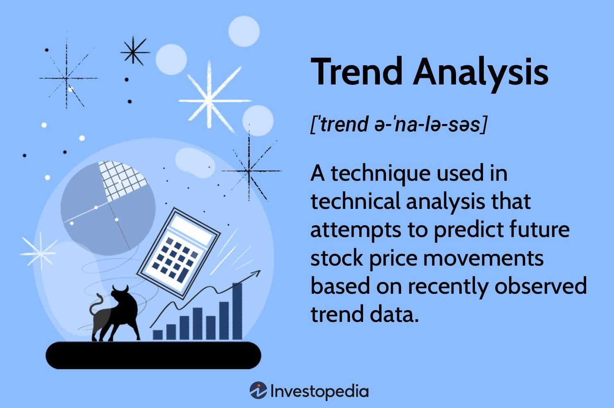

## Table of Contents

## What is trend analysis?

Trend analysis is a way to look at data over time to see if there are patterns or changes. It helps people understand if something is getting better, worse, or staying the same. For example, businesses might use trend analysis to see if their sales are going up or down over the years. By looking at these trends, they can make better decisions about what to do next.

There are different ways to do trend analysis. One common way is to use graphs and charts to show the data over time. This makes it easier to see the patterns. Another way is to use math formulas to predict future trends based on past data. Trend analysis is used in many fields, like finance, weather forecasting, and even health care, to help people make sense of large amounts of data and plan for the future.

## Why is trend analysis important in business?

Trend analysis is important in business because it helps companies understand what is happening over time. By looking at sales, costs, or customer behavior, businesses can see if things are getting better or worse. This helps them make smart decisions. For example, if a company sees that sales of a certain product are going down, they might decide to change the product or stop selling it altogether.

Another reason trend analysis is important is that it helps businesses plan for the future. By looking at past trends, companies can predict what might happen next. This can help them prepare for changes in the market or new opportunities. For instance, if a business sees that more people are buying their products online, they might decide to focus more on their online sales.

Overall, trend analysis gives businesses a clear picture of their performance and helps them stay ahead of the competition. It's like having a map that shows where you've been and where you're going, which is really helpful in making the right choices for the future.

## How can trend analysis be applied in different industries?

Trend analysis can be used in many different industries to help them understand what is happening and plan for the future. In the retail industry, businesses use trend analysis to look at sales data over time. This helps them see which products are popular and which ones are not selling well. By knowing these trends, retail stores can decide what to stock more of and what to stop selling. This can save them money and help them make more profit.

In the healthcare industry, trend analysis is used to look at patient data. Doctors and hospitals can see if certain diseases are becoming more common or if treatments are working better over time. This helps them make better decisions about how to treat patients and where to focus their resources. For example, if a hospital sees that more people are coming in with a certain illness, they might decide to hire more doctors who specialize in that illness.

In the finance industry, trend analysis is used to look at stock prices and economic data. Investors and banks use this information to predict what will happen in the future. If they see that a certain stock is going up over time, they might decide to buy more of it. On the other hand, if they see that the economy is slowing down, they might decide to be more careful with their investments. This helps them make smarter decisions and protect their money.

## What are the basic steps to perform a trend analysis?

To perform a trend analysis, you first need to collect data over time. This could be sales numbers, website visits, or any other information you want to look at. Make sure the data is organized in a way that shows how it changes over time, like in a table or a spreadsheet. Once you have your data, the next step is to look for patterns. You can do this by drawing a line on a graph that goes through the middle of your data points. This line will show you the general direction of the trend, whether it's going up, down, or staying the same.

After you've found the general trend, you can go deeper by looking at smaller patterns within the data. For example, you might see that sales go up every summer but down in the winter. This can help you understand what might be causing the trends. The last step is to use what you've learned to make decisions. If you see that a certain product is becoming more popular, you might decide to make more of it. Or if you see that fewer people are visiting your website, you might decide to change your marketing strategy. By following these steps, you can use trend analysis to make better choices for the future.

## What data sources are commonly used for trend analysis?

For trend analysis, people often use data from sales records. This data shows how much of a product or service was sold over time. Companies can get this information from their own records or from reports they buy from market research companies. Another common source is website analytics. This data shows how many people visit a website, what pages they look at, and how long they stay. Businesses use this to see if more people are coming to their site or if certain pages are becoming more popular.

Another important data source is social media. By looking at what people are talking about and how often they mention certain topics, companies can see if interest in their products is growing or shrinking. Surveys and customer feedback are also used a lot. These give direct information about what customers think and how their opinions change over time. Finally, economic data like unemployment rates or consumer spending can help businesses understand bigger trends that might affect their industry.

## How can one identify a trend using statistical tools?

To identify a trend using statistical tools, you first need to gather your data and organize it over time. This could be monthly sales figures, daily website visits, or any other data you want to analyze. Once you have your data ready, you can use a tool called regression analysis. This tool helps you draw a line through your data points that shows the general direction of the trend. If the line goes up, it means your data is increasing over time. If it goes down, it means your data is decreasing. This line is called the trend line, and it helps you see the overall pattern in your data.

After you've drawn your trend line, you can use another tool called moving averages to look at smaller patterns within your data. A moving average smooths out the ups and downs in your data, making it easier to see if there are any short-term trends happening. For example, you might see that sales go up every summer but down in the winter. By using these statistical tools, you can get a clear picture of what's happening with your data over time. This helps you understand if things are getting better, worse, or staying the same, and it can guide you in making decisions for the future.

## What are the common pitfalls to avoid in trend analysis?

One common mistake in trend analysis is relying too much on short-term data. Sometimes, a few good or bad months can make it look like there's a big trend when really it's just a small change. It's important to look at data over a longer time to see the real trend. Another mistake is ignoring outside factors that can affect the data. For example, if sales go up because of a big holiday, it might not mean the trend is really going up. You need to think about things like holidays, the economy, or even the weather when you look at trends.

Another pitfall is not checking the data carefully enough. Sometimes, there can be mistakes in the numbers or the way they're collected. If you don't fix these errors, your trend analysis can be wrong. It's also easy to see what you want to see in the data, which is called confirmation bias. If you think sales are going up, you might only look for information that supports that idea and ignore anything that says sales are going down. To avoid these problems, always double-check your data and try to look at it from different angles.

## How does trend analysis differ from other types of data analysis?

Trend analysis is different from other types of data analysis because it focuses on looking at data over time to see if there are patterns or changes. It helps to show if something is getting better, worse, or staying the same. For example, a business might use trend analysis to see if their sales are going up or down over the years. This is different from other types of analysis like descriptive analysis, which just looks at what the data is right now, or diagnostic analysis, which tries to figure out why something happened.

Other types of data analysis, like predictive analysis, use data to guess what might happen in the future, but they use more complex math and models than trend analysis. Trend analysis is simpler and usually just uses a line to show the general direction of the data. On the other hand, prescriptive analysis goes even further by suggesting what actions to take based on the data. So, while trend analysis is about seeing patterns over time, other types of analysis can focus on the present, the reasons behind the data, or what to do next.

## What advanced techniques can enhance trend analysis?

One advanced technique that can enhance trend analysis is using time series decomposition. This technique breaks down the data into different parts, like trends, seasonal patterns, and random noise. By separating these parts, you can see the big trends more clearly without being distracted by short-term changes or seasonal ups and downs. For example, if you're looking at monthly sales data, time series decomposition can help you see the overall trend of sales going up or down over years, while also showing you how sales change during different seasons.

Another technique is using machine learning algorithms, like ARIMA (AutoRegressive Integrated Moving Average) models. These models can predict future trends based on past data. They look at how data has changed over time and use that information to make guesses about what will happen next. This can be really helpful for businesses trying to plan for the future. For example, a company might use an ARIMA model to predict how many products they will sell next month, so they can make sure they have enough in stock.

## How can predictive analytics be integrated with trend analysis?

Predictive analytics can be integrated with trend analysis to make better guesses about the future. Trend analysis looks at data over time to see if there are patterns or changes. Predictive analytics takes this a step further by using math and computer models to predict what might happen next. For example, a business might use trend analysis to see that their sales are going up over time. Then, they can use predictive analytics to guess how much their sales will go up next month or next year. By combining these two methods, businesses can get a clearer picture of where they're headed and plan better.

To integrate predictive analytics with trend analysis, you first need good data that shows changes over time. Once you have this data, you can use trend analysis to find the general direction of these changes. After that, you can use predictive analytics tools, like machine learning models, to look at the trends and make predictions. For example, if a company sees that more people are buying their products online, they can use trend analysis to understand this pattern and then use predictive analytics to guess how many more people will buy online in the future. This helps the company prepare for what's coming and make smart decisions.

## What role does machine learning play in modern trend analysis?

Machine learning plays a big role in modern trend analysis by making it easier and more accurate to find patterns in data. It uses special computer programs that can learn from the data they see. These programs can look at a lot of information quickly and find trends that might be hard for people to see. For example, a business might use machine learning to look at their sales data over time. The machine learning program can find out if sales are going up or down and even guess why this is happening. This helps businesses understand their data better and make smarter choices.

Another way machine learning helps with trend analysis is by making predictions. Once a machine learning program finds a trend in the data, it can use that information to guess what will happen next. For example, if a company sees that more people are buying their products online, a machine learning model can predict how many more people will buy online in the future. This is really helpful for planning and making sure the company is ready for what's coming. By using machine learning, businesses can get a clearer picture of their trends and use that information to do better in the future.

## How can organizations implement a trend analysis strategy effectively?

To implement a trend analysis strategy effectively, organizations need to start by gathering good data. This means collecting information over time, like sales numbers or website visits, and making sure it's accurate and complete. Once they have the data, they should use tools like graphs and charts to see the trends clearly. It's also important to use statistical tools like regression analysis to draw a line through the data points, which shows the general direction of the trend. By looking at this trend line, organizations can understand if things are getting better, worse, or staying the same.

After finding the trends, organizations should think about what might be causing them. They need to consider outside factors like holidays, the economy, or the weather, which can affect the data. It's also helpful to use advanced techniques like time series decomposition or machine learning to get a deeper understanding of the trends and make better predictions about the future. By using these methods, organizations can make smart decisions based on what they see in the data. This helps them plan better and stay ahead of the competition.

## How are Machine Learning Models used in Trend Forecasting?

Machine learning models have become pivotal in enhancing the accuracy and efficiency of trend forecasting in algorithmic trading. By processing large datasets efficiently, these models identify subtle patterns and anomalies that might not be apparent through traditional methods. Key [machine learning](/wiki/machine-learning) techniques used in trend forecasting include regression analysis, neural networks, and ensemble methods.

### Regression Analysis

Regression analysis is fundamental in predicting the future values of financial markets based on historical data. Linear regression, which models the relationship between a dependent variable and one or more independent variables, helps in identifying linear trends within market data. More sophisticated variants, such as polynomial regression, can capture non-linear relationships. The basic formula for linear regression is:

$$
y = \beta_0 + \beta_1 x + \epsilon
$$

where $y$ is the predicted variable, $x$ is the independent variable, $\beta_0$ and $\beta_1$ are the coefficients, and $\epsilon$ represents the error term. Models can be evaluated for accuracy using metrics such as R-squared or Mean Squared Error (MSE).

### Neural Networks

Neural networks, particularly [deep learning](/wiki/deep-learning) models, have enabled significant advances in trend forecasting. These networks consist of multiple layers that allow them to model complex and non-linear relationships in the data. A popular architecture in financial forecasting is the Long Short-Term Memory (LSTM) network, a type of recurrent [neural network](/wiki/neural-network) designed to remember information over longer periods. This feature makes LSTM particularly effective in detecting trends that evolve over time. A simple implementation in Python using libraries like TensorFlow or Keras may look like this:

```python
from keras.models import Sequential
from keras.layers import LSTM, Dense

# Initialize the LSTM model
model = Sequential()
model.add(LSTM(units=50, return_sequences=True, input_shape=(X_train.shape[1], X_train.shape[2])))
model.add(LSTM(units=50))
model.add(Dense(units=1))

# Compile the model
model.compile(optimizer='adam', loss='mean_squared_error')

# Fit the model
model.fit(X_train, y_train, epochs=100, batch_size=32)
```

This code outlines a basic LSTM network designed to predict future market prices based on training data matrices $X$ and corresponding price movements $y$.

### Ensemble Methods

Ensemble methods leverage multiple learning models to improve prediction accuracy and reduce overfitting. Techniques like Random Forests and Gradient Boosting aggregate the results of many weak models to produce a stronger predictive performance. Random Forests, for example, create a "forest" of decision trees during training and output the mode of the classes (classification) or mean/average prediction (regression) of the individual trees. This method is particularly effective in reducing the variance and improving the robustness of the forecast.

```python
from sklearn.ensemble import RandomForestRegressor

# Initialize the random forest model
rf_model = RandomForestRegressor(n_estimators=100, random_state=42)

# Train the model
rf_model.fit(X_train, y_train)

# Make predictions
predictions = rf_model.predict(X_test)
```

Ensemble methods like this offer flexibility and improved performance over single models by combining the strengths of various algorithms.

### Dynamic and Adaptive Forecasting

Machine learning's capacity for dynamic adaptation makes it invaluable in algorithmic trading. These models can continuously learn from new data, adjusting their parameters to accommodate evolving market conditions. This feature is especially crucial in volatile markets where static models may quickly become obsolete.

By harnessing these machine learning techniques, traders can enhance their algorithms, improve the precision of trend forecasts, and capitalize on market movements with greater confidence.

## References & Further Reading

[1]: Bergstra, J., Bardenet, R., Bengio, Y., & Kégl, B. (2011). ["Algorithms for Hyper-Parameter Optimization."](https://dl.acm.org/doi/10.5555/2986459.2986743) Advances in Neural Information Processing Systems 24.

[2]: ["Advances in Financial Machine Learning"](https://www.amazon.com/Advances-Financial-Machine-Learning-Marcos/dp/1119482089) by Marcos Lopez de Prado

[3]: ["Evidence-Based Technical Analysis: Applying the Scientific Method and Statistical Inference to Trading Signals"](https://www.amazon.com/Evidence-Based-Technical-Analysis-Scientific-Statistical/dp/0470008741) by David Aronson

[4]: ["Machine Learning for Algorithmic Trading"](https://github.com/PacktPublishing/Machine-Learning-for-Algorithmic-Trading-Second-Edition) by Stefan Jansen

[5]: ["Quantitative Trading: How to Build Your Own Algorithmic Trading Business"](https://books.google.com/books/about/Quantitative_Trading.html?id=j70yEAAAQBAJ) by Ernest P. Chan