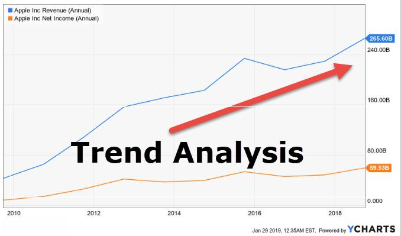

Algorithmic trading has fundamentally transformed financial markets by employing advanced technological methods to automate and optimize trading processes. At the heart of this transformative approach lies trend forecasting, a crucial component that provides insights into potential market movements by predicting future trends based on historical market data.

Trend forecasting is essential for traders and trading systems aiming to capitalize on market dynamics. It uses data-driven strategies to anticipate whether an asset's price will increase, decrease, or stabilize over a given period. By harnessing trend forecasting, algorithmic traders can execute trades with increased precision and reduced latency, optimizing their portfolios' performance in a competitive trading environment.



This article provides an extensive examination of various forecasting models and their application in algorithmic trading. We explore the principles of trend following and the use of technical analysis, highlighting how they contribute to predicting market trends. Additionally, we'll uncover how innovative machine learning models are enhancing the precision of trend forecasts, enabling traders to generate more refined trading strategies.

By understanding these models and methods, traders are equipped with enhanced tools, allowing them to capitalize on market opportunities and improve their trading performance. They gain the ability to respond swiftly to market changes, benefiting from both short-term price movements and long-term investment prospects.

## Table of Contents

## Understanding Trend Forecasting in Algorithmic Trading

Trend forecasting is a crucial element in algorithmic trading, revolving around the ability to predict future market directions through historical data analysis, technical indicators, and statistical methods. This process allows traders to anticipate potential uptrends or downtrends, enabling more informed trading decisions.

Algorithmic trading systems leverage these forecasts by automating trade executions based on pre-set rules that incorporate predicted market movements. By identifying specific conditions in which an asset's price is likely to rise or fall, these systems can react swiftly to market changes, often faster than human traders can.

Key to trend forecasting is the identification and interpretation of market trends, which manifest as consistent directional movements in asset prices. An uptrend is characterized by a series of higher highs and higher lows, suggesting that demand is outpacing supply, driving prices upward. Conversely, a downtrend consists of lower highs and lower lows, indicating stronger supply than demand. Recognizing the point at which a trend reverses direction is also vital, as these reversals can signal significant shifts in market dynamics.

Technical analysis provides the foundation for many trend forecasting models. By examining price charts and using various indicators, traders can detect patterns and infer potential future behavior. Indicators such as moving averages are often used to smooth out price data and highlight trends. For example, a commonly used tactic is the crossover strategy, where a short-term moving average crossing above a long-term moving average suggests a potential uptrend, while the opposite indicates a downtrend.

Mathematical models further enhance the accuracy of trend forecasts. Time-series analysis, for instance, can be employed to model price movements and predict future trends using past data. A popular method in time series modeling is the Autoregressive Integrated Moving Average (ARIMA) model, which combines autoregressive and moving average components to create a robust framework for forecasting.

Python offers powerful libraries such as pandas for data manipulation and statsmodels for statistical modeling, making it an ideal tool for developing and testing trend forecasting models. Below is an example of how one might implement a basic ARIMA model in Python:

```python
import pandas as pd
from statsmodels.tsa.arima.model import ARIMA

# Load time series data
data = pd.read_csv('historical_prices.csv')
prices = data['Close']

# Fit an ARIMA model
model = ARIMA(prices, order=(1, 1, 1))  # (p,d,q) order
model_fit = model.fit()

# Forecast future prices
forecast = model_fit.forecast(steps=5)
print("Forecasted Prices:", forecast)
```

Understanding and implementing trend forecasting in [algorithmic trading](/wiki/algorithmic-trading) involves the careful application of historical analyses, technical indicators, and statistical models. By automating these processes, traders can effectively anticipate market movements, capturing opportunities that align with predicted trends while mitigating the impact of reversals and [volatility](/wiki/volatility-trading-strategies).

## Technical Analysis and Its Role in Forecasting

Technical analysis is a method used by traders and analysts to evaluate and forecast future price movements in financial markets. This is accomplished through the examination of historical price data, trading volumes, and other statistical indicators. Its primary objective is to identify trends, patterns, and potential reversal points that can inform trading decisions.

A cornerstone of technical analysis is the use of indicators. Moving averages, one of the most popular indicators, smooth out price data to identify the underlying trend. There are several types of moving averages, including simple moving averages (SMA) and exponential moving averages (EMA). The SMA is calculated by taking the arithmetic mean of a given set of prices over a specific number of time periods. Conversely, the EMA gives more weight to the most recent prices, making it more responsive to new information.

Trend lines are another critical tool in technical analysis. They are drawn over pivot highs or under pivot lows to visualize the direction of the market. An upward trend line has a positive slope and is drawn by connecting two or more low points. Conversely, a downward trend line has a negative slope and is formed by connecting two or more high points. These lines are useful for identifying support and resistance levels, which are prices at which the asset tends to stop and reverse its direction.

Price patterns, such as head and shoulders, double tops, and triangles, also play a significant role. These geometric figures, formed by the price's movements, can suggest potential outcomes. For instance, the head and shoulders pattern, a common reversal pattern, indicates a potential reversal of the current trend after it fully forms.

Understanding technical signals is essential for developing effective algorithmic trading strategies. Algorithms can be programmed to recognize these indicators and patterns, triggering buy or sell decisions. For instance, a simple strategy might involve buying an asset when its short-term EMA crosses above its long-term EMA, signifying a potential upward trend, and selling when the opposite occurs.

The integration of technical analysis into algorithmic trading systems enables traders to systematize their decision-making process. By relying on pre-established rules, algorithms can execute trades with greater speed and consistency than human traders. Moreover, when combined with historical data, these technical tools can help traders backtest their strategies, ensuring that they have a statistically significant edge before trading in live markets.

In conclusion, technical analysis is a vital component of forecasting in algorithmic trading. By utilizing indicators, trend lines, and price patterns, traders can develop and refine strategies that seek to capitalize on market trends. The ability to understand and implement these technical signals is crucial for maximizing the efficacy of algorithmic trading systems.

## Machine Learning Models in Trend Forecasting

Machine learning models have become pivotal in enhancing the accuracy and efficiency of trend forecasting in algorithmic trading. By processing large datasets efficiently, these models identify subtle patterns and anomalies that might not be apparent through traditional methods. Key [machine learning](/wiki/machine-learning) techniques used in trend forecasting include regression analysis, neural networks, and ensemble methods.

### Regression Analysis

Regression analysis is fundamental in predicting the future values of financial markets based on historical data. Linear regression, which models the relationship between a dependent variable and one or more independent variables, helps in identifying linear trends within market data. More sophisticated variants, such as polynomial regression, can capture non-linear relationships. The basic formula for linear regression is:

$$
y = \beta_0 + \beta_1 x + \epsilon
$$

where $y$ is the predicted variable, $x$ is the independent variable, $\beta_0$ and $\beta_1$ are the coefficients, and $\epsilon$ represents the error term. Models can be evaluated for accuracy using metrics such as R-squared or Mean Squared Error (MSE).

### Neural Networks

Neural networks, particularly [deep learning](/wiki/deep-learning) models, have enabled significant advances in trend forecasting. These networks consist of multiple layers that allow them to model complex and non-linear relationships in the data. A popular architecture in financial forecasting is the Long Short-Term Memory (LSTM) network, a type of recurrent [neural network](/wiki/neural-network) designed to remember information over longer periods. This feature makes LSTM particularly effective in detecting trends that evolve over time. A simple implementation in Python using libraries like TensorFlow or Keras may look like this:

```python
from keras.models import Sequential
from keras.layers import LSTM, Dense

# Initialize the LSTM model
model = Sequential()
model.add(LSTM(units=50, return_sequences=True, input_shape=(X_train.shape[1], X_train.shape[2])))
model.add(LSTM(units=50))
model.add(Dense(units=1))

# Compile the model
model.compile(optimizer='adam', loss='mean_squared_error')

# Fit the model
model.fit(X_train, y_train, epochs=100, batch_size=32)
```

This code outlines a basic LSTM network designed to predict future market prices based on training data matrices $X$ and corresponding price movements $y$.

### Ensemble Methods

Ensemble methods leverage multiple learning models to improve prediction accuracy and reduce overfitting. Techniques like Random Forests and Gradient Boosting aggregate the results of many weak models to produce a stronger predictive performance. Random Forests, for example, create a "forest" of decision trees during training and output the mode of the classes (classification) or mean/average prediction (regression) of the individual trees. This method is particularly effective in reducing the variance and improving the robustness of the forecast.

```python
from sklearn.ensemble import RandomForestRegressor

# Initialize the random forest model
rf_model = RandomForestRegressor(n_estimators=100, random_state=42)

# Train the model
rf_model.fit(X_train, y_train)

# Make predictions
predictions = rf_model.predict(X_test)
```

Ensemble methods like this offer flexibility and improved performance over single models by combining the strengths of various algorithms.

### Dynamic and Adaptive Forecasting

Machine learning's capacity for dynamic adaptation makes it invaluable in algorithmic trading. These models can continuously learn from new data, adjusting their parameters to accommodate evolving market conditions. This feature is especially crucial in volatile markets where static models may quickly become obsolete.

By harnessing these machine learning techniques, traders can enhance their algorithms, improve the precision of trend forecasts, and capitalize on market movements with greater confidence.

## Case Study: Trend Following Strategy

Trend following is a widely adopted trading strategy that involves executing trades aligned with the prevailing market direction. This strategy capitalizes on the [momentum](/wiki/momentum) of existing trends, aiming to generate profits as the trend continues. By evaluating historical price movements and integrating advanced forecasting models, traders can make informed decisions about entry and [exit](/wiki/exit-strategy) points.

Technical analysis plays a foundational role in [trend following](/wiki/trend-following) strategies. Traders often utilize various indicators to identify trends, such as moving averages, which smooth price data over a specified period to highlight the overall direction. For instance, a common technique is the crossover of moving averages, where a short-term moving average crossing above a long-term moving average may signal a potential uptrend.

Machine learning enhances this strategy by offering sophisticated models that can process vast amounts of data to predict future trends. Models such as neural networks and ensemble methods like random forests allow traders to adapt to market changes dynamically. For example, a neural network trained on historical price data can identify complex patterns and provide probabilistic forecasts of future price movements.

A well-documented case study involves a [hedge fund](/wiki/hedge-fund-trading-strategies) that successfully applied a trend-following strategy using technical analysis and machine learning models. The fund utilized a combination of moving averages and a neural network model to determine trends and forecast future price movements. By continuously retraining the model with the latest market data, the hedge fund ensured the strategy's adaptability to evolving market conditions.

The integration of machine learning provided the fund with an edge, enabling it to capture subtle market signals that traditional technical indicators might miss. This approach not only improved the accuracy of trend detection but also facilitated timely decision-making, allowing the fund to capitalize on market momentum effectively.

The synergy between technical analysis and machine learning in trend-following strategies exemplifies the potential of blending quantitative methods with advanced computational models. Such an integrated approach not only enhances the predictive capabilities but also mitigates risks associated with market volatility, ultimately contributing to sustained trading success.

## Applications and Advantages of Forecasting Models

Forecasting models serve as essential tools in the trading ecosystem across a broad spectrum of asset classes such as equities, commodities, and [forex](/wiki/forex-system). Their versatility stems from their capacity to digest vast amounts of historical and real-time data, transforming these inputs into actionable insights that can guide trading strategies.

One of the primary advantages of using forecasting models is their ability to reduce risk. By accurately predicting market trends, traders can make informed decisions that minimize exposure to unfavorable market movements. For instance, a well-calibrated model can detect emerging patterns that signal potential downturns, allowing traders to exit positions preemptively or hedge their portfolios accordingly. This predictive capability helps in cushioning the impacts of market volatility.

Forecasting models also enhance the accuracy of trading decisions. Through the use of sophisticated algorithms and statistical analyses, these models process complex datasets to identify patterns that may not be immediately apparent. Techniques such as regression analysis, time-series modeling, and machine learning algorithms refine predictions and improve the probability of profitable trades. A classic example would include the use of moving averages and momentum indicators, which provide clear signals on the potential directions of price movements.

The capability to harness market momentum is another significant advantage offered by forecasting models. Models that detect and exploit trends can capitalize on sustained price movements, whether upward or downward, maximizing profit potential. For example, a momentum trading strategy powered by a forecasting model can identify assets experiencing significant upward price movements post earnings announcement. Traders can then ride the trend by investing in these assets, often resulting in substantial gains.

To illustrate how traders can employ these models effectively, consider a simple moving average crossover strategy in Python:

```python
import pandas as pd
import numpy as np

# Fetch data
data = pd.read_csv('market_data.csv')
data['SMA_50'] = data['Close'].rolling(window=50).mean()
data['SMA_200'] = data['Close'].rolling(window=200).mean()

# Identify signals
data['Signal'] = 0
data['Signal'][50:] = np.where(data['SMA_50'][50:] > data['SMA_200'][50:], 1, 0)
data['Position'] = data['Signal'].diff()

# Visualize signals
import matplotlib.pyplot as plt

plt.figure(figsize=(14,7))
plt.plot(data['Close'], label='Closing Price', alpha=0.5)
plt.plot(data['SMA_50'], label='50-Day SMA', alpha=0.75)
plt.plot(data['SMA_200'], label='200-Day SMA', alpha=0.75)
plt.plot(data[data['Position'] == 1].index, 
         data['SMA_50'][data['Position'] == 1], 
         '^', markersize=10, color='g', lw=0, label='Buy Signal')
plt.plot(data[data['Position'] == -1].index, 
         data['SMA_50'][data['Position'] == -1], 
         'v', markersize=10, color='r', lw=0, label='Sell Signal')
plt.title('Simple Moving Average Strategy')
plt.legend()
plt.show()
```

This Python code outlines a basic strategy using moving averages to identify buy/sell signals in market data. When the 50-day simple moving average (SMA) crosses above the 200-day SMA, it generates a buy signal; conversely, a sell signal occurs when it crosses below.

In conclusion, the adaptive use of forecasting models equips traders with a robust framework to navigate the complexities of financial markets. By leveraging these models, they gain a competitive edge through reduced risk, accurate predictions, and the ability to capitalize on momentum, ultimately enhancing the overall profitability of their trading strategies.

## Challenges in Trend Forecasting and Algorithmic Trading

Algorithmic trading and trend forecasting have transformed how traders engage with financial markets, yet they are not without their challenges. Among these, data quality, model validation, and overfitting stand out as significant obstacles that traders must navigate to ensure the efficacy of their strategies.

Data quality is foundational in building reliable forecasting models. The integrity and accuracy of data can directly influence the performance of an algorithmic trading system. Inconsistent or inaccurate data may lead to incorrect predictions, thereby affecting trading outcomes. Traders must ensure that data is clean, complete, and collected from credible sources. Employing data preprocessing techniques such as normalization, handling missing values, and removing outliers is essential to maintaining high data quality.

Model validation is another critical element. It involves assessing the model's performance using historical data to ensure it accurately forecasts future market trends. A robust validation process includes techniques like cross-validation, where the data is partitioned into subsets to test the model repeatedly, enhancing its predictive capability. This process helps identify whether a model can generalize well to new data or if it is merely capturing noise.

Overfitting is a common problem in algorithmic trading models, where the model is too complex and captures noise instead of the underlying trend. This results in poor performance on unseen data. To mitigate overfitting, traders can simplify the model by reducing its complexity, or applying regularization techniques, which penalize excessive complexity, helping the model generalize better.

Regularization can be implemented in Python, for example, using the Ridge regression, which adds a penalty equal to the square of the magnitude of coefficients. Here's a sample code snippet:

```python
from sklearn.linear_model import Ridge
from sklearn.model_selection import train_test_split
from sklearn.metrics import mean_squared_error

# Assume X is the feature matrix and y is the target variable
X_train, X_test, y_train, y_test = train_test_split(X, y, test_size=0.2, random_state=42)

ridge_model = Ridge(alpha=1.0)
ridge_model.fit(X_train, y_train)

y_pred = ridge_model.predict(X_test)
mse = mean_squared_error(y_test, y_pred)

print(f"Mean Squared Error: {mse}")
```

Understanding and addressing these challenges is crucial for traders in algorithmic trading. By ensuring high data quality, validating models rigorously, and actively mitigating overfitting, traders can refine their strategies for better market performance. Embracing these practices enhances the reliability and effectiveness of trend forecasting systems in dynamic financial markets.

## Conclusion

Trend forecasting and algorithmic trading have become indispensable components of modern financial markets, driven by the convergence of advanced technologies and sophisticated analytical methods. The integration of mathematical models and computing power has allowed traders to decipher patterns and signals that were once obscured in the noise of market data. With recent technological advancements, traders now possess an array of tools designed to enhance decision-making processes, facilitating more precise market assessments.

The evolution of [artificial intelligence](/wiki/ai-artificial-intelligence) and machine learning has paved the way for even greater enhancements in market analysis. These technologies are equipped to process vast datasets rapidly, uncovering trends that might elude traditional statistical methods. Machine learning algorithms, such as neural networks and ensemble methods, are increasingly capable of adapting to changing market conditions, offering dynamic forecasting solutions and supporting automated trading strategies.

To remain competitive and achieve sustained success in trading, it is crucial for traders to continually educate themselves about these transformative technologies. Familiarity with tools such as machine learning libraries (e.g., TensorFlow, Scikit-learn) and programming languages (Python, R) enhances a trader’s ability to develop and refine complex algorithmic systems. Embracing continuous learning helps traders mitigate risks such as data quality issues and model overfitting, common challenges in algorithmic trading, thus maintaining a competitive edge.

In conclusion, the enhanced analytical capabilities provided by current technological tools have revolutionized trading, yielding benefits that include improved accuracy, speed, and adaptability. As AI and machine learning continue to advance, traders are equipped with the potential to conduct more precise and impactful market analyses. The ongoing education and adaptation to these developments are vital for harnessing these technologies to their full extent and achieving long-term trading success.

## References & Further Reading

[1]: Bergstra, J., Bardenet, R., Bengio, Y., & Kégl, B. (2011). ["Algorithms for Hyper-Parameter Optimization."](https://dl.acm.org/doi/10.5555/2986459.2986743) Advances in Neural Information Processing Systems 24.

[2]: ["Advances in Financial Machine Learning"](https://www.amazon.com/Advances-Financial-Machine-Learning-Marcos/dp/1119482089) by Marcos Lopez de Prado

[3]: ["Evidence-Based Technical Analysis: Applying the Scientific Method and Statistical Inference to Trading Signals"](https://www.amazon.com/Evidence-Based-Technical-Analysis-Scientific-Statistical/dp/0470008741) by David Aronson

[4]: ["Machine Learning for Algorithmic Trading"](https://github.com/PacktPublishing/Machine-Learning-for-Algorithmic-Trading-Second-Edition) by Stefan Jansen

[5]: ["Quantitative Trading: How to Build Your Own Algorithmic Trading Business"](https://books.google.com/books/about/Quantitative_Trading.html?id=j70yEAAAQBAJ) by Ernest P. Chan