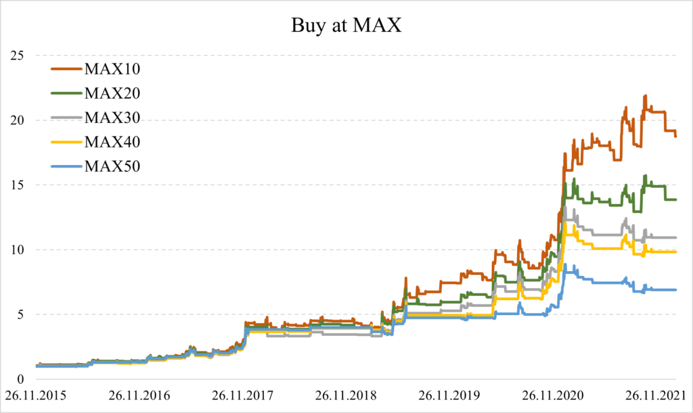

## Table of Contents

## What is trend-following in the context of Bitcoin trading?

Trend-following in Bitcoin trading is a strategy where traders try to make money by following the overall direction of Bitcoin's price movement. Instead of trying to predict sudden changes or short-term movements, trend-followers look for a clear pattern that shows Bitcoin's price going up or down over time. They buy Bitcoin when they see it's on an upward trend and sell it when they notice the trend is going down. This method relies on the idea that once a trend starts, it is likely to continue for some time.

Using trend-following can be helpful because it takes emotion out of trading decisions. Instead of guessing when the price will change, traders use specific rules or indicators to decide when to buy or sell. For example, they might use moving averages, which are lines on a chart that smooth out price data to show the trend more clearly. However, trend-following is not perfect. Sometimes, trends can suddenly reverse, and traders might buy or sell at the wrong time. Despite these risks, many traders find trend-following to be a useful way to navigate the often unpredictable world of Bitcoin trading.

## What is mean-reversion in the context of Bitcoin trading?

Mean-reversion in Bitcoin trading is a strategy that believes prices will eventually return to their average or "mean" value after moving away from it. Traders who use this approach think that if Bitcoin's price goes too high or too low, it will eventually come back to a more normal level. They look for times when the price is far from its average and bet on it moving back toward that average. For example, if Bitcoin's price suddenly jumps very high, a mean-reversion trader might sell, expecting the price to drop back down.

This strategy can be useful because it takes advantage of the natural ups and downs in Bitcoin's price. However, it's not always easy to predict when the price will revert to the mean. Sometimes, the price might stay high or low for longer than expected, which can lead to losses for mean-reversion traders. Despite these challenges, many traders find mean-reversion to be a helpful way to make decisions in the volatile world of Bitcoin trading.

## How can a beginner identify trends in Bitcoin price movements?

For a beginner to identify trends in Bitcoin price movements, the first step is to look at a price chart over a long period of time, like weeks or months. On this chart, you can draw a line that connects the highs and lows of the price. If this line is going up over time, it means Bitcoin is in an upward trend. If the line is going down, it's in a downward trend. A simple way to do this is by using a tool called a moving average, which smooths out the price data to make the trend easier to see. For example, a 50-day moving average shows the average price over the last 50 days, and if the current price is above this line, it suggests an upward trend.

Another way to spot trends is by watching how Bitcoin reacts at certain price levels. If the price keeps bouncing off a certain low point and then going up, that low point is called support, and it can signal an upward trend. On the other hand, if the price keeps hitting a high point and then falling back down, that high point is called resistance, and it can signal a downward trend. Beginners can use simple tools on trading platforms to draw these lines and see if the price is consistently moving in one direction. By paying attention to these patterns and using basic tools, even someone new to trading can start to understand and identify trends in Bitcoin's price movements.

## What are the basic indicators used to detect mean-reversion in Bitcoin?

To spot mean-reversion in Bitcoin, beginners can use simple tools called indicators. One common indicator is the moving average. A moving average is a line that shows the average price of Bitcoin over a certain time, like 20 or 50 days. If Bitcoin's price moves far away from this line, it might be a sign that the price will soon come back to the average. For example, if Bitcoin's price is much higher than the 50-day moving average, a trader might expect it to drop back down toward the average.

Another useful indicator is the Bollinger Bands. These are two lines that sit above and below the moving average. The top line is usually two standard deviations above the moving average, and the bottom line is two standard deviations below. When Bitcoin's price touches or goes beyond these lines, it might mean the price has gone too far and will soon return to the middle, which is the moving average. By watching these indicators, even someone new to trading can start to see when Bitcoin's price might be ready to revert to its average.

## Can you explain the difference between trend-following and mean-reversion strategies?

Trend-following and mean-reversion are two different ways to trade Bitcoin. Trend-following means you try to make money by going along with the overall direction of Bitcoin's price. If the price is going up, you buy Bitcoin and hope it keeps going up. If the price is going down, you sell Bitcoin or wait to buy it later when the price is lower. The idea is to ride the trend as long as it lasts. Trend-followers use tools like moving averages to see if the price is going up or down over time.

On the other hand, mean-reversion is about betting that Bitcoin's price will come back to its average after it moves too far away. If the price goes really high, a mean-reversion trader might sell, expecting it to drop back down to the average. If the price goes really low, they might buy, expecting it to go back up to the average. Mean-reversion traders use tools like moving averages and Bollinger Bands to see when the price is far from its average and might be ready to come back. Both strategies have their own risks and rewards, and they help traders make decisions in different ways.

## What are the risks associated with trend-following strategies in Bitcoin?

Trend-following strategies in Bitcoin can be risky because the price can change direction suddenly. If a trader buys Bitcoin thinking the price will keep going up, but it suddenly goes down, they could lose money. This is called a "false [breakout](/wiki/breakout-trading)," where the price seems to start a new trend but quickly reverses. Because Bitcoin's price can be very unpredictable, these false breakouts happen a lot, making trend-following risky.

Another risk is that trend-following strategies can lead to buying high and selling low. If a trader waits too long to buy into an upward trend, they might buy at the peak just before the price starts to drop. Similarly, if they sell too early in a downward trend, they might miss out on further gains if the price keeps falling. These timing issues can make it hard for traders to make money, especially in a market as volatile as Bitcoin.

## How do mean-reversion strategies mitigate risks in Bitcoin trading?

Mean-reversion strategies can help lower risks in Bitcoin trading by betting that the price will come back to its average after moving too far away. This means traders might buy Bitcoin when the price is very low, expecting it to go back up to the average. They might also sell when the price is very high, expecting it to drop back down. This approach can be safer because it doesn't rely on guessing where the price will go next. Instead, it uses the idea that prices tend to return to normal levels over time.

However, mean-reversion strategies are not without risks. Sometimes, Bitcoin's price can stay high or low for longer than expected, which can lead to losses if a trader buys or sells at the wrong time. For example, if a trader sells Bitcoin when the price is high, thinking it will drop back to the average, but the price keeps going up, they might miss out on gains. Despite these challenges, mean-reversion can still be a helpful way to manage risk in the unpredictable world of Bitcoin trading, as it focuses on the long-term balance of prices rather than short-term swings.

## What advanced technical analysis tools can be used to enhance trend-following in Bitcoin?

To make trend-following better in Bitcoin trading, traders can use a tool called the Moving Average Convergence Divergence (MACD). This tool helps show when a trend is getting stronger or weaker. It uses two lines: one fast line and one slow line. When the fast line crosses above the slow line, it might mean the price is starting to go up. When the fast line crosses below the slow line, it might mean the price is starting to go down. By watching these lines, traders can see if a trend is really happening or if it might be about to change.

Another useful tool is the Relative Strength Index (RSI). The RSI helps show if Bitcoin is being bought or sold too much. If the RSI goes above 70, it might mean Bitcoin is overbought and the price could go down soon. If it goes below 30, it might mean Bitcoin is oversold and the price could go up. Traders can use this to check if a trend is strong or if it might be ready to change direction. By combining these tools with simple trend lines, traders can get a better idea of when to buy or sell Bitcoin, making their trend-following strategy more accurate.

## How can statistical models be applied to predict mean-reversion in Bitcoin?

Statistical models can help predict mean-reversion in Bitcoin by looking at past price data to find patterns. One common model is the Ornstein-Uhlenbeck process, which is good at showing how prices might move back to their average over time. Traders use this model to guess when Bitcoin's price is too far from its normal level and might come back to it. By studying the data, the model can tell if the price has moved too much and how quickly it might return to the average. This can help traders decide when to buy or sell Bitcoin to take advantage of the price moving back to normal.

Another way to use statistical models is with something called regression analysis. This method looks at how Bitcoin's price changes compared to other factors, like trading volume or market news. If the price goes too high or too low compared to these factors, the model can predict that it will come back to a more normal level. By using regression analysis, traders can see if the current price is out of line with what the model expects and make trades based on that information. These statistical models can give traders a better idea of when mean-reversion might happen, helping them make smarter decisions in the unpredictable world of Bitcoin trading.

## What are some case studies of successful trend-following in Bitcoin markets?

One successful case of trend-following in Bitcoin markets happened in 2017. During that year, Bitcoin's price started to go up a lot, and many traders noticed this trend. They used tools like moving averages to confirm that the price was really going up. Traders who bought Bitcoin early in the year and held onto it until December made a lot of money. The price went from around $1,000 at the start of the year to almost $20,000 by the end. By following the upward trend and using simple trend-following strategies, these traders were able to make big profits.

Another example of successful trend-following happened in 2020. After the price dropped a lot in March because of the global economic uncertainty, many traders saw that the price started to go back up. They used indicators like the MACD to see that the trend was changing from down to up. Traders who bought Bitcoin in April, when the price was around $7,000, and held onto it until the end of the year saw the price go up to over $29,000. By following the trend and using tools to confirm it, these traders were able to make good money even during a tough time.

## How do institutional investors use mean-reversion strategies in Bitcoin?

Institutional investors use mean-reversion strategies in Bitcoin to try to make money by betting that the price will come back to its average after it moves too far away. They look at the price over a long time and use tools like moving averages and Bollinger Bands to see when the price is too high or too low. If the price is much higher than the average, they might sell Bitcoin, expecting it to drop back down. If the price is much lower than the average, they might buy Bitcoin, expecting it to go back up. This way, they can take advantage of the ups and downs in Bitcoin's price without having to guess where it will go next.

These investors also use more advanced statistical models to predict when mean-reversion might happen. For example, they might use the Ornstein-Uhlenbeck process to see how quickly the price might come back to its average. By studying past price data, they can make better guesses about when to buy or sell. Institutional investors have a lot of money and can make big trades, so using mean-reversion strategies helps them manage risk and make steady profits in the often unpredictable world of Bitcoin trading.

## What are the future trends and potential developments in trend-following and mean-reversion strategies for Bitcoin?

In the future, trend-following strategies for Bitcoin might get better with new technology. Traders could use more advanced tools like [machine learning](/wiki/machine-learning) to spot trends faster and more accurately. These tools can look at a lot of data very quickly and find patterns that humans might miss. This could help traders make better decisions about when to buy or sell Bitcoin. Also, as more people and big investors get into Bitcoin, the market might become more stable, making it easier to follow trends. But, because Bitcoin's price can still change a lot, traders will need to keep learning and adapting to new ways of spotting trends.

For mean-reversion strategies, the future might bring more advanced statistical models that can predict when Bitcoin's price will come back to its average even better. These models could use more data and look at more factors, like news and social media, to guess when the price has moved too far. Institutional investors might use these new models to make smarter trades and manage their risk better. As Bitcoin becomes more popular, mean-reversion strategies could become more important for keeping the market balanced. But, because Bitcoin can be unpredictable, traders will still need to be careful and ready for sudden changes in the price.

## How can data analysis be used for strategy formulation?

To effectively apply trend-following and mean-reversion strategies in Bitcoin trading, it is crucial to base decisions on robust historical data. Data collection typically involves accessing records from exchanges such as Gemini, which provides comprehensive historical price data for Bitcoin. The process begins by obtaining a dataset that encompasses daily opening, closing, high, and low prices along with transaction volumes over an extended period, ensuring that the sample includes various market conditions.

### Data Collection

The data is usually extracted via API calls or downloaded directly from exchange platforms. For example, using Python, one might employ the `pandas` library to streamline this operation:

```python
import pandas as pd
import requests

url = 'https://api.gemini.com/v1/pubticker/btcusd'
response = requests.get(url)
bitcoin_data = response.json()

df = pd.DataFrame(bitcoin_data)
```

This setup grants the trader access to dynamically updating datasets, facilitating ongoing strategy assessment and optimization.

### Detailed Analysis

The analysis of Bitcoin's behavior relies on statistical methods and visualization tools to identify patterns suitable for specific strategies. For trend-following, one might inspect moving averages for signals of sustained price movements. A common approach is to analyze simple moving averages (SMA) and exponential moving averages (EMA) over various periods.

With SMA, potential entry and [exit](/wiki/exit-strategy) signals are identified by crossovers. For instance, a short-term SMA crossing above a long-term SMA might suggest a buying opportunity. Mathematically, an SMA is expressed as:

$$
\text{SMA}_n = \frac{1}{n} \sum_{i=0}^{n-1} P_i
$$

Where $P_i$ represents the closing price at day $i$.

For mean-reversion, examining [volatility](/wiki/volatility-trading-strategies) through Bollinger Bands or oscillators like the Relative Strength Index (RSI) is key. These tools help in pinpointing when prices are likely to revert to their mean. Prices touching the lower Bollinger Band might suggest undervaluation, whereas the RSI could indicate overselling when it falls below a certain threshold (commonly 30).

### Behavioral Analysis Near Extremes

Analyzing Bitcoin's behavior near its historical extreme prices—the maxima and minima—provides insights into market volatility and investor psychology. This analysis involves segmenting data to calculate average price returns and volatility after these extremes. Identifying common patterns following these price points can enhance strategy robustness.

For example, during periods of extreme low prices, statistical evaluation indicates potential strong rebounds, a consideration in developing mean-reversion strategies. Conversely, following record highs, trend-following strategies might still prevail if the subsequent volatility and trading [volume](/wiki/volume-trading-strategy) metrics support ongoing [momentum](/wiki/momentum).

By rigorously analyzing historical data, traders can devise strategies that are empirically grounded, optimizing potential returns while managing risks associated with Bitcoin's notorious price swings.

## References & Further Reading

[1]: Bergstra, J., Bardenet, R., Bengio, Y., & Kégl, B. (2011). ["Algorithms for Hyper-Parameter Optimization."](https://papers.nips.cc/paper/4443-algorithms-for-hyper-parameter-optimization) Advances in Neural Information Processing Systems 24.

[2]: ["Advances in Financial Machine Learning"](https://www.amazon.com/Advances-Financial-Machine-Learning-Marcos/dp/1119482089) by Marcos Lopez de Prado

[3]: ["Evidence-Based Technical Analysis: Applying the Scientific Method and Statistical Inference to Trading Signals"](https://www.amazon.com/Evidence-Based-Technical-Analysis-Scientific-Statistical/dp/0470008741) by David Aronson

[4]: ["Machine Learning for Algorithmic Trading"](https://github.com/stefan-jansen/machine-learning-for-trading) by Stefan Jansen

[5]: ["Quantitative Trading: How to Build Your Own Algorithmic Trading Business"](https://books.google.com/books/about/Quantitative_Trading.html?id=j70yEAAAQBAJ) by Ernest P. Chan