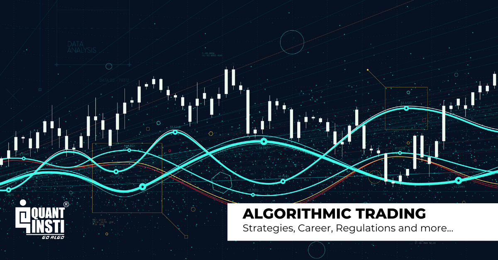

## Table of Contents

## What are trend following indicators and how do they work?

Trend following indicators are tools used by traders to identify and follow the direction of market trends. They help traders decide when to buy or sell assets by showing whether the market is moving up, down, or sideways. Some common trend following indicators include moving averages, the Average Directional Index (ADX), and the Parabolic SAR. These indicators work by analyzing past price data to predict future price movements, helping traders make more informed decisions.

These indicators work by smoothing out price data over a period of time to make trends easier to spot. For example, a moving average calculates the average price of an asset over a specific number of days, and when the price crosses above this average, it might signal a good time to buy. Conversely, if the price falls below the moving average, it could be a sign to sell. The key idea is that these indicators help traders ride the trend until it shows signs of reversing, which can lead to profitable trades if used correctly.

## What are the most common trend following indicators used in trading?

The most common trend following indicators used in trading are moving averages, the Average Directional Index (ADX), and the Parabolic SAR. Moving averages are very popular because they are easy to understand and use. They work by calculating the average price of an asset over a certain number of days. For example, a 50-day moving average takes the average price of the last 50 days. Traders often use two moving averages, like a 50-day and a 200-day, to see when they cross each other. When the shorter moving average crosses above the longer one, it might be a good time to buy. When it crosses below, it might be a good time to sell.

The Average Directional Index (ADX) helps traders see how strong a trend is. It gives a number between 0 and 100. If the ADX is above 25, it usually means the trend is strong. If it's below 20, the trend is weak. Traders use this to decide if they should follow the trend or wait for a stronger one. The Parabolic SAR is another useful indicator. It puts dots on a chart to show where the trend might reverse. If the dots are below the price, it suggests the trend is up, and if they are above the price, it suggests the trend is down. Traders use these dots to decide when to enter or [exit](/wiki/exit-strategy) trades.

## How can trend following indicators be applied in algorithmic trading?

Trend following indicators can be used in [algorithmic trading](/wiki/algorithmic-trading) to make decisions automatically. In algorithmic trading, computers use these indicators to decide when to buy or sell assets without human help. For example, a computer might use moving averages to watch the price of a stock. If the short-term moving average goes above the long-term one, the computer might buy the stock. If it goes below, the computer might sell it. This way, the computer can follow the trend and make trades based on clear rules.

Another way to use [trend following](/wiki/trend-following) indicators in algorithmic trading is with the Average Directional Index (ADX). The computer can check if the ADX is above 25 to see if the trend is strong. If it is, the computer might decide to follow the trend and make a trade. If the ADX is below 20, the computer might wait for a stronger trend. The Parabolic SAR can also be used. The computer can watch the dots on the chart. If the dots are below the price, it might buy the stock, and if they are above, it might sell. This helps the computer make quick decisions based on the trend.

## What are the benefits of using trend following indicators in algo trading?

Using trend following indicators in algo trading can help traders make money by following the market's direction. These indicators, like moving averages, ADX, and Parabolic SAR, give clear signals about when to buy or sell. This makes it easier for the computer to decide what to do without needing a person to watch the market all the time. The computer can quickly spot trends and act on them, which can lead to more trades and possibly more profits.

Another benefit is that trend following indicators can help reduce the risk of making bad trades. By sticking to the trend, the computer follows a plan that has been shown to work over time. This means it is less likely to make sudden, risky moves based on short-term changes in the market. Using these indicators also helps keep trading decisions consistent, which can lead to better results over time.

## What are the potential pitfalls or limitations of relying on trend following indicators?

Using trend following indicators can sometimes lead to problems. One big issue is that these indicators often give signals after the trend has already started. This means you might buy or sell a bit late, which can make you miss out on the best parts of the trend. Also, these indicators can give false signals, making you think a trend is starting when it's not. This can lead to losing money if you follow these wrong signals.

Another problem is that trend following indicators don't work well in markets that move sideways. When prices go up and down without a clear trend, these indicators can keep telling you to buy and sell, which can lead to a lot of small losses. Plus, relying too much on these indicators can make you miss other important things happening in the market, like big news or changes in how people feel about the market. So, it's good to use trend following indicators, but you should also look at other things to make the best trading decisions.

## How can one backtest trend following strategies in algorithmic trading?

To backtest trend following strategies in algorithmic trading, you need to use past market data to see how well your strategy would have worked. You can use special software or programming languages like Python to do this. First, you gather historical price data for the assets you want to trade. Then, you write code that tells the computer to use your trend following indicators, like moving averages or ADX, to make buy and sell decisions based on this old data. The computer runs through the data, making trades as if it were in the past, and keeps track of how much money you would have made or lost.

After the backtest is done, you look at the results to see if your strategy worked well. You check things like how much money you made, how often you made or lost money, and how big your wins and losses were. If your strategy did well in the past, it might work well in the future too. But remember, past results don't always mean future success. You might need to change your strategy a bit if it didn't work as well as you hoped. Backtesting helps you find out what works and what doesn't before you start trading with real money.

## What are some advanced techniques for optimizing trend following indicators in algo trading?

One advanced technique for optimizing trend following indicators in algo trading is to use multiple time frames. Instead of just looking at one time frame, like daily prices, you can also look at shorter or longer ones, like hourly or weekly prices. By doing this, you can see if the trend is strong across different time frames. If the trend looks good on both short and long time frames, it might be a better time to trade. This can help you make more accurate decisions and avoid false signals.

Another technique is to combine different trend following indicators. For example, you might use moving averages along with the ADX. The moving averages can tell you the direction of the trend, while the ADX can tell you how strong it is. If both indicators agree, it can give you more confidence in your trading decisions. You can also use other tools, like the Relative Strength Index (RSI), to check if the market is overbought or oversold. This can help you decide when to enter or exit a trade more effectively.

## How do market conditions affect the performance of trend following strategies?

Market conditions can really change how well trend following strategies work. When the market is moving in a clear direction, either up or down, trend following strategies can do very well. They help traders catch these big moves and make money by following the trend. But if the market is moving sideways, without a clear trend, these strategies can struggle. They might keep telling you to buy and sell, but you end up losing money because the market isn't going anywhere.

It's also important to think about how fast the market is moving. In fast-moving markets, trend following strategies can be great because they help you jump on trends quickly. But in slow-moving markets, these strategies might not work as well because the trends are not strong enough to make big profits. So, it's good to keep an eye on the market and maybe change your strategy a bit depending on what's happening.

## Can trend following indicators be combined with other types of indicators for better results?

Yes, trend following indicators can be combined with other types of indicators to get better results. For example, you can use trend following indicators like moving averages to see the direction of the market, and then use other indicators like the Relative Strength Index (RSI) to check if the market is overbought or oversold. The RSI can help you decide if it's a good time to buy or sell based on how strong the current price movement is. By using both types of indicators together, you can make more informed decisions and avoid some of the pitfalls of using trend following indicators alone.

Another way to combine indicators is to use trend following indicators with [volume](/wiki/volume-trading-strategy) indicators, like the On-Balance Volume (OBV). The OBV can show you if the trend is supported by strong buying or selling pressure. If the trend following indicator shows a trend and the OBV confirms it with high volume, it can give you more confidence in your trade. This combination can help you spot trends that are more likely to continue, leading to better trading results.

## What role does risk management play when using trend following indicators in algo trading?

Risk management is very important when using trend following indicators in algo trading. It helps you protect your money by setting rules on how much you can lose on each trade. For example, you might decide to only risk a small part of your money on any single trade. This way, even if the trend following indicator gives a wrong signal and you lose money, you won't lose too much. You can also use stop-loss orders, which automatically sell your asset if the price drops too much, to limit your losses.

Another part of risk management is deciding how much of your money to use for trading. You might choose to only use a small part of your total money, so you have some left if things go wrong. It's also good to keep checking and changing your risk rules as the market changes. By doing this, you can make sure your trend following strategy works well and keeps your money safe.

## How have trend following strategies evolved with the advent of machine learning and AI?

Trend following strategies have changed a lot since [machine learning](/wiki/machine-learning) and AI came along. Before, traders used simple rules like moving averages to spot trends. Now, with machine learning, computers can look at a lot more data and find patterns that people might miss. They can learn from past trades and get better over time. This means trend following strategies can be more accurate and make better decisions about when to buy or sell.

AI also helps by making it easier to test and improve these strategies. With AI, you can run many tests quickly to see what works best. This is called [backtesting](/wiki/backtesting). AI can also look at different market conditions and change the strategy to fit them. This makes trend following strategies more flexible and able to work well in different situations. So, with machine learning and AI, trend following has become smarter and more effective.

## What are some real-world examples of successful algo trading systems that use trend following indicators?

One real-world example of a successful algo trading system that uses trend following indicators is the Turtle Trading System. This system was created in the 1980s by Richard Dennis and William Eckhardt. They taught a group of people, called the Turtles, how to trade using simple trend following rules. The Turtles used moving averages to spot trends and made a lot of money by following these trends. The system showed that trend following can work well if you stick to the rules and manage your risk.

Another example is the Medallion Fund, run by Renaissance Technologies. This fund uses advanced algorithms, including trend following indicators, to make trades. The Medallion Fund is famous for making huge profits, often more than 30% a year. They use a lot of data and complex math to find trends and make quick trades. This shows that even with simple trend following ideas, you can do very well if you use them smartly with other tools and good risk management.

## References & Further Reading

[1]: Schwager, J.D. (1996). [Technical Analysis](https://www.amazon.com/Getting-Started-Technical-Analysis-Schwager/dp/0471295426). Wiley Finance.

[2]: Nison, S. (2001). [Japanese Candlestick Charting Techniques](https://pakyahussin.com/wp-content/uploads/2019/07/Steve-Nison-Japanese-Candlestick-Charting-Techniques-Prentice-Hall-Press-2001.pdf). Prentice Hall Press.

[3]: Murphy, J.J. (1999). [Technical Analysis of the Financial Markets](https://www.amazon.com/Technical-Analysis-Financial-Markets-Comprehensive/dp/0735200661). New York Institute of Finance.

[4]: Kirkpatrick II, C.D., & Dahlquist, J.R. (2010). [Technical Analysis: The Complete Resource for Financial Market Technicians](https://www.amazon.com/Technical-Analysis-Complete-Financial-Technicians/dp/0134137043). FT Press.

[5]: Bollinger, J. (2001). [Bollinger on Bollinger Bands](https://www.amazon.com/Bollinger-Bands-John/dp/0071373683). McGraw Hill.

[6]: Wilder, J.W. (1978). [New Concepts in Technical Trading Systems](https://www.amazon.com/New-Concepts-Technical-Trading-Systems/dp/0894590278). Trend Research.

[7]: Lane, G.C. (1984). [Lane's Stochastics](https://store.traders.com/-v02-c03-lane-pdf.html). Technical Analysis of Stocks and Commodities, Vol. 2.

[8]: Patel, M. (2010). [Trading with Ichimoku Clouds: The Essential Guide to Ichimoku Kinko Hyo Technical Analysis](https://www.amazon.com/Trading-Ichimoku-Clouds-Essential-Technical-ebook/dp/B003NSBMMQ). Wiley.

[9]: Kaufman, P.J. (2005). [The New Commodity Trading Systems and Methods](https://www.amazon.com/New-Commodity-Trading-Systems-Methods/dp/0471878790). Wiley.

[10]: Covel, M. W. (2009). [Trend Following: How Great Traders Make Millions in Up or Down Markets](https://www.amazon.com/Trend-Following-Millions-Financial-Prentice/dp/0131446037). FT Press.