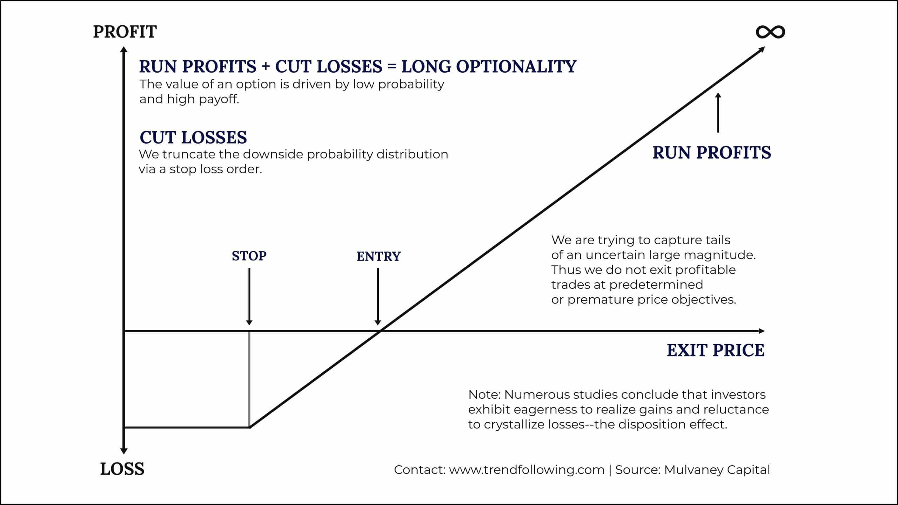

Trend following, a critical concept in trading, is based on the idea that financial markets move in trends – upward, downward, or sideways – over time. This strategy, widely regarded for its straightforwardness and efficacy, involves identifying and riding these market trends to capitalize on their momentum. It's not just about predicting future movements; instead, trend followers aim to react to current market movements and make decisions based on actual trends rather than forecasts or assumptions.

The significance of trend following in trading cannot be overstated. It's a cornerstone strategy for many traders, from novices to seasoned professionals, due to its adaptability across various markets and asset classes. Whether in stocks, commodities, currencies, or bonds, trend-following strategies have demonstrated resilience and profitability over decades. Their success stems from their ability to capture large market moves, making them a compelling strategy in the dynamic world of trading. This strategy thrives on the principle that 'the trend is your friend,' encouraging traders to align with market momentum rather than attempting to predict reversals.

## Table of Contents

## Understanding Trend Following

### The Concept of a Trend

In trading, a trend is essentially a sustained movement in the market in a particular direction over a period. It's the general trajectory of market prices, either upwards, downwards, or sideways. The crux of identifying a trend lies in observing consistent patterns in price movements. When prices steadily increase, it forms an uptrend, characterized by higher highs and higher lows. Conversely, a downtrend is marked by lower lows and lower highs, indicating a gradual decrease in prices.

Trends can be influenced by a multitude of factors, including economic indicators, company performance, political events, and market sentiment. Recognizing a trend involves more than just spotting a temporary direction in price; it's about identifying a pattern that persists long enough to provide actionable trading opportunities. Successful trend following hinges on the trader's ability to discern these patterns amidst market noise and volatility.

Understanding trends is critical because they are the foundation upon which many trading strategies are built. Traders use trend analysis to make informed decisions, aligning their trades with the market's momentum to capitalize on potential gains. In essence, trends offer a roadmap for navigating the often unpredictable terrain of financial markets, providing a systematic approach to trading.

### How Trends Emerge

Trends in trading emerge from a complex interplay of factors influencing market sentiment and price movement. They can develop in any market, be it stocks, forex, commodities, or indices, and their formation is often rooted in fundamental, economic, and psychological factors.

1. **Fundamental Factors**: Economic data, earnings reports, changes in industry dynamics, and macroeconomic factors often initiate trends. For example, a positive earnings report from a leading company can trigger an uptrend in that sector. Similarly, broader economic indicators like GDP growth, interest rates, or employment data can influence market trends.
2. **Technical Factors**: Trends can also emerge from technical analysis. Traders using chart patterns, volume analysis, and technical indicators contribute to the formation of trends. When a significant number of traders act upon similar technical signals, their collective action can create and sustain a trend.
3. **Market Sentiment**: Trends are significantly influenced by the overall sentiment or psychology of market participants. News events, geopolitical developments, and market narratives can shift sentiment rapidly, leading to trend formation. For instance, optimistic sentiment about technology advancements might lead to a sustained uptrend in tech stocks.
4. **Liquidity and Market Participation**: The level of liquidity and the participation of different types of traders, including institutional investors, hedge funds, and retail traders, play a vital role in how trends develop. High liquidity and increased participation often contribute to stronger and more sustained trends.
5. **External Shocks**: Sometimes, trends emerge unexpectedly due to external shocks like political instability, natural disasters, or significant policy changes. These events can abruptly change the market’s direction and create new trends.
6. **Global Interconnectedness**: In today’s global economy, trends can also emerge due to events in other markets or countries. For example, a significant policy change in a major economy like the US or China can influence global market trends.

Understanding how trends emerge helps traders in anticipating potential market movements and aligning their strategies accordingly. It's important to note that trends can vary significantly across different markets and assets, and what drives a trend in one market may not apply to another. This dynamic nature of trends underlines the importance of continuous learning and adaptation in trend-following strategies.

## Short-Term vs Long-Term Trends

In trading, understanding the distinction between short-term and long-term trends is pivotal for implementing effective trend-following strategies. These trends differ significantly in duration, characteristics, and the factors that influence them.

|  | **Short-Term Trends** | **Long-Term Trends** |
| --- | --- | --- |
| **Duration** | Typically, these trends last from a few days to a few weeks. | These trends can span months or even years. |
| **Characteristics** | Short-term trends are often more volatile and less predictable. They are influenced by temporary market sentiments, news events, and minor economic updates. | Long-term trends are generally more stable and easier to identify. They are driven by underlying economic factors, long-term corporate performance, or sustained market shifts. |
| **Trading Approach** | Traders capitalize on these trends through quick, responsive actions. Short-term trend trading often involves higher frequency trading and requires constant market monitoring. | Trading with long-term trends involves a more patient, 'set-and-forget' approach. Traders need to withstand short-term market fluctuations without reacting hastily. |
| **Indicators Used** | Short-term traders may rely on indicators like short-period moving averages, stochastic oscillators, or RSI for more immediate signals. | Long-term traders often use indicators like long-period moving averages, MACD, or trend lines to identify and stay with the trend. |

Both short-term and long-term trends offer unique opportunities and challenges. Short-term trends can provide quick profits but require agility and tolerance for higher risk and market noise. Long-term trends offer the potential for significant returns with less need for frequent trading decisions, but require patience and a higher tolerance for temporary paper losses.

Traders must choose the type of trend that best matches their trading style, risk tolerance, time availability, and strategic preferences. Some may even blend both approaches, using short-term strategies to capitalize on immediate opportunities while maintaining long-term positions aligned with broader market movements. The key is understanding the inherent nature of these trends and how they align with personal trading goals and methods.

## Identifying Trends

Identifying trends is a critical skill in trend-following strategies. It involves distinguishing direction in market price movements to make informed trading decisions. Here are key insights into how traders can recognize and validate a trend:

1. **Observation of Price Movements**:
    - **Higher Highs and Higher Lows**: In an uptrend, look for a pattern of higher highs and higher lows. Conversely, a downtrend is indicated by lower highs and lower lows.
    - **Direction of Price Movement**: Consistent movement in one direction over time often signals a trend.
2. **Use of Technical Indicators**:
    - **Moving Averages**: A simple moving average (SMA) or an exponential moving average (EMA) can help smooth out price data to identify the trend direction. For example, when the price is consistently above a moving average, it may indicate an uptrend.
    - **Moving Average Crossovers**: A short-term moving average crossing over a long-term average can signal the start of a new trend.
3. **Trend Lines and Channels**:
    - **Drawing Trend Lines**: Connect the lows in an uptrend or the highs in a downtrend. A valid trend line should be touched at least three times by the price.
    - **Channels**: Parallel lines can be drawn along the trend line to create a channel, helping to identify potential buy and sell points within a trend.
4. **Volume Analysis**:
    - **Volume Confirmation**: Rising volume during the formation of a trend can confirm its strength. A trend accompanied by decreasing volume might suggest weakening momentum.
5. **Chart Patterns Recognition**:
    - **Continuation Patterns**: Patterns like flags, pennants, or triangles can indicate that a current trend is likely to continue.
    - **Reversal Patterns**: Head and shoulders, double tops, and double bottoms can signal a potential trend reversal.
6. **Price Breakouts**:
    - **Breakouts from Ranges**: A price breaking out from a consolidation range or resistance/support levels can signal the beginning of a new trend.
7. **Combination of Time Frames**:
    - **Multiple Time Frame Analysis**: Using different time frames (like daily, weekly, monthly charts) for a broader view of the trend. Confirmation across multiple time frames strengthens the validity of a trend.
8. **Confirmation with Fundamental Analysis** (for longer-term trends):
    - **Economic Indicators and Market News**: Aligning the trend with economic indicators and news can provide additional confirmation, especially for long-term trends.

By combining these methods, traders can more accurately identify and validate trends in the markets. It’s important to remember that no single method is infallible, so using a combination of techniques can help in making more robust trading decisions. Remember, in trend following, the goal is not to predict future price movements but to react to current market trends with disciplined strategy and risk management.

## Implementing Trend Following Strategies

### Key Indicators

In trend following, certain key indicators are instrumental in identifying and capitalizing on market trends. These indicators help traders discern the strength, duration, and potential shifts in trends. Here are some of the most commonly used indicators in trend-following strategies:

1. **Moving Averages (MAs)**:
    - **Simple Moving Average (SMA)**: Calculates the average price over a specific number of periods, smoothing out price data to identify the trend direction.
    - **Exponential Moving Average (EMA)**: Similar to SMA but gives more weight to recent prices, making it more responsive to new information.
    - **Crossovers**: A popular trend-following signal is when a short-term moving average crosses over a longer-term moving average, indicating a potential trend change.
2. **Average True Range (ATR)**:
    - ATR measures market volatility by decomposing the entire range of an asset price for that period.
    - Higher ATR values indicate higher volatility, often found during market trends.
    - It’s used to adjust the distance of trailing stops or determine the size of the position in accordance with the current market volatility.
3. **Bollinger Bands**:
    - Consist of three lines: a moving average (middle band), an upper band at a standard deviation above, and a lower band at a standard deviation below the moving average.
    - The squeezing of bands often indicates low market volatility and can precede significant price movements or trend changes.
4. **Relative Strength Index (RSI)**:
    - A momentum oscillator that measures the speed and change of price movements.
    - RSI values range from 0 to 100, with high readings suggesting overbought conditions (potential downtrend) and low readings indicating oversold conditions (potential uptrend).
5. **MACD (Moving Average Convergence Divergence)**:
    - MACD is a trend-following momentum indicator showing the relationship between two moving averages of an asset's price.
    - The MACD crossover of its signal line can indicate a buying or selling opportunity in the direction of the trend.
6. **Directional Movement Index (DMI)**:
    - Includes the Average Directional Index (ADX), which measures the strength of a trend.
    - Values above 25 often indicate a strong trend, while values below 25 indicate a weak or absent trend.
7. **Trendlines and Channels**:
    - Drawing trendlines connecting highs or lows can help visualize the trend.
    - Channels, or the addition of parallel lines to trendlines, can provide potential areas of support and resistance within a trend.

Each of these indicators serves a unique purpose in trend-following strategies. Moving averages provide a smoothed analysis of price trends, ATR offers insights into market volatility, Bollinger Bands gauge market dynamics, and oscillators like RSI and MACD offer momentum insights. The effectiveness of these indicators increases when used in conjunction with other tools and aligned with comprehensive risk management strategies. Understanding the nuances of each indicator can greatly enhance a trader’s ability to follow and capitalize on market trends effectively.

### Strategy Examples

Trend following strategies range from simple to advanced, catering to various levels of trading expertise and complexity. Here are examples of both simple and advanced trend-following strategies that traders commonly use:

|  | Complexity | Description | Execution | Example |
| --- | --- | --- | --- | --- |
| **Dual Moving Average Crossover** | Simple | This involves using two moving averages, a short-term and a long-term. | When the short-term moving average crosses above the long-term moving average, it signals a potential upward trend, suggesting a buy. Conversely, if the short-term average crosses below, it signals a downward trend, suggesting a sell. | A popular combination is the 50-day and 200-day moving averages. |
| **ATR Channel Breakout** | Advanced | This strategy uses the Average True Range (ATR) to create a channel around the price, defining the trend's volatility. | Buy when the price breaks above the ATR channel and sell when it breaks below. The ATR helps in adjusting the channel width based on market volatility. | Setting a 2x ATR above and below a 20-day moving average creates a dynamic channel that adjusts to changing market conditions. |
| **Bollinger Bands Trend Following** | Intermediate | Bollinger Bands consist of a moving average (middle band), an upper band, and a lower band. | A buy signal occurs when the price touches the lower band, suggesting an oversold condition. A sell signal is indicated when the price touches the upper band, implying an overbought condition. | Using a 20-day moving average with two standard deviations for the bands. |
| **Momentum Breakout** | Advanced | This involves identifying strong trend movements or breakouts using momentum indicators. | Buy when a significant upward momentum is detected and sell on strong downward momentum. Indicators like RSI or MACD can be helpful. | Buying when RSI crosses above 70 or selling when it falls below 30. |
| **Parabolic SAR Trend Following** | Intermediate | Parabolic SAR (Stop and Reverse) provides potential stop-loss points and indicates the trend direction. | When the dots are below the price, it indicates an uptrend; above the price suggests a downtrend. Traders can enter or exit trades based on the position of the SAR dots relative to the price. | Enter a long position when the dots shift below the price candles and exit or go short when they move above. |
| **Donchian Channel Trend Following** | Intermediate | Utilizes the Donchian channel, defined by the highest high and lowest low of a set period. | A buy signal occurs when the price breaks above the upper band of the channel, while a sell signal happens when the price breaks below the lower band. | Using a 20-day Donchian channel to set the upper and lower bounds. |

These trend-following strategies offer a spectrum of complexity, from straightforward moving average crossovers to more nuanced approaches like ATR channel breakouts. Traders can choose or modify these strategies based on their experience level, risk tolerance, and market conditions. It's crucial to combine these strategies with sound risk management practices and continuous market analysis for optimal trading performance.

## Pros and Cons of Trend Following

### Advantages

Trend following, a mainstay in trading strategies, presents numerous advantages that cater to both novice and seasoned traders. Here are some key benefits of employing trend-following strategies:

1. **Simplicity and Clarity**: One of the primary advantages of trend following is its simplicity. The concept of buying high and selling higher in uptrends, or selling low and buying back lower in downtrends, is straightforward and easy to understand, even for beginners.
2. **Effectiveness Across Markets**: Trend-following strategies are versatile and can be effective across various asset classes, including stocks, bonds, currencies, and commodities. This adaptability allows traders to apply these strategies in different market environments.
3. **Profit Potential in Both Bull and Bear Markets**: Trend following does not restrict traders to bullish markets alone. These strategies can be designed to capitalize on both rising and falling market trends, providing opportunities for profit in diverse market conditions.
4. **Suitability for Long-Term Trading**: Trend-following strategies are particularly effective for long-term trading. They allow traders to ride out long-term market trends, potentially leading to significant gains over time.
5. **Risk Management**: Trend following inherently includes risk management principles. Traders can set stop-loss orders based on trend reversals, which helps in minimizing losses and protecting profits.
6. **Reduced Need for Market Forecasting**: These strategies do not require precise predictions about market movements or timing. Instead, they focus on identifying and reacting to established trends, which reduces the pressure and uncertainty associated with market forecasting.
7. **Benefit from Market Psychology**: Trend following capitalizes on the herd mentality often observed in markets. As more traders join a trend, it tends to strengthen, creating self-reinforcing momentum that trend followers can benefit from.
8. **Automatable and Scalable**: Many trend-following strategies can be automated, which allows for more disciplined trading and the ability to scale strategies across different instruments and timeframes.
9. **Diversification**: Implementing trend-following strategies can add diversification to a trading portfolio. By trading different assets and using varied trend-following methods, traders can spread their risk.
10. **Emotional Detachment**: By adhering to the rules of a trend-following strategy, traders can make more objective, rule-based decisions, reducing the impact of emotions on their trading.

The combination of these advantages makes trend following a compelling strategy, especially for those seeking a systematic approach to trading that can be applied across different market conditions. However, it's important to remember that like any trading strategy, trend following is not without its risks and limitations, and it requires discipline and proper risk management to be effective.

### Disadvantages

While trend following is a widely used and effective trading strategy, it is not without its drawbacks. Understanding these limitations is essential for traders to use these strategies effectively. Here are some potential disadvantages of trend following:

1. **Late Entry and Exit**: Trend following inherently involves a degree of lag, as it relies on confirming the existence of a trend before entering a trade. This delay can sometimes mean missing the early part of a trend or staying in a trade after a trend has peaked.
2. **Whipsaws and False Signals**: In volatile markets, trend-following strategies can generate false signals or 'whipsaws', leading to entering or exiting trades prematurely. This can result in increased transaction costs and reduced profitability.
3. **Underperformance in Range-Bound Markets**: Trend following strategies tend to underperform in markets that are range-bound or lacking a clear direction. In such conditions, these strategies may generate signals that lead to flat or losing trades.
4. **Psychological Challenges**: The need for discipline and patience can be challenging, especially during periods when a trend-following strategy is not performing optimally. Staying the course during drawdowns or periods of market inactivity can be mentally taxing for traders.
5. **Risk of Large Drawdowns**: While trend following can provide substantial profits during strong trends, these strategies are also susceptible to significant drawdowns during trend reversals or when high volatility leads to rapid trend changes.
6. **Over-reliance on Historical Data**: Trend-following models often rely on historical market data for back-testing and developing strategies. However, past performance is not always indicative of future results, and market conditions can change in ways that historical models may not predict.
7. **Capital Intensive**: To effectively follow trends, especially in multiple markets or asset classes, substantial capital may be required. This can be a barrier for smaller retail traders.
8. **Transaction Costs and Slippage**: Frequent trading, a common aspect of trend-following strategies, can lead to higher transaction costs. Additionally, slippage - the difference between expected and actual execution prices - can impact profitability, especially in fast-moving markets.
9. **Dependency on Extended Trends**: For maximum effectiveness, trend-following strategies require extended market trends. In the absence of such trends, these strategies may yield minimal or negative returns.
10. **Adaptation to Market Changes**: Trend-following strategies may need regular adjustments to remain effective. Markets evolve, and a static approach might become less effective over time, requiring continuous monitoring and adaptation.

These disadvantages highlight the importance of a balanced approach in trading. While trend following can be a powerful tool in a trader's arsenal, understanding its limitations is crucial for long-term success. It is often beneficial to combine trend-following with other strategies and sound risk management practices to mitigate these drawbacks.

## Quantifying and Defining a Trend

In the realm of trend following, the ability to quantify and define a trend is not just beneficial, but essential. Quantitative techniques enable traders to establish concrete criteria for trend identification, leading to more objective and systematic trading decisions. Here's an overview of how traders can use quantitative methods for trend following:

1. **Moving Averages**: One of the most fundamental tools for trend quantification is the moving average. Simple Moving Averages (SMA) or Exponential Moving Averages (EMA) smooth out price data to create a single flowing line, making it easier to identify the direction of the trend. A rising moving average indicates an uptrend, while a declining moving average suggests a downtrend.
2. **Average Directional Index (ADX)**: The ADX is a popular tool used to measure the strength of a trend. Values above a certain threshold (commonly 20 or 25) indicate a strong trend, while lower values suggest a weaker or range-bound market.
3. **Relative Strength Index (RSI)**: While primarily a momentum indicator, RSI can also help in trend identification. Consistently high RSI values (above 70) might indicate a strong uptrend, whereas consistently low values (below 30) could suggest a downtrend.
4. **Trendlines and Channels**: Drawing trendlines on price charts is a straightforward method to visualize and define trends. Upward sloping lines indicate uptrends, while downward slopes signal downtrends. Parallel channels can also be drawn to understand the volatility and stability of the trend.
5. **Standard Deviation and Bollinger Bands**: These tools measure the volatility and stability of trends. Bollinger Bands, which plot standard deviations above and below a moving average, can indicate the strength of the trend based on the width of the bands.
6. **Breakout Indicators**: Quantitative breakout indicators, such as Donchian Channels, help traders identify when an asset has broken out of its typical range, indicating the start of a new trend.
7. **Price Action and Patterns**: While not purely quantitative, observing price action and chart patterns can complement quantitative methods. Patterns like triangles, flags, and head and shoulders can indicate trend continuations or reversals.
8. **Algorithmic Models**: Advanced traders may employ algorithmic models that use statistical methods to define and follow trends. These models can process large datasets and complex calculations that are beyond manual analytical capabilities.

Quantifying trends is vital because it introduces objectivity and repeatability into a trading strategy. It minimizes emotional decision-making and bias, which are common pitfalls in trading. A quantified approach also allows for easier strategy refinement and adjustment, as specific parameters can be tweaked and tested for effectiveness.

In conclusion, the use of quantitative techniques in trend following is a cornerstone of modern trading strategies. By quantifying trends, traders can establish clear criteria for trade entries and exits, leading to more disciplined and potentially more profitable trading.

## Trend Following in Various Markets

Trend following, as a strategy, is remarkably versatile and can be adapted to a wide range of markets. Each market, however, has its unique characteristics, and understanding these is crucial for the effective application of trend following strategies. Here's an overview of the best markets for trend following and how the strategy can be adapted across different asset classes:

**Stock Market**

The stock market, with its vast array of individual stocks, indices, and sectors, is a fertile ground for trend followers. Trends in stocks can be driven by a multitude of factors including corporate earnings, industry developments, and overall economic conditions. Long-term trends are particularly prevalent in stock markets, making them suitable for trend following.

**Commodities Market**

Commodities like gold, oil, and agricultural products are highly susceptible to trends driven by supply and demand dynamics, geopolitical events, and changes in economic policies. The cyclical nature of commodities often creates strong trends that can be capitalized on using trend following strategies.

**Forex Market**

The foreign exchange market is another ideal venue for trend followers due to its enormous size, liquidity, and the long-term trends formed by macroeconomic factors. Currency pairs can exhibit significant trends driven by interest rate differentials, economic data, and global geopolitical events.

**Futures Market**

Futures contracts across commodities, indices, and even bonds provide trend followers with a diverse set of instruments to trade. The leverage inherent in futures trading can amplify gains from trend following but also increases risk, making risk management crucial.

**Cryptocurrency Market**

Despite being relatively new, the cryptocurrency market has shown strong trend movements, driven by investor sentiment, regulatory news, and technological advancements. The high volatility in this market can result in substantial trends, offering significant opportunities for trend followers.

**Bond Market**

The bond market, while often perceived as less volatile, does exhibit trends, especially in response to changes in interest rates and monetary policy. Trend following can be used in both government and corporate bond markets.

The key to successfully implementing trend following in different markets lies in understanding the unique characteristics of each market. Factors such as market liquidity, volatility, and the impact of economic events vary across markets and must be accounted for in trend following strategies.

While the core principles of trend following remain the same, strategies may need to be tailored to fit different markets. This includes customizing indicator settings, risk management rules, and entry/exit criteria to suit the specific dynamics of each market.

Applying trend following across multiple markets can also provide diversification benefits, reducing risk and smoothing the equity curve. This diversification allows trend followers to capitalize on opportunities in different markets while mitigating the impact of any single market’s downturn.

In conclusion, trend following is a versatile strategy that can be applied effectively across a range of markets. The key to success lies in understanding the specific traits of each market, customizing strategies accordingly, and employing robust risk management techniques. Whether in stocks, commodities, forex, or newer markets like cryptocurrencies, trend following remains a powerful tool for traders.

## Risk Management in Trend Following

Effective risk management is the backbone of successful trend following. Given the inherent uncertainties in financial markets, trend followers must adopt robust risk management strategies to preserve capital and sustain profitability. Here are key strategies and common mistakes to be aware of:

**Position Sizing**

One of the most critical aspects of risk management in trend following is position sizing. It's essential to determine the right amount of capital to allocate to each trade based on the risk profile and overall portfolio size. This approach helps in managing potential losses without significantly impacting the overall portfolio.

**Stop-Loss Orders**

Implementing stop-loss orders is a fundamental risk control mechanism. These orders help in automatically closing a position at a predetermined price level, thus limiting potential losses if the market moves against the trend.

**Diversification Across Markets**

Diversification is not just about spreading investments across multiple assets but also about choosing different markets and instruments. This strategy reduces the risk of a single market's downturn impacting the entire portfolio.

**Monitoring Market Conditions**

Constantly monitoring market conditions is vital for trend followers. Changes in market volatility, economic indicators, and global events can significantly affect market trends, and being alert to these changes can help in making informed decisions.

**Adapting to Market Changes**

Flexibility in adapting strategies to changing market conditions is crucial. This includes modifying existing positions, reevaluating trend indicators, or even exiting the market when necessary.

**Leverage Management**

While leverage can amplify gains in trend following, it can also magnify losses. It’s important to use leverage judiciously, understanding its potential impact on both profits and losses.

**Regular Review and Adjustments**

Regularly reviewing and adjusting strategies based on past performance and market feedback is essential. This ongoing process helps in refining strategies and improving their effectiveness over time.

## Systematic vs Discretionary Trend Following

Trend following in trading can be approached through two distinct methodologies: systematic and discretionary. Each method has its unique attributes and caters to different types of traders.

**Systematic Trend Following**

- **Rule-Based**: Systematic trend following is heavily reliant on predetermined rules and algorithms. Traders develop a set of criteria and conditions under which they enter and exit trades. This method is less influenced by emotional biases.
- **Automation**: Often, these strategies can be automated, allowing for the use of trading bots or algorithms that execute trades when certain conditions are met. This automation ensures discipline and consistency in applying the strategy.
- **Quantitative Analysis**: Systematic approaches typically involve quantitative analysis, using historical data to back-test and validate strategies before implementation.
- **Scalability and Efficiency**: Because of the automation and rule-based nature, systematic strategies can efficiently manage multiple positions across various markets, enhancing scalability.
- **Emotionally Less Taxing**: As decisions are based on predefined rules, traders are less prone to emotional decision-making, which can be a significant advantage during volatile market conditions.

**Discretionary Trend Following**

- **Human Judgment**: Discretionary trend following depends largely on the trader's expertise, intuition, and judgment. While it may use similar indicators as systematic methods, the final decision to trade is made by the trader.
- **Flexibility**: This approach allows for greater flexibility. Traders can interpret market contexts and nuances that a purely systematic approach might not pick up. They can adapt quickly to changing market conditions without the need for algorithmic reprogramming.
- **Requires Experience**: Discretionary trading often requires a deeper level of market experience and understanding since decisions are based on subjective judgment rather than fixed rules.
- **Emotionally Demanding**: As it relies on human decision-making, it can be more emotionally taxing. Traders need to manage their emotions effectively to avoid cognitive biases that might impair judgment.
- **Less Consistent**: Without the rigid structure of an automated system, discretionary trading can be less consistent, with a greater variability in trading outcomes.

**Key Differences**

- **Decision-Making**: Systematic uses algorithms and fixed rules, while discretionary relies on human judgment and intuition.
- **Adaptability**: Discretionary trading can adapt quickly to market changes, whereas systematic methods require rule adjustments or reprogramming.
- **Consistency**: Systematic trading offers more consistency in applying the strategy, whereas discretionary methods might see more variability.
- **Emotional Influence**: Discretionary trading is more susceptible to emotional biases, while systematic methods minimize this impact.
- **Complexity and Skill Level**: Systematic approaches can be complex to set up initially and may require programming skills. Discretionary trading demands a high level of market knowledge and experience.

In conclusion, both systematic and discretionary trend following have their advantages and drawbacks. The choice between them often depends on the trader’s personality, skill level, and comfort with either relying on strict rules and automation or making decisions based on personal judgment and market experience.

## Conclusion

In conclusion, trend following represents a pivotal strategy in modern trading, characterized by its adaptability and effectiveness across various market conditions.

Trend following, with its dynamic nature and robust methodology, remains a cornerstone in the repertoire of modern traders. Whether you're a novice seeking a solid foundation or an experienced trader looking to refine your strategies, the world of trend following offers a rich and rewarding journey.

We encourage readers to deep dive further into this fascinating aspect of trading. Explore additional resources, engage with community discussions, and consider integrating trend following into your trading arsenal. As the markets continue to evolve, the principles of trend following stand as a testament to the enduring nature of this effective trading strategy.

## Frequently Asked Questions

**What is trend following?**

Trend following is a trading strategy that attempts to capitalize on long-term moves that play out in various markets. Traders using this strategy believe that price movements will continue in the same direction for some time.

**How do you identify a trading trend?**

Trends can be identified using technical analysis tools such as moving averages, Relative Strength Index (RSI), and Average Directional Index (ADX). Traders look for patterns in price movements and use these tools to confirm whether a trend is present.

**Can trend following be applied in all markets?**

Yes, trend following can be applied across various markets, including stocks, commodities, currencies, and bonds. However, its effectiveness may vary depending on market conditions and volatility.

**What are the key indicators used in trend following?**

Key indicators include moving averages (like the Dual Moving Average), Average True Range (ATR), Bollinger Bands, and momentum indicators. These tools help traders determine the strength and direction of a trend.

**How long do trend followers typically hold a position?**

The holding period in trend following can vary greatly, from several weeks to months, or even years. It largely depends on the type of trend (short-term vs. long-term) and the specific strategy being used.

**Is trend following risky?**

Like all trading strategies, trend following involves risk. The main risks include market reversals and whipsaws, where a perceived trend rapidly reverses, potentially leading to significant losses.

**How important is risk management in trend following?**

Risk management is crucial in trend following. It involves setting stop-loss orders, diversifying across different asset classes, and properly sizing positions to manage the potential losses.

**Do trend following strategies work in sideways markets?**

Trend following strategies are less effective in sideways or range-bound markets as these strategies rely on the existence of a clear trend. In such markets, trend followers might experience more false signals and whipsaws.

**Has the effectiveness of trend following changed over time?**

The effectiveness of trend following can fluctuate over time due to changes in market conditions, volatility, and economic factors. However, it remains a popular strategy due to its adaptability and potential for long-term gains.

**Can beginners use trend following strategies?**

Yes, trend following can be suitable for beginners, thanks to its simplicity and straightforward principles. However, like any trading strategy, it requires study, practice, and a solid understanding of risk management principles.

## References & Further Reading

- ["Trend Following: How to Make a Fortune in Bull, Bear, and Black Swan Markets"](https://www.amazon.com/Trend-Following-Fortune-Markets-Trading-ebook/dp/B06Y63RDS2) by Michael W. Covel - This book provides a comprehensive look at the trend following strategy, backed by real-world examples and success stories.
- ["Following the Trend: Diversified Managed Futures Trading"](https://www.amazon.com/Following-Trend-Diversified-Managed-Futures/dp/1118410858) by Andreas F. Clenow - Clenow shares insights on how professional traders apply trend following strategies in futures markets.
- ["The Complete TurtleTrader: The Legend, the Lessons, the Results"](https://www.amazon.com/Complete-TurtleTrader-Legend-Lessons-Results/dp/0061241709) by Michael W. Covel - A fascinating account of how a group of novice traders became millionaires using trend following strategies.
- ["Trend Commandments: Trading for Exceptional Returns"](https://www.amazon.com/Trend-Commandments-Trading-Exceptional-Returns/dp/0132695243) by Michael W. Covel - A guide to the fundamental principles of trend following, emphasizing the need for discipline and risk management.
- ["A Quantitative Analysis of Managed Futures Strategies."](https://www.cmegroup.com/education/files/Lintner_Revisited_Quantitative_Analysis.pdf) Journal of Futures Markets, 2010.