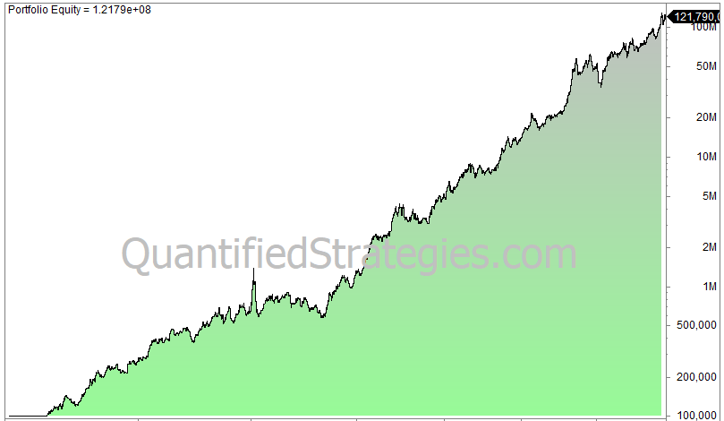

In algorithmic trading, trend following strategies are both a traditional and reliable method for capturing profits from market trends. These strategies involve identifying and capitalizing on the momentum in financial markets, with the goal of profiting when market trends persist. By focusing on long-term gains, trend followers enter trades that align with prevailing trends and exit as trends begin to reverse, minimizing losses and maximizing profits.

The advent of algorithmic trading has enhanced trend following by introducing automation, increasing efficiency, and improving performance. Algorithmic systems can continuously monitor market conditions, execute trades precisely, and manage portfolios with minimal human intervention.

This article examines how trend following strategies are designed, assesses their effectiveness, identifies the markets they are most effective in, and outlines their pros and cons.

## Table of Contents

## Understanding Trend Following Strategies

Trend following strategies are designed to capitalize on the sustained momentum of price movements in financial markets, whether they be upward or downward. Unlike predictive strategies that attempt to forecast price changes, trend following strategies focus on reacting to established trends. The main objective is to identify a trend, follow its direction, and maintain that position until signs of reversal are evident. 

The essence of these strategies lies in using technical analysis tools and quantitative rules to detect trends and act upon them. Technical indicators are pivotal in this process, providing systematic guidelines for entering and exiting trades. Among the most commonly employed indicators are moving averages, Average True Range (ATR), and Bollinger Bands.

Moving averages are perhaps the most frequently used tool in trend following strategies. They help smooth out price data over a specific period, allowing traders to better discern the direction of a trend. For instance, a simple moving average (SMA) is calculated as the average price over a defined number of periods, providing a visual representation of the trend direction. Crossovers, where a shorter moving average crosses a longer one, are often used as signals for entry or exit points.

The ATR is another crucial metric, measuring market [volatility](/wiki/volatility-trading-strategies) by averaging the range between the high and low prices over a specific period. In [trend following](/wiki/trend-following), the ATR can help determine appropriate stop-loss levels, ensuring that trades are exited if the market moves against the established trend by a significant margin. This is particularly useful in volatile markets, where large price swings can otherwise unexpectedly close profitable positions.

Bollinger Bands, consisting of a middle band (a simple moving average) and two outer bands representing standard deviations from the SMA, are also instrumental. They adjust to market conditions and provide dynamic entry and [exit](/wiki/exit-strategy) points. A typical Bollinger Band strategy might involve buying when the price hits the lower band or selling when it reaches the upper band, with the assumption that prices will revert to the mean over time.

In summary, trend following strategies are grounded in the methodical use of technical indicators to identify and follow market trends. These strategies prioritize the establishment of quantitative rules over subjective judgment, thereby facilitating a systematic approach to trading across different market conditions. Such an approach seeks to minimize emotional decision-making and relies on a disciplined adherence to predefined entry and exit rules derived from technical analysis.

## Key Components and Markets for Trend Following

Successful trend following strategies are based on several key components: robust entry and exit rules, effective risk management, and diversification across various markets. Each component plays a crucial role in maximizing the strategy's performance and resilience.

**Robust Entry and Exit Rules**  
Robust entry and exit rules are essential to capturing trends without falling victim to market noise. These rules are typically systematic and repeatable, relying on quantitative indicators to identify favorable trade setups. Commonly used indicators in trend following include moving averages, Average True Range (ATR), and Bollinger Bands. These indicators help to determine potential entry points when the price breaches a certain threshold, suggesting the formation or continuation of a trend. Similarly, exit rules are designed to lock in gains and minimize losses by signaling when a trend is likely reversing or losing [momentum](/wiki/momentum).

**Risk Management Strategies**  
Effective risk management is critical in mitigating potential losses associated with trend following strategies. Due to the nature of trends, there can be significant drawdowns; hence, setting stop-loss orders or using position sizing techniques is essential. One popular risk management formula is the Kelly Criterion, which helps determine the optimal size of a series of bets or positions by maximizing logarithmically expected wealth:
$$
f^* = \frac{bp - q}{b}
$$
Where $f^*$ is the fraction of the capital to risk, $b$ is the odds received on the wager, $p$ is the probability of winning, and $q$ is the probability of losing.

**Diversification Across Multiple Markets**  
Diversification is a key strategy for diluting risk and capitalizing on a variety of opportunities across different asset classes. Trend followers often implement their strategies across multiple markets, including commodities, currencies, and equities. Markets such as commodities and [forex](/wiki/forex-system) are particularly suited for trend following due to their macroeconomic influences, deep [liquidity](/wiki/liquidity-risk-premium), and prolonged trends. By spreading exposure across diverse markets, traders can potentially benefit from uncorrelated price movements and reduce the impact of adverse shifts in any single market.

The overarching aim of trend following is to capture the majority of price movements within a trend, rather than attempting to precisely time market tops and bottoms. This approach accepts that trends, by their nature, will have periods of retracement and consolidation. The strategy's success hinges on its ability to consistently execute rules that capitalize on trending moves while minimizing exposure to flatter, more erratic market conditions.

## Examples of Trend Following Strategies

Some well-known trend following strategies include the ATR Channel Breakout, Bollinger Band Breakout, and the Donchian Trend Strategy. These strategies have been embraced by traders for their potential to capture and profit from durable market trends by employing systematic rules and indicators.

- The Dual and Triple Moving Average strategies are particularly popular among traders who aim to capture longer trends. The dual moving average strategy involves using two moving averages of different lengths to identify trend changes. For instance, a buy signal is generated when a short-term moving average crosses above a long-term moving average, while a sell signal occurs when the reverse happens. The triple moving average strategy adds an additional layer by incorporating a third moving average, which can help reduce whipsaws and provide more reliable signals.

- The ATR Channel Breakout is a strategy that involves identifying breakouts above or below certain channels defined by the Average True Range (ATR) metric. The ATR provides a measure of market volatility, and by constructing channels around a moving average with a width determined by the ATR, traders can identify potential breakout points. A buy signal is typically generated when the price breaks above the upper channel, while a sell signal is triggered when the price falls below the lower channel.

- Donchian strategies utilize moving average filters to ensure trades are placed in established trends, using new highs or lows as triggers. The Donchian Channel, named after Richard Donchian, uses the highest high and the lowest low over a specified time period to define the channel. A common approach is to enter a buy trade when the price exceeds the upper band of the channel and initiate a sell trade when the price falls below the lower band. This method ensures that trades align with significant price movements, capturing the momentum of the trend. 

Overall, these trend following strategies exemplify the principles of simplicity and systematic rule-based trading, making them attractive options for traders seeking to exploit market trends with consistency. Utilizing technical indicators and predefined rules allows for disciplined entry and exit decisions, reducing the impact of emotional biases in trading.

## Do Trend Following Strategies Work?

Trend following strategies have proven successful across various markets and timeframes. Their effectiveness stems largely from their simplicity and robustness, which help avoid the pitfalls of overfitting that can plague more complex models. This simplicity allows for systematic application, relying on established rules and technical indicators to enter and exit trades based on ongoing trends.

The foundational principle of trend following is not to predict future price movements, but to ride existing trends. This principle makes these strategies particularly resilient during volatile and uncertain market conditions. For example, using moving averages, a key tool for trend followers, helps traders identify the momentum and continuation of trends without the need for complex predictive models. Trend following’s reliance on this kind of systematic methodology allows traders to maintain discipline, even when financial markets exhibit unpredictability.

However, despite their historical success, these strategies require patience and resilience from traders. The nature of trend following often results in low win ratios. This is because the strategies may frequently incur small losses or breakeven trades, only achieving profitability from larger, less frequent gains. For instance, while a trader might experience multiple trades with slight losses, a successful trend-following strategy aims to capture considerable profits when a significant trend materializes.

This propensity for larger winning trades amidst numerous small losses also implies significant drawdowns can occur. Hence, traders must be psychologically prepared to endure periods where losses outweigh wins. Furthermore, risk management plays a crucial role in the overall success of trend following. Effective practices help mitigate the financial impact of drawdowns, ensuring that traders remain solvent and prepared to capitalize on future market trends.

In conclusion, trend following strategies' long-standing success across diverse market conditions attests to their viability. Their simplicity and rule-based nature enable traders to execute consistently under stress, albeit with the caveat of requiring robust risk management and psychological endurance.

## Pros and Cons of Trend Following

Trend following is distinguished by its simplicity and adaptability across various market conditions. Unlike predictive strategies, trend following does not attempt to forecast market movements. Instead, it reacts to observable market trends, allowing traders to make decisions based on established patterns. This reactive nature eliminates the need for precise market timing, which can be both challenging and risky, especially in volatile markets.

One of the primary advantages of trend following strategies is their minimal time management requirements. Traders do not need to continuously monitor the markets to the same extent as other strategies might demand. Once the rules are established and trades are entered, the strategy manages the positions until an exit condition is triggered. This makes trend following particularly suitable for individuals who may not have the time or inclination to engage in intensive market analysis daily.

Despite these advantages, trend following strategies are not without their drawbacks. One of the significant challenges they face is susceptibility to abrupt market reversals. These reversals can lead to a [high frequency](/wiki/high-frequency-trading) of false signals, commonly referred to as "whipsaws," where the strategy might indicate a trend continuation that quickly reverses direction. Such events can erode profits and challenge the strategy's effectiveness.

Moreover, trend following relies heavily on capturing a few large, profitable trends to offset many smaller, losing trades. This characteristic necessitates a degree of psychological resilience from the trader, as periods of drawdowns and small losses are frequent. The strategy's effectiveness hinges on the trader's ability to remain committed through these challenging times, awaiting significant trends that yield substantial profits.

In summary, while trend following offers a straightforward approach that minimizes the need for constant market oversight and precise timing, its susceptibility to sudden trend reversals and the psychological demands of enduring frequent small losses are crucial considerations for traders. Understanding these pros and cons is vital for successfully implementing trend following strategies.

## Conclusion

Trend following remains a viable and often successful trading strategy, particularly when integrated into [algorithmic trading](/wiki/algorithmic-trading) systems. Its capability to operate across a wide range of markets and asset classes speaks to its adaptability and robustness. This versatility allows traders to monitor diverse market conditions and instruments, enhancing the potential for profitability in trending environments. 

For traders, a critical aspect of implementing trend following strategies is assessing their risk tolerance and psychological endurance. The nature of these strategies often involves enduring periods of drawdown and volatility. Traders must be prepared to experience frequent small losses, which can test one's emotional resilience and commitment to the strategy. The use of robust risk management techniques is essential to mitigate potential losses and sustain trader confidence during challenging periods.

While trend following strategies have their limitations, such as vulnerability to sudden market reversals and overreliance on large, fewer profitable trades, their systematic nature is a significant advantage. The rule-based approach of trend following allows for consistent application, reducing the need for subjective decision-making and enabling traders to capitalize on market trends over extended periods. This systematic framework often involves predefined rules using technical indicators, such as moving averages or [breakout](/wiki/breakout-trading) levels, to signal entry and exit points.

Overall, despite certain drawbacks, trend following's enduring success in various markets underscores its strategic value for traders seeking to benefit from persistent market trends over the long term. Its structured methodology offers traders a disciplined approach to navigating the complexities of financial markets, making it a desirable choice for those who value sustained exposure to market trends.

## References & Further Reading

[1]: ["Trend Following: How to Make a Fortune in Bull, Bear, and Black Swan Markets"](https://www.amazon.com/Trend-Following-5th-Fortune-Markets/dp/1119371872) by Michael Covel

[2]: ["Following the Trend: Diversified Managed Futures Trading"](https://www.wiley.com/en-us/Following+the+Trend%3A+Diversified+Managed+Futures+Trading,+2nd+Edition-p-9781119909002) by Andreas F. Clenow

[3]: ["Quantitative Technical Analysis: An Integrated Approach to Trading System Development and Trading Management"](https://www.amazon.com/Quantitative-Technical-Analysis-integrated-development/dp/0979183855) by Howard B. Bandy

[4]: Pardo, R. (2008). ["The Evaluation and Optimization of Trading Strategies,"](https://onlinelibrary.wiley.com/doi/book/10.1002/9781119196969) 2nd Edition. Wiley.

[5]: "Trading Systems: A New Approach to System Development and Portfolio Optimisation" by Emilio Tomasini and Urban Jaekle