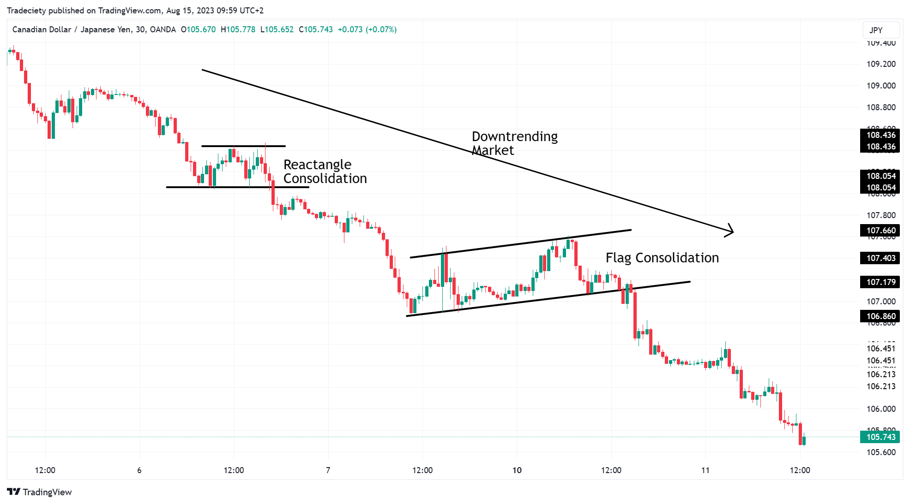

## Table of Contents

## What is trend trading and how does it differ from other trading strategies?

Trend trading is a strategy where traders try to make money by following the direction of a market trend. They look at charts and data to see if prices are generally going up or down over time. If they see a trend, they will buy when the price is going up and sell when it's going down. The idea is to ride the trend as long as it lasts, making profits along the way.

This strategy is different from others like day trading or scalping, where traders might make many quick trades in a single day to catch small price movements. Trend traders are more patient; they hold onto their investments for longer periods, sometimes weeks or months. Another different strategy is counter-trend trading, where traders bet that the current trend will reverse soon. Trend trading focuses on going with the flow of the market, while other strategies might try to predict or react to short-term changes.

## How can beginners identify market trends using basic technical analysis?

Beginners can start identifying market trends by looking at price charts. A simple way to do this is by using moving averages, which are lines on a chart that show the average price of a stock or asset over a certain period. If the price is above the moving average, it might mean the trend is going up. If the price is below the moving average, the trend might be going down. A common moving average to use is the 50-day moving average, which looks at the average price over the last 50 days.

Another easy tool for beginners is trend lines. You can draw a trend line by connecting the highs or lows of the price on a chart. If you connect the lows and the line is going up, it shows an uptrend. If you connect the highs and the line is going down, it shows a downtrend. Watching how the price reacts to these lines can help you see if the trend is strong or if it might be changing. By using these simple tools, beginners can start to understand and follow market trends.

## What are the most common indicators used in trend trading?

The most common indicators used in trend trading are moving averages and the Relative Strength Index (RSI). Moving averages help traders see the general direction of the market. They do this by showing the average price of a stock or asset over a certain time. For example, a 50-day moving average shows the average price over the last 50 days. If the price is above this line, it might mean the trend is going up. If it's below, the trend might be going down. Traders often use two moving averages, like a 50-day and a 200-day, to see if they cross each other. This crossing can signal a change in the trend.

Another popular indicator is the RSI, which measures how fast and how much a price is changing. It ranges from 0 to 100. If the RSI is above 70, it might mean the asset is overbought and the price could go down soon. If it's below 30, it might mean the asset is oversold and the price could go up. Traders use the RSI to see if a trend might be getting too strong and could reverse. By combining moving averages and the RSI, traders can get a better idea of the market trend and make smarter trading decisions.

## How do you set up a trend trading strategy for short-term gains?

Setting up a trend trading strategy for short-term gains involves using quick-moving indicators and watching the market closely. One way to do this is by using shorter moving averages, like a 10-day or 20-day moving average. These can help you see trends that might only last a few days or weeks. When the price moves above the moving average, it could be a good time to buy. When it moves below, it might be time to sell. You can also use the Relative Strength Index (RSI) set to a shorter period, like 14 days, to see if the price is moving too fast and might change direction soon.

Another important part of a short-term trend trading strategy is setting clear entry and exit points. This means deciding at what price you will buy and at what price you will sell before you start trading. For example, if you see the price moving above the 20-day moving average, you might decide to buy. Then, if the price hits a certain level or the RSI goes above 70, you might decide to sell. By setting these points ahead of time, you can make quick decisions and try to catch short-term trends without getting too emotional about your trades.

## What are the risks associated with trend trading and how can they be mitigated?

Trend trading can be risky because trends don't last forever. Sometimes, a trend might reverse suddenly, and if you're not quick to sell, you could lose money. Another risk is that you might get into a trade too late, after the trend has already started to weaken. This can mean smaller profits or even losses if the trend changes direction. Also, trend trading can lead to overtrading, where you make too many trades trying to catch every little move in the market, which can add up to big losses over time.

To lower these risks, it's important to use stop-loss orders. A stop-loss order is like a safety net that automatically sells your investment if the price drops to a certain level, helping to limit your losses. It's also a good idea to keep an eye on the market and be ready to change your strategy if the trend starts to shift. Using more than one indicator, like moving averages and the RSI, can give you a better picture of what's happening and help you make smarter decisions. Finally, don't trade too much. Stick to a plan and only make trades when you see a clear trend, not just because you want to be in the market all the time.

## How can moving averages be used to enhance trend trading strategies?

Moving averages are a great tool for trend traders because they help smooth out price data and show the general direction of the market. By using moving averages, traders can see if a stock or asset is in an uptrend or a downtrend. For example, if the price of a stock is above its 50-day moving average, it might mean the trend is going up. If the price is below the moving average, the trend might be going down. Traders often use two moving averages, like a short-term one (like 20 days) and a long-term one (like 50 days), to see if they cross each other. When the short-term moving average crosses above the long-term one, it's called a "golden cross" and can signal a good time to buy. When the short-term moving average crosses below the long-term one, it's called a "death cross" and can signal a good time to sell.

Using moving averages can also help traders stay in a trend longer and avoid getting out too early. For instance, if a trader sees that the price is still above the moving average, they might decide to keep their investment even if the price drops a bit. This can help them catch more of the trend and make bigger profits. But it's important to use moving averages along with other tools, like the Relative Strength Index (RSI), to get a fuller picture of the market. By combining these tools, traders can make better decisions and lower their risks.

## What role does volume play in confirming trends and how should it be analyzed?

Volume is like the number of people buying and selling a stock or asset. It's important because it can show how strong a trend is. If a lot of people are trading, it means the trend might be strong and more likely to keep going. For example, if the price of a stock is going up and the volume is high, it's a good sign that the uptrend is strong. But if the price is going up and the volume is low, it might mean the trend is weak and could change soon.

To analyze volume, you can look at a volume chart, which shows how many shares or units of an asset were traded each day. You can compare the volume on days when the price is going up or down to see if the trend is supported by a lot of trading. If you see high volume when the price breaks through a moving average or a trend line, it's a good sign that the trend is real and might continue. By watching volume along with price and other indicators, you can get a better idea of whether a trend is strong or if it might be time to get out of a trade.

## How can advanced traders use multiple time frame analysis to improve trend trading decisions?

Advanced traders can use multiple time frame analysis to get a better view of the market and make smarter trend trading decisions. This means looking at the same stock or asset on different time frames, like daily, weekly, and monthly charts. By doing this, traders can see the big picture and the smaller details at the same time. For example, if the weekly chart shows a strong uptrend, but the daily chart shows the price is starting to go down, a trader might decide to wait before buying. This way, they can make sure they are trading in the direction of the main trend while also catching smaller moves within it.

Using multiple time frames can also help traders find the best times to enter and exit trades. If the monthly chart shows a long-term uptrend, the weekly chart might show a good entry point when the price pulls back a bit. Then, the daily chart can help the trader see the exact moment to buy, like when the price moves above a short-term moving average. By combining information from different time frames, traders can make more informed decisions and increase their chances of making profits while reducing risks.

## What are some effective profit-taking strategies in trend trading?

One effective profit-taking strategy in trend trading is to use trailing stop-loss orders. A trailing stop-loss moves up with the price as it goes higher. This way, you can lock in profits while still giving the trend room to grow. For example, if you buy a stock at $50 and set a trailing stop-loss at 10%, the stop-loss will move up to $55 if the price reaches $61. If the price then drops to $55, the stop-loss will trigger, and you'll sell the stock, keeping some of your profits. This strategy helps you stay in the trend as long as it's going well but gets you out if it starts to turn around.

Another good strategy is to take partial profits at different levels. This means selling some of your investment as the price goes up, but keeping the rest to see if the trend continues. For example, if you buy a stock at $50 and it goes up to $60, you might sell half of your shares at $60 to lock in some profit. If the price keeps going up to $70, you can sell more shares or all of them. This way, you get to enjoy some profits early but still have a chance to make more if the trend keeps going. By taking profits in stages, you can balance the risk of missing out on further gains with the safety of securing some returns.

## How can algorithmic trading be integrated into trend trading for better results?

Algorithmic trading can make trend trading better by using computers to find and follow trends faster and more accurately than people can. Traders can set up algorithms to watch the market all the time and make trades based on rules they set. For example, an algorithm can be told to buy a stock when its price goes above a certain moving average and sell it when the price goes below another moving average. This way, the algorithm can catch trends as soon as they start and make trades without waiting for a person to decide. It can also use many different indicators at the same time, like moving averages and the RSI, to make smarter decisions and lower the risk of making a bad trade.

Using algorithms can also help traders take profits and manage risks better. An algorithm can be set up to use trailing stop-loss orders, which move up with the price to lock in profits while still letting the trend grow. It can also take partial profits at different levels, selling some shares as the price goes up but keeping others to see if the trend continues. This way, the algorithm can balance making profits with managing risks. By using algorithmic trading, trend traders can make their strategies work better and maybe make more money while keeping their risks under control.

## What are the psychological challenges faced by trend traders and how can they be overcome?

Trend traders often face psychological challenges like fear and greed. When a trend is going well, traders might get greedy and want to keep their investment longer, hoping for even bigger profits. But if the trend suddenly changes, they can lose a lot of money. On the other hand, fear can make traders sell too early, missing out on more gains. It's hard to stay calm and stick to a plan when the market is moving a lot.

To overcome these challenges, trend traders need to set clear rules and stick to them. Using stop-loss orders can help manage fear by automatically selling an investment if the price drops too much. It's also important to take profits at set levels to avoid greed. Keeping a trading journal can help traders see their mistakes and learn from them. By focusing on the long-term plan and not getting too emotional about short-term moves, traders can make better decisions and handle the ups and downs of the market.

## How do global economic events influence trend trading strategies and what adjustments are necessary?

Global economic events can really shake up the markets and change the trends that traders are following. Things like interest rate changes, big news about the economy, or even political events can make prices go up or down fast. For example, if a country's central bank raises interest rates, it might make people want to invest in that country's currency more, pushing its value up. But if there's bad news about a country's economy, like a big drop in jobs, it might make people sell that country's stocks and the prices could go down. Trend traders need to keep an eye on these events because they can start new trends or end old ones.

To adjust their strategies, trend traders should watch the news and be ready to change their plans. If a big event happens, they might need to use shorter time frames to see the new trends faster. They could also set their stop-loss orders closer to the current price to protect their money if the market moves a lot. It's also a good idea to use more than one indicator, like moving averages and the RSI, to get a better picture of what's happening. By staying flexible and keeping up with the news, trend traders can make better decisions and handle the ups and downs that come with global economic events.

## References & Further Reading

[1]: Bergstra, J., Bardenet, R., Bengio, Y., & Kégl, B. (2011). ["Algorithms for Hyper-Parameter Optimization."](https://dl.acm.org/doi/10.5555/2986459.2986743) Advances in Neural Information Processing Systems 24.

[2]: ["Advances in Financial Machine Learning"](https://www.amazon.com/Advances-Financial-Machine-Learning-Marcos/dp/1119482089) by Marcos Lopez de Prado

[3]: ["Evidence-Based Technical Analysis: Applying the Scientific Method and Statistical Inference to Trading Signals"](https://www.amazon.com/Evidence-Based-Technical-Analysis-Scientific-Statistical/dp/0470008741) by David Aronson

[4]: ["Machine Learning for Algorithmic Trading"](https://github.com/stefan-jansen/machine-learning-for-trading) by Stefan Jansen

[5]: ["Quantitative Trading: How to Build Your Own Algorithmic Trading Business"](https://www.amazon.com/Quantitative-Trading-Build-Algorithmic-Business/dp/1119800064) by Ernest P. Chan