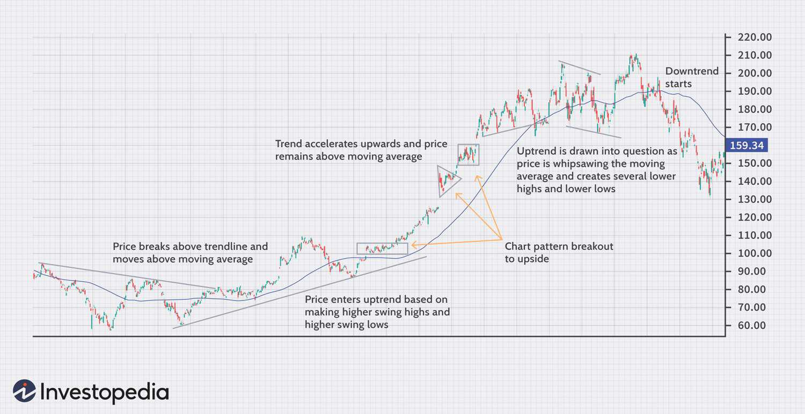

Welcome to the world of trading strategies, where we explore various methods to profit from market movements. Trading strategies are systematic plans designed to achieve profitable returns by analyzing historical data and trading signals. Whether you're a novice starting with the basics or a seasoned trader refining your techniques, understanding diverse trading strategies is crucial. Knowledge of these strategies can provide the foundation necessary for developing a disciplined approach to trading.

In this article, we'll explore the principles and techniques behind trend trading profit strategies and explore the role of algorithmic trading. By focusing on these two popular approaches, traders can gain insights into capturing market trends and employing automated systems to optimize trade execution. Trend trading involves identifying price movements to capitalize on an asset's momentum, while algorithmic trading leverages technology and mathematical models to enhance trading efficiency.



Our goal is to equip you with the knowledge required to make informed decisions in the trading arena. By understanding and implementing advanced strategies, traders can navigate the complexities of financial markets and improve their trading performance. Informed decision-making is the cornerstone of successful trading, and comprehending these strategies is a step toward achieving that goal.

## Table of Contents

## Understanding Trend Trading

Trend trading is a strategy focused on capitalizing on the sustained direction of asset prices over time, leveraging market momentum to obtain profitable opportunities. The fundamental aspect of trend trading is recognizing the direction of the market's trend—either upward or downward. An upward trend is characterized by a series of higher highs and higher lows, while a downward trend is marked by lower lows and lower highs.

Trend traders employ various technical tools to identify trading opportunities and make informed decisions. Two commonly used tools are trendlines and moving averages. Trendlines are straight lines drawn on a chart indicating the general direction of price movement, typically using the peaks and troughs of price changes. They serve as visual aids to help traders determine the direction of the trend. Moving averages smooth out price data over a specified period, providing traders with a clearer view of the trend’s direction and its strength. The simple moving average (SMA) and the exponential moving average (EMA) are two popular types, with the latter giving more weight to recent prices and thus reacting more quickly to price changes.

For instance, a trader might use a 50-day moving average to observe the medium-term trend of an asset. If the asset's price consistently stays above the 50-day moving average, it suggests an upward trend, indicating a potential buying opportunity. Conversely, if the price remains below it, this can be indicative of a downtrend, signaling a potential sell.

Trend trading is adaptable and can be applied by traders with varying time horizons. Short-term traders may focus on trends that last a few days to weeks, often known as swing trading. Intermediate traders might focus on trends lasting from weeks to months. Long-term traders primarily aim to capitalize on trends lasting several months to years, aligning more with position trading. Each of these applications involves the same fundamental principles but varies in the execution based on the trader’s specific time frame and market outlook. 

Risk management is crucial for trend traders, as market reversals can occur without warning, leading to potential losses. Thus, many traders use stop-loss orders, which automatically close a position when the asset reaches a predetermined price level, to protect against significant losses should the trend direction change unexpectedly.

In summary, trend trading is a flexible strategy that spans various time frames and utilizes specific technical tools like trendlines and moving averages to capture profits from market trends. Understanding the trend direction and implementing sound risk management practices are essential components for the success of this trading approach.

## Trend Trading Strategies

Trend trading encompasses a variety of strategies, each designed to capitalize on the sustained [momentum](/wiki/momentum) of asset prices in either an upward or downward direction. Understanding and using these strategies is crucial for traders aiming to leverage the benefits of trend trading.

Popular strategies within trend trading include moving averages, momentum indicators, trendlines, and chart patterns.

**Moving Averages**: Moving averages (MAs) are widely used to smooth out price data. The two most common types are the simple moving average (SMA) and exponential moving average (EMA). Traders use these averages to identify trends by observing the crossover of short-term and long-term MAs. For instance, a common strategy is the "Golden Cross," where the short-term MA crosses above the long-term MA, signaling potential upward momentum. Conversely, a "Death Cross," where the short-term MA crosses below the long-term MA, may indicate downward momentum.

**Momentum Indicators**: Momentum indicators, such as the Relative Strength Index (RSI) and Moving Average Convergence Divergence (MACD), help traders assess the speed and change of price movements. RSI is used to identify overbought or oversold conditions in a market, typically indicating a potential reversal. MACD combines moving averages to show trends and potential buy/sell signals when the MACD line crosses the signal line or when MACD diverges from price trends.

**Trendlines**: Drawing trendlines is a straightforward method to identify and follow trends. A trendline is a straight line connecting two or more price points and extending into the future to act as a line of support or resistance. Traders monitor price interactions with these lines; a break above or below a trendline may suggest a trend continuation or reversal.

**Chart Patterns**: Patterns such as head and shoulders, triangles, or flags can provide insights into future price movements. These patterns are visual constructs formed by price movements and can signal possible continuation or reversal of trends. For example, a head and shoulders pattern may indicate a bullish-to-bearish trend reversal.

A combination of these strategies can enhance the effectiveness of trend trading. For instance, a trader might use moving averages to identify the trend direction, momentum indicators to gauge the strength of the trend, and trendlines or chart patterns to spot specific entry and [exit](/wiki/exit-strategy) points.

**Risk Management**: Effective risk management is indispensable in trading. Tools like stop-loss orders are integral to safeguarding against potential trend reversals. A stop-loss order automatically exits a trade at a predefined price level, mitigating losses if the market moves unfavorably. For example, a trader might set a stop-loss slightly below a support level in an uptrend to protect against a breakdown.

Using these strategies together, along with rigorous risk management practices, can significantly improve a trader's ability to capitalize on market trends while minimizing potential downsides.

 to Algo Trading

Algorithmic trading, often referred to as algo trading, is the process of using computer algorithms to execute trades in financial markets with minimal human intervention. This type of trading is characterized by the use of automated software systems to trade financial assets by applying complex mathematical models and formulas. These algorithms are designed to make trading decisions at speeds and frequencies that are typically unachievable by human traders.

One of the primary features of algo trading is its reliance on mathematical models. These models assess various market conditions and signals, determining the optimal points for buying or selling assets. Another key component is [backtesting](/wiki/backtesting), where algorithms are tested using historical data to evaluate their potential effectiveness before being deployed in live markets. This helps in refining strategies to enhance their predictive accuracy and performance.

Real-time data is crucial for algo trading as it involves monitoring and analyzing ongoing market activity to make instantaneous trading decisions. By leveraging technology to process vast amounts of data, algo traders can react promptly to market changes, seizing opportunities that may arise due to price movements or market inefficiencies.

Common algorithmic strategies include:

1. **Trend-following strategies**: This involves identifying and following prevailing market trends. Algorithms exploit patterns and momentum in price movements, buying on upward trends and selling on downward ones. These strategies often use moving averages and momentum indicators to identify trends.

2. **Arbitrage strategies**: Arbitrage algorithms capitalize on price discrepancies of the same asset in different markets, executing simultaneous buy and sell orders to achieve risk-free profit. These algorithms require precise and rapid execution to take advantage of brief price differentials.

3. **Market-making strategies**: Market-making involves providing liquidity to financial markets by placing buy and sell orders for securities. Algorithms help by automatically quoting both bid and ask prices, earning the difference, or spread. This strategy benefits from high speed and volume trading, minimizing the bid-ask spread.

Algo trading transforms the trading landscape by improving execution speed and accuracy, reducing transaction costs, and minimizing human emotional bias during trading. Its integration into modern finance demonstrates the growing reliance on technology for efficient and informed decision-making in markets.

## Benefits and Challenges of Algo Trading

Algorithmic trading, often referred to as algo trading, is increasingly popular among traders due to its numerous advantages. Chief among these is the speed with which trades can be executed. Unlike manual trading, which involves human intervention and is subject to delays and errors, algo trading uses automated systems to execute trades within fractions of a second. This speed can be crucial in markets where price movements happen rapidly.

Efficiency is another significant benefit of algo trading. Algorithms can simultaneously monitor multiple markets and assets, executing trades based on predefined criteria much more efficiently than a human could. This efficiency extends to the elimination of emotional bias in trading. Emotionally-driven decisions can lead to inconsistent trading outcomes; algorithms, on the other hand, adhere strictly to logic and preset rules, thus maintaining consistency.

Algo trading also enables backtesting, which is the process of testing a trading strategy on historical data to evaluate its viability. This can be done using Python libraries such as `[backtrader](/wiki/backtrader)` or `zipline`, allowing traders to optimize strategies before applying them to live markets. This optimization helps in fine-tuning strategies to improve profitability and reduce potential risks.

```python
import backtrader as bt

class MyStrategy(bt.Strategy):
    def __init__(self):
        self.sma = bt.indicators.SimpleMovingAverage(self.data.close, period=15)

    def next(self):
        if self.sma > self.data.close:
            self.buy()
        elif self.sma < self.data.close:
            self.sell()

cerebro = bt.Cerebro()
cerebro.addstrategy(MyStrategy)
data = bt.feeds.YahooFinanceData(dataname='AAPL', fromdate=datetime(2020, 1, 1), todate=datetime(2021, 1, 1))
cerebro.adddata(data)
cerebro.run()
```

Another advantage is scalability. An algorithm can handle large volumes of data and execute thousands of trades across different markets simultaneously. This is particularly beneficial for hedge funds or firms managing substantial portfolios.

However, algo trading is not without its challenges. Data quality is paramount; poor data can lead to erroneous trading decisions. Traders must ensure they have accurate, real-time data to inform their strategies.

Overfitting is another concern. This occurs when a trading strategy is too closely tailored to historical data, making it ineffective in future market conditions. Overfitting can be mitigated by incorporating robust testing and validation techniques into the strategy development process.

Lastly, transaction costs must be managed effectively. Although [algorithmic trading](/wiki/algorithmic-trading) reduces slippage (the difference between expected and actual trade prices), frequent trading can incur substantial transaction fees, which can erode profits. Careful consideration of these costs is vital when developing and implementing algo trading strategies.

In summary, while algo trading offers considerable advantages in terms of speed, efficiency, and consistency, it also presents challenges that must be carefully managed to ensure successful trading outcomes.

## Combining Trend Trading and Algo Trading

Integrating trend trading with algorithmic trading (algo trading) allows traders to leverage the best features of both approaches, creating a more efficient and strategic trading approach. Trend trading focuses on understanding and capitalizing on market momentum, while algo trading offers automation, precision, and speed in executing trades. By merging these strategies, traders can significantly amplify their market presence and effectiveness.

One primary advantage of combining trend trading with algo trading is the automation of trend identification and execution. Using algorithms, traders can set predefined criteria based on trend indicators—such as moving averages, trendlines, and momentum indicators—to automatically execute trades. This removes the potential for human error and emotional bias, ensuring that trades are executed consistently according to the strategy's design.

For instance, a simple Python script using a library like `pandas` and `numpy` could automate a moving average crossover strategy, where trades are initiated based on the crossing of short-term and long-term moving averages.

```python
import pandas as pd
import numpy as np

# Example data
data = pd.DataFrame({
    'price': [100, 102, 101, 105, 110, 108, 112, 115, 117, 116]
})

# Calculate moving averages
short_window = 3
long_window = 5

data['short_mavg'] = data['price'].rolling(window=short_window, min_periods=1).mean()
data['long_mavg'] = data['price'].rolling(window=long_window, min_periods=1).mean()

# Generate trading signals
data['signal'] = 0
data['signal'][short_window:] = np.where(data['short_mavg'][short_window:] > data['long_mavg'][short_window:], 1, -1)

# Print the data with signals
print(data)
```

This script calculates short-term and long-term moving averages and generates buy or sell signals based on their crossover. Each time the short-term average moves above the long-term average, a buy signal is generated, and vice versa for sell signals.

In addition to automating execution, combining these strategies provides enhanced risk management. Automated solutions can swiftly respond to market changes by implementing immediate stop-loss orders or take-profit levels, reducing the risk of substantial losses during volatile market conditions. Additionally, it allows for more sophisticated risk-to-reward optimization, leveraging historical data to refine strategies over time for improved performance.

Moreover, the integration facilitates backtesting on historical datasets, allowing traders to validate the profitability of their strategies before deploying them in live environments. This is an essential step in ensuring that a strategy is not only theoretically sound but also practically effective. The process helps mitigate the risk of overfitting—developing a strategy that performs well on historical data but poorly in real-world scenarios.

In summary, by harnessing the speed, accuracy, and automation capabilities of algo trading with the market insights provided by trend trading, traders can develop more powerful, reliable, and efficient trading strategies. This fusion not only improves execution precision but also significantly enhances market risk management and overall strategic robustness.

## Conclusion

Trend trading and algorithmic trading offer distinct advantages that can be harnessed by traders looking to maximize their profits in financial markets. Trend trading capitalizes on the momentum of asset price movements, allowing traders to identify potential gains by recognizing and following market trends. This approach enables traders to align with the larger market direction, often using technical indicators like moving averages or trendlines to make informed decisions.

On the other hand, algorithmic trading introduces the benefits of automation, efficiency, and precision. By employing complex mathematical models and trading algorithms, algo trading eliminates human error and emotional biases, ensuring consistent strategy execution. The ability to backtest strategies on historical data further enhances traders' decision-making capabilities, providing insights into potential strategy optimization and scalability across different market conditions.

By understanding and implementing these strategies, traders can refine their approach and make more informed decisions. Staying updated with market trends is crucial, as it allows traders to adjust their strategies to align with evolving market conditions. Continuous refinement and adaptation of trading strategies, whether trend-based or algorithmic, are essential for maintaining a competitive edge and achieving success in today's dynamic trading environments. Ultimately, a well-rounded strategy that leverages both trend and algorithmic trading principles offers a formidable advantage for traders seeking profitable opportunities.

## References & Further Reading

[1]: Bergstra, J., Bardenet, R., Bengio, Y., & Kégl, B. (2011). ["Algorithms for Hyper-Parameter Optimization."](https://dl.acm.org/doi/10.5555/2986459.2986743) Advances in Neural Information Processing Systems 24.

[2]: ["Advances in Financial Machine Learning"](https://www.amazon.com/Advances-Financial-Machine-Learning-Marcos/dp/1119482089) by Marcos Lopez de Prado

[3]: ["Evidence-Based Technical Analysis: Applying the Scientific Method and Statistical Inference to Trading Signals"](https://www.amazon.com/Evidence-Based-Technical-Analysis-Scientific-Statistical/dp/0470008741) by David Aronson

[4]: ["Machine Learning for Algorithmic Trading"](https://github.com/stefan-jansen/machine-learning-for-trading) by Stefan Jansen

[5]: ["Quantitative Trading: How to Build Your Own Algorithmic Trading Business"](https://www.amazon.com/Quantitative-Trading-Build-Algorithmic-Business/dp/1119800064) by Ernest P. Chan