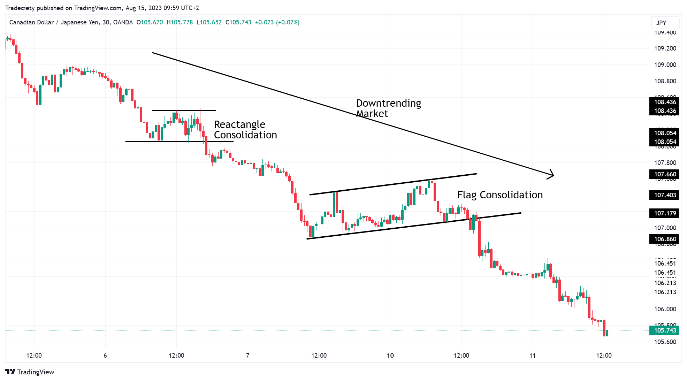

## Table of Contents

## What is trend trading and how does it differ from other trading strategies?

Trend trading is a strategy where traders try to make money by following the direction of a market trend. A trend is like a pattern that shows if the price of something, like a stock or a currency, is going up, down, or staying the same over time. Traders who use trend trading will buy when they think the price is going to keep going up, and they will sell when they think the price is going to keep going down. They use tools like charts and indicators to help them figure out where the trend is heading.

Trend trading is different from other strategies because it focuses on the big picture of where the market is headed, rather than trying to predict small, quick changes in price. For example, day trading is another strategy where traders buy and sell very quickly within the same day, trying to make small profits from tiny price movements. On the other hand, trend trading might involve holding onto a trade for weeks or months. Another strategy, called scalping, involves making lots of trades in a short time to catch very small price changes. Trend trading is more about patience and waiting for the right moment to join a trend that could last a while.

## What are the basic principles of identifying a trend in the market?

Identifying a trend in the market starts with looking at price movements over time. You can do this by using charts, which show how the price of something has changed. If the price keeps going up over time, that's called an uptrend. If it keeps going down, that's a downtrend. Sometimes, the price might not go up or down a lot and just moves sideways; that's called a sideways trend or a range-bound market. To spot these trends, you can draw lines on the chart that connect the highs and lows of the price movements. If the line connecting the lows keeps going up, you're probably in an uptrend. If the line connecting the highs keeps going down, you're likely in a downtrend.

Another way to identify a trend is by using indicators, which are tools that help you see patterns more clearly. Moving averages are a popular type of indicator. They smooth out price data to create a single flowing line, making it easier to see the overall direction of the trend. For example, if the price is above a moving average and the moving average is going up, that can be a sign of an uptrend. If the price is below a moving average and the moving average is going down, that might indicate a downtrend. Other indicators like the Relative Strength Index (RSI) or the Moving Average Convergence Divergence (MACD) can also help confirm if a trend is strong or if it might be about to change direction. By combining these tools and looking at the big picture, you can get a better idea of where the market is headed.

## How can beginners start applying simple trend trading strategies?

Beginners can start applying simple trend trading strategies by first learning to identify trends on a chart. Look for a series of higher highs and higher lows to spot an uptrend, or lower highs and lower lows for a downtrend. You can use a simple moving average, like a 50-day moving average, to help you see the trend more clearly. If the price is above the moving average and the moving average is going up, you might be in an uptrend. If the price is below the moving average and it's going down, you could be in a downtrend. Once you spot a trend, the basic idea is to buy when the price is going up and sell when it's going down.

After identifying the trend, beginners should practice entering and exiting trades based on the trend's direction. For an uptrend, you might buy when the price pulls back to the moving average and then starts to go up again. For a downtrend, you could sell or short sell when the price bounces up to the moving average and then starts to go down again. It's important to set stop-loss orders to limit your losses if the trend changes direction unexpectedly. Start with small trades and use a demo account to practice without risking real money. As you get more comfortable, you can slowly increase your trade sizes and refine your strategy.

## What are the most common indicators used in trend trading?

In trend trading, the most common indicators are moving averages, the Relative Strength Index (RSI), and the Moving Average Convergence Divergence (MACD). Moving averages help you see the overall direction of the trend by smoothing out price data. A simple moving average, like a 50-day or 200-day moving average, is often used. When the price is above the moving average and the moving average is going up, it suggests an uptrend. If the price is below the moving average and it's going down, it indicates a downtrend.

The Relative Strength Index (RSI) is another useful tool. It measures the speed and change of price movements and ranges from 0 to 100. If the RSI is above 70, it might mean the market is overbought and could be due for a downturn. If it's below 30, it might suggest the market is oversold and could be ready for an upturn. The RSI can help confirm whether a trend is strong or if it might be about to reverse. 

The Moving Average Convergence Divergence (MACD) is also popular. It shows the relationship between two moving averages of a security's price. The MACD line is calculated by subtracting the 26-day exponential moving average (EMA) from the 12-day EMA. A signal line, which is a 9-day EMA of the MACD line, is then plotted on top of the MACD line. When the MACD line crosses above the signal line, it's a bullish signal, suggesting the trend might be going up. When it crosses below, it's a bearish signal, indicating the trend might be going down. These indicators together help traders make better decisions about when to buy or sell based on the trend.

## How do moving averages contribute to trend trading strategies?

Moving averages are super helpful in trend trading because they make it easier to see the big picture of where the market is going. They work by taking the average price of something over a certain number of days, like 50 or 200 days. This average is shown as a line on a chart. When the price of a stock or currency is above this line and the line is going up, it suggests that the market is in an uptrend. If the price is below the line and the line is going down, it means the market might be in a downtrend. This simple way of looking at the trend helps traders decide when to buy or sell.

Traders often use moving averages to find good times to enter or exit trades. For example, if you're in an uptrend, you might wait for the price to dip back to the moving average line before buying. This can be a good entry point because it's like buying at a discount while still following the overall upward trend. On the other hand, if you're in a downtrend, you might sell or short sell when the price bounces up to the moving average line. This can help you catch the downward move at a better price. By using moving averages, traders can make more informed decisions and stick to the trend, which is key to successful trend trading.

## What role do support and resistance levels play in trend trading?

Support and resistance levels are super important in trend trading because they help traders figure out where the price of a stock or currency might stop moving in one direction and start moving in another. Support is like a floor where the price tends to bounce back up from. If the price keeps hitting this floor and going back up, it's a sign that the uptrend might keep going. Resistance is like a ceiling where the price often stops going up and starts to come back down. When the price keeps hitting this ceiling and falling back, it might mean the downtrend will continue. By watching these levels, traders can make better guesses about when to buy or sell.

In an uptrend, traders might look for the price to bounce off the support level as a good time to buy. This is because the price has shown it's strong enough to keep going up after touching that level. If the price breaks through the support level and keeps going down, it could be a sign that the uptrend is over and it's time to sell. In a downtrend, traders might wait for the price to hit the resistance level before selling or short selling. If the price breaks through the resistance and keeps going up, it might mean the downtrend is ending and it could be a good time to buy. By using support and resistance levels, traders can make smarter decisions and follow the trend more effectively.

## How can traders use trend lines effectively in their strategies?

Trend lines are super helpful for traders because they show the direction of the market in a simple way. To draw a trend line, you connect the lows in an uptrend or the highs in a downtrend. In an uptrend, if the price keeps bouncing off the trend line and going up, it's a sign that the trend might keep going. Traders can use this as a signal to buy when the price touches the trend line. In a downtrend, if the price keeps hitting the trend line and then going down again, it suggests the downtrend could continue. Traders might see this as a good time to sell or short sell when the price touches the trend line.

Trend lines also help traders spot when a trend might be changing. If the price breaks through the trend line in an uptrend, it could mean the uptrend is over and it's time to sell. If the price breaks through the trend line in a downtrend, it might signal that the downtrend is ending and it could be a good time to buy. By watching how the price interacts with the trend line, traders can make better decisions about when to enter or exit trades. Using trend lines helps traders follow the market's direction and make smarter moves based on what the trend is doing.

## What are the risks associated with trend trading and how can they be managed?

Trend trading comes with some risks that traders need to be aware of. One big risk is that trends can change direction suddenly. If you're following a trend and it reverses, you might lose money because you were expecting it to keep going the same way. Another risk is that trends can be slow to develop, which means you might have to wait a long time before seeing any profits. Also, sometimes the market can be choppy or move sideways, making it hard to spot a clear trend. This can lead to false signals, where you think a trend is starting but it doesn't really go anywhere.

To manage these risks, it's important to use stop-loss orders. A stop-loss order is like a safety net that automatically sells your trade if the price goes against you by a certain amount. This helps limit how much money you can lose if the trend changes direction. Another way to manage risk is by not putting all your money into one trade. Instead, spread your money across different trades so that if one doesn't work out, you still have other chances to make money. It's also helpful to keep learning and practicing with a demo account before using real money. This way, you can get better at spotting trends and understanding how the market works without risking your savings.

## How do advanced traders use multiple time frame analysis in trend trading?

Advanced traders use multiple time frame analysis to get a clearer picture of the market trend. They look at different time frames, like daily, weekly, and monthly charts, to see how the trend looks over different periods. By doing this, they can spot the bigger trend on the longer time frames and find good entry and exit points on the shorter time frames. For example, if the weekly chart shows an uptrend, they might use the daily chart to find a dip in the price where they can buy. This helps them make sure they're trading in the direction of the main trend while also catching smaller moves within that trend.

Using multiple time frames also helps advanced traders manage their risk better. If the trend looks strong on the longer time frames but starts to weaken on the shorter ones, it might be a sign to tighten their stop-loss orders or take some profits. This way, they can protect their money if the trend starts to change direction. By combining information from different time frames, advanced traders can make more informed decisions and increase their chances of success in trend trading.

## What are some advanced trend trading strategies that involve Fibonacci retracement?

Advanced traders often use Fibonacci retracement to help them find good times to buy or sell in a trend. Fibonacci retracement is a tool that shows levels where the price might pull back before continuing in the direction of the trend. To use it, traders pick a high point and a low point on the chart and draw the Fibonacci levels between them. These levels are usually at 23.6%, 38.2%, 50%, 61.8%, and 78.6%. In an uptrend, traders might look for the price to pull back to one of these levels and then start going up again as a good time to buy. In a downtrend, they might wait for the price to bounce up to a Fibonacci level before selling or short selling.

Combining Fibonacci retracement with other tools like trend lines and moving averages can make the strategy even stronger. For example, if the price pulls back to a Fibonacci level and also touches a trend line or a moving average, it can be a more reliable signal. Traders might see this as a good entry point because it shows that multiple indicators are pointing in the same direction. By using Fibonacci retracement along with other tools, advanced traders can make better decisions about when to enter and exit trades, helping them follow the trend more effectively and manage their risk.

## How can algorithmic trading be integrated into trend trading strategies?

Algorithmic trading can be integrated into trend trading strategies by using computer programs to automatically find and follow trends. Traders can program these algorithms to look at moving averages, trend lines, and other indicators to spot when a trend is starting or ending. Once the algorithm sees a trend, it can automatically buy or sell based on the rules set by the trader. This means the trader doesn't have to watch the market all the time and can let the computer do the work. It helps take emotions out of trading, which can lead to better decisions and more consistent results.

Using algorithms for trend trading also allows traders to backtest their strategies. This means they can use historical data to see how their trend trading rules would have worked in the past. If the strategy looks good in the backtest, traders can feel more confident using it in the real market. Algorithms can also handle many trades at once, which can be hard for a person to do. By combining algorithmic trading with trend trading, traders can make their strategies more efficient and possibly more profitable.

## What are the latest trends and innovations in trend trading for expert traders?

Expert traders are now using machine learning and artificial intelligence to improve their trend trading strategies. These technologies can look at huge amounts of data and find patterns that humans might miss. For example, an AI system can analyze social media, news, and market data to predict where the market might be heading. This helps traders make better decisions about when to buy or sell. Some traders also use these systems to automatically adjust their trading rules based on what's happening in the market, making their strategies more flexible and responsive.

Another big trend is the use of sentiment analysis in trend trading. This involves looking at what people are saying online about a stock or market to see if the general feeling is positive or negative. If a lot of people are talking positively about a stock, it might be a sign that the price will go up. Traders can use this information to spot trends earlier and get in on trades before others do. Combining sentiment analysis with traditional trend indicators like moving averages and trend lines can give traders a more complete picture of the market, helping them make smarter trading decisions.

## What is the Concept of Trend Trading?

Trend trading is a strategy that involves recognizing and capitalizing on market [momentum](/wiki/momentum) by following the prevailing direction of stock prices. Traders who employ this method seek to benefit from either upward (bullish) or downward (bearish) trends in asset prices. At the core of trend trading is the concept of accurately identifying and acknowledging these trends early to maximize potential gains.

To successfully implement trend trading, one must employ effective trend analysis. Key technical indicators are instrumental in this process, including moving averages, trend lines, and relative strength indices (RSI).

**Moving Averages** are among the most widely used tools for trend analysis. They smooth out price data to identify the direction of the trend over a designated period. The simple moving average (SMA) is calculated by summing the closing prices over a specific timeframe and dividing by the number of periods. The formula for a simple moving average is:

$$

SMA = \frac{P_1 + P_2 + \cdots + P_n}{n} 
$$

where $P_1, P_2, \cdots, P_n$ represent the closing prices over $n$ periods.

**Trend Lines** are drawn on price charts to help traders identify and confirm trend directions. An uptrend is characterized by prices making higher highs and higher lows, and a trend line is drawn below the price action. Conversely, a downtrend consists of lower highs and lower lows, with the trend line drawn above the price pattern.

The assumption underlying trend trading is that prices exhibit tendencies to move in persistent directions over longer periods, a phenomenon often driven by market psychology and behavioral finance principles. Consequently, traders using this strategy seek to enter positions in alignment with the identified trend and [exit](/wiki/exit-strategy) once signals suggest a reversal.

Effective implementation of trend trading requires awareness of key entry and exit points. Traders often enter positions when the price breaks above a resistance level or bounces off a support level along the trend line. Conversely, they might exit when the price crosses below a moving average or breaches a trend line, suggesting a potential reversal. Additionally, stop-loss orders can be strategically placed to mitigate risks associated with sudden market shifts.

An adept trend trader recognizes that while trends can offer substantial opportunities, they also necessitate vigilance and flexibility to adapt to evolving market conditions. Understanding and utilizing technical indicators effectively, combined with disciplined risk management, enhances the probability of success within this trading framework.

## References & Further Reading

[1]: Bergstra, J., Bardenet, R., Bengio, Y., & Kégl, B. (2011). ["Algorithms for Hyper-Parameter Optimization."](https://dl.acm.org/doi/10.5555/2986459.2986743) Advances in Neural Information Processing Systems 24.

[2]: ["Advances in Financial Machine Learning"](https://www.amazon.com/Advances-Financial-Machine-Learning-Marcos/dp/1119482089) by Marcos Lopez de Prado

[3]: ["Evidence-Based Technical Analysis: Applying the Scientific Method and Statistical Inference to Trading Signals"](https://www.amazon.com/Evidence-Based-Technical-Analysis-Scientific-Statistical/dp/0470008741) by David Aronson

[4]: ["Machine Learning for Algorithmic Trading"](https://github.com/stefan-jansen/machine-learning-for-trading) by Stefan Jansen

[5]: ["Quantitative Trading: How to Build Your Own Algorithmic Trading Business"](https://www.amazon.com/Quantitative-Trading-Build-Algorithmic-Business/dp/1119800064) by Ernest P. Chan