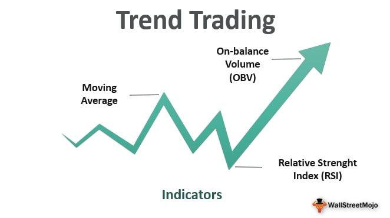

The financial markets are a dynamic environment where trading strategies play a crucial role in achieving success. Investors and traders constantly seek ways to gain an edge in the market, making strategy development essential. Among the myriad of strategies, trend trading and algorithmic trading (algo trading) have gained significant popularity, especially in today's technologically-advanced trading landscape.

Trend trading involves identifying and capitalizing on market trends, relying on the principle that prices move in long-term patterns. Traders using this approach aim to benefit from upward (bullish) or downward (bearish) trends, employing technical indicators such as moving averages and trend lines to make informed decisions. Understanding and accurately analyzing these trends can significantly enhance a trader's ability to predict market movements and react accordingly.



Algorithmic trading, on the other hand, leverages automation to execute trades based on pre-set criteria, allowing for high-speed and efficient trading. This method eliminates human emotions from trading decisions, often resulting in more disciplined and objective outcomes. Algorithms can analyze vast amounts of data rapidly, providing traders with the real-time decision-making capabilities necessary in volatile or fast-moving markets.

This article explores the intricacies of these strategies and their roles in the financial markets. Understanding these strategies can empower traders to make informed decisions, capitalizing on market trends. The combination of trend analysis with the precision of algorithmic execution offers a powerful approach for both retail and institutional traders. By integrating advanced technology and strategic foresight, investors can better navigate the complexities of the financial markets, ultimately improving their chances of a successful trading outcome.

## Table of Contents

## Understanding Trading Strategies

Trading strategies are systematic methodologies employed by investors to make informed decisions about buying and selling assets. These strategies are crafted to achieve specific objectives, such as maximizing profits, minimizing risks, or seizing market trends. A trader’s choice of strategy is influenced by various factors including risk tolerance, investment goals, and prevailing market conditions, which necessitates a thorough understanding of both market dynamics and personal financial objectives.

The core of any trading strategy includes a blend of technical analysis, market research, and, at times, intuitive judgment. Technical analysis involves using statistical data obtained from trading activity, such as price movement and [volume](/wiki/volume-trading-strategy), to forecast future price movements. Traders often use technical indicators like moving averages, relative strength index (RSI), and Fibonacci retracement levels to identify potential entry and exit points in the market.

Market research also plays a significant role in crafting a trading strategy. It involves the thorough analysis of various economic factors, industry trends, and company-specific information that can impact asset prices. This type of research aids traders in understanding broader market conditions and spotting investment opportunities.

In several cases, traders also rely on their instincts, drawing from experience and past market behavior. This gut intuition enables traders to respond swiftly to market anomalies or news that could disrupt their strategy. However, intuition is generally supported by solid analytical groundwork, ensuring decisions are not made on impulse alone.

To provide an overview of different types of trading strategies, some of the fundamental approaches include:

1. **Scalping**: A strategy focused on profiting from small price changes, often through quick, frequent trades. Scalpers rely heavily on real-time market data and technical analysis.

2. **Day Trading**: Involves buying and selling securities within the same trading day to take advantage of marginal price swings. Traders typically do not hold any positions overnight.

3. **Swing Trading**: This strategy involves holding assets for several days or weeks to capitalize on expected upward or downward market shifts. Swing traders often utilize fundamental analysis in conjunction with technical indicators to predict price movements.

4. **Position Trading**: A longer-term approach where traders hold positions for extended periods, ranging from months to years, expecting significant price changes. This strategy focuses on macroeconomic factors and long-term trends.

5. **Arbitrage**: It exploits price differences of the same asset in different markets. Traders buy low in one market and sell high in another, typically requiring rapid execution.

These strategies are not mutually exclusive and can be adapted and combined to meet individual trading goals. Developing a robust trading strategy requires careful planning, continuous learning, and disciplined execution. Understanding basic principles and the intricacies of various strategies empowers traders to navigate the dynamic financial markets effectively.

## The Concept of Trend Trading

Trend trading is a strategy that involves recognizing and capitalizing on market [momentum](/wiki/momentum) by following the prevailing direction of stock prices. Traders who employ this method seek to benefit from either upward (bullish) or downward (bearish) trends in asset prices. At the core of trend trading is the concept of accurately identifying and acknowledging these trends early to maximize potential gains.

To successfully implement trend trading, one must employ effective trend analysis. Key technical indicators are instrumental in this process, including moving averages, trend lines, and relative strength indices (RSI).

**Moving Averages** are among the most widely used tools for trend analysis. They smooth out price data to identify the direction of the trend over a designated period. The simple moving average (SMA) is calculated by summing the closing prices over a specific timeframe and dividing by the number of periods. The formula for a simple moving average is:

$$

SMA = \frac{P_1 + P_2 + \cdots + P_n}{n} 
$$

where $P_1, P_2, \cdots, P_n$ represent the closing prices over $n$ periods.

**Trend Lines** are drawn on price charts to help traders identify and confirm trend directions. An uptrend is characterized by prices making higher highs and higher lows, and a trend line is drawn below the price action. Conversely, a downtrend consists of lower highs and lower lows, with the trend line drawn above the price pattern.

The assumption underlying trend trading is that prices exhibit tendencies to move in persistent directions over longer periods, a phenomenon often driven by market psychology and behavioral finance principles. Consequently, traders using this strategy seek to enter positions in alignment with the identified trend and [exit](/wiki/exit-strategy) once signals suggest a reversal.

Effective implementation of trend trading requires awareness of key entry and exit points. Traders often enter positions when the price breaks above a resistance level or bounces off a support level along the trend line. Conversely, they might exit when the price crosses below a moving average or breaches a trend line, suggesting a potential reversal. Additionally, stop-loss orders can be strategically placed to mitigate risks associated with sudden market shifts.

An adept trend trader recognizes that while trends can offer substantial opportunities, they also necessitate vigilance and flexibility to adapt to evolving market conditions. Understanding and utilizing technical indicators effectively, combined with disciplined risk management, enhances the probability of success within this trading framework.

## Algorithmic Trading: Automation in Strategy Execution

Algorithmic trading, often referred to as algo trading, is a method that automates the execution of trade orders through pre-programmed instructions. These instructions are based on a range of variables such as timing, price, quantity, and market conditions. The core advantage lies in the algorithm's capacity to process large datasets with rapid speed and precision, offering traders the ability to make decisions and act on them in real-time. This technological approach to trading enables the execution of complex strategies that would be challenging to manage manually.

One of the primary benefits of [algorithmic trading](/wiki/algorithmic-trading) is its capacity to mitigate the influence of human emotions, such as fear or greed, which can lead to irrational decision-making. By adhering to a set of defined and tested rules, algo trading ensures disciplined and objective trade execution, potentially leading to enhanced performance.

**Popular Algorithms and Platforms**

Several algorithms are widely used in algorithmic trading, each serving different objectives and trading styles. Some popular types include:

1. **Trend Following Algorithms**: These algorithms capitalize on momentum by identifying market trends and executing trades that align with these trends. They often use technical indicators like moving averages or the Moving Average Convergence Divergence (MACD) to signal entries and exits.

2. **Arbitrage Algorithms**: These take advantage of price differentials in different markets or instruments. For instance, if an asset is priced differently on two exchanges, an arbitrage algorithm can execute simultaneous buy and sell orders to profit from the variance.

3. **Market Making Algorithms**: These algorithms provide liquidity by buying and selling an asset and profiting from the bid-ask spread. They continuously quote both buy and sell prices, earning a small profit on each trade while maintaining a neutral market position.

4. **Mean Reversion Algorithms**: Based on the statistical assumption that prices will revert to their mean over time, these algorithms place trades when the market price deviates significantly from the perceived average price.

Platforms such as MetaTrader, QuantConnect, and [Interactive Brokers](/wiki/interactive-brokers-api) provide traders with the tools and environments to develop and deploy algorithmic strategies. These platforms allow users to write, backtest, and optimize their algorithms in various programming languages like Python, C++, and others.

**Advantages and Potential Pitfalls**

The automation and efficiency provided by algo trading come with several advantages. It improves execution speed and accuracy, reduces transaction costs, and allows traders to backtest strategies on historical data, ensuring robustness before live implementation. Automation also enables high-frequency trading, where traders execute thousands of trades within microseconds, often in positions for very short durations to capitalize on minute market changes.

However, potential pitfalls include the risk of over-optimization, where an algorithm is too finely tuned to past data, leading to poor performance in live markets. Algorithm errors or bugs can execute faulty trades, causing significant financial losses. Additionally, in highly volatile or illiquid markets, automated systems may struggle with slippage, where the executed price is worse than expected. Lastly, regulatory compliance remains a primary concern, as algo trading systems must adhere to financial regulations to avoid legal repercussions.

In conclusion, while algorithmic trading offers substantial benefits, its success relies on careful strategy formulation, rigorous testing, and continuous monitoring. A balanced approach, combining automation with human oversight, can help traders harness the full potential of algorithmic trading.

## Integrating Trend Trading with Algorithmic Strategies

Combining trend trading with algorithmic strategies provides traders with a robust framework for optimizing trade execution and boosting performance. In the landscape of contemporary financial markets, this integration leverages the strengths of both approaches to maximize returns and balance risk.

Algorithms armed with the capability to identify trend patterns enable the automation of trade execution in alignment with prevailing market movements. These algorithms commonly utilize technical indicators—such as moving averages, trend lines, and momentum oscillators—to assess market trends accurately. For instance, the moving average crossover strategy is frequently employed, whereby a short-term moving average crossing over a long-term moving average signals a potential buy opportunity, while the reverse suggests a sell.

The seamless operation of trend-following strategies through algorithmic execution ensures trades occur at optimal points, minimizing the impact of human emotions such as fear and greed. Python, a versatile programming language, is often used to create these trading algorithms. Python libraries such as Pandas for data manipulation and Backtrader for strategy [backtesting](/wiki/backtesting) streamline the development process. Below is an example of a simple moving average crossover strategy implemented in Python using Backtrader:

```python
import backtrader as bt

class SmaCross(bt.SignalStrategy):

    def __init__(self):
        sma1 = bt.ind.SMA(period=10)  # Short-term moving average
        sma2 = bt.ind.SMA(period=30)  # Long-term moving average
        self.signal_add(bt.SIGNAL_LONG, sma1 - sma2)

cerebro = bt.Cerebro()
cerebro.addstrategy(SmaCross)
data = bt.feeds.YahooFinanceData(dataname='AAPL', fromdate=datetime(2020,1,1), todate=datetime(2023,1,1))
cerebro.adddata(data)
cerebro.run()
cerebro.plot()
```

This code demonstrates how an algorithm can act based on the crossover of two moving averages, signaling trades aligned with identified trends.

Integrating these methodologies also facilitates enhanced risk management. Algorithms can be programmed to include stop-loss and take-profit levels, or to dynamically adjust positions as market [volatility](/wiki/volatility-trading-strategies) fluctuates. By doing so, traders can efficiently hedge against adverse market conditions and lock in gains, aligning strategy execution with risk appetite and portfolio objectives.

Real-world applications underline the efficacy of this integration. For instance, quantitative hedge funds have adopted algorithmic trend-following strategies, yielding consistent returns over varying market cycles. Such successful implementations underscore the strategic advantage of melding trend analysis with algorithmic precision.

Despite the clear benefits, it is crucial to acknowledge potential challenges such as algorithm misfiring or market anomalies. Continuous monitoring, regular backtesting, and adaptation to market changes remain imperative to sustain success in this dynamic fusion of trend trading and algorithmic strategies.

## Challenges and Considerations

While trend trading and algo trading are widely used strategies, they present challenges and entail certain risks that traders must carefully manage. Market volatility, algorithm errors, and ever-changing market conditions can heavily impact the performance of these strategies. 

### Market Volatility

Market volatility is a significant concern for both trend traders and algo traders. High volatility can lead to rapid price swings, which might cause trend traders to misinterpret trend signals, leading to premature entries or exits. Similarly, in the context of algorithmic trading, volatile markets can trigger frequent trades, resulting in excessive transaction costs and slippage.

To combat this, traders often employ volatility indicators such as the Average True Range (ATR) to gauge market conditions and adapt their strategies accordingly. For example, a Python script using the ATR might look something like this:

```python
import pandas as pd
import numpy as np

def calculate_atr(data, period=14):
    data['high_low'] = data['High'] - data['Low']
    data['high_close'] = np.abs(data['High'] - data['Close'].shift())
    data['low_close'] = np.abs(data['Low'] - data['Close'].shift())
    ranges = data[['high_low', 'high_close', 'low_close']].max(axis=1)
    atr = ranges.rolling(period).mean()
    return atr

# Example usage with a DataFrame named 'market_data'
# market_data = pd.read_csv('market_data.csv')
atr_values = calculate_atr(market_data)
```

### Algorithm Errors and System Failures

Algorithmic trading systems are prone to programming errors and technical failures. A minor bug in the code can result in significant financial losses if not detected early. Moreover, system failures due to hardware malfunctions or network issues can prevent the execution of trades at critical times, leading to missed opportunities or unintended exposure.

To mitigate these risks, rigorous testing and backtesting of algorithms are essential. Automated systems should include failsafes and alerts to handle unexpected scenarios. Regular audits and updates ensure the system remains resilient against changing market conditions.

### Changing Market Conditions

The dynamic nature of financial markets often leads to regime changes that can render previously successful strategies ineffective. Trend traders might struggle to identify clear trends in a sideways market, while algo traders may find that historical patterns no longer hold.

Adapting to changing conditions involves continuously monitoring the market and adjusting strategies. Machine learning techniques can be applied to algorithmic systems to enable adaptive learning from new data, thus enhancing their ability to adjust to evolving markets.

### Regulatory Compliance and Ethical Considerations

Regulatory oversight in trading necessitates adherence to compliance requirements, which vary by jurisdiction. Algo traders must ensure their strategies comply with trading laws and reporting standards, avoiding practices like spoofing or wash trading, which are illegal and unethical.

Ethical trading practices are also paramount. Algo traders, in particular, should avoid manipulating markets for unfair advantages and instead use their strategies to contribute to market efficiency.

### Conclusion

Navigating the challenges of trend and algorithmic trading requires a deep understanding of the factors that can affect these strategies. By employing sound risk management practices, staying informed of regulatory changes, and continuously refining their strategies, traders can improve their likelihood of success while maintaining ethical standards.

## Conclusion

Trading strategies such as trend trading and algorithmic trading are essential tools for today's traders, providing frameworks to navigate the complexities of the financial markets. Successfully understanding and leveraging these strategies can significantly enhance a trader's probability of making informed, profitable decisions. 

As technology and financial landscapes evolve, traders must continuously adapt their methodologies to maintain a competitive edge. This evolution entails integrating new technologies and market data, iterating on existing strategies to adapt to emerging patterns, and leveraging advancements in computational power and data analytics. For instance, [machine learning](/wiki/machine-learning) techniques are increasingly utilized in algorithmic trading to improve decision-making processes and predictive accuracy.

Incorporating robust research, ongoing education, and effective risk management practices are foundational components of a successful trading strategy. This involves regularly analyzing market trends, refining algorithms, and staying informed about regulatory changes. Traders must be vigilant in assessing and adjusting their strategies to account for these dynamics, employing both qualitative insights and quantitative techniques.

Ultimately, this article has provided a comprehensive overview of trend trading and algorithmic strategies, emphasizing their roles and interactions within financial markets. Through a disciplined application of these strategies, traders can capitalize on market opportunities while effectively managing associated risks. As the environment continues to change, the fusion of traditional trading principles with innovative technologies will likely play an increasingly critical role in shaping the future of trading.

## References & Further Reading

[1]: Bergstra, J., Bardenet, R., Bengio, Y., & Kégl, B. (2011). ["Algorithms for Hyper-Parameter Optimization."](https://dl.acm.org/doi/10.5555/2986459.2986743) Advances in Neural Information Processing Systems 24.

[2]: ["Advances in Financial Machine Learning"](https://www.amazon.com/Advances-Financial-Machine-Learning-Marcos/dp/1119482089) by Marcos Lopez de Prado

[3]: ["Evidence-Based Technical Analysis: Applying the Scientific Method and Statistical Inference to Trading Signals"](https://www.amazon.com/Evidence-Based-Technical-Analysis-Scientific-Statistical/dp/0470008741) by David Aronson

[4]: ["Machine Learning for Algorithmic Trading"](https://github.com/stefan-jansen/machine-learning-for-trading) by Stefan Jansen

[5]: ["Quantitative Trading: How to Build Your Own Algorithmic Trading Business"](https://www.amazon.com/Quantitative-Trading-Build-Algorithmic-Business/dp/1119800064) by Ernest P. Chan