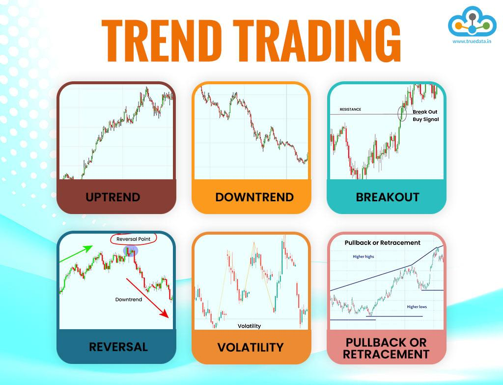

With the advancement of technology, investment practices have evolved significantly, leading to the emergence of trend trading and algorithmic (algo) trading. These trading strategies leverage computational power and sophisticated algorithms to make swift and data-driven investment decisions. As financial markets become more complex and interconnected, the demand for precision and speed in trading has intensified, prompting the adoption of these innovative approaches.

Trend trading involves identifying and capitalizing on the momentum of asset prices. Traders analyze historical data and utilize technical indicators to predict future price movements, making informed decisions on buying and selling based on observed trends. This method requires a keen understanding of market dynamics and the ability to interpret complex data patterns.



In contrast, algorithmic trading uses computer programs to execute trades automatically, following predefined criteria. This approach eliminates human emotion from the trading process, often resulting in more efficient and cost-effective operations. Algo trading strategies range from simple rule-based systems to complex models incorporating machine learning and high-frequency trading techniques.

In this article, we explore the intricacies of investment trend trading and algo trading, highlighting their strategies, benefits, and considerations. Our focus will be on helping traders and investors understand how to implement these practices effectively, maintaining an edge in today's dynamic markets. By blending traditional analysis with modern technology, traders can optimize their investment strategies, achieving both efficiency and profitability in a highly competitive environment.

## Table of Contents

## Understanding Investment Trend Trading

Investment trend trading is a strategy that aims to capitalize on the direction of market prices by analyzing trends through trendlines or price action. This approach is based on the hypothesis that markets tend to move in trends that can be predicted to a certain extent using historical price data and technical analysis tools.

Traders implementing this strategy often utilize a variety of technical indicators to predict and validate market trends. Among the most commonly used tools are moving averages and the Relative Strength Index (RSI). Moving averages help in smoothing price data, providing a clearer perspective of the market's direction by filtering out short-term fluctuations. The RSI, on the other hand, is a [momentum](/wiki/momentum) oscillator that measures the speed and change of price movements, helping traders identify overbought or oversold conditions.

To better understand, consider how moving averages are used to indicate trends: 

- A Simple Moving Average (SMA) is calculated by taking the arithmetic mean of a given set of prices over a specific number of days.

$$
SMA = \frac{P_1 + P_2 + \ldots + P_n}{n}
$$

where $P$ represents the price of the asset and $n$ is the number of time periods.

Traders look for crossovers, such as when a short-term moving average crosses above a longer-term moving average, signaling a potential uptrend. When the reverse occurs, it may indicate a downtrend.

In trend trading, uptrends and downtrends are crucial indicators for trading actions. During an uptrend, characterized by a series of higher highs and higher lows, traders typically seek opportunities to buy. Conversely, in a downtrend, identified by lower highs and lower lows, selling or shorting the asset is often the preferred strategy.

A critical aspect of trend trading is the ability to accurately identify signs of trend reversals. Such reversals present opportunities to maximize profits by entering or exiting the market at strategic times. Technical indicators, like the RSI, can aid in this process by offering insights into whether an asset is approaching overbought or oversold levels, which are common precursors to trend reversals.

Ultimately, the success of investment trend trading hinges on a trader's skill in interpreting technical data and making informed decisions that align with current market trends. It requires continuous observation and analysis of market patterns to identify optimal points for executing trades.

## Algorithmic Trading: What Is It?

Algorithmic trading, commonly referred to as algo trading, involves the use of computer programs to automate the execution of trades in financial markets. These sophisticated algorithms are programmed to identify trading opportunities based on pre-set parameters, enabling transactions to be executed at speeds and intervals far surpassing human capabilities. This technological advancement is crucial in today's rapid-paced trading environment where split-second decisions can significantly impact profitability.

Algo trading functions on the principle of using historical data and mathematical models to forecast market trends. The algorithms scan various sources of information including market indicators, price feeds, and trading volumes to identify potential profit opportunities. Once these opportunities are identified, orders are automatically generated and executed, thereby eliminating the latency associated with manual trading.

A key advantage of [algorithmic trading](/wiki/algorithmic-trading) is its ability to remove human emotions such as fear and greed from the trading process. This can lead to more consistent and disciplined trading practices, as decisions are based purely on data-driven insights rather than emotional responses. Additionally, algo trading enhances the efficiency and cost-effectiveness of trading operations by reducing the need for active human intervention, minimizing transaction costs, and allowing for the management of larger volumes of data.

Several strategies are frequently employed in algorithmic trading to achieve systematic and profitable engagements. Among them, trend-following strategies are popular, which rely on algorithms to detect and exploit persistent price movements in the market. Arbitrage opportunities can also be captured, involving the simultaneous purchase and sale of an asset in different markets to profit from price discrepancies. Market-making strategies are another common approach, where algorithms place buy and sell orders to profit from the bid-ask spread while providing [liquidity](/wiki/liquidity-risk-premium) to the market.

Each of these strategies leverages the computational power of algorithms to optimize the timing and conditions of trades, aiming for consistent profitability. By using pre-defined criteria, algorithms can execute thousands of transactions across different markets and financial instruments with precision, thus maintaining a competitive edge in the global financial landscape.

## Benefits and Challenges of Algo Trading

Algorithmic trading, or algo trading, offers numerous benefits by harnessing the power of computer systems to execute trades with precision and efficiency. One of the primary advantages is its capacity to execute trades at optimal prices with speed and accuracy, surpassing human capabilities. This results in reduced transaction costs and minimizes the impact of human error, thereby enhancing overall trading performance.

Algo trading enables simultaneous checks on various market conditions. This multifaceted approach allows traders to make informed decisions based on multiple data points, optimizing their strategies and potentially improving profitability. Such automation ensures that trading activities can be conducted continuously without the need for constant human oversight.

Despite its advantages, algorithmic trading also presents several challenges. A significant dependence on technology means that traders must rely on the robustness of their computational systems. This requires substantial financial resources to invest in high-speed computing infrastructure, reliable data feeds, and advanced software platforms. Technical failures, such as software bugs or connectivity issues, can lead to missed opportunities or unintended trades, which might result in financial losses.

Moreover, algo trading systems must be meticulously designed to withstand unexpected market behaviors, commonly referred to as black swan events. These rare and unpredictable occurrences can lead to severe market disruptions, posing risks to inadequately prepared trading algorithms. To mitigate these risks, it is crucial that traders employ thorough [backtesting](/wiki/backtesting) and scenario analysis to validate and adapt their algorithms against a wide range of conditions.

While the potential for increased efficiency and profitability through algorithmic trading is substantial, it necessitates a balanced approach, combining technological investment, robust algorithm design, and continuous evaluation to effectively navigate the complexities of the financial markets.

## Integrating Trend Trading and Algo Strategies

Combining trend trading strategies with algorithmic systems has the potential to significantly enhance trading performance. The integration allows traders to leverage the precision of algorithms to detect and react to trend shifts more effectively than manual observation. Algorithms can be coded to analyze vast amounts of market data, identifying trend patterns that may not be immediately apparent to human traders. This automated approach optimizes entry and [exit](/wiki/exit-strategy) points, allowing trades to be executed at the most opportune times for maximum profit.

By incorporating specific algorithmic rules to follow identified trends, traders can minimize emotional bias, which is often a hindrance in manual trading. The algorithmic execution ensures adherence to predefined strategies, maintaining consistency and discipline in trading decisions. This can lead to more systematic and objective trading processes, devoid of emotional reactions that might skew judgment.

Backtesting is a crucial component in the integration process. Backtesting involves running algorithms on historical data to validate their effectiveness in various market conditions. It allows traders to assess how well an algorithm would have performed in past situations, providing a foundation for decision-making in live markets. Thus, backtesting helps in refining algorithms before deployment, ensuring they are well-suited for current conditions.

Ongoing assessment and adaptation of trading algorithms are necessary to remain effective in changing markets. Financial markets are dynamic, and trends can shift rapidly due to geopolitical, economic, or other unforeseen factors. Continuous monitoring and adjustment of algorithms help align them with these fluctuations, ensuring they remain both relevant and efficient. Strategies that may have been profitable under certain market conditions may require recalibration as new data emerges, necessitating a robust adaptive framework in the algorithmic design.

In summary, the fusion of trend trading strategies with algorithmic trading technologies creates a powerful mechanism for executing trades more effectively. Proper implementation requires technical expertise in algorithmic programming and a thorough understanding of market dynamics. When done correctly, it provides a competitive edge by capitalizing on precise and systematic trading opportunities.

## Technical Requirements for Algo Trading

Successful algorithmic trading necessitates several critical technical components to ensure precise and timely execution of trades. High-speed computing plays a pivotal role in enabling traders to execute complex algorithms rapidly, minimizing latency and maximizing efficiency. Traders typically require powerful hardware that can process large volumes of data without significant delays, contributing to the swift execution of trades.

Access to reliable market data feeds stands as another essential requirement. These feeds provide real-time information on market prices, [volume](/wiki/volume-trading-strategy), and other essential metrics, which algorithms rely on to make split-second trading decisions. The accuracy and speed of these data feeds directly impact the effectiveness of the trading algorithms.

Efficient trade execution platforms are also fundamental, offering the necessary infrastructure for placing orders directly into the market. These platforms should be capable of handling high-frequency trading actions without bottlenecks, ensuring that orders are executed as intended.

Traders engaging in algorithmic trading must also possess skills in programming and data analysis or opt to hire professionals proficient in these areas. The ability to code in languages such as Python, R, or C++ is invaluable, enabling the development and implementation of sophisticated trading algorithms. For instance, a simple moving average crossover strategy might be implemented in Python using libraries like pandas and NumPy to analyze time-series data and execute buy/sell signals:

```python
import pandas as pd

# Assume df is a DataFrame with 'close' prices
short_window = 40
long_window = 100

signals = pd.DataFrame(index=df.index)
signals['signal'] = 0.0

# Create short and long simple moving averages
signals['short_mavg'] = df['close'].rolling(window=short_window, min_periods=1).mean()
signals['long_mavg'] = df['close'].rolling(window=long_window, min_periods=1).mean()

# Generate signals
signals['signal'][short_window:] = (
    signals['short_mavg'][short_window:] > signals['long_mavg'][short_window:]
).astype(float)

# Determine positions
signals['positions'] = signals['signal'].diff()

```
This snippet demonstrates the essential process of creating signals based on moving averages and setting positions accordingly.

Continuous monitoring and refinement of trading algorithms are critical to adapting to shifting market conditions and ensuring sustained performance. Algorithms must be consistently evaluated and backtested against historical data to verify their effectiveness and adjust for evolving market dynamics. Regular updates and fine-tuning are necessary to incorporate new data insights and risk parameters, ultimately safeguarding against potential losses due to market [volatility](/wiki/volatility-trading-strategies).

## Conclusion

Investment trend trading and algorithmic trading have become indispensable tools for traders and investors seeking to optimize efficiency and profitability in today's fast-paced financial markets. These strategies, built on a foundation of rigorous technical analysis and computational prowess, offer significant advantages but also come with complexities that require thorough understanding.

Both trend trading and algorithmic trading necessitate a profound comprehension of market dynamics and technological demands. Mastery in these areas enables traders to identify and exploit market opportunities more effectively. Trend trading, relying on the analysis of market directions, allows traders to capitalize on price movements, while algorithmic trading facilitates swift, emotionless execution of trades based on predefined criteria.

The integration of robust technical analysis with sophisticated algorithmic strategies can significantly enhance a trader's ability to navigate volatile market conditions. Advanced algorithms, when combined with trend analysis, enable more precise and timely entry and exit points, minimizing risks and maximizing potential returns. This synergy not only enhances trading efficiency but also helps in maintaining a structured approach to decision-making.

Investors and traders are advised to adopt a cautious approach when implementing these advanced strategies. Starting small and engaging in comprehensive testing of strategies can mitigate risks associated with erroneous algorithmic setups or misinterpretations of market data. Incremental scaling, based on gained experience and confidence, can lead to superior outcomes and sustained growth over time.

In summary, by strategically leveraging both trend trading and algorithmic trading techniques, market participants can position themselves advantageously in the competitive landscape. A methodical approach, underpinned by ongoing education and system refinement, is fundamental to reaping the benefits of these powerful trading methodologies.

## References & Further Reading

[1]: Bergstra, J., Bardenet, R., Bengio, Y., & Kégl, B. (2011). ["Algorithms for Hyper-Parameter Optimization."](https://papers.nips.cc/paper/4443-algorithms-for-hyper-parameter-optimization) Advances in Neural Information Processing Systems 24.

[2]: ["Advances in Financial Machine Learning"](https://www.amazon.com/Advances-Financial-Machine-Learning-Marcos/dp/1119482089) by Marcos Lopez de Prado

[3]: ["Evidence-Based Technical Analysis: Applying the Scientific Method and Statistical Inference to Trading Signals"](https://www.amazon.com/Evidence-Based-Technical-Analysis-Scientific-Statistical/dp/0470008741) by David Aronson

[4]: ["Machine Learning for Algorithmic Trading"](https://github.com/PacktPublishing/Machine-Learning-for-Algorithmic-Trading-Second-Edition) by Stefan Jansen

[5]: ["Quantitative Trading: How to Build Your Own Algorithmic Trading Business"](https://books.google.com/books/about/Quantitative_Trading.html?id=j70yEAAAQBAJ) by Ernest P. Chan