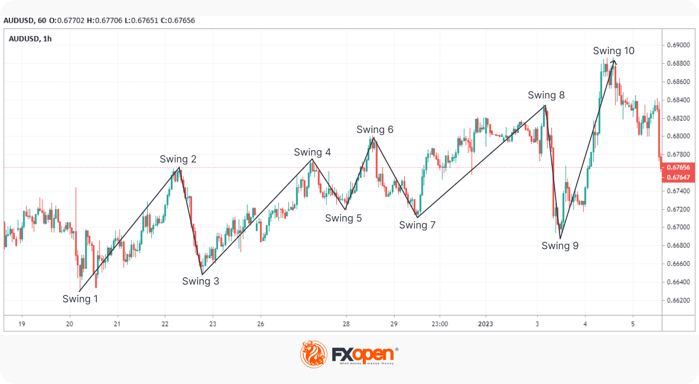

## Table of Contents

## What is trend trading?

Trend trading is a trading strategy where you try to make money by following the direction of a market trend. A trend is when the price of something, like a stock or a currency, goes up or down over time. If the price is going up, you buy and hold onto it, hoping to sell it later for a higher price. If the price is going down, you might sell what you have or even borrow and sell something you don't own, planning to buy it back later at a lower price.

This strategy works because trends can last for a long time, giving you a chance to make a profit. The key is to spot the trend early and get in at the right time. However, it's not always easy. Trends can change suddenly, and if you're not careful, you could lose money. That's why trend traders use different tools and charts to help them see where the market might be heading next.

## What is swing trading?

Swing trading is a way to make money by buying and selling things like stocks or currencies over a few days or weeks. The idea is to catch the "swings" in the price, which are the ups and downs that happen more often than big trends. Swing traders look for times when the price might go up a bit, buy at a low point, and then sell at a higher point a short time later.

To do swing trading well, you need to watch the market closely and use charts and other tools to guess where the price might go next. It's different from trend trading because swing traders don't hold onto their investments for as long. They try to make smaller profits more often, which can add up over time. But it can be risky because the market can change quickly, so you need to be ready to act fast.

## How do trend trading and swing trading differ in terms of time frames?

Trend trading and swing trading use different time frames to make money. Trend trading looks at the big picture. Traders who use this method might hold onto their investments for weeks, months, or even years. They want to catch the long-lasting movements in the market, so they are patient and wait for the right time to buy or sell.

On the other hand, swing trading focuses on shorter time frames. Swing traders usually hold their investments for just a few days or weeks. They try to make money from the smaller ups and downs in the market, called "swings." This means they need to watch the market closely and be ready to act quickly to buy low and sell high.

In simple terms, trend trading is about waiting for big trends to play out over a long time, while swing trading is about catching smaller price movements in a shorter time. Both methods can work, but they need different levels of patience and attention to the market.

## What are the key strategies used in trend trading?

In trend trading, one key strategy is to use moving averages. A moving average is a line on a chart that shows the average price of something over a certain time. Traders often use two moving averages, one that looks at a shorter time and one that looks at a longer time. When the shorter moving average crosses above the longer one, it might be a good time to buy because it could mean the price is starting to go up. When the shorter moving average crosses below the longer one, it might be a good time to sell because it could mean the price is starting to go down.

Another important strategy in trend trading is to use trend lines. A trend line is a straight line drawn on a chart that connects the highs or lows of the price over time. If the price keeps going up and touching the trend line without breaking it, it shows that the upward trend is strong. Traders might buy when the price touches the trend line and then goes up again. If the price keeps going down and touching the trend line without breaking it, it shows that the downward trend is strong. Traders might sell when the price touches the trend line and then goes down again.

A third strategy is to use support and resistance levels. Support is a price level where the price tends to stop going down and start going up again. Resistance is a price level where the price tends to stop going up and start going down again. Trend traders watch these levels closely. If the price breaks through a resistance level, it might be a good time to buy because it could mean the price will keep going up. If the price breaks through a support level, it might be a good time to sell because it could mean the price will keep going down.

## What are the key strategies used in swing trading?

In swing trading, one key strategy is to use chart patterns. These are shapes that show up on price charts and can help traders guess where the price might go next. For example, a "head and shoulders" pattern might mean the price is about to go down, while a "cup and handle" pattern might mean the price is about to go up. Swing traders look for these patterns and try to buy or sell at the right time based on what the pattern is telling them.

Another important strategy in swing trading is to use technical indicators like the Relative Strength Index (RSI) or the Moving Average Convergence Divergence (MACD). These tools help traders see if a stock or currency is overbought or oversold. If the RSI shows that something is overbought, it might be a good time to sell because the price could go down soon. If it shows that something is oversold, it might be a good time to buy because the price could go up soon. The MACD can help traders see when the price might start to change direction, which is useful for deciding when to buy or sell.

A third strategy is to pay attention to support and resistance levels. These are price levels where the price tends to stop and change direction. If the price hits a support level and starts to go up, swing traders might buy, hoping to sell later at a higher price. If the price hits a resistance level and starts to go down, they might sell, hoping to buy back later at a lower price. By watching these levels, swing traders can make quick decisions to catch the small price swings and make a profit.

## How do risk management techniques differ between trend trading and swing trading?

In trend trading, risk management often involves setting wider stop-loss orders because traders hold their positions for a longer time. A stop-loss order is like a safety net that automatically sells your investment if the price drops to a certain level. Since trend traders are in it for the long haul, they might set their stop-loss further away from the current price to give the trend more time to play out. They also use position sizing, which means they decide how much money to put into each trade based on how risky it is. This way, even if a trade goes wrong, they won't lose too much money. Trend traders might also use trailing stops, which move up as the price goes up, to lock in profits while still giving the trend room to grow.

In swing trading, risk management is more about quick action and tighter stop-loss orders. Because swing traders are only holding their positions for a few days or weeks, they need to be ready to get out fast if the market turns against them. They set their stop-loss orders closer to the current price to limit their losses if the swing doesn't go as planned. Swing traders also use position sizing, but they might adjust it more often because they're making more trades. They need to keep a close eye on the market and be ready to change their plans quickly. This means they have to be more hands-on with their risk management, always ready to cut their losses or take their profits at the right time.

## What types of markets are best suited for trend trading?

Trend trading works well in markets that have clear, long-lasting trends. These are markets where the price moves in one direction for a long time, like stocks, commodities, and forex. For example, if a company is doing really well and its stock price keeps going up over months or years, that's a good market for trend trading. The same goes for commodities like oil or gold if their prices are going up or down steadily over time. Trend traders look for these big moves and try to make money by following the trend.

Forex markets, where people trade different currencies, are also good for trend trading. Sometimes, one country's currency will get stronger or weaker compared to another country's currency over a long time. This can happen because of things like changes in interest rates or big news about the economy. Trend traders can make money by buying the stronger currency and selling the weaker one, holding onto their positions until the trend changes. Overall, any market where the price moves in a clear direction for a long time is a good fit for trend trading.

## What types of markets are best suited for swing trading?

Swing trading works best in markets that have a lot of ups and downs over short periods, like a few days or weeks. Stocks are a good choice for swing trading because their prices can change a lot in a short time due to news about the company or the economy. The stock market is also very active, with lots of trading happening every day, which gives swing traders plenty of chances to buy and sell.

Another good market for swing trading is forex, where people trade different currencies. Currencies can also move up and down a lot in a short time because of things like interest rates or big news events. Forex markets are open 24 hours a day, so swing traders can watch and trade at any time. This makes it easier to catch the small price swings and make a profit.

## How does the psychological aspect of trading affect trend traders versus swing traders?

The psychological aspect of trading can be different for trend traders and swing traders. Trend traders need a lot of patience because they hold onto their investments for a long time. They have to be okay with waiting and not get too worried if the price goes up and down a bit along the way. It can be hard for them to stick with their plan when the market is moving slowly or when they see small losses. They need to trust that the big trend will keep going and not let short-term changes make them sell too soon.

Swing traders, on the other hand, need to be quick and ready to act fast. They have to watch the market closely and make decisions quickly, which can be stressful. They might feel a lot of pressure to get in and out of trades at the right time to catch the small price swings. This can lead to more stress and the need to stay calm under pressure. Swing traders need to be good at handling their emotions and not let fear or excitement make them do something they might regret later.

## What technical indicators are most commonly used in trend trading?

Trend traders often use moving averages to help them see where the market is going. A moving average is a line on a chart that shows the average price of something over time. Trend traders might use two moving averages, one that looks at a shorter time and one that looks at a longer time. When the shorter moving average goes above the longer one, it might be a good time to buy because it could mean the price is starting to go up. When the shorter moving average goes below the longer one, it might be a good time to sell because it could mean the price is starting to go down. This helps trend traders spot the start of a new trend and decide when to get in or out.

Another common tool for trend traders is the Average Directional Index (ADX). The ADX helps traders see how strong a trend is. If the ADX number is high, it means the trend is strong, and trend traders might want to stay in their trades longer. If the ADX number is low, it means the trend is weak, and trend traders might want to be more careful or look for a new trend to follow. By using the ADX, trend traders can make better decisions about when to hold onto their investments and when to let them go.

## What technical indicators are most commonly used in swing trading?

Swing traders often use the Relative Strength Index (RSI) to help them decide when to buy or sell. The RSI is a number that goes from 0 to 100 and shows if something is overbought or oversold. If the RSI is over 70, it means the price might be too high and could go down soon, so swing traders might sell. If the RSI is under 30, it means the price might be too low and could go up soon, so swing traders might buy. By watching the RSI, swing traders can catch the small price swings and make a profit.

Another common tool for swing traders is the Moving Average Convergence Divergence (MACD). The MACD is made up of two lines, the MACD line and the signal line. When the MACD line crosses above the signal line, it might be a good time to buy because it could mean the price is starting to go up. When the MACD line crosses below the signal line, it might be a good time to sell because it could mean the price is starting to go down. Swing traders use the MACD to see when the price might change direction and make quick decisions to catch the swings in the market.

## How can a trader transition from swing trading to trend trading or vice versa?

Transitioning from swing trading to trend trading means you need to start thinking about the big picture instead of the small ups and downs. You'll need to be more patient and hold onto your investments for a longer time, like weeks, months, or even years. Instead of looking at the market every day, you'll need to check it less often and focus on long-term trends. You might start using tools like moving averages and the Average Directional Index (ADX) to help you see where the market is going over a long time. It's important to set wider stop-loss orders to give the trend more time to play out and not get too worried about small price changes along the way.

Going from trend trading to swing trading means you need to start watching the market more closely and be ready to act fast. You'll be looking for smaller price swings that happen over a few days or weeks, so you'll need to check the market more often. You might start using tools like the Relative Strength Index (RSI) and the Moving Average Convergence Divergence (MACD) to help you see when the price might change direction. You'll need to set tighter stop-loss orders to limit your losses if the swing doesn't go as planned. It can be more stressful because you have to make quick decisions, but it can also be exciting to catch those small price movements and make a profit.

## References & Further Reading

[1]: Bergstra, J., Bardenet, R., Bengio, Y., & Kégl, B. (2011). ["Algorithms for Hyper-Parameter Optimization."](https://dl.acm.org/doi/10.5555/2986459.2986743) Advances in Neural Information Processing Systems 24.

[2]: ["Advances in Financial Machine Learning"](https://www.amazon.com/Advances-Financial-Machine-Learning-Marcos/dp/1119482089) by Marcos Lopez de Prado

[3]: ["Evidence-Based Technical Analysis: Applying the Scientific Method and Statistical Inference to Trading Signals"](https://www.amazon.com/Evidence-Based-Technical-Analysis-Scientific-Statistical/dp/0470008741) by David Aronson

[4]: ["Machine Learning for Algorithmic Trading"](https://github.com/stefan-jansen/machine-learning-for-trading) by Stefan Jansen

[5]: ["Quantitative Trading: How to Build Your Own Algorithmic Trading Business"](https://www.amazon.com/Quantitative-Trading-Build-Algorithmic-Business/dp/1119800064) by Ernest P. Chan