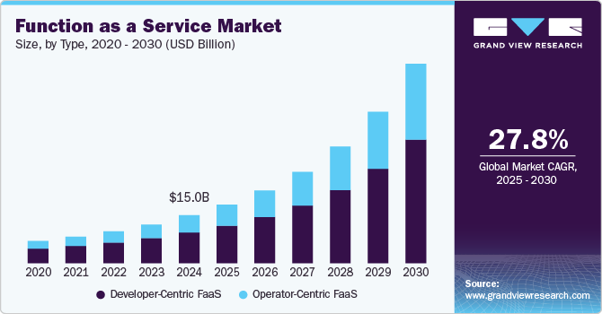

## Table of Contents

## What is a trending market?

A trending market is when the prices of things like stocks or other investments are moving in a clear direction over time. This could be going up, which is called a bullish trend, or going down, which is called a bearish trend. People who invest or trade watch these trends closely because they can help them decide when to buy or sell.

Knowing about trending markets is important because it can help people make better choices with their money. If a market is in a bullish trend, it might be a good time to buy because prices are expected to keep going up. But if it's in a bearish trend, it might be better to sell or wait before buying. Understanding these trends can help people make smarter decisions and possibly make more money.

## How can you identify a trending market?

To identify a trending market, you need to look at the price movements of stocks or other investments over time. A trending market is when these prices keep moving in the same direction for a while. If the prices are going up over time, it's called an uptrend or bullish trend. If the prices are going down, it's called a downtrend or bearish trend. You can see these trends by looking at charts that show how prices have changed over days, weeks, or even months.

One way to spot a trend is by drawing lines on these charts. For an uptrend, you draw a line along the bottom of the price movements, connecting the lowest points. If this line keeps going up, you have an uptrend. For a downtrend, you draw a line along the top of the price movements, connecting the highest points. If this line keeps going down, you have a downtrend. Another way is to use moving averages, which are lines that show the average price over a certain time. If the price stays above the moving average, it might be an uptrend. If it stays below, it might be a downtrend.

It's also helpful to pay attention to what other people are saying and doing. If many people are talking about a stock or if there's a lot of news about it, it might be a sign of a trending market. Also, if a lot of people are buying or selling the same thing, that can push the market in a certain direction. By combining these different ways of looking at the market, you can get a better idea of whether it's trending up or down.

## What are the different types of trends in a market?

In a market, there are three main types of trends: uptrends, downtrends, and sideways trends. An uptrend happens when the prices of stocks or other investments keep going up over time. This is also called a bullish trend because it's like a bull charging forward. On the other hand, a downtrend is when prices keep going down. This is called a bearish trend, like a bear swiping down. Lastly, a sideways trend, or a range-bound market, is when prices move up and down but stay about the same over time. They don't really go up or down a lot.

Each type of trend can last for different amounts of time. Some trends last for just a few days or weeks, and these are called short-term trends. Other trends can last for months or even years, and these are called long-term trends. Knowing the difference between these can help you decide what to do with your money. For example, if you see a long-term uptrend, you might want to buy and hold onto your investments for a while. But if you see a short-term downtrend, you might want to sell quickly or wait before buying anything new.

## What causes a market to trend?

A market trends because of many reasons that all work together. One big reason is what people think and feel about the market. If a lot of people think the market will do well, they start buying more, which makes prices go up and creates an uptrend. But if people think the market will do badly, they start selling, which makes prices go down and creates a downtrend. Also, big news like a new law or a world event can change what people think and cause the market to trend.

Another reason for market trends is the economy. If the economy is doing well, with more jobs and people spending more money, the market might go up. But if the economy is struggling, with fewer jobs and people saving their money, the market might go down. Companies also play a part. If a company does really well or really badly, it can affect the whole market and start a trend. All these things together make the market move in a certain direction for a while.

## How do trends affect investment decisions?

Trends in the market really change how people decide to invest their money. When the market is going up, which we call an uptrend, people often feel good about buying stocks or other things. They think the prices will keep going up, so it's a good time to get in and make some money. But when the market is going down, or in a downtrend, people get worried. They might decide to sell what they have before the prices drop even more, or they might wait to buy anything new until the market starts going up again.

Trends also help people plan for the long term. If someone sees that the market has been going up for a long time, they might decide to keep their money in the market and wait for it to grow even more. On the other hand, if they see the market has been going down for a while, they might move their money to safer places where it won't lose as much value. By watching trends, people can make smarter choices about when to buy, sell, or hold onto their investments.

## What are the key indicators used to analyze market trends?

To figure out what the market is doing, people use things called indicators. One common indicator is the moving average, which is a line that shows the average price of a stock over a certain time, like 50 days or 200 days. If the price of the stock stays above this line, it might mean the market is going up. If it stays below, it might mean the market is going down. Another indicator is the Relative Strength Index (RSI), which tells you if a stock is being bought or sold a lot. If the RSI is high, it means a lot of people are buying, and if it's low, it means a lot of people are selling.

Another important indicator is [volume](/wiki/volume-trading-strategy), which shows how many stocks are being traded. If the volume is high when the price is going up, it can mean that the uptrend is strong because a lot of people believe in it. But if the volume is low, the trend might not be as strong. People also look at chart patterns, like when the price makes higher highs and higher lows, which can show an uptrend, or lower highs and lower lows, which can show a downtrend. By using these indicators together, people can get a better idea of what the market is doing and make smarter choices about their investments.

## How can technical analysis be used to understand market trends?

Technical analysis is a way to look at the market by studying charts and numbers to see what's happening with prices. People use it to spot trends, which are when prices keep moving in the same direction for a while. They do this by drawing lines on the charts. For an uptrend, they draw a line along the bottom of the price movements, connecting the lowest points. If this line keeps going up, it means the market is in an uptrend. For a downtrend, they draw a line along the top of the price movements, connecting the highest points. If this line keeps going down, it means the market is in a downtrend. By looking at these lines, people can see if the market is going up or down and make better choices about buying or selling.

Another way to use technical analysis is by looking at moving averages, which are lines that show the average price over a certain time. If the price stays above the moving average, it might mean the market is in an uptrend. If it stays below, it might mean the market is in a downtrend. People also use other tools like the Relative Strength Index (RSI) to see if a stock is being bought or sold a lot. If the RSI is high, it means a lot of people are buying, which can support an uptrend. If it's low, it means a lot of people are selling, which can support a downtrend. By combining these tools, people can get a good picture of what the market is doing and decide when to buy or sell their investments.

## What role does fundamental analysis play in assessing market trends?

Fundamental analysis looks at the basic things about a company or the whole economy to understand market trends. It's different from technical analysis, which just looks at price charts. With [fundamental analysis](/wiki/fundamental-analysis), people check things like how much money a company is making, how much it's growing, and if it's a good deal compared to other companies. They also look at bigger things like what's happening in the whole economy, like if there are more jobs or if people are spending more money. By understanding these things, people can guess if the market will go up or down.

When people use fundamental analysis, they try to see if the market is going in a direction that makes sense based on real stuff happening in companies and the economy. For example, if a company is making more money and growing fast, it might help start an uptrend in the market. But if the economy is doing badly, with fewer jobs and less spending, it might lead to a downtrend. By looking at these basic things, people can make smarter choices about when to buy or sell investments, and they can understand why the market is moving the way it is.

## How do global economic factors influence market trends?

Global economic factors have a big impact on market trends because they affect how people and businesses around the world act. Things like how fast the world economy is growing, what interest rates are doing, and how much countries are trading with each other can all make the market go up or down. For example, if the world economy is growing fast, companies might make more money, which can make stock prices go up and start an uptrend. But if the economy is slowing down, companies might make less money, which can make stock prices go down and start a downtrend.

Another important global economic [factor](/wiki/factor-investing) is what's happening with money and how much it's worth in different countries. If one country's money gets stronger compared to others, it can make that country's products more expensive for people in other countries to buy. This can hurt that country's companies and make the market go down. On the other hand, if a country's money gets weaker, its products become cheaper for other countries to buy, which can help its companies and make the market go up. By keeping an eye on these global economic factors, people can get a better idea of why the market is moving the way it is and make smarter choices about their investments.

## What strategies can be employed to capitalize on market trends?

One way to make money from market trends is by following the trend. If you see that the market is going up, you can buy stocks or other things and hold onto them while the prices keep going up. This is called riding the trend. But you need to be careful and watch the market closely because trends can change. When you think the trend might be ending, you can sell your investments and make a profit. Another way is to use stop-loss orders, which automatically sell your investments if the price goes down a certain amount. This can help you avoid losing too much money if the trend suddenly changes.

Another strategy is to use technical analysis to find good times to buy and sell. You can look at charts and use tools like moving averages to see when a trend might start or end. For example, if the price stays above the moving average, it might be a good time to buy because the market is in an uptrend. If the price goes below the moving average, it might be a good time to sell because the market could be going into a downtrend. By using these tools, you can make better choices about when to get in and out of the market and make money from the trends.

Fundamental analysis can also help you make money from market trends. By looking at things like how much money a company is making and how the economy is doing, you can guess if the market will go up or down. If you think the market will go up because companies are doing well, you can buy stocks and hold onto them. But if you think the market will go down because the economy is struggling, you might want to sell your investments or wait before buying anything new. By combining these strategies and keeping an eye on both the market and the bigger picture, you can make smarter choices and possibly make more money from market trends.

## How can one manage risks associated with trading in trending markets?

Managing risks when trading in trending markets is important to protect your money. One way to do this is by using stop-loss orders. A stop-loss order is like a safety net that automatically sells your investment if the price drops to a certain level. This can help you avoid losing too much money if the market suddenly turns against you. Another way is to not put all your money into one investment. By spreading your money across different stocks or other things, you can reduce the risk of losing everything if one of them goes down.

It's also a good idea to keep an eye on the market and be ready to change your plans. Trends can change quickly, so you need to be flexible. If you see signs that the trend might be ending, like the price going below the moving average, you might want to sell your investments before the market goes down more. Also, don't let your feelings control your decisions. It can be easy to get excited when the market is going up and want to buy more, or to get scared when it's going down and want to sell everything. But making decisions based on feelings can lead to big losses. By staying calm and sticking to your plan, you can manage the risks better and protect your money.

## What advanced tools and technologies are available for trend analysis in financial markets?

Advanced tools and technologies have made it easier to understand and predict trends in financial markets. One popular tool is [algorithmic trading](/wiki/algorithmic-trading), which uses computer programs to buy and sell investments based on set rules. These programs can look at a lot of data very quickly and make decisions faster than a person could. Another tool is [machine learning](/wiki/machine-learning), which is a type of [artificial intelligence](/wiki/ai-artificial-intelligence) that can learn from past data to predict what might happen next in the market. By using machine learning, traders can find patterns and trends that might be hard to see otherwise.

There are also advanced charting platforms that help traders see and analyze market trends in more detail. These platforms can show different types of charts and let you add lots of indicators, like moving averages and the Relative Strength Index (RSI), to help you understand the market better. Some platforms even use big data and sentiment analysis to look at what people are saying online about certain stocks or the market in general. This can give traders a better idea of what other people are thinking and feeling, which can affect market trends. By using these advanced tools and technologies, traders can make more informed decisions and possibly make more money.

## What are the key aspects of understanding market trends?

Market trends are fundamental to financial analysis, serving as indicators of the general direction that market prices are likely to take over a designated timeframe. These trends can manifest as upward, downward, or sideways movements, each providing insights into market behavior and investor sentiment.

An upward trend denotes a consistent rise in prices, indicating a bullish market where assets are increasingly valued. Conversely, a downward trend is characterized by falling prices, suggesting a bearish market with decreasing asset values. Recognizing these patterns assists traders in determining optimal entry and [exit](/wiki/exit-strategy) points, maximizing their trading strategies' effectiveness.

Despite the Efficient Market Hypothesis (EMH) asserting that markets are inherently unpredictable due to the rapid assimilation of information, trends frequently emerge. These trends, often discernible through past and present data, offer shrewd investors opportunities to capitalize on market movements. EMH categorizes markets into three forms—weak, semi-strong, and strong—each reflecting varying levels of informational access and incorporation into asset prices.

Technical analysts employ a range of tools and methodologies to interpret market trends, relying heavily on visual and statistical data. Moving averages, for instance, smooth out price data over a specific period, highlighting the underlying trend direction. The simple moving average (SMA) is calculated as follows:

$$
\text{SMA} = \frac{\sum \text{Price over n periods}}{n}
$$

where $n$ represents the number of periods over which the average is computed. Trend lines further extend this analysis by connecting successive highs or lows in a price chart, visually defining a trend’s trajectory and potential support and resistance levels.

Chart patterns, another critical tool, are formations created by the price movements of an asset, offering forecasts on future price direction. Common patterns include head and shoulders, triangles, and flags, each with implications on the continuation or reversal of trends.

Together, these analytical approaches enable traders to dissect market dynamics systematically, exploiting trends for strategic financial gains. Through such analysis, traders gain actionable insights, harnessing the power of statistical trends in an ostensibly unpredictable market environment.

## References & Further Reading

[1]: Bergstra, J., Bardenet, R., Bengio, Y., & Kégl, B. (2011). ["Algorithms for Hyper-Parameter Optimization."](https://dl.acm.org/doi/10.5555/2986459.2986743) Advances in Neural Information Processing Systems 24.

[2]: ["Advances in Financial Machine Learning"](https://www.amazon.com/Advances-Financial-Machine-Learning-Marcos/dp/1119482089) by Marcos Lopez de Prado

[3]: ["Evidence-Based Technical Analysis: Applying the Scientific Method and Statistical Inference to Trading Signals"](https://www.amazon.com/Evidence-Based-Technical-Analysis-Scientific-Statistical/dp/0470008741) by David Aronson

[4]: ["Machine Learning for Algorithmic Trading"](https://github.com/stefan-jansen/machine-learning-for-trading) by Stefan Jansen

[5]: ["Quantitative Trading: How to Build Your Own Algorithmic Trading Business"](https://www.amazon.com/Quantitative-Trading-Build-Algorithmic-Business/dp/1119800064) by Ernest P. Chan