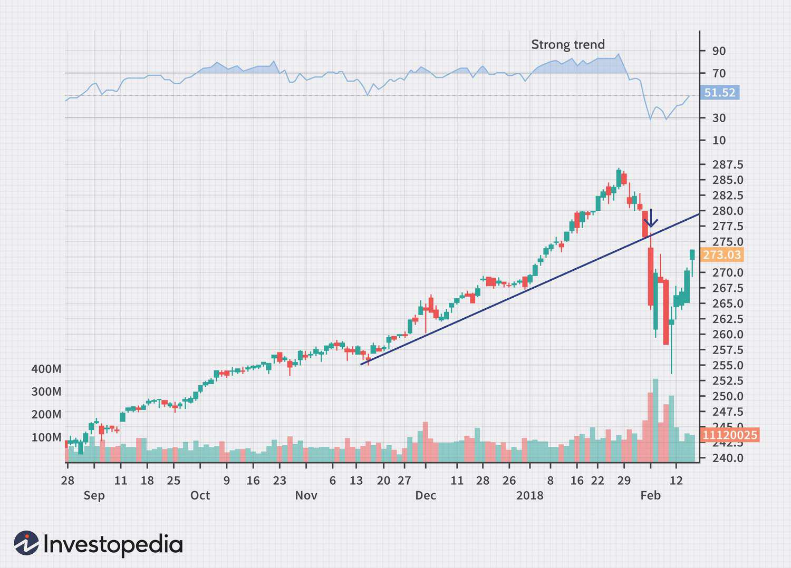

The financial markets experience continuous change, primarily influenced by technological advancements, economic fluctuations, and evolving investor behaviors. These dynamic factors not only affect market stability but also shape the strategies employed by traders and investors. A pivotal trend transforming the financial landscape is the increasing adoption of algorithmic trading. This method leverages cutting-edge technology to execute trades with remarkable precision and speed, thus redefining traditional trading practices.

Algorithmic trading utilizes pre-programmed instructions to select, buy, and sell assets. It allows traders to capitalize on small price discrepancies in the market, facilitating high-frequency trading (HFT) where a large number of trades are executed within fractions of a second. This transformation is further propelled by the integration of artificial intelligence (AI) and machine learning (ML) technologies, which enhance trading models by learning from historical data and adapting to market changes in real time.



As algorithmic trading continues to grow, it promises to bring efficiency and liquidity to the financial markets. However, it also introduces complexities and challenges, particularly concerning market dynamics and regulatory oversight. Market participants must understand these emerging trends and analyses to inform their trading strategies effectively. By adopting a comprehensive approach to market trends and analysis, traders and investors can make informed decisions to navigate the intricate financial landscape, harnessing technology to improve their trading outcomes.

## Table of Contents

## Understanding Market Trends

Market trends are fundamental to financial analysis, serving as indicators of the general direction that market prices are likely to take over a designated timeframe. These trends can manifest as upward, downward, or sideways movements, each providing insights into market behavior and investor sentiment.

An upward trend denotes a consistent rise in prices, indicating a bullish market where assets are increasingly valued. Conversely, a downward trend is characterized by falling prices, suggesting a bearish market with decreasing asset values. Recognizing these patterns assists traders in determining optimal entry and [exit](/wiki/exit-strategy) points, maximizing their trading strategies' effectiveness.

Despite the Efficient Market Hypothesis (EMH) asserting that markets are inherently unpredictable due to the rapid assimilation of information, trends frequently emerge. These trends, often discernible through past and present data, offer shrewd investors opportunities to capitalize on market movements. EMH categorizes markets into three forms—weak, semi-strong, and strong—each reflecting varying levels of informational access and incorporation into asset prices.

Technical analysts employ a range of tools and methodologies to interpret market trends, relying heavily on visual and statistical data. Moving averages, for instance, smooth out price data over a specific period, highlighting the underlying trend direction. The simple moving average (SMA) is calculated as follows:

$$
\text{SMA} = \frac{\sum \text{Price over n periods}}{n}
$$

where $n$ represents the number of periods over which the average is computed. Trend lines further extend this analysis by connecting successive highs or lows in a price chart, visually defining a trend’s trajectory and potential support and resistance levels.

Chart patterns, another critical tool, are formations created by the price movements of an asset, offering forecasts on future price direction. Common patterns include head and shoulders, triangles, and flags, each with implications on the continuation or reversal of trends.

Together, these analytical approaches enable traders to dissect market dynamics systematically, exploiting trends for strategic financial gains. Through such analysis, traders gain actionable insights, harnessing the power of statistical trends in an ostensibly unpredictable market environment.

## Market Analysis in the Age of Algo Trading

Market analysis is a fundamental component in understanding the financial markets, enabling participants to evaluate past, present, and future trends. Traditionally, this analysis required extensive manual effort and the expertise of financial analysts. However, the advent of [algorithmic trading](/wiki/algorithmic-trading) has revolutionized the process by introducing tools that can rapidly analyze vast datasets with unprecedented speed and precision.

Algorithmic trading utilizes computer programs to execute trading strategies based on pre-defined criteria. These algorithms can process large volumes of market data to identify patterns or trends that may not be visible to human traders. The rapid processing capabilities of algorithms enable them to react quickly to market changes, providing traders with a competitive edge. Moreover, since these algorithms operate based on statistical and mathematical models, they can minimize human errors and emotional biases.

The integration of [artificial intelligence](/wiki/ai-artificial-intelligence) (AI) and [machine learning](/wiki/machine-learning) (ML) into trading algorithms has further enhanced their capabilities. AI and ML allow for the creation of sophisticated models that can learn from historical data and adapt to evolving market conditions. Machine learning models, for instance, can be trained to identify complex patterns in market behavior, predict price movements, and optimize trading strategies over time. A common method in this context is the use of supervised learning algorithms, where the model is trained on a labelled dataset to predict future outcomes.

A basic example of a trading algorithm might involve a simple moving average crossover strategy. Here is a Python implementation using the `pandas` library:

```python
import pandas as pd

# Load your data
data = pd.read_csv('market_data.csv')

# Calculate moving averages
short_window = 30
long_window = 90

data['Short_MA'] = data['Close'].rolling(window=short_window, min_periods=1).mean()
data['Long_MA'] = data['Close'].rolling(window=long_window, min_periods=1).mean()

# Signal generation: Buy when Short_MA crosses above Long_MA, sell otherwise
data['Signal'] = 0
data['Signal'][short_window:] = \
    np.where(data['Short_MA'][short_window:] > data['Long_MA'][short_window:], 1, -1)

# Generate trading orders
data['Position'] = data['Signal'].diff()

# Print the first few lines of the dataframe
print(data.head())
```

In this example, buy and sell signals are generated based on the crossover of short-term and long-term moving averages.

Major financial institutions have widely adopted algorithmic trading platforms to perform market analysis, harnessing these advanced technologies to optimize their trading strategies. These platforms not only increase the efficiency of trading operations but also reduce transaction costs. For example, investment banks and hedge funds use these algorithms to execute high-frequency trading ([HFT](/wiki/high-frequency-trading-strategies)), completing numerous trades in fractions of a second.

In conclusion, algorithmic trading has transformed market analysis, making it more dynamic and data-driven. By leveraging computational power and advanced analytical techniques, algorithmic trading platforms enhance the ability of traders to make informed decisions, thus shaping the modern financial ecosystem. As technology continues to evolve, the integration of AI and ML in trading algorithms promises to further revolutionize market analysis, presenting new opportunities and challenges for market participants.

## Key Growth Drivers of Algorithmic Trading

The proliferation of data and advancements in technology are pivotal drivers in the expansion of algorithmic trading. With the exponential growth of available market data, financial institutions are better equipped to leverage this information for more precise trading strategies. This vast influx of data, coupled with advancements in computing power, allows algorithms to process and analyze information at unprecedented speeds, making high-frequency trading (HFT) viable. HFT systems capitalize on minute price divergences to execute trades within milliseconds, thereby enhancing market [liquidity](/wiki/liquidity-risk-premium) and efficiency.

The financial industry has recognized the proficiency of algorithmic trading in reducing transaction costs and enhancing execution speed and precision. As a result, there is a marked increase in adoption rates among major financial institutions. By automating trading processes, these institutions can minimize human error and respond swiftly to market fluctuations, gaining a competitive edge in a fast-paced environment.

Regulatory bodies, aware of the growing significance of algorithmic trading, are instituting guidelines that support and facilitate its expansion while ensuring market integrity. This regulatory backing, combined with ongoing advancements in artificial intelligence (AI) and machine learning (ML), continues to propel the evolution of sophisticated trading platforms. These platforms harness AI and ML to develop adaptive models capable of learning from vast datasets, identifying patterns and trends that might elude conventional analysis.

The integration of these technologies also aids in improving market efficiency. Algorithms can identify [arbitrage](/wiki/arbitrage) opportunities and execute trades with precision, thus narrowing bid-ask spreads and enhancing overall liquidity. Moreover, by executing a large [volume](/wiki/volume-trading-strategy) of trades seamlessly, algorithmic trading plays a crucial role in price discovery and stabilizing markets during periods of [volatility](/wiki/volatility-trading-strategies).

Consequently, the growth of algorithmic trading is intrinsically linked to technological innovation and data accessibility. As these factors continue to evolve, they promise to reshape the landscape of financial markets, driving efficiency and offering novel opportunities for investors and traders alike.

## Challenges Facing Algorithmic Trading

Algorithmic trading, while advantageous, encounters several significant challenges that need addressing to mitigate risks and enhance market stability. One primary concern is market volatility. Algorithms can exacerbate rapid market movements, leading to events known as flash crashes. These are sudden, severe drops in asset prices, often resolved within minutes, but they can cause widespread panic and financial loss. An instance was the May 6, 2010, Flash Crash, where the Dow Jones Industrial Average briefly plummeted over 1,000 points, unintentionally triggered by automated high-frequency trades.

Another issue is the opaque nature of algorithmic trading systems. These systems often operate as "black boxes," meaning that the processes and decisions behind trades are not transparent, even to the developers themselves. This opacity can hinder effective oversight and make it challenging to pinpoint the causes of market disruptions.

Systemic risk also looms large. The interconnectedness of global financial markets means that a failure in one part of the market can rapidly propagate. Algorithmic systems, particularly those engaged in high-frequency trading, can amplify these risks due to their speed and scale. A malfunctioning or poorly designed algorithm could potentially lead to cascading failures, impacting liquidity and stability across the financial system.

Regulatory bodies are actively working to address these concerns. Agencies like the U.S. Securities and Exchange Commission (SEC) and the European Securities and Markets Authority (ESMA) have introduced regulations aimed at increasing transparency and accountability in algorithmic trading. Measures include mandating algorithmic trading firms to implement risk controls, undergo regular compliance audits, and maintain detailed records of their trading processes and decisions.

Potential solutions include enhancing the auditability and transparency of trading algorithms. Developing more robust risk management frameworks to identify and control systemic threats is crucial. Additionally, adopting standardized practices for algorithm development and deployment could help ensure fair practices and minimize the risk of systemic failures.

Overall, while algorithmic trading presents opportunities for efficiency and profitability, it also necessitates careful consideration and management of its inherent challenges to safeguard the financial markets.

## Future Outlook and Opportunities

The future of algorithmic trading appears highly promising, driven by continued technological advancements and evolving market dynamics. With these developments, the role of artificial intelligence (AI) in generating sophisticated trading strategies is becoming more prominent. AI enables the creation of algorithmic models that can learn from vast datasets and adapt to new patterns, thereby enhancing predictive accuracy and robust decision-making capabilities. This evolution opens up new opportunities for traders who can leverage AI to develop strategies that were previously unattainable due to computational and analytical constraints.

The algorithmic trading landscape is also witnessing a shift towards broader adoption among retail investors, primarily as trading platforms become increasingly accessible and user-friendly. This democratization is fueled by fintech advancements that lower entry barriers, providing retail traders with tools and insights once reserved for institutional investors. As a result, retail participation in algorithmic trading is likely to grow, contributing to increased market liquidity and diversity.

Globalization and interconnected financial markets introduce both challenges and opportunities for algorithmic trading. On one hand, traders can exploit arbitrage opportunities across different geographies, benefiting from varying market inefficiencies. On the other hand, these interconnected markets also pose the risk of systemic contagion, where shocks in one market can rapidly propagate globally, prompting traders to develop more resilient cross-market strategies.

Investors intending to capitalize on these emerging opportunities should focus on acquiring a deep understanding of AI and machine learning applications in trading, while also staying informed about global market interdependencies. By doing so, they are better positioned to identify profitable avenues and mitigate risks within this evolving landscape. 

Ultimately, continued innovation in technology and analytics is set to expand the horizons of algorithmic trading, enabling deeper market penetration and creating a wealth of opportunities for proactive participants.

## Conclusion

Algorithmic trading is rapidly reshaping financial markets by offering enhanced speed, precision, and efficiency in trade execution. These benefits, however, are accompanied by certain risks and challenges, necessitating a comprehensive understanding of market dynamics. Recognizing market trends is crucial for traders who wish to capitalize on market opportunities and avoid pitfalls. Tools and technologies such as algorithmic models help in identifying these trends, offering traders a significant advantage in timing their market entries and exits.

The continual evolution of algorithmic trading is driven by technological advancements, providing fertile ground for future innovation. Despite existing challenges like market volatility and the potential for flash crashes, these advancements present ample opportunities for creating sophisticated trading strategies. Embracing these technological tools allows traders and investors to navigate the intricate financial landscape more effectively.

Leveraging insights gained from market trends and thorough analysis enhances trade strategies, aligning them more closely with the intricacies of the current financial environment. As the trading ecosystem continues to grow more complex, the adaptability of traders becomes paramount. A proactive approach in staying informed about technological and market developments is key to achieving success in this rapidly changing field. By maintaining this adaptability, traders and investors will be better equipped to harness the opportunities presented by algorithmic trading while mitigating its inherent risks.

## References & Further Reading

[1]: Bergstra, J., Bardenet, R., Bengio, Y., & Kégl, B. (2011). ["Algorithms for Hyper-Parameter Optimization."](https://dl.acm.org/doi/10.5555/2986459.2986743) Advances in Neural Information Processing Systems 24.

[2]: ["Advances in Financial Machine Learning"](https://www.amazon.com/Advances-Financial-Machine-Learning-Marcos/dp/1119482089) by Marcos Lopez de Prado

[3]: ["Evidence-Based Technical Analysis: Applying the Scientific Method and Statistical Inference to Trading Signals"](https://www.amazon.com/Evidence-Based-Technical-Analysis-Scientific-Statistical/dp/0470008741) by David Aronson

[4]: ["Machine Learning for Algorithmic Trading"](https://github.com/stefan-jansen/machine-learning-for-trading) by Stefan Jansen

[5]: ["Quantitative Trading: How to Build Your Own Algorithmic Trading Business"](https://www.amazon.com/Quantitative-Trading-Build-Algorithmic-Business/dp/1119800064) by Ernest P. Chan