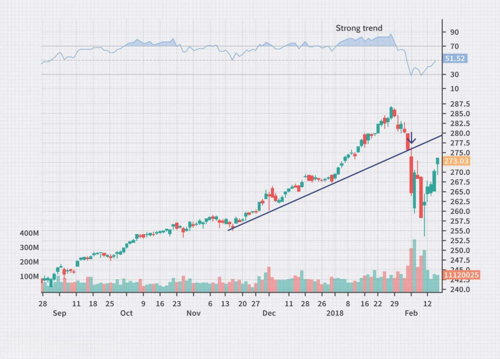

In the fast-paced financial markets of today, investing in the stock market has taken on new dimensions with the advent of algorithmic trading. Algorithmic trading, often referred to as algo-trading or automated trading, relies on complex computer programs to execute trades at speeds and frequencies that are impossible for human traders. This technological advancement leverages sophisticated algorithms and vast amounts of data to make informed trading decisions, often optimizing these decisions based on predetermined criteria. With the proliferation of big data and advancements in computing power, algo-trading has become a staple in modern finance, dominating a significant portion of trading volumes in global markets.

The integration of algorithmic trading with stock market investing promises numerous advantages, from increased efficiency and precision in trade execution to the mitigation of emotional bias that often hampers traditional trading. However, it also introduces new challenges, such as a reliance on robust infrastructure and the potential for systemic risks. Such complexities demand a detailed exploration of the advantages and hurdles that accompany algo-trading, as well as a thorough understanding of various algorithms and strategies utilized in this domain.



As more investors and traders harness technology to gain a competitive edge, an understanding of algorithmic trading becomes crucial for both novices and experienced market players. This knowledge not only equips them with the tools needed to navigate the evolving market landscape but also to adapt to the rapid technological advancements shaping the future of finance. Embracing algorithmic trading requires a blend of technical and financial savvy, as well as a keen awareness of the ever-changing market dynamics.

Algorithmic trading is reshaping the landscape of stock market investments, offering unprecedented opportunities and challenges. As we examine its role in today's financial environment, it is imperative to consider how these automated systems are influencing the way investors and institutions manage and execute trades. This exploration unveils the complexities and potential that algorithmic trading holds in the quest for higher efficiency and better investment outcomes in the stock market.

## Table of Contents

## Understanding Algorithmic Trading

Algorithmic trading involves the automatic execution of trades using predefined sets of rules or algorithms. These algorithms can vary significantly in complexity. At the simplest level, an algorithm might trigger trades based on basic price changes, such as buying a stock when its price falls below a certain level, or selling when it rises above a particular threshold. More advanced algorithms might incorporate multiple market indicators, like moving averages, volume changes, or market volatility metrics, to make intricate trading decisions.

The core objective of algorithmic trading is to achieve optimal trade execution at the best available prices, facilitated by minimal human involvement. This high degree of automation helps reduce the emotional influences that often impair human trading decisions, such as panic selling or overenthusiastic buying during volatile market conditions.

Algorithmic trading has gained substantial traction among institutional investors and hedge funds due to its ability to process high volumes of transactions efficiently and accurately. Its increasing popularity is also noticeable among retail traders, attributed to significant technological advancements in trading software and the proliferation of high-speed internet. Retail traders, equipped with the latest technology, can now access similar tools and platforms previously available only to professional traders.

In summary, [algorithmic trading](/wiki/algorithmic-trading) integrates technology and finance through a set of programmed criteria, allowing automated trades that aim for precision and speed while mitigating human errors and emotional biases.

## How Algorithmic Trading Works

Algorithmic trading fundamentally operates by leveraging predefined rules and sophisticated data analysis to automate the execution of trades in financial markets. At its core, it requires the creation of algorithms—computer programs that dictate the precise conditions under which trades should occur. These conditions can encompass various factors, such as particular price points, identifiable market trends, or specific technical indicators that might signal optimal trading moments.

The process begins with the programming of specific trading rules by traders or quantitative analysts. These rules can be simple, such as executing a trade when a stock price reaches a certain threshold, or complex, incorporating multiple variables and conditions. For instance, an algorithm might be designed to execute a buy order when the price of a stock surpasses its 50-day moving average, while simultaneously ensuring that the relative strength index (RSI) is below a certain level to confirm upward [momentum](/wiki/momentum).

Real-time data analysis is a critical component of algorithmic trading, enabling algorithms to swiftly identify trading opportunities that match the programmed criteria. Algo-trading systems are designed to ingest vast amounts of market data and respond almost instantaneously. This capability far surpasses human reaction times, thereby optimizing the speed and efficiency of trade execution. Algorithms continuously evaluate market conditions, incorporating factors such as price changes, [volume](/wiki/volume-trading-strategy), and market [volatility](/wiki/volatility-trading-strategies) to make informed decisions about entering or exiting positions.

Consider the following Python snippet as an illustrative example of a simple algorithmic trading strategy using the popular library pandas for handling data:

```python
import pandas as pd

# Load historical market data
data = pd.read_csv('market_data.csv')  # Ensure market_data.csv is available

# Calculate a 50-day moving average
data['50_MA'] = data['Close'].rolling(window=50).mean()

# Define RSI calculation (simplified)
def calculate_rsi(data, periods=14):
    delta = data['Close'].diff()
    gain = (delta.where(delta > 0, 0)).rolling(window=periods).mean()
    loss = (-delta.where(delta < 0, 0)).rolling(window=periods).mean()
    rs = gain / loss
    return 100 - (100 / (1 + rs))

data['RSI'] = calculate_rsi(data)

# Define trading signals
data['Signal'] = 0  # No position
data.loc[(data['Close'] > data['50_MA']) & (data['RSI'] < 30), 'Signal'] = 1  # Buy signal
data.loc[(data['Close'] < data['50_MA']) & (data['RSI'] > 70), 'Signal'] = -1  # Sell signal

# Output trading signals
print(data[['Close', '50_MA', 'RSI', 'Signal']])
```

This code exemplifies a basic momentum-based strategy by buying assets when conditions suggest an upward trend and selling when the trend appears to be reversing.

Overall, algorithmic trading systems continuously monitor the data stream, updating calculations and conditions to decide the optimal moments for executing trades. This dynamic assessment allows traders to maintain positions in rapidly changing markets effectively, mitigating the effects of human error and emotional influence while maximizing precision and speed. Through automation, algo-trading facilitates handling large volumes of transactions efficiently, which would otherwise be infeasible manually.

## Advantages of Algorithmic Trading

Algorithmic trading, or algo-trading, offers numerous advantages to market participants, primarily by enhancing the speed and accuracy with which trades are executed. By leveraging computer algorithms, traders can conduct transactions at speeds that are beyond human capability, ensuring that trades are executed at the best possible prices almost instantaneously. This rapid execution reduces the risk of missed opportunities, which is crucial in the fast-moving environment of stock markets.

Moreover, algo-trading significantly reduces transaction costs by minimizing human intervention in the trading process. When trades are executed automatically, the influence of human emotions such as fear and greed is markedly diminished, leading to more rational investment decisions. The absence of emotional biases translates into a more disciplined approach to trading, where decisions are guided by predefined algorithms rather than impulsive reactions to market fluctuations.

One of the key features of algorithmic trading is [backtesting](/wiki/backtesting), which allows traders to test their strategies against historical data. By simulating trades over past market conditions, traders can evaluate the potential effectiveness and profitability of their strategies before deploying them in live markets. This rigorous testing framework helps enhance the robustness of trading strategies, ensuring they are well-tuned to handle various market scenarios.

Additionally, algo-trading enables the simultaneous execution of multiple trades or strategies across diverse portfolios without the need for manual oversight. This capacity for multitasking is particularly beneficial for institutional investors managing large and complex portfolios. By automating the trading process, market participants can efficiently manage and adjust their positions in response to dynamic market conditions, thereby optimizing their overall investment performance.

In summary, algorithmic trading offers enhanced speed, accuracy, and efficiency in trade execution. It minimizes costs and human error, provides robust strategy testing through backtesting, and facilitates the management of multiple trades and strategies simultaneously, all of which are invaluable advantages in today's financial markets.

## Challenges and Risks

Despite the numerous advantages of algorithmic trading, it presents several challenges that must be carefully managed. Key among these is technological dependency, where the seamless operation of trading algorithms relies heavily on sophisticated hardware and software. Any failure in these systems can halt trading activities or result in erroneous trades, potentially causing significant financial losses. To mitigate these risks, robust infrastructure and contingency plans are essential.

Latency issues represent another substantial challenge. In algorithmic trading, even microsecond delays can lead to missed trading opportunities. The speed at which trades are executed can be the difference between profit and loss, especially in a competitive marketplace where multiple algorithms strive to exploit the same market inefficiencies. Efficient data processing and minimal transmission delays are critical in maintaining competitive advantage.

Additionally, the unpredictability of 'black swan' events poses a considerable risk to algorithmic trading systems. These events, characterized by their rarity and severe impact, often fall outside the scope of conventional predictive models employed by trading algorithms. Algorithms designed using historical data can fail to anticipate these anomalies, leading to substantial financial repercussions.

The reliance on algorithms and technology can also exacerbate the effects of market volatility or crashes. Algorithmic trading strategies that work well in stable markets may not perform optimally under extreme market conditions, which can lead to cascading failures as algorithms react to rapidly changing prices and volumes. The 2010 Flash Crash serves as a poignant example of how algorithmic trading can amplify market disruptions.

To address these challenges, it is crucial to incorporate rigorous testing and validation processes, including stress-testing algorithms against various market scenarios to ensure robust performance. Additionally, continuous monitoring and adaptive algorithms that can modify their strategies in response to real-time market changes may offer some degree of resilience against these risks. Ultimately, while algorithmic trading offers significant advantages, a comprehensive understanding and prudent management of its inherent challenges are necessary for sustainable success.

## Popular Strategies in Algo-Trading

Algorithmic trading employs various strategies designed to capitalize on different market conditions and asset behaviors, aiming for optimal execution and profitability. Here are some popular strategies used in algo-trading:

1. **Trend-Following Strategies**: These strategies identify and capitalize on price movements. They are based on the principle that securities which have been trending will continue to do so. Trend-following algorithms use various indicators like moving averages to detect these trends. For example, the creation of signals based on a moving average crossover is a common method:

   ```python
   # Example of a simple moving average crossover strategy
   def moving_average(prices, window):
       return prices.rolling(window=window).mean()

   # Trading signal based on moving average crossover
   short_window = 40
   long_window = 100

   data['Short_MA'] = moving_average(data['Close'], short_window)
   data['Long_MA'] = moving_average(data['Close'], long_window)

   data['Signal'] = 0
   data['Signal'][short_window:] = np.where(data['Short_MA'][short_window:] > data['Long_MA'][short_window:], 1, 0)
   data['Position'] = data['Signal'].diff()
   ```

2. **Arbitrage Opportunities**: This strategy involves exploiting price differences of a security between different markets or forms. It typically involves buying a security in one market at a lower price and selling it in another market at a higher price. The efficiency of algorithmic systems is critical here to execute trades quickly before price inequalities dissolve.

3. **Index Fund Rebalancing**: Index funds periodically adjust their holdings to align with their benchmark indices. Algo-trading can forecast these adjustments and strategically trade to benefit from expected price movements in stocks involved in rebalancing. Anticipating these portfolio adjustments can provide profitable short-term trading opportunities.

4. **Mean Reversion**: Mean reversion strategies work on the premise that asset prices tend to revert to their historical means. When prices deviate significantly from the mean, algorithms will open trades expecting a return to average values. This involves statistical analysis and is primarily effective in relatively stable markets.

5. **VWAP (Volume-Weighted Average Price)**: VWAP strategies aim to execute trades close to the average price weighted by volume throughout the trading period. Algorithms attempt to break down large orders and execute them incrementally, minimizing their market impact.

6. **TWAP (Time-Weighted Average Price)**: Similar to VWAP, the TWAP strategy involves executing trades uniformly over a predefined time period, thereby reducing adverse market impact. These strategies are used to ensure trading orders are filled evenly over time.

These strategies demonstrate the versatility of algorithmic trading, utilizing different techniques to optimize trading execution and profitability. Each strategy caters to specific market conditions and investor objectives, making algorithmic trading a valuable tool in modern finance.

## Getting Started with Algorithmic Trading

To embark on a career in algorithmic trading, aspiring traders need to equip themselves with a combination of technical and financial expertise. Central to this is acquiring basic computer programming skills, which act as a foundation for creating, testing, and implementing trading algorithms. Languages such as Python are highly recommended due to their simplicity and the extensive availability of financial libraries and frameworks.

A comprehensive understanding of financial markets is indispensable. This includes knowledge of market structures, trading instruments, and price dynamics. Familiarity with financial concepts allows traders to design algorithms that effectively capitalize on market patterns and anomalies.

Access to both historical and real-time market data is critical for developing and refining trading strategies. Historical data is used for backtesting, a process where algorithms are applied to past market conditions to evaluate their performance. Real-time data feeds provide the current market conditions necessary for implementing strategies and making informed trading decisions.

For beginners, using simpler trading platforms that offer basic algorithmic capabilities can be advantageous. These platforms often contain user-friendly interfaces and pre-coded strategies that facilitate an understanding of how algorithms function. Traders can gradually progress to more sophisticated systems that offer greater customization and advanced features.

Partnering with online brokers that cater to algorithmic trading is a practical step for executing trades. Such brokers provide the necessary infrastructure, including robust APIs, that enable seamless integration of the trader's algorithms with the broader market. Reliable execution and low latency are important considerations when selecting a broker, ensuring that trades occur at optimal speeds.

Continuous education and staying updated with market trends and technological advancements are vital components of sustained success in algorithmic trading. The financial markets and technology landscape are ever-evolving, necessitating an ongoing commitment to learning. Engaging with online courses, trading forums, and industry publications can help traders stay informed and adapt to changes effectively.

Practical application of these skills and knowledge can be demonstrated through a simple trading algorithm in Python:

```python
import numpy as np
import pandas as pd
from datetime import datetime

# Example of a simple moving average crossover strategy
def moving_average_crossover(data, short_window=40, long_window=100):
    signals = pd.DataFrame(index=data.index)
    signals['price'] = data['Close']
    signals['short_mavg'] = data['Close'].rolling(window=short_window, min_periods=1, center=False).mean()
    signals['long_mavg'] = data['Close'].rolling(window=long_window, min_periods=1, center=False).mean()

    # Create signals
    signals['signal'] = 0.0
    signals['signal'][short_window:] = np.where(signals['short_mavg'][short_window:] 
                                                > signals['long_mavg'][short_window:], 1.0, 0.0)

    # Generate trading orders
    signals['positions'] = signals['signal'].diff()

    return signals

# Assuming 'data' is a DataFrame with a DateTime index and a column 'Close' for closing prices
example_data = pd.DataFrame({
    'Close': np.random.normal(100, 1, size=200)  # random closing prices
}, index=pd.date_range(start='2020-01-01', periods=200, freq='D'))

signals = moving_average_crossover(example_data)

# Print the signals for the first 5 days
print(signals.head())
```

This sample code exemplifies how integrating programming skills, market understanding, and data access can yield a basic algorithmic trading strategy, serving as a stepping stone toward more complex systems.

## Conclusion

Algorithmic trading is fundamentally reshaping the landscape of stock trading by delivering unprecedented levels of efficiency and precision that manual trading cannot achieve. By leveraging sophisticated algorithms, traders can execute trades quickly, consistently, and with a level of accuracy that minimizes human error and emotional biases. This technological advancement allows traders to take advantage of fleeting market opportunities that would otherwise be inaccessible through conventional trading methods.

However, the benefits of algorithmic trading are balanced by an array of risks and challenges that traders must diligently manage. Technological dependencies, potential system failures, and latency issues can pose significant threats to successful trading operations. Furthermore, algorithmic systems may not always predict or handle unexpected market movements or 'black swan' events effectively, which could lead to substantial financial losses. Thus, a careful approach is essential for minimizing these risks, involving regular system checks, robust backtesting, and constant vigilance in monitoring market conditions.

Investing in the stock market using algorithmic strategies can indeed be profitable, but it demands a disciplined approach underpinned by sound judgment and caution. Traders must not only possess a deep understanding of the financial markets and technical know-how but also keep abreast of ongoing developments and innovations within the algorithmic trading sphere.

As financial markets continue to evolve, the role of algorithmic trading is likely to become even more significant in shaping investment strategies. The continuous advancements in technology and data analytics promise to further enhance the capabilities of algorithmic trading, making it an indispensable tool in the modern trader's arsenal. In light of these developments, both beginner and seasoned traders are encouraged to embrace the learning curve associated with algorithmic trading to secure their footing in an increasingly competitive trading environment.

## References & Further Reading

[1]: Bergstra, J., Bardenet, R., Bengio, Y., & Kégl, B. (2011). ["Algorithms for Hyper-Parameter Optimization."](https://papers.nips.cc/paper/4443-algorithms-for-hyper-parameter-optimization) Advances in Neural Information Processing Systems 24.

[2]: ["Advances in Financial Machine Learning"](https://www.amazon.com/Advances-Financial-Machine-Learning-Marcos/dp/1119482089) by Marcos Lopez de Prado

[3]: ["Evidence-Based Technical Analysis: Applying the Scientific Method and Statistical Inference to Trading Signals"](https://www.amazon.com/Evidence-Based-Technical-Analysis-Scientific-Statistical/dp/0470008741) by David Aronson

[4]: ["Machine Learning for Algorithmic Trading"](https://github.com/PacktPublishing/Machine-Learning-for-Algorithmic-Trading-Second-Edition) by Stefan Jansen

[5]: ["Quantitative Trading: How to Build Your Own Algorithmic Trading Business"](https://books.google.com/books/about/Quantitative_Trading.html?id=j70yEAAAQBAJ) by Ernest P. Chan