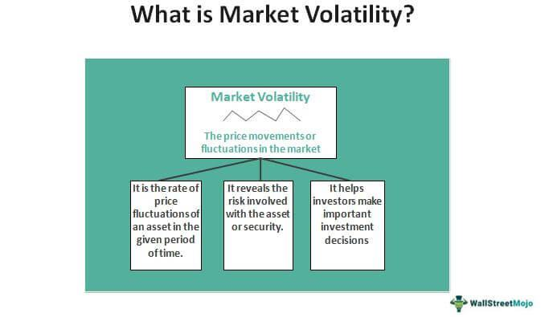

Market conditions in trading can often be unpredictable, challenging even the most seasoned traders. Traders frequently encounter market volatility and trendless conditions, often described as choppy markets. These markets lack a clear direction and feature fluctuating prices, making it difficult to establish a consistent trading strategy. This article examines the complexities of choppy markets and explores how algorithmic trading can be a valuable tool in navigating these uncertain times. Algorithmic trading offers potential solutions by automating decision-making processes that can swiftly adapt to volatile environments, minimizing risks and maximizing potential gains.

## Table of Contents



## Understanding Market Volatility and Choppy Markets

Market volatility refers to the rate at which the price of securities increases or decreases for a given set of returns, often viewed as the variability of returns. It is an essential aspect of financial markets, indicating the degree of variation in trading prices over time. Higher volatility is typically seen as risky, resulting in larger swings in asset prices. Choppy markets, on the other hand, are characterized by volatile price movements without discernible trends, where prices oscillate in a range but fail to establish a clear directional movement.

Several factors contribute to market volatility. Economic indicators, such as changes in interest rates, inflation data, and GDP reports, are common contributors. These indicators influence investor sentiment and expectations, often leading to rapid price changes in asset markets. Geopolitical events—ranging from elections, conflicts, or changes in policy—can also trigger significant market movements. Such events introduce uncertainty and risk, which are core elements that drive volatility.

Choppy markets often arise from a combination of these factors that keep investor sentiment indecisive. For instance, during periods of economic uncertainty or geopolitical instability, traders might exhibit hesitant behaviors, resulting in sideways price action. Additionally, stages of economic cycles where markets await new data or catalyst information can lead to such environments. In these scenarios, macroeconomic data releases might not provide enough momentum to break existing price levels.

Examples of market conditions that typically lead to trendless or choppy trading environments include periods surrounding important central bank announcements or the lead-up to elections, where the outcome is uncertain. During these times, the market may experience frequent but short-lived price spikes as investors react to pieces of information or speculation, ultimately causing erratic movements with little clear progression.

In summary, market volatility and choppy markets are crucial concepts for understanding trading environments. They are driven by economic indicators and geopolitical events, which can lead to significant challenges in predicting price movements. The ability to recognize and adapt to these conditions is vital for traders aiming to navigate and succeed in such unpredictable market phases.

## Characteristics of Trendless Trading

A trendless market, often referred to as a range-bound or sideways market, is characterized by the lack of a directional price movement over a period. In such conditions, asset prices oscillate within a horizontal range without any significant upward or downward trajectory. This environment is typically challenging for traders relying on trend-following strategies, as there is no clear market direction to capitalize on.

### Characteristics and Identification

1. **Oscillating Prices:** The most defining feature of a trendless market is the oscillation of prices within a defined range. This condition can be identified using technical indicators like Bollinger Bands or Moving Average Envelopes, which help visualize the range-bound nature by constraining prices within upper and lower bands. When prices move towards the upper band, they are likely to reverse, moving back towards the lower band, and vice versa.

2. **Volume Patterns:** In a trendless market, trading volumes may decrease, reflecting a lack of enthusiasm or conviction among traders. Alternatively, trading volumes may remain flat, indicating neither the bulls nor the bears have an upper hand. This can be observed in volume histograms where fluctuating volumes without a clear pattern suggest market indecisiveness.

3. **Technical Patterns:** Chart patterns such as rectangles and double tops/bottoms often appear in trendless markets. A rectangle pattern involves prices bouncing between a strong horizontal support and resistance, forming a box-like shape. Double tops and bottoms indicate repeated attempts to break through support or resistance without success, leading to reversals within a defined range.

### Impact on Trading Strategies

The absence of a clear trend requires trading strategies that can adapt to short-term price fluctuations. Trend-following strategies, such as those using moving averages, are typically ineffective in trendless markets, as false signals become more frequent due to the absence of sustained price movements. Instead, traders often resort to strategies such as:

- **Range Trading:** This involves identifying the support (lower bound) and resistance (upper bound) levels of the price range and executing buy orders near support and sell orders near resistance. The key to success is precise identification of these levels and swift execution to capitalize on these small movements.

- **Utilization of Indicators:** Oscillators like the Relative Strength Index (RSI) and the Stochastic Oscillator can be particularly useful. These indicators help identify overbought or oversold conditions, often serving as triggers for entry and exit points. For instance, a high RSI value near the upper range suggests a potential sell opportunity, while a low RSI near the bottom could indicate a buy.

### Examples of Trendless Market Conditions

Trendless market conditions can manifest over various time frames:

- **Intraday:** On an intraday basis, a stock may trade within a tight range of a few cents, influenced by low trading activity or lack of impactful news. Intraday traders often look at candlestick patterns or minute-by-minute oscillations to exploit these minor movements.

- **Medium-term:** For instance, a currency pair may oscillate within a range over several weeks due to geopolitical stability or balanced economic data from both countries, leading to balanced buying and selling pressures.

- **Long-term:** Major stock indices can remain trendless for months during periods of macroeconomic stagnation or uncertainty, with prices moving back and forth between established support and resistance levels without breakout catalysts.

In summary, trendless markets necessitate a flexible approach, prioritizing strategies that leverage short-term price movements rather than long-term directional bets. Recognizing the characteristics of these markets allows traders to adjust their tactics accordingly, using tools and strategies suited for non-trending conditions.

## Challenges of Trading in Choppy Markets

Trading in choppy markets presents several significant challenges for traders, making it a daunting environment for both seasoned and novice participants. One of the primary difficulties lies in the occurrence of false breakouts. In choppy conditions, prices often oscillate within a confined range, giving off signals that suggest the start of a new trend. Traders might interpret a [breakout](/wiki/breakout-trading) from this range as an entry or [exit](/wiki/exit-strategy) point, only to find that the price rapidly reverses, leading to potential losses. False breakouts can be particularly damaging as they not only result in financial loss but also erode trader confidence.

Choppy markets also increase the risk of losses due to their inherent unpredictability. The frequent and rapid shifts in price can quickly trigger stop losses, causing traders to exit positions prematurely, which can accumulate into significant cumulative losses. Additionally, the lack of a clear trend makes it challenging to apply traditional trend-following strategies, which depend on sustained price movements in a particular direction. This environment demands a higher level of adaptability and often necessitates a shift to range-bound strategies that aim to exploit smaller price fluctuations.

Emotionally, trading in choppy markets can exacerbate fear and greed, two of the most potent emotions in trading. The fear of missing out (FOMO) might compel traders to enter positions prematurely, while the fear of losses can lead to hasty exits. Conversely, during the rare instances when a position is profitable, greed might tempt traders to hold on for too long, waiting for gains that never materialize. The constant emotional rollercoaster can lead to impulsive decisions, further increasing the risk of error.

In terms of strategy, choppy markets have divergent impacts on short-term trading and long-term investment approaches. For short-term traders, such as day traders or scalpers, the constant price fluctuations may offer numerous opportunities for quick profits. However, the same [volatility](/wiki/volatility-trading-strategies) increases the likelihood of rapid losses. Short-term traders must possess the dexterity to navigate these conditions swiftly while maintaining strict risk management practices.

Long-term investors face different challenges. In a trendless environment, the potential for [momentum](/wiki/momentum) investing strategies is reduced, and the instability can discourage long-term commitments due to the lack of visible growth patterns in asset prices. Investors might find it challenging to discern the intrinsic value of investments, as price movements often reflect short-term market sentiment rather than fundamental value.

Overall, managing choppy market conditions requires a blend of technical skills, adaptability, and psychological resilience. Traders and investors must be prepared to modify their strategies while maintaining a disciplined approach to risk and emotional management.

## Algorithmic Trading: A Solution for Volatile Markets

Algorithmic trading, often referred to as algo trading, is a method that utilizes computer algorithms to execute trades quickly and efficiently, aiding traders in managing market volatility. By automating the trading process, algorithmic systems can make rapid decisions based on quantitative data, thereby minimizing human errors and emotional biases.

One of the primary advantages of [algorithmic trading](/wiki/algorithmic-trading) in volatile markets is its ability to handle large volumes of data and execute trades at speeds unattainable by human traders. This capability is crucial during periods of market turbulence when swift action is needed to capitalize on fleeting opportunities or to mitigate risk.

**Swift Transactions and Risk Management**

The precision and speed of algorithmic trading systems enable traders to capitalize on minute price movements that are typical in choppy markets. Algorithms can be programmed to identify predefined conditions such as price fluctuations or market inefficiencies and automatically execute trades when these conditions are met. This automated process reduces the time latency between decision-making and trade execution, which is essential in fast-moving markets.

For risk management, algorithms can be designed to implement stop-loss and take-profit orders, ensuring that traders exit positions at advantageous levels. This automated risk management is particularly beneficial in choppy markets, where price reversals can occur suddenly and without warning. Additionally, algorithms can be fine-tuned to analyze historical data, optimizing trade parameters for current market conditions.

**Types of Algorithmic Strategies in Choppy Markets**

Two popular algorithmic strategies effective in managing choppy market conditions are [arbitrage](/wiki/arbitrage) and mean reversion.

1. **Arbitrage**: This strategy involves exploiting price discrepancies between different markets or instruments. For example, if a security is priced differently on two exchanges, an algorithm can simultaneously buy the lower-priced asset and sell the higher-priced one, capturing the spread. Given the speed and efficiency of computer algorithms, such opportunities can be detected and executed within milliseconds.

2. **Mean Reversion**: This strategy is based on the statistical premise that prices and returns eventually move back toward the mean or average over time. In trendless or volatile markets, prices often oscillate between support and resistance levels without maintaining a clear direction. An algorithmic system can be programmed to identify overbought or oversold conditions using indicators like the Relative Strength Index (RSI). When a price deviation is detected, the algorithm executes trades based on the assumption that the price will revert to its historical average.

Here is a simple example in Python illustrating an algorithmic approach using the mean reversion strategy:

```python
import numpy as np
import pandas as pd

# Generate example price data
np.random.seed(42)
price_data = np.random.normal(loc=100, scale=1, size=100)

# Compute moving average
window_size = 5
rolling_mean = pd.Series(price_data).rolling(window=window_size).mean()

# Identify potential trade signals
buy_signals = np.where(price_data < rolling_mean, 1, 0)
sell_signals = np.where(price_data > rolling_mean, -1, 0)

# Execute trades based on signals
positions = buy_signals + sell_signals
```

In this example, trades are executed when the market price deviates from its moving average—an indication that it may soon revert to the mean. Implementing this strategy can be adapted for real-time data and enhanced with additional decision criteria for improved performance in volatile markets.

Algorithmic trading continues to evolve, offering an array of tools and strategies suitable for navigating the unpredictable nature of choppy markets, thereby providing traders with a significant advantage in execution speed and risk management.

## Developing Strategies for Choppy Markets

When navigating choppy markets, developing effective trading strategies is essential for maintaining profitability. One approach that traders often use is range-bound trading, which capitalizes on price movements within a specific horizontal range. This method involves identifying support and resistance levels where prices are likely to bounce or reverse, thus allowing traders to buy at the support and sell at the resistance.

Technical analysis tools play a crucial role in identifying actionable signals in choppy markets. Fibonacci retracements are valuable for plotting potential support and resistance levels. By calculating key ratios—23.6%, 38.2%, 50%, 61.8%, and 100%—traders can anticipate price pullbacks or rebounds based on historical price movements. This method assumes that a security's price will retrace a predictable portion of a move before resuming in the original direction.

Oscillators, such as the Relative Strength Index (RSI) or the Moving Average Convergence Divergence (MACD), are instrumental in choppy market conditions. They help traders determine overbought or oversold positions, indicating potential reversal points. For instance, an RSI above 70 suggests an overbought condition, while an RSI below 30 indicates an oversold condition, providing traders with clues about potential entry or exit points.

Setting realistic targets and managing risks are imperative during periods of heightened volatility. Traders must define clear stop-loss levels to minimize potential losses. A stop-loss should be set below the support level for a long position and above the resistance level for a short position. Additionally, the risk-to-reward ratio must be favorable; a typical benchmark is a 1:2 or 1:3 ratio, where potential gains significantly outweigh potential losses.

Moreover, position sizing is an essential risk management tool. By limiting the amount invested in any single trade relative to the overall portfolio, traders can protect themselves against substantial losses. A common strategy is the fixed-percent risk rule, where a trader risks only a small percentage, typically 1-3%, of their total capital on a single trade.

Employing these strategies can enhance the potential for success in choppy markets. By using range-bound trading techniques, leveraging technical analysis tools like Fibonacci retracements and oscillators, and setting realistic targets with calculated risk management, traders can better navigate the challenges posed by volatile trading environments.

## Psychological Aspects of Trading in Volatile Conditions

Maintaining emotional discipline is crucial when trading in volatile market conditions. Emotional responses such as fear and greed can cloud judgment, leading to impulsive decisions that may exacerbate potential losses. By fostering emotional discipline, traders can ensure that their decisions are guided by rational analysis rather than emotional reactions.

To manage stress and maintain a calm mindset, traders can adopt several techniques. One such technique is mindfulness meditation, which encourages an awareness of the present moment without judgment. This practice can help traders remain calm and focused, reducing the likelihood of panic in response to sudden market shifts. Regular physical exercise and adequate rest are also important, as they boost both mental clarity and resilience.

Developing emotional resilience involves building the ability to withstand and recover from stressful situations. One effective strategy for enhancing resilience is cognitive restructuring, which entails identifying and challenging negative thought patterns. Traders can practice replacing thoughts like "I’ll never recover from this loss" with more constructive reflections such as "This is an opportunity to learn and improve my strategy."

Furthermore, setting realistic expectations and accepting the inherent uncertainties of trading can mitigate disappointment and stress. For instance, instead of expecting profits every day, traders might focus on the disciplined execution of their strategies, accepting that losses are part of the process.

Building a supportive network can also contribute significantly to emotional resilience. Engaging with fellow traders in forums or discussion groups provides opportunities to share experiences, discuss coping strategies, and receive emotional support from peers who understand the challenges of trading in volatile conditions.

In volatile market conditions, where uncertainty is the only certainty, keeping emotions in check is not just beneficial but necessary for success. By integrating stress management techniques, realistic goal-setting, cognitive restructuring, and a supportive community, traders can enhance their emotional resilience and maintain the composure needed to navigate turbulent markets effectively.

## Conclusion

The primary takeaway for managing choppy market conditions through algorithmic trading is the necessity of adopting and continually refining robust trading strategies that can adapt to unpredictable movements and lack of clear trends. Algorithmic trading provides a significant edge by allowing traders to systematically analyze vast data sets and execute trades with high precision and speed, minimizing emotional interference. 

Traders are encouraged to perpetually optimize their algorithms and strategies. This involves [backtesting](/wiki/backtesting) against historical data to identify conditions under which strategies perform optimally or falter. Continuous refinement is essential, as markets evolve and factors influencing volatility can change rapidly due to technological advancements, economic shifts, and geopolitical developments.

Balancing technical sophistication with emotional readiness is equally crucial. Technical tools, such as advanced algorithms, should be complemented by an acute awareness of one's psychological state. Maintaining emotional discipline assists in sticking to pre-defined trading plans and avoids impulsive decisions driven by fear or greed, especially in unpredictable markets.

Ultimately, the successful deployment of algorithmic trading in choppy markets is rooted in a disciplined approach that harmoniously integrates precise technical methods with sound psychological practices. This dual focus not only enhances the ability to navigate volatility but also builds resilience, ensuring long-term sustainability and success in trading endeavors.

## References & Further Reading

[1]: Bergstra, J., Bardenet, R., Bengio, Y., & Kégl, B. (2011). ["Algorithms for Hyper-Parameter Optimization."](https://dl.acm.org/doi/10.5555/2986459.2986743) Advances in Neural Information Processing Systems 24.

[2]: ["Advances in Financial Machine Learning"](https://www.amazon.com/Advances-Financial-Machine-Learning-Marcos/dp/1119482089) by Marcos Lopez de Prado

[3]: ["Evidence-Based Technical Analysis: Applying the Scientific Method and Statistical Inference to Trading Signals"](https://www.amazon.com/Evidence-Based-Technical-Analysis-Scientific-Statistical/dp/0470008741) by David Aronson

[4]: ["Machine Learning for Algorithmic Trading"](https://github.com/stefan-jansen/machine-learning-for-trading) by Stefan Jansen

[5]: ["Quantitative Trading: How to Build Your Own Algorithmic Trading Business"](https://github.com/LucindaYa/quant-resources/blob/master/Quantitative%20Trading%20How%20to%20Build%20Your%20Own%20Algorithmic%20Trading%20Business.pdf) by Ernest P. Chan