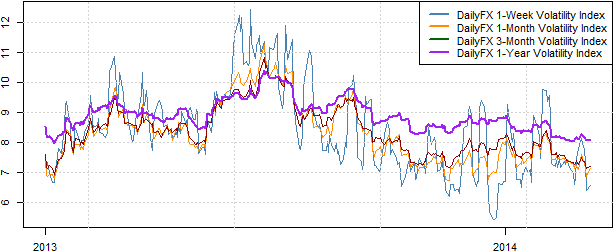

## Table of Contents

## What is trendless trading?

Trendless trading is a way of trading where the price of something, like a stock or a currency, doesn't go up or down in a clear direction for a while. Instead, it moves sideways within a certain range. Traders who use this method look for small price changes within this range to make quick profits. They buy when the price is low and sell when it's a bit higher, but still within the same range.

This type of trading can be good because it doesn't need big market moves to make money. It's all about being patient and watching the market closely. However, it can also be tricky because the small price changes might not be enough to cover the costs of trading, like fees. So, trendless trading works best for people who are good at spotting these small changes and can trade often without losing too much money on fees.

## How does market volatility affect trendless trading?

Market volatility can make trendless trading harder. When the market is very volatile, prices can jump around a lot. This means the price might suddenly move out of the range that a trendless trader is used to. If the price goes too high or too low, the trader might lose money because they were expecting the price to stay within a certain range.

On the other hand, some traders might see high volatility as a chance to make more money. If they are quick and good at spotting when the price is about to move back into the range, they can buy or sell at the right times. But this is risky because the market can be unpredictable, and it takes a lot of skill and attention to do well in a volatile market.

## What are the key indicators used in trendless trading?

In trendless trading, traders often use a few key indicators to help them decide when to buy or sell. One important indicator is the Bollinger Bands. These are lines drawn on a price chart that show the highest and lowest prices a stock or currency has been at recently. When the price stays between these lines, it means the market is moving sideways, which is good for trendless trading. Traders look for the price to touch the lower band as a signal to buy, and the upper band as a signal to sell.

Another useful indicator is the Relative Strength Index (RSI). The RSI helps traders see if a stock or currency is overbought or oversold. If the RSI is below 30, it means the price might be too low and could go up soon, so it's a good time to buy. If it's above 70, the price might be too high and could go down, so it's a good time to sell. This helps trendless traders find the best times to make their trades within the range.

The Moving Average Convergence Divergence (MACD) is also helpful. It shows the relationship between two moving averages of a stock's price. When the MACD line crosses above the signal line, it can be a sign to buy, and when it crosses below, it can be a sign to sell. Trendless traders use this to spot small changes in the price direction within the range, helping them make quick trades to earn small profits.

## Can you explain the concept of a sideways market?

A sideways market is when the price of something, like a stock or a currency, doesn't go up or down a lot. Instead, it moves back and forth within a certain range. Imagine a ball bouncing between two lines on a chart. The ball doesn't go above the top line or below the bottom line, it just keeps bouncing in between. This is what happens in a sideways market. Traders who like this kind of market look for chances to buy when the price is near the bottom of the range and sell when it's near the top.

In a sideways market, the price might seem boring because it's not making big moves. But for some traders, this can be a good thing. They can make money by making lots of small trades within the range. They need to be patient and watch the market closely to spot the right times to buy and sell. If they do it right, they can make small profits over and over again. But they also need to be careful because the costs of trading, like fees, can eat into their profits if they're not careful.

## What strategies are effective in a trendless market?

In a trendless market, one effective strategy is range trading. This means buying when the price is near the bottom of the range and selling when it's near the top. Traders watch the price closely and use tools like Bollinger Bands to see where the range is. They wait for the price to hit the lower part of the range, then buy, hoping it will go up a bit. When it gets to the top of the range, they sell, making a small profit. This strategy works well because it doesn't need big price moves, just small ones within the range.

Another strategy is using the Relative Strength Index (RSI). The RSI helps traders see if a stock or currency is overbought or oversold. If the RSI is below 30, it means the price might be too low and could go up soon, so it's a good time to buy. If it's above 70, the price might be too high and could go down, so it's a good time to sell. By watching the RSI, traders can find the best times to make their trades within the range, making small profits from these moves.

A third strategy involves using the Moving Average Convergence Divergence (MACD). This tool shows the relationship between two moving averages of a stock's price. When the MACD line crosses above the signal line, it can be a sign to buy, and when it crosses below, it can be a sign to sell. Trendless traders use this to spot small changes in the price direction within the range, helping them make quick trades to earn small profits. By combining these strategies, traders can take advantage of the small price movements in a trendless market.

## How do traders identify a trendless market?

Traders identify a trendless market by looking at how the price moves over time. They watch the price on a chart and see if it stays between two lines without going up or down a lot. If the price keeps bouncing back and forth within this range, it means the market is moving sideways. Traders use tools like Bollinger Bands to help them see this range. If the price stays inside the Bollinger Bands for a while, it's a good sign that the market is trendless.

Another way traders spot a trendless market is by using the Relative Strength Index (RSI). The RSI shows if a stock or currency is overbought or oversold. In a trendless market, the RSI will often move between 30 and 70 without going too high or too low for long. This tells traders that the price is not making big moves, just small ones within a range. By watching these indicators, traders can tell if the market is trendless and plan their trades accordingly.

## What are the risks associated with trading in a volatile, trendless market?

Trading in a volatile, trendless market can be risky because the price can suddenly jump out of the range that traders expect. When the market is very volatile, the price might go up or down a lot in a short time. This means that if a trader buys when the price is low, hoping it will go up a bit, the price might instead drop even lower. This can lead to big losses if the trader is not ready for these sudden moves. It's hard to predict what will happen next in a volatile market, so traders need to be very careful and quick to react.

Another risk is that the costs of trading, like fees, can eat into the small profits that traders make in a trendless market. Since the price moves are small, the profits from each trade are also small. If a trader makes a lot of trades to try to make money, the fees can add up and might be more than the profits. This means that even if a trader is good at spotting the right times to buy and sell, they might still lose money because of the costs. So, traders need to think about these costs and make sure their profits are big enough to cover them.

## How can one manage risk when engaging in trendless trading?

Managing risk in trendless trading means being careful and having a plan. One way to do this is by setting stop-loss orders. A stop-loss order is like a safety net that tells your trading platform to sell your stock if the price drops too much. This can help you avoid big losses if the price suddenly goes out of the range you expect. Another way to manage risk is by not putting all your money into one trade. Instead, spread your money out over different trades. This way, if one trade goes wrong, you won't lose everything.

It's also important to keep an eye on the costs of trading, like fees. Since the profits from trendless trading are usually small, these fees can eat into your earnings. To manage this, try to keep your trading costs low by choosing a platform with low fees. Also, be patient and don't trade too often. Wait for the right moments to buy and sell, so you can make more money from each trade. By being careful and having a good plan, you can manage the risks of trendless trading and hopefully make some profits.

## What role does technical analysis play in trendless trading?

Technical analysis is really important in trendless trading. It helps traders see where the price is likely to go next, even if it's just moving sideways. Traders use tools like Bollinger Bands to find the range the price is moving in. If the price stays inside these bands, it means the market is trendless. They also use the Relative Strength Index (RSI) to see if the price is too high or too low. If the RSI is below 30, it might be a good time to buy because the price could go up soon. If it's above 70, it might be a good time to sell because the price could go down. By watching these indicators, traders can find the best times to make their trades and make small profits.

Another tool traders use is the Moving Average Convergence Divergence (MACD). This helps them spot small changes in the price direction within the range. When the MACD line crosses above the signal line, it can be a sign to buy, and when it crosses below, it can be a sign to sell. By using these technical analysis tools, traders can make better decisions about when to buy and sell in a trendless market. This helps them manage their trades carefully and hopefully make some money, even when the market isn't making big moves.

## How do advanced traders use options in a trendless market?

Advanced traders use options in a trendless market to make money from small price changes. They might use a strategy called a "straddle," where they buy both a call option and a put option at the same time. This means they can make money if the price goes up a little or down a little. They do this because in a trendless market, the price doesn't move a lot, so they need a way to make money from these small moves. By using options, they can make a profit no matter which way the price goes, as long as it moves enough to cover the cost of the options.

Another way advanced traders use options in a trendless market is by selling options. They might sell a call option and a put option at the same time, which is called a "strangle." This strategy works well in a trendless market because the price is likely to stay within a certain range. If the price doesn't move out of this range, the options they sold will expire worthless, and they keep the money they got from selling them. This can be a good way to make money in a market that isn't going up or down a lot, but it's risky because if the price does move a lot, they could lose money.

## What are some common mistakes beginners make in trendless trading?

One common mistake beginners make in trendless trading is not understanding the range well enough. They might think the price will stay in the same range forever, but it can suddenly move out of it. This can lead to big losses if they're not ready for it. Beginners also often trade too much, trying to catch every small move in the price. This can be a problem because the costs of trading, like fees, can add up and eat into their small profits. They need to be patient and wait for the right times to buy and sell.

Another mistake is not using stop-loss orders. A stop-loss order can help protect them from big losses if the price suddenly goes down. Without it, they might lose more money than they planned. Beginners also sometimes forget to look at the bigger picture. They focus too much on small price changes and don't see when the market might be starting to move in a new direction. By keeping an eye on the bigger trends, they can make better decisions and avoid getting caught in a market that's starting to change.

## How can algorithmic trading be optimized for trendless and volatile markets?

Algorithmic trading can be optimized for trendless and volatile markets by using strategies that focus on small price changes and quick reactions. In a trendless market, algorithms can be set up to buy and sell within a certain range, using tools like Bollinger Bands to identify this range. The algorithm watches the price closely and makes trades when it hits the lower or upper part of the range. This way, it can make small profits from these small moves. In volatile markets, the algorithm needs to be quick to react to sudden price changes. It can use stop-loss orders to limit losses if the price moves out of the expected range. By adjusting the algorithm to be more sensitive to these quick changes, it can take advantage of the volatility and make trades at the right times.

Another way to optimize algorithmic trading in these markets is by using multiple indicators to make better decisions. For example, the algorithm can use the Relative Strength Index (RSI) to see if the price is overbought or oversold, and the Moving Average Convergence Divergence (MACD) to spot small changes in the price direction. By combining these indicators, the algorithm can make more accurate predictions about when to buy and sell. It's also important to keep an eye on trading costs, like fees, because the profits from trendless trading are usually small. By setting the algorithm to trade less often but at the right times, it can help keep these costs down and make more money overall.

## References & Further Reading

[1]: Bergstra, J., Bardenet, R., Bengio, Y., & Kégl, B. (2011). ["Algorithms for Hyper-Parameter Optimization."](https://dl.acm.org/doi/10.5555/2986459.2986743) Advances in Neural Information Processing Systems 24.

[2]: ["Advances in Financial Machine Learning"](https://www.amazon.com/Advances-Financial-Machine-Learning-Marcos/dp/1119482089) by Marcos Lopez de Prado

[3]: ["Evidence-Based Technical Analysis: Applying the Scientific Method and Statistical Inference to Trading Signals"](https://www.amazon.com/Evidence-Based-Technical-Analysis-Scientific-Statistical/dp/0470008741) by David Aronson

[4]: ["Machine Learning for Algorithmic Trading"](https://github.com/stefan-jansen/machine-learning-for-trading) by Stefan Jansen

[5]: ["Quantitative Trading: How to Build Your Own Algorithmic Trading Business"](https://github.com/LucindaYa/quant-resources/blob/master/Quantitative%20Trading%20How%20to%20Build%20Your%20Own%20Algorithmic%20Trading%20Business.pdf) by Ernest P. Chan