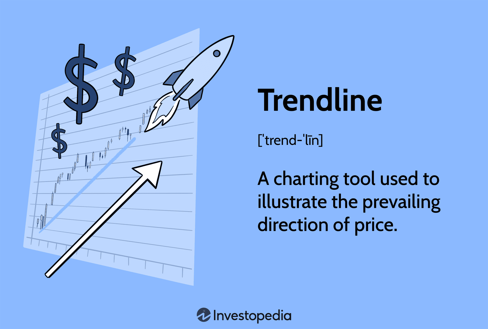

Investing trendlines are graphical representations of price movements in financial markets, constructed by connecting a series of data points, typically price highs or lows. These lines help traders and analysts discern the underlying direction of the market—whether upward, downward, or sideways—and are fundamental tools in technical analysis. Trendlines are significant as they aid in identifying market trends and potential reversal points, offering insights for strategic financial decisions. They are simple yet powerful, providing a visual indication of market sentiment and trajectory, which can be crucial for timing trades and managing risk.

Algorithmic trading, often referred to as "algo trading," uses complex algorithms to automate trading strategies based on predefined criteria. This approach has gained prominence due to its ability to handle large volumes of trades with speed and precision, minimizing human error and emotional bias. Integrating trendline analysis into algorithmic trading enables the automation of strategies that can identify and act on market trends efficiently. This synergy leverages the predictive power of trendlines and the execution strength of algorithms, enhancing decision-making processes in a fast-paced investment environment.



In today's investment landscape, data-driven decision-making is increasingly vital. The sheer volume of market data available necessitates sophisticated tools and methods to process and analyze it effectively. By combining trendline analysis with algorithmic trading, investors can harness the power of data analytics to refine their strategies and optimize performance. This integration exemplifies the growing reliance on quantitative analysis and technological advancements in finance.

This article aims to provide readers with an in-depth understanding of how trendlines can be seamlessly incorporated into algorithmic trading strategies. By exploring the concepts, tools, and techniques at the intersection of these two disciplines, readers will gain practical insights into enhancing their trading approaches. We will discuss the nuances of trendline identification, the mechanics of algorithmic trading, and how these elements converge to offer a robust framework for informed investment decisions.

The discussion will include an overview of the tools and methods involved in trendline-based algorithmic trading. These will range from basic technical analysis software for plotting trendlines to complex algorithmic trading platforms that facilitate the execution of automated strategies. Through examples and case studies, we aim to equip readers with the knowledge to navigate the challenges and opportunities of integrating trendline analysis with algorithmic trading.

## Table of Contents

## Understanding Trendlines in Financial Analysis

Trendlines are fundamental tools in technical analysis used to identify and visualize the direction and strength of a market trend. By drawing lines that connect specific data points on a financial chart, such as prices or indices, analysts can infer potential movement patterns and make informed predictions about future market behaviors.

### Types of Trendlines

1. **Upward Trendlines**: These lines are drawn by connecting successive higher lows in a market, forming an ascending slope. They indicate a bullish trend, suggesting that the asset's price is likely to continue rising as demand surpasses supply.

2. **Downward Trendlines**: Constructed by linking consecutive lower highs, downward trendlines create a descending trajectory. They signify a bearish market, where supply exceeds demand, often leading to price declines.

3. **Sideways Trendlines**: Also known as horizontal trendlines, these occur when the market experiences little to no overall directional movement, indicating a range-bound market. Prices move within a horizontal band, reflecting a state of equilibrium between buying and selling forces.

### Identifying Market Trends and Turning Points

Trendlines serve as a visual tool to foresee potential market trends and reversals. When an asset's price consistently tests and respects a trendline, it underscores the strength of the prevailing trend. Conversely, a breach in the trendline could signal a change in market dynamics, alerting traders to potential trend reversals. This ability to highlight zones of support and resistance is instrumental for traders in executing timely entry and [exit](/wiki/exit-strategy) strategies.

### Methods for Drawing Trendlines

Accurate trendline drawing often requires practice and precision. The basic method involves:

- **Selecting Significant Peaks and Troughs**: To draw an upward trendline, connect the lowest low with the successive higher lows. For a downward trendline, join the highest high with consecutive lower highs.
- **Using Multiple Time Frames**: Analyzing different durations can provide a more comprehensive picture of the trend, confirming its validity across varied contexts.
- **Adjusting for False Breakouts**: At times, sharp price movements might erroneously break a trendline. By employing moving averages or additional technical indicators alongside trendlines, traders can filter out noise and avoid premature conclusions.

### Examples of Trendline Usage in Market Analysis

Historical analyses provide numerous instances where trendlines effectively guided market insights. For instance, during the 2008 financial crisis, many stocks exhibited clear downward trendlines, signaling extended periods of declination. Skilled chartists utilized these lines to anticipate potential recovery points when prices eventually broke upward through established trendlines. Similarly, between 2009 and 2020, the S&P 500 demonstrated a prominent upward trendline, which analysts used as a benchmark for support throughout the bull market run.

Trendlines are indispensable for traders and analysts aiming to decipher market patterns. Their strategic application allows for a nuanced understanding of market movements, enabling informed decision-making and strategic planning in financial markets.

## The Role of Algorithmic Trading

Algorithmic trading, often referred to as algo trading, involves the use of computer programs to execute trades at high speeds and [volume](/wiki/volume-trading-strategy), which would be impossible for a human trader. It emerged in the late 20th century with advancements in computing and networking technology, allowing traders to leverage algorithms to capitalize on market inefficiencies. As the financial markets evolved, so did [algorithmic trading](/wiki/algorithmic-trading), gaining essential features such as improved data analysis and more complex decision-making frameworks.

The primary benefits of using algorithms in trading are speed, efficiency, and accuracy. Algorithms can process vast amounts of market data within milliseconds and make predetermined decisions based on that data. This ability to act quickly is crucial in fast-paced financial markets where tiny price differences can lead to significant profit margins. For instance, algorithms can periodically monitor stock prices and execute trades when certain criteria are met—something human traders cannot achieve manually in real-time.

Enhancing trendline analysis with algorithmic trading is an innovative approach to market analysis. Trendlines—tools used to identify and visualize trends in market data—can be algorithmically analyzed to predict market movements. By automating this analysis, algorithms can detect subtle market patterns and make precise predictions. For example, an algorithm may be programmed to recognize when a stock's price breaks a significant trendline and execute either buy or sell orders based on this event.

The infrastructure behind algorithmic trading consists of sophisticated technology frameworks that include advanced computing platforms, high-speed internet, and access to real-time market data. Trading algorithms are typically built using programming languages like Python, C++, or Java due to their computational efficiency and versatility. These languages support libraries and frameworks that facilitate complex data handling and analysis, essential for developing robust trading models.

Considerable research and various case studies have illustrated the success of algorithmic trading strategies that incorporate trendline analysis. One prominent example is the use of a simple moving average crossover strategy in identifying trend reversals. When a short-term moving average crosses above a long-term moving average, it may trigger a buy signal. Algorithms can be programmed to execute these trades in milliseconds, optimizing the entry and exit points for maximized returns.

```python
import pandas as pd
import numpy as np

def moving_average_strategy(prices, short_window, long_window):
    signals = pd.DataFrame(index=prices.index)
    signals['signal'] = 0.0

    # Create short simple moving average
    signals['short_mavg'] = prices.rolling(window=short_window, min_periods=1, center=False).mean()

    # Create long simple moving average
    signals['long_mavg'] = prices.rolling(window=long_window, min_periods=1, center=False).mean()

    # Create signals
    signals['signal'][short_window:] = np.where(signals['short_mavg'][short_window:] 
                                                > signals['long_mavg'][short_window:], 1.0, 0.0)   

    # Generate trading orders
    signals['positions'] = signals['signal'].diff()

    return signals
```

This Python code implements a basic moving average strategy that could be part of a larger algorithmic system analyzing trendlines. It illustrates the intersection of trendline analysis and algorithmic execution—a combination leading to strategic market insights and potentially profitable trades.

In summary, algorithmic trading represents a critical evolution in the financial markets, enhancing traditional analytical methods like trendline analysis with automation and computational precision. The technology and infrastructure underpinning algorithmic trading provide a powerful framework for executing complex strategies, often resulting in improved trading performance. However, successful application requires meticulous design, testing, and implementation of these algorithms.

## Integrating Trendline Analysis with Algorithmic Trading

Integrating trendline analysis with algorithmic trading involves a methodical approach that enhances decision-making efficiency and precision in trading. To effectively combine these two practices, traders and developers must carefully calibrate their algorithms to identify and act on trendlines, thus leveraging the insights these trendlines provide to automate trading decisions. 

### Technical Considerations

When calibrating algorithms to recognize and act on trendlines, several technical considerations must be addressed:

1. **Data Set and Time Frame Selection:** Accurate trendline analysis requires high-quality historical price data. Algorithms should be programmed to select appropriate data sets, considering the desired time frame—whether intraday, daily, weekly, or monthly—based on the trading strategy.

2. **Trendline Identification Algorithms:** Algorithms need reliable methods to identify trendlines accurately. These methods usually involve statistical techniques like linear regression or moving averages to detect upward, downward, or sideways trends. For instance, the slope of the trendline can be calculated to determine the strength and direction of a trend.

3. **Threshold Settings:** It is crucial to set thresholds for entry and exit points. These thresholds often depend on variations in trendline slopes and deviations in price movement, which help in minimizing false signals.

4. **Performance Optimization:** The algorithm’s performance should be continuously monitored and optimized. This includes fine-tuning parameters to align with changing market conditions and ensuring minimal latency in execution.

### Examples of Popular Algorithms

Several algorithms are widely used in trendline-based trading systems:

- **Mean Reversion Algorithms:** These use the belief that prices and returns eventually revert to their long-term mean. When prices deviate significantly from this mean, the algorithm triggers a trade.

- **Momentum-Based Algorithms:** These algorithms focus on buying assets that are trending up and selling those trending down, based on identified trendlines and their strength.

- **Breakout Algorithms:** These algorithms execute trades when the price breaks above or below a trendline, suggesting a potential price movement in that direction.

### Challenges and Pitfalls

The integration of trendline analysis with algorithmic trading presents several challenges:

- **Misidentification of Trends:** Algorithms may sometimes misinterpret data, resulting in the incorrect identification of trendlines, which can lead to erroneous trades.

- **Market Volatility:** In highly volatile markets, trendline analysis can become less reliable. Algorithms need to adjust quickly to rapid changes in trend direction to avoid large losses.

- **Overfitting:** Excessively optimizing an algorithm for historical data might result in overfitting, where the model performs well on past data but fails to adapt to future market conditions.

### Guidelines for Backtesting and Optimization

1. **Robust Backtesting Framework:** Utilize comprehensive backtesting frameworks to simulate trades using historical data. This helps in understanding how the algorithm would have performed under past market conditions.

2. **Parameter Variation:** Experiment with a variety of parameter settings to find the optimal combinations that balance profitability and risk.

3. **Walk Forward Analysis:** Use walk forward analysis to validate the stability and adaptability of the algorithm over successive periods.

4. **Performance Metrics:** Employ performance metrics such as Sharpe ratio, maximum drawdown, and profit factor to evaluate the algorithm’s efficacy and risk levels.

By addressing these technical considerations, leveraging popular algorithms, and carefully managing potential challenges, investors can effectively integrate trendline analysis with algorithmic trading to gain a competitive edge in the financial markets.

## Benefits and Risks Associated with Trendline Algo Trading

Trendline-based strategies within algorithmic trading present several advantages. Primarily, they allow for the automation of trading decisions by systematically identifying and exploiting market trends. This automation ensures consistent application of strategies without the interference of emotional biases, enabling traders to execute trades with precision and speed. An algorithm can process vast amounts of data much faster than a human, recognizing patterns and executing trades in split seconds, crucial in fast-moving markets. Furthermore, the ability to backtest trendline strategies against historical data enables traders to refine and optimize their approaches before deploying them in live markets.

Despite these advantages, there are inherent risks in trendline algo trading. One significant risk is market [volatility](/wiki/volatility-trading-strategies), which can obscure real trends and lead to misidentifications, potentially resulting in erroneous trades. Algorithms might also "overfit" to historical data, making them less effective in unforeseen market conditions. Additionally, there is the danger of false trend recognition, where algorithms may interpret noise as genuine trends, leading to poor trading decisions.

To address these risks, various risk management techniques can be deployed. Diversification is a foundational strategy, spreading capital over different assets to minimize exposure to any single market's volatility. Implementing stop-loss orders can also help limit potential losses in case a trend reverses unexpectedly. Furthermore, ongoing monitoring and recalibration of algorithms are vital to ensure they remain effective in dynamic market environments.

In terms of regulatory considerations, algorithmic traders must comply with various regulations designed to maintain market stability and integrity. Regulators such as the U.S. Securities and Exchange Commission (SEC) and the European Securities and Markets Authority (ESMA) have established frameworks that govern the development and deployment of trading algorithms, including requirements for testing, risk management, and reporting.

Finally, successful engagement in trendline algorithmic trading requires a specific mindset and preparation. Traders must be committed to continuous learning and adaptation, as market conditions and technologies evolve rapidly. A robust understanding of both financial markets and the technical aspects of algorithm development is essential. Additionally, traders should maintain a disciplined approach, balancing reliance on algorithmic precision with human oversight to adjust strategies as needed. Skilled traders remain flexible, ready to recalibrate algorithms in response to new data and insights, ensuring they are well-prepared to navigate the complexities of algo trading.

## Future Trends in Trendline Financial Analysis and Algo Trading

The landscape of trendline financial analysis and algorithmic trading is experiencing rapid evolution, propelled by technological advancements and shifts in market dynamics. These innovations promise to enhance the precision and effectiveness of trading strategies, offering investors new ways to harness financial data. This section explores the future directions in trendline analysis technology, algorithmic trading innovations, and the emerging market factors influencing these practices.

### Advancements in Trendline Analysis Technology and Methodology

Recent developments in trendline analysis are focused on improving accuracy and adaptability through enhanced computational tools and techniques. New methods incorporate real-time data processing to offer more dynamic and responsive analysis. Machine learning algorithms are being developed to automatically identify and adjust trendlines based on vast datasets, allowing for more nuanced understanding of market movements. These innovations are set to refine the predictive capabilities of trendlines, especially as they integrate with multifaceted trading platforms.

### AI, Machine Learning, and the Future of Algorithmic Trading

The application of [artificial intelligence](/wiki/ai-artificial-intelligence) (AI) and [machine learning](/wiki/machine-learning) (ML) is poised to revolutionize algorithmic trading. These technologies enable algorithms to continually learn from large datasets, recognize patterns, and optimize trading strategies. By leveraging neural networks and [deep learning](/wiki/deep-learning) methods, algorithms can predict asset price movements with greater accuracy. Python libraries such as TensorFlow and PyTorch are commonly used for developing and training such models.

Below is an example of a simple Python function utilizing machine learning to predict stock prices using a trendline feature:

```python
import numpy as np
from sklearn.linear_model import LinearRegression

# Generate example data
time = np.arange(100)
prices = np.random.normal(0, 1, size=100).cumsum() + 50

# Fit a linear trendline
model = LinearRegression()
model.fit(time.reshape(-1, 1), prices)

# Predict future prices
future_time = np.arange(100, 110)
predicted_prices = model.predict(future_time.reshape(-1, 1))
```

### Emerging Market Factors Influencing Trendlines and Trading Algorithms

Volatility in global markets, escalating economic uncertainties, and the rapid integration of emerging economies are significantly impacting trendlines and the performance of trading algorithms. Market factors such as geopolitical tensions, regulatory changes, and environmental concerns are increasingly influencing asset prices and trend patterns. Algorithms need to evolve to account for these factors, incorporating broader datasets and diverse indicators to maintain relevance and accuracy.

### Role of Big Data and Analytics

The role of big data is pivotal in shaping the future of trendline analysis and algorithmic trading. The availability of extensive datasets allows for more comprehensive analysis and testing of trading models. Advanced analytics, including sentiment analysis from news and social media, can enrich trendline insights, providing a more holistic market view. Implementing cloud-based data solutions also enhances computational capabilities, enabling real-time analysis and rapid execution of trades.

### Expert Opinions and Industry Forecasts

Industry experts anticipate that the continued integration of AI and big data will dramatically transform both trendline analysis and algorithmic trading. There is consensus that as technology advances, trading systems will become increasingly autonomous while maintaining an ability to adapt to evolving market conditions. Analysts predict a future where collaborative efforts between human insight and automated systems will define successful investment strategies. This fusion promises to not only maximize returns but also mitigate risks associated with unpredictable market shifts.

In summary, the future of trendline financial analysis and algorithmic trading lies in the synergistic application of cutting-edge technologies and comprehensive market intelligence. As these industries evolve, they offer sophisticated tools that empower investors to navigate the complexities of the modern financial landscape with confidence.

## Conclusion

Trendlines have long been fundamental to financial analysis, offering clear visual guidance about market trends, potential turning points, and [momentum](/wiki/momentum). Their integration into algorithmic trading systems marks a significant advancement in trading strategies. This combination allows for the automation of decisions and executions based on trendline data, increasing both precision and efficiency.

The key benefits of this integration include enhanced analysis accuracy and trading speed, which can lead to improved profitability. Algorithms can swiftly process vast amounts of historical and real-time data, drawing and adjusting trendlines automatically, thus benefitting from a data-driven approach that minimizes human error. Moreover, the use of algorithms enables traders to backtest strategies over historical data to optimize performance.

However, potential challenges exist, such as the risk of algorithms misjudging market conditions due to unexpected volatility or misidentified trends. It is crucial to maintain robust risk management frameworks to mitigate these downsides, alongside regular monitoring and adjustment of the algorithmic strategies employed.

The delicate balance between human insight and algorithmic precision cannot be overstated. While algorithms excel in speed and data processing, human intuition and understanding of broader economic contexts remain valuable. Traders should strive to harness the synergy of these approaches for optimal results.

As trading technology rapidly evolves, it is essential for investors to remain informed and adaptable. Staying up-to-date with emerging tools, trends, and regulatory requirements is critical. Investors are encouraged to explore further educational resources and training opportunities to deepen their understanding of trendline and algorithmic trading. Such knowledge will be indispensable as they navigate the increasingly data-driven world of finance.

## References & Further Reading

[1]: Bergstra, J., Bardenet, R., Bengio, Y., & Kégl, B. (2011). ["Algorithms for Hyper-Parameter Optimization."](https://papers.nips.cc/paper/4443-algorithms-for-hyper-parameter-optimization) Advances in Neural Information Processing Systems 24.

[2]: ["Advances in Financial Machine Learning"](https://www.amazon.com/Advances-Financial-Machine-Learning-Marcos/dp/1119482089) by Marcos Lopez de Prado

[3]: ["Evidence-Based Technical Analysis: Applying the Scientific Method and Statistical Inference to Trading Signals"](https://www.amazon.com/Evidence-Based-Technical-Analysis-Scientific-Statistical/dp/0470008741) by David Aronson

[4]: ["Machine Learning for Algorithmic Trading"](https://github.com/stefan-jansen/machine-learning-for-trading) by Stefan Jansen

[5]: ["Quantitative Trading: How to Build Your Own Algorithmic Trading Business"](https://www.amazon.com/Quantitative-Trading-Build-Algorithmic-Business/dp/1119800064) by Ernest P. Chan