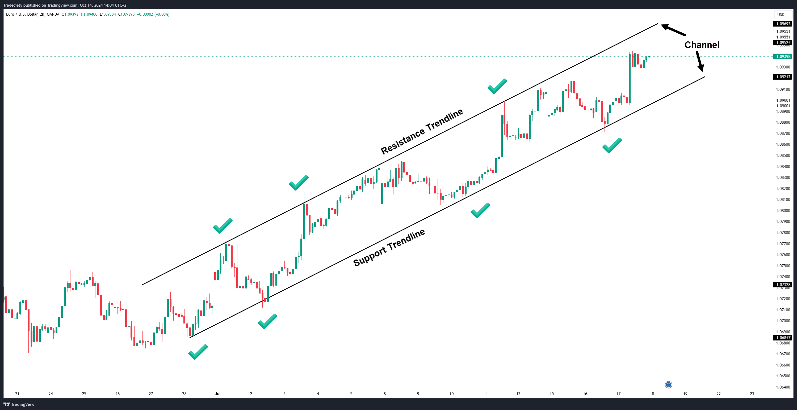

The evolution of trading strategies has increasingly emphasized technical analysis tools, with trendlines emerging as a powerful yet often underutilized resource for traders. Trendlines provide a simple yet effective method to determine the general direction of a market, highlighting areas of potential support or resistance where price movement may slow or reverse. Within this article, we examine trendline trading strategies in detail, particularly their application in the context of algorithmic trading. 

Trendlines assist traders by illustrating the direction and momentum of price movements, which is key in executing informed and timely trading decisions. By tracing these diagonal lines across a price chart, traders can identify trends in uptrends, downtrends, or even sideways moving markets. These visual cues can be pivotal for traders aiming to spot breakouts or potential reversal points, thus offering significant insights into market behavior. Understanding these dynamics is crucial, as it underpins one's ability to predict future market movements based on historical price patterns.



In recent years, algorithmic trading has gained significant traction. Its rise is attributed to its ability to execute trades at lightning speed based on predefined criteria, and trendline-based strategies seamlessly fit into this technological advancement. Algorithmic systems can be programmed to automatically detect trendline patterns and react to price actions, minimizing emotional biases that often impair human traders. This capability not only enhances precision but also enables the consistent application of a trading strategy in volatile markets.

Integrating trendline strategies within an algorithmic trading framework involves several considerations. These include the automatic identification of trendlines, accuracy in pinpointing breakouts or bounces, and the application of these strategies in real-time market conditions. The systematic approach afforded by algorithms can transform the way traders engage with the market, improving both the effectiveness and profitability of their trading endeavors.

This guide aims to explore the subtleties of incorporating trendline strategies into algorithmic trading. By understanding how to systematically apply these principles, traders can refine their systems to better navigate the complexities of the financial markets.

## Table of Contents

## What is a Trendline Trading Strategy?

A trendline trading strategy employs a diagonal line drawn across price charts to identify the direction of a price movement or trend. This technique is pivotal in technical analysis, providing traders with a visual representation of market dynamics. Trendlines are essential in detecting significant market events such as breakouts, bounces, and reversals. They function as dynamic support and resistance levels, helping traders interpret areas where price movements might halt or change direction.

When trendlines are applied effectively, they can enhance a trading system by pinpointing entry and [exit](/wiki/exit-strategy) points. This ability to offer crucial insights into potential market movements makes them a valuable tool. For example, during an uptrend, a trendline can be drawn connecting consecutive higher lows, while in a downtrend, the line connects successive lower highs. In a range-bound market condition, trendlines are used to describe both support and resistance, indicating where the price fluctuates within a horizontal boundary.

The power of trendline trading lies in its focus on predicting future price movements through the analysis of historical price action patterns. Traders often examine past behaviors to forecast potential price directions. This strategy categorizes trendlines into uptrend, downtrend, and range-bound, each mirroring different market conditions.

1. **Uptrend Line:** This is drawn to connect a series of ascending lows, signaling that the trading instrument's price is moving upward.
2. **Downtrend Line:** Conversely, this connects descending highs, indicating a decline in the trading instrument's price.
3. **Range-bound Trendlines:** These parallel lines confine price action within a horizontal pattern, reflecting stability in price movement without a distinct directional trend.

Understanding and utilizing trendlines can guide traders in developing robust trading strategies tailored to various market environments. To effectively use trendlines, traders must analyze price data with accuracy, recognizing key pivot points that define a trend's structural integrity. This might involve creating formulas or algorithms for automatic trendline detection. In Python, for instance, libraries such as `pandas` and `matplotlib` can assist in visualizing price data and computing trendlines systematically. Below is a simple example of plotting a trendline using Python:

```python
import pandas as pd
import numpy as np
import matplotlib.pyplot as plt
from statsmodels.api import OLS

# Sample data: Simulating a price series
np.random.seed(0)
dates = pd.date_range('2023-01-01', periods=100)
price = np.random.normal(loc=100, scale=1, size=len(dates)).cumsum()

# Create a DataFrame
df = pd.DataFrame({'Price': price}, index=dates)

# Calculate an example trendline using ordinary least squares regression
x = np.arange(len(df))
y = df['Price']
trendline = OLS(y, np.c_[x, np.ones(len(x))]).fit().predict(np.c_[x, np.ones(len(x))])

# Plot prices and trendline
plt.figure(figsize=(10, 5))
plt.plot(df.index, df['Price'], label='Price')
plt.plot(df.index, trendline, label='Trendline', linestyle='--')
plt.title('Price Trend with Trendline')
plt.legend()
plt.show()
```

This code snippet simulates a price series, calculates a simple trendline using linear regression, and plots the resulting trend. By using such tools, traders can refine their strategies, improving their ability to predict price movements and enhancing their trading success.

## Examples of Trendline Trading Strategies

There are several methodologies in trading that leverage trendlines to aid in strategic decision-making. These approaches range from straightforward [trend following](/wiki/trend-following) to more complex strategies that involve multiple technical analysis tools. Here, we discuss some of the most common trendline trading strategies:

- **Trend-following strategies:** This approach involves entering trades in the direction of an existing trend when a breakout occurs. Traders may identify an uptrend by drawing a trendline connecting a series of higher lows. As price breaks above this line during a period of consolidation, it signals a continuation of the trend and a potential buying opportunity. Conversely, in a downtrend, a breakout below a trendline of lower highs indicates a potential continuation of downward movement, suggesting a selling opportunity.

- **Trendline bounce strategies:** This method focuses on trading price bounces off trendline levels. When the price approaches a trendline but fails to break through, rebounding instead, it is known as a bounce. Traders often look for confirmation of the bounce using candlestick patterns, such as hammer or engulfing patterns, to affirm the direction of the trade.

- **Counter-trendline breakout strategy:** This strategy involves drawing short trendlines across pullbacks or retracements within a larger trend. When price breaks through these smaller trendlines in the direction of the primary trend, it suggests a resumption of the dominant trend, offering a potential entry signal. This approach is particularly useful in identifying entry points during corrections within long-standing trends.

- **Price channel strategy:** Price channels are created by drawing two parallel trendlines that encompass price activity. The upper trendline acts as resistance, and the lower trendline acts as support. Traders might look to buy near support and sell near resistance within the channel. Alternatively, a breakout beyond the channel can suggest a new trend direction, providing strategic entry or exit signals.

- **Trend reversal breakout strategy:** This approach aims to capture potential trend reversals by targeting breaches of established trendlines. When a price effectively breaks a trendline that has provided reliable support or resistance in the past, it can signal a change in trend direction. Traders using this strategy often monitor additional indicators or volume to confirm potential reversals, reducing the likelihood of false breakouts.

These strategies are built on the premise that trendlines can effectively help traders identify trends, reversal points, and potential entry and exit points based on historical price patterns. Integration with other technical tools and indicators can further enhance their reliability, ensuring better alignment with market conditions.

## Is Trendline Trading Effective?

Trendline trading can be highly effective, particularly for traders who emphasize price action. The effectiveness of this strategy largely hinges on the accurate application of trendlines and comprehensive [backtesting](/wiki/backtesting). While trendlines can visually show the direction of trends and highlight market [momentum](/wiki/momentum), their reliability is heavily influenced by the prevailing market conditions and the timeframe utilized. For example, longer timeframes might provide more stability in trendline analysis, whereas shorter timeframes can offer more opportunities for trade entries and exits, yet at a higher risk of false signals.

It's important to note the inherent subjectivity in identifying and drawing trendlines. This subjectivity can lead to varying interpretations among traders, thus underscoring the need for meticulous testing before approving any trendline strategy. Without proper validation through historical data, the risk of relying on potentially misleading signals increases significantly. Traders are advised to approach each identified trendline with caution, ensuring comprehensive backtesting is conducted to verify its validity.

Integrating trendline strategies with other analytical tools can substantially enhance their effectiveness. Technical indicators such as moving averages, relative strength index (RSI), or Bollinger Bands can offer additional confirmation signals or filter out false breakouts. Risk management techniques also play a crucial role, helping to mitigate the impact of faulty trades by defining clear stop-loss and take-profit levels. For instance, using a stop-loss based on a percentage of account equity or the average true range (ATR) can protect against excessive losses.

In conclusion, while trendline trading has the potential to be effective, its success is largely dependent on how well it is integrated with other strategies and disciplined risk management practices. Traders are encouraged to approach trendline analysis with a systematic methodology, combining both manual insight and automated tools where feasible to maximize reliability and performance.

## Implementing Trendline Strategies in Algo Trading

Algorithmic trading significantly enhances the implementation of trendline strategies by automating key decision-making processes, thus eliminating human emotional biases. This automation allows traders to execute precise entry and exit points based on predefined rules. Trendlines, which are essential in determining market trends and potential reversals, can be systematically incorporated into algorithmic models to offer traders an edge in the market.

To effectively automate trendline strategies, algorithms must be capable of accurately identifying and drawing trendlines. This involves using methods to evaluate market data and detect points of support and resistance. Breakouts and bounces from trendlines need to be analyzed in real-time, requiring algorithms to react swiftly to market conditions. Coding these strategies can present challenges due to the inherently subjective nature of visual trendline identification. However, employing [machine learning](/wiki/machine-learning) models or custom scripts can vastly improve the accuracy and execution of these patterns. For example, clustering algorithms can be used to group data points and identify significant trendlines.

Platforms that support API integration for real-time data access are crucial for algo traders using trendline strategies. These platforms allow for immediate response to market changes leveraging real-time data feeds, which help in executing trades as soon as a trendline [breakout](/wiki/breakout-trading) or bounce is detected. Python, with libraries such as TA-Lib for technical analysis, can be used to automate these processes. An example Python code snippet for identifying trendlines might look like this:

```python
import numpy as np
import pandas as pd

def detect_trendline(prices, window=20):
    # computes linear regression across 'window' frames
    x = np.arange(window)
    for start in range(len(prices) - window + 1):
        y = prices[start:start + window]
        A = np.vstack([x, np.ones(len(x))]).T
        m, c = np.linalg.lstsq(A, y, rcond=None)[0]
        # slope (m) and intercept (c) of the trendline
        trendline = m * x + c

        print(f"Trendline from {start} to {start + window - 1}: slope = {m}, intercept = {c}")
        # Further logic can identify if it defines a significant trendline
```

Risk management rules and thorough backtesting remain integral components in developing a robust algorithm-based trendline trading strategy. Backtesting involves running the strategy through historical data to assess its performance, helping to refine the algorithm and manage risk effectively. It ensures the strategy's empirical reliability before deployment in live trading.

Incorporating machine learning techniques can further enhance the robustness and precision of trendline strategies, adapting to the dynamic nature of markets. These advanced methods can forecast potential trends, allowing the strategies to adjust and evolve continuously based on the learned patterns. This ensures traders remain competitive and potentially more profitable within the [algorithmic trading](/wiki/algorithmic-trading) landscape.

## The Challenges of Backtesting Trendline Strategies

Backtesting trendline strategies poses several challenges due to the inherent subjectivity involved. Drawing trendlines often requires personal judgment, leading to inconsistencies and varying interpretations, which complicates the process of systematically evaluating trendline effectiveness. To address this, traders need sophisticated algorithms capable of evaluating historical price data and automating the identification of trendlines.

One significant challenge in backtesting is the subjective nature of trendline placement. Traders may draw trendlines based on different highs and lows, creating discrepancies in strategy testing. Developing systematic criteria and algorithms can help standardize trendline identification, reducing this subjectivity. For instance, programming algorithms to automatically detect significant peaks and troughs can offer consistency. This task, however, presumes a solid understanding of market dynamics and requires technical expertise.

Hindsight bias further complicates backtesting trendline strategies. This bias occurs when traders overestimate the predictability of trends after knowing the outcomes. It can lead to an overly optimistic assessment of strategy performance. Utilizing real-time data and objective rules can mitigate hindsight bias by providing a more realistic view of a strategy's success. Backtests should be conducted on out-of-sample data to ensure robustness, avoiding curve-fitting to past data.

Advanced coding and machine learning methods are increasingly employed to enhance the accuracy and reliability of backtesting. Machine learning models can be trained to detect trendlines by recognizing patterns in historical data. For example, using Python libraries such as TensorFlow or scikit-learn, one can build models that learn from vast datasets to better predict trendline interactions. These models can also be trained to refine strategies based on past performance, offering an adaptive approach to strategy development.

```python
import numpy as np
from sklearn.linear_model import LinearRegression

def detect_trendline(prices):
    # Simulate price data for trendline detection
    x = np.arange(len(prices)).reshape(-1, 1)
    model = LinearRegression().fit(x, prices)

    trend_pred = model.predict(x)
    return trend_pred

# Example usage
prices = np.array([10, 12, 15, 14, 17, 19, 18])  # Sample price data
trendline = detect_trendline(prices)
print(trendline)
```

By using such techniques, traders can build more reliable backtesting models that account for the complex nature of financial markets and reduce subjectivity in trendline drawing. Nevertheless, despite technological advancements, successful backtesting and implementation of trendline strategies still demand both computational and market expertise.

## Conclusion

Trendline trading strategies, when combined with algorithmic trading, represent an innovative approach that merges the precision of technical analysis with the speed and accuracy of automated trading. These strategies utilize the drawing of trendlines across price charts to detect the market's direction and potential pivot points. Despite their subjective nature—stemming from the individual discretion involved in drawing them—when effectively coded and backtested, trendline strategies can significantly improve market prediction and decision-making capabilities. A well-coded algorithm can execute trades with precision, making objective decisions based on predefined criteria, thus eliminating human biases and emotional trading mistakes.

Understanding both the strengths and challenges of trendline trading is crucial for traders aiming to succeed in dynamic markets. The primary strengths include the ability to identify and capitalize on trends, support, and resistance levels, and potential breakouts, which are essential for effective trading strategies. On the other hand, challenges include the subjective nature of trendline placement and the need for adaptive strategies to accommodate different market conditions and timeframes.

Future advancements in algorithms and machine learning are expected to further refine and enhance trendline trading strategies. As these technologies evolve, they will likely provide more robust tools for trendline detection and analysis, potentially making these strategies more accessible and accurate. Machine learning models, in particular, could be used to learn from historical data, recognizing patterns that humans might overlook and adapting more quickly to changing market dynamics. This could lead to more streamlined operations and high precision in trade execution, allowing traders to mitigate risks while maximizing profitability in increasingly complex and volatile market environments.

## FAQs

### FAQs

**What timeframe is best for trendline trading?**  
Trendline trading can be applied across various timeframes, but the choice largely depends on the trader's objectives and strategy. For longer-term strategies, daily and weekly charts are often preferred as they can filter out short-term market noise and provide a clearer view of the prevailing trend. Conversely, intraday traders might prefer 5-minute or 15-minute charts to capture shorter trend movements. It's crucial to recognize that longer timeframes tend to provide more reliable trendlines due to the inclusion of more data points.

**How can I automate trendline trading strategies?**  
Automating trendline trading strategies involves translating the strategies into a series of rules that an algorithm can execute. This requires programming skills, where traders use languages like Python to develop scripts capable of drawing trendlines and identifying breakouts or bounces. Here's a basic outline of the process:

```python
import pandas as pd
import numpy as np

def calculate_trendline(prices, start, end):
    x = np.arange(start, end)
    y = prices[start:end]
    poly_fit = np.polyfit(x, y, 1)
    return poly_fit

prices = np.random.rand(100)  # Replace with actual price data
trendline = calculate_trendline(prices, 0, 50)

# The slope and intercept can be used to project the trendline and determine entry/exit rules
```

Advanced systems may incorporate real-time data feeds through APIs and include machine learning models for better trendline detection and execution.

**How do I know if my trendline is broken?**  
A trendline is considered broken when the price closes beyond it. This breach needs to be confirmed, as intraday spikes can temporarily violate a trendline without indicating a true breakout. In algorithmic trading, this could be defined as:

```python
def is_trendline_broken(prices, trendline, current_price):
    slope, intercept = trendline
    expected_price = slope * len(prices) + intercept
    return current_price > expected_price  # or use < for downtrend line break
```

**What happens when a trendline is broken?**  
When a trendline is breached, it may signal a shift in market sentiment or trend reversal. This typically prompts traders to take action, such as closing current positions that are in line with the broken trend or initiating new positions in the direction of the breakout. However, false breakouts are common, so additional confirmation (e.g., increased [volume](/wiki/volume-trading-strategy) or secondary indicators) is advisable.

**Why do we use trendlines in trading strategies?**  
Trendlines are utilized because they visually assist traders in identifying the general direction and momentum of price movements. They act as dynamic support and resistance levels, helping traders anticipate potential price reactions at key levels. Incorporating trendlines into trading strategies can enhance market analysis, offering clearer entry and exit points based on historical price patterns.

**Can trendline strategies be profitable without automation?**  
Yes, trendline strategies can be profitable without automation; however, they require significant discipline and experience in manual monitoring and execution. Manual trading allows for the human element of judgment, which can be beneficial in ambiguous market scenarios. Nonetheless, automation offers advantages in speed, precision, and emotional neutrality, which are essential in volatile markets and for handling larger datasets consistently.

## References & Further Reading

[1]: Bergstra, J., Bardenet, R., Bengio, Y., & Kégl, B. (2011). ["Algorithms for Hyper-Parameter Optimization."](https://papers.nips.cc/paper/4443-algorithms-for-hyper-parameter-optimization) Advances in Neural Information Processing Systems 24.

[2]: ["Advances in Financial Machine Learning"](https://www.amazon.com/Advances-Financial-Machine-Learning-Marcos/dp/1119482089) by Marcos Lopez de Prado

[3]: ["Evidence-Based Technical Analysis: Applying the Scientific Method and Statistical Inference to Trading Signals"](https://www.amazon.com/Evidence-Based-Technical-Analysis-Scientific-Statistical/dp/0470008741) by David Aronson

[4]: ["Machine Learning for Algorithmic Trading"](https://github.com/stefan-jansen/machine-learning-for-trading) by Stefan Jansen

[5]: ["Quantitative Trading: How to Build Your Own Algorithmic Trading Business"](https://books.google.com/books/about/Quantitative_Trading.html?id=j70yEAAAQBAJ) by Ernest P. Chan