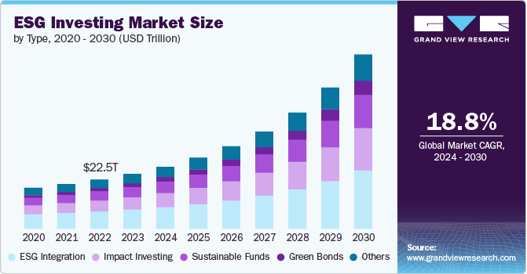

## Table of Contents

## What is ESG investing?

ESG investing is a way of choosing investments based on three main factors: Environment, Social, and Governance. It means that when people decide where to put their money, they think about how a company treats the planet, how it treats people, and how it is run. For example, they might look at if a company is trying to reduce pollution, if it treats its workers well, and if its leaders are honest and fair.

People use ESG investing because they want their money to help make the world a better place. They believe that companies that care about these things will do well in the long run. By choosing to invest in these companies, they hope to support good practices and also make a profit. It's a way to use money to vote for a better future for everyone.

## Why is ESG investing important?

ESG investing is important because it helps people make choices that are good for the world and good for their wallets. When people invest in companies that care about the environment, treat people well, and have good leaders, they are using their money to support positive changes. This can lead to a better future for everyone, with cleaner air and water, fair treatment of workers, and companies that are run honestly.

Also, [ESG](/wiki/esg-investing) investing can be a smart way to make money. Companies that focus on these areas often do well over time. They might save money by using less energy or by avoiding problems that come from treating people badly. They might also attract more customers who want to buy from companies that do good things. So, by choosing ESG investments, people can help make the world better and still earn a good return on their money.

## What are the main components of ESG?

The main components of ESG are Environment, Social, and Governance. Environment looks at how a company affects the natural world. This includes things like how much pollution it makes, how it uses energy, and if it tries to protect nature. Companies that do well in this area might use clean energy, recycle, and work to reduce their impact on the planet.

Social focuses on how a company treats people. This includes its workers, the community it's part of, and the people who buy its products. Good social practices might mean paying fair wages, making sure the workplace is safe, and helping the community. Companies that care about social issues often treat everyone with respect and try to make a positive difference in people's lives.

Governance is about how a company is run. It looks at things like who makes the big decisions, how honest the company is, and if it follows the rules. Good governance means having leaders who are fair and open about what they do. Companies with strong governance are often more trustworthy and less likely to get into trouble.

## How has the interest in ESG investing grown over the years?

Interest in ESG investing has grown a lot over the years. In the past, people mostly cared about making money from their investments. But now, more and more people want their money to help make the world a better place too. They see that companies that care about the environment, treat people well, and have good leaders can do well in the long run. This has made ESG investing more popular. Big investors like pension funds and banks are now looking at ESG factors when they choose where to put their money.

This growth in interest can be seen in the numbers too. More money is going into ESG funds every year. For example, in 2020, global sustainable investment reached over $35 trillion, up from $22.9 trillion in 2016. This shows that people are not just talking about ESG investing; they are actually doing it. As more people learn about how important these issues are, the interest in ESG investing is likely to keep growing.

## What are some current trends in ESG investing?

One big trend in ESG investing right now is the focus on climate change. More and more investors are looking at how companies are dealing with this big problem. They want to see if companies are using clean energy, reducing their carbon footprint, and planning for a future where the climate is changing. This is because people know that climate change is a huge risk, and they want their money to help fix it, not make it worse.

Another trend is the use of technology to make ESG investing easier. There are now apps and tools that help people see how companies are doing on ESG issues. These tools can show you things like a company's environmental impact or how it treats its workers. This makes it easier for people to choose investments that match their values. It also helps companies see where they need to improve, which can lead to better practices overall.

A third trend is the growing interest in social issues, like diversity and inclusion. Investors are paying more attention to how companies treat their employees and the communities they work in. They want to see companies that have diverse teams and treat everyone fairly. This is because they believe that companies that care about these things will be stronger and more successful in the long run.

## How do ESG criteria affect investment decisions?

ESG criteria help people decide where to put their money by looking at how companies treat the environment, people, and how they are run. When people use ESG criteria, they want to invest in companies that are good for the planet, treat their workers well, and have honest leaders. For example, they might choose a company that uses clean energy instead of one that pollutes a lot. They might also pick a company that pays fair wages and has a diverse team over one that doesn't. By using ESG criteria, people can make sure their money supports companies that are doing good things.

These criteria can also affect how much money people make from their investments. Companies that do well on ESG issues often do better in the long run. They might save money by using less energy or by avoiding problems that come from treating people badly. They might also attract more customers who want to buy from companies that do good things. So, by choosing investments based on ESG criteria, people can help make the world better and still earn a good return on their money.

## What are the challenges faced in ESG investing?

One big challenge with ESG investing is that it can be hard to measure how well a company is doing on these issues. There are no set rules for what counts as good or bad on environment, social, and governance. Different people might look at the same company and see different things. This makes it hard to compare companies and decide which ones to invest in. Also, some companies might say they are doing good things, but it's hard to know if they are telling the truth.

Another challenge is that ESG investing might not always make as much money as other kinds of investing. Some people worry that if they focus too much on ESG, they might miss out on good investments that don't score well on these issues. This can be a problem for people who need to make a lot of money from their investments, like pension funds. They have to balance making money with doing good, which can be tricky.

Lastly, there can be a lot of greenwashing in ESG investing. Greenwashing is when companies pretend to be more environmentally friendly or socially responsible than they really are. This can fool investors into thinking they are putting their money into good companies when they are not. It's hard for investors to spot greenwashing, and it can make them lose trust in ESG investing.

## How can investors measure the impact of their ESG investments?

Investors can measure the impact of their ESG investments by looking at specific data and reports. They can use tools and ratings from companies that specialize in ESG analysis. These tools look at things like how much carbon a company produces, how it treats its workers, and if its leaders are honest. By comparing these numbers over time, investors can see if the companies they invest in are getting better at being good for the environment, people, and governance. They can also look at reports from the companies themselves, which often talk about their ESG goals and how they are doing.

Another way to measure impact is by looking at the bigger picture. Investors can see if their ESG investments are helping to make the world a better place. For example, if they invest in a company that uses clean energy, they can check if that company is helping to reduce pollution. They can also see if the companies they invest in are making a difference in their communities, like by creating jobs or helping local people. By looking at these bigger changes, investors can feel good about the impact their money is having.

## What role do regulations play in shaping ESG investing trends?

Regulations play a big role in shaping ESG investing trends. Governments around the world are making new rules that make companies report more about their environmental, social, and governance practices. These rules help investors see which companies are doing good things and which ones are not. For example, some countries now require companies to say how much carbon they produce or how they treat their workers. This makes it easier for investors to choose companies that match their values.

These regulations also push companies to improve their ESG practices. If a company knows it has to report on its environmental impact, it might try harder to use less energy or reduce pollution. The same goes for social and governance issues. Companies might work to treat their workers better or make sure their leaders are honest. As more regulations come into place, more companies will focus on ESG, which will make ESG investing even more popular.

## How do different sectors respond to ESG criteria?

Different sectors respond to ESG criteria in their own ways. For example, the energy sector is often under a lot of pressure to improve its environmental practices. Companies in this sector might switch to using more renewable energy like wind or solar power to reduce their carbon footprint. They do this because they know that investors and customers care about the environment. On the other hand, the technology sector might focus more on social issues, like making sure their workplaces are diverse and inclusive. They might also work on reducing the environmental impact of their products, like making sure old electronics are recycled properly.

The financial sector also pays a lot of attention to ESG criteria. Banks and investment firms might create special funds that only invest in companies that do well on these issues. They do this because they see that more and more people want to put their money into companies that are good for the world. The healthcare sector might focus on governance, making sure that their leaders are honest and that they follow all the rules. They might also work on social issues, like making sure everyone can get the care they need. Each sector has its own challenges and opportunities when it comes to ESG, but they all know that these issues are important to investors.

## What advanced strategies can be used to optimize ESG portfolios?

One advanced strategy to optimize ESG portfolios is to use data analytics and [artificial intelligence](/wiki/ai-artificial-intelligence). These tools can help investors look at a lot of information quickly and find patterns that might be hard to see otherwise. For example, they can use AI to predict how a company's environmental practices might change in the future. This can help investors pick companies that are likely to do well on ESG issues over time. By using these smart tools, investors can make better choices and build a stronger ESG portfolio.

Another strategy is to focus on impact investing. This means choosing investments that not only do well on ESG criteria but also have a clear, positive impact on the world. For example, an investor might put money into a company that builds affordable housing or one that helps people get clean water. By focusing on these kinds of investments, investors can feel good about the difference their money is making. This can also lead to good returns, because companies that solve big problems often do well in the long run.

## What future developments are expected in the field of ESG investing?

In the future, ESG investing is expected to become even more popular. More people will want to put their money into companies that care about the environment, treat people well, and have good leaders. This is because more people are learning about how important these issues are. Governments might also make more rules that make companies report on their ESG practices. This will make it easier for investors to see which companies are doing good things. As a result, more money will go into ESG funds, and more companies will try to improve their ESG scores.

Another big change will be the use of new technology to help with ESG investing. Tools like artificial intelligence and big data will make it easier for investors to find the best ESG investments. These tools can look at a lot of information quickly and find patterns that might be hard to see otherwise. They can also help predict how companies will do on ESG issues in the future. This will make ESG investing smarter and more effective. As these technologies get better, they will help more people make good choices with their money and support a better future for everyone.

## References & Further Reading

[1]: Friede, G., Busch, T., & Bassen, A. (2015). ["ESG and financial performance: aggregated evidence from more than 2000 empirical studies."](https://www.tandfonline.com/doi/full/10.1080/20430795.2015.1118917) Corporate Social Responsibility and Environmental Management, 23(6), 424-444.

[2]: Amel-Zadeh, A., & Serafeim, G. (2018). ["Why and How Investors Use ESG Information: Evidence from a Global Survey."](https://www.tandfonline.com/doi/full/10.2469/faj.v74.n3.2) Journal of Financial Economics, 34(3).

[3]: Lopez de Prado, M. (2018). ["Advances in Financial Machine Learning."](https://www.amazon.com/Advances-Financial-Machine-Learning-Marcos/dp/1119482089) Wiley.

[4]: Jansen, S. (2020). ["Machine Learning for Algorithmic Trading: Predictive models to extract signals from market and alternative data for systematic trading strategies."](https://github.com/stefan-jansen/machine-learning-for-trading) Packt Publishing.

[5]: Eurosif. (2021). ["European SRI Study 2021."](https://www.eurosif.org/news/eurosif-report-2021/) European Sustainable Investment Forum.

[6]: Liang, H., & Renneboog, L. (2020). ["Corporate Social Responsibility and Sustainable Finance: A Review of the Literature."](https://papers.ssrn.com/sol3/papers.cfm?abstract_id=3698631) in Handbook of Environmental and Sustainable Finance, Elsevier.

[7]: von Lilienfeld-Toal, U., & Ruenzi, S. (2016). ["CEO Ownership, Stock Market Performance, and Managerial Discretion."](https://www.jstor.org/stable/43611178) Review of Finance, 18(3), 809-842.