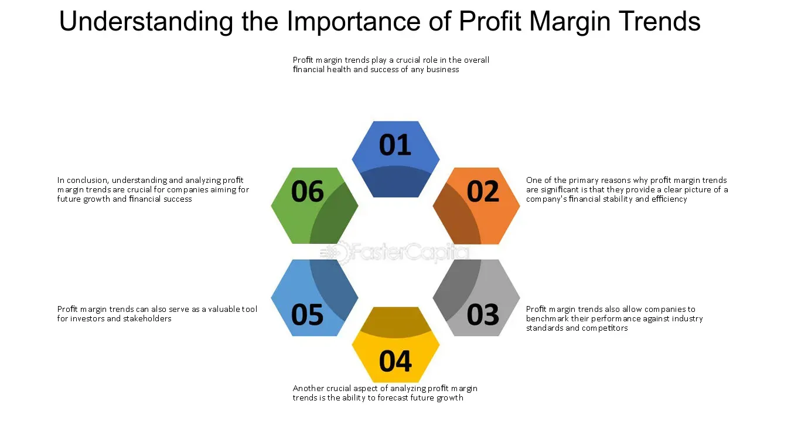

## Table of Contents

## What is profitability in the financial sector?

Profitability in the financial sector refers to how well a financial institution, like a bank or an investment firm, is able to make money. It shows if the company is earning more money than it is spending. This is important because it helps the company grow, pay its employees, and give returns to its investors. Profitability is measured using different financial ratios and metrics, like net profit margin, return on assets (ROA), and return on equity (ROE).

These metrics help investors and managers understand the health of the financial institution. For example, a high net profit margin means the company is good at turning its revenue into profit. A high ROA shows that the company is using its assets efficiently to generate earnings. And a high ROE indicates that the company is effectively using the money invested by shareholders to generate profits. By looking at these numbers, people can decide if the financial institution is a good place to invest their money or if it's managing its resources well.

## How do economic cycles affect profitability in finance?

Economic cycles, which are the ups and downs in the economy over time, can really change how profitable financial companies are. When the economy is doing well, like during a boom, people and businesses have more money to spend and invest. This means more loans are taken out, more investments are made, and financial companies make more money from interest and fees. So, their profits go up. But, when the economy is not doing so great, like during a recession, people and businesses cut back on spending and borrowing. This means fewer loans and investments, which can lead to lower profits for financial companies.

Also, during tough economic times, more people might not be able to pay back their loans, which is called a default. This can hurt the financial company's profits even more because they lose money on those loans. On the other hand, during good times, fewer people default on their loans, so the financial company keeps more of its money. So, economic cycles can make a big difference in how much profit a financial company makes, swinging from high profits in good times to lower profits or even losses in bad times.

## What role do interest rates play in financial sector profitability?

Interest rates are super important for how much money banks and other financial companies make. When interest rates go up, banks can charge more for loans. This means they earn more money from the interest people pay on things like mortgages, car loans, and credit cards. But, it's not all good news. Higher interest rates can also mean that fewer people want to borrow money because it's more expensive. So, banks might make more money on each loan, but they might not give out as many loans.

On the flip side, when interest rates go down, borrowing money becomes cheaper. More people might want to take out loans, which can be good for banks because they can lend more money. But, the downside is that the interest they earn on each loan is less. Also, banks have to pay interest on the money people put in savings accounts. When interest rates are low, they pay less to savers, but when rates are high, they have to pay more. So, interest rates can really swing the profits of financial companies back and forth depending on how they balance lending more at lower rates or less at higher rates.

## How does regulatory compliance impact the profitability of financial institutions?

Regulatory compliance means that financial institutions have to follow rules set by the government. These rules are there to make sure that banks and other financial companies do things the right way and don't take too many risks. But following these rules can cost a lot of money. Financial institutions have to spend money on things like hiring people to make sure they are following the rules, using special computer systems, and sometimes even paying fines if they mess up. All of this can make it harder for them to make a profit because they have less money left over after paying for these things.

On the other hand, being good at following the rules can also help financial institutions make more money in the long run. If people trust that a bank is doing things the right way, they might be more likely to do business with that bank. This can bring in more customers and more money. Also, if a bank follows the rules well, it might avoid big fines and other problems that can hurt its profits. So, while regulatory compliance can make things more expensive in the short term, it can also help a bank be more profitable in the long term by building trust and avoiding trouble.

## What are the effects of technological advancements on profitability in finance?

Technological advancements have a big impact on how much money financial companies can make. New technology like online banking, mobile apps, and AI can help banks do things faster and cheaper. For example, when people can do their banking on their phones, banks don't need as many people working in branches. This saves them money on salaries and building costs. Also, using AI and data analysis can help banks understand their customers better and offer them the right products, which can bring in more money.

But, it's not all easy. Banks have to spend a lot of money to get these new technologies. They need to buy new computer systems, train their staff, and sometimes even hire new people who know how to use the technology. If they don't keep up with the latest tech, they might lose customers to other banks that are using it. So, while technology can help banks make more money in the long run, it can also be expensive and risky in the short term.

## How do shifts in consumer behavior influence financial sector profitability?

Shifts in consumer behavior can really change how much money financial companies make. When people start using online banking and mobile apps more, banks can save money because they don't need as many physical branches. This means less spending on rent and staff, which can help their profits. Also, if people start using new types of financial products, like digital wallets or cryptocurrencies, banks might make more money by offering these services. But, if people start trusting banks less because of things like data breaches or bad service, they might take their money elsewhere, which can hurt the bank's profits.

On the other hand, if people start saving more and spending less, banks might see fewer loans being taken out. This can mean less money coming in from interest on loans, which can lower their profits. But, if people start investing more in things like stocks or mutual funds, banks can make money by charging fees for managing these investments. So, the way people behave with their money can push banks to change their services and how they make money, affecting their overall profitability.

## What is the impact of fintech on traditional financial institutions' profitability?

Fintech, which is short for financial technology, has changed the game for traditional banks and financial companies. These new fintech companies offer services like online payments, digital wallets, and quick loans through apps and websites. This means people can do their banking without ever going to a bank branch. Because fintech companies often have lower costs, they can offer better deals and lower fees, which can make them more attractive to customers. As a result, traditional banks might lose customers and see their profits go down if they can't keep up with these new competitors.

However, fintech also gives traditional banks a chance to make more money if they use it the right way. Banks can partner with fintech companies or use their technology to improve their own services. For example, they can use fintech to make their online banking better or to offer new products like digital loans. By doing this, banks can attract more customers and make more money. So, while fintech can be a threat to traditional banks' profits, it can also be an opportunity if they adapt and use it to their advantage.

## How does risk management contribute to profitability in the financial sector?

Risk management is really important for how much money financial companies can make. It's all about figuring out what could go wrong and making plans to stop those things from happening. For example, if a bank knows that some people might not pay back their loans, they can set aside money to cover those losses. This way, they don't lose all their profits if someone can't pay. Good risk management helps banks keep their money safe and make more profit in the long run.

Also, when banks manage risks well, people trust them more. If customers think a bank is careful and safe, they're more likely to do business with that bank. This can bring in more customers and more money. Plus, if a bank is good at managing risks, it might not have to pay as much for things like insurance or borrowing money from other banks. All of these things can help the bank make more profit. So, risk management is a big part of making sure a financial company stays profitable.

## What are the key performance indicators (KPIs) used to measure profitability in finance?

Key performance indicators (KPIs) are important numbers that help people see how well a financial company is doing at making money. Some common KPIs for measuring profitability in finance are net profit margin, return on assets (ROA), and return on equity (ROE). Net profit margin shows how much profit a company makes after paying all its costs. It's calculated by dividing the net profit by the total revenue. A high net profit margin means the company is good at turning its money into profit. ROA tells us how well a company is using its stuff, like buildings and computers, to make money. It's found by dividing the net income by the total assets. A high ROA means the company is using its stuff well to make money.

ROE is another important KPI that shows how well a company is using the money that people have invested in it. It's calculated by dividing the net income by the shareholders' equity. A high ROE means the company is making good use of the money people have put into it. These KPIs help investors and managers see if the financial company is doing a good job at making money and using its resources wisely. By looking at these numbers, they can decide if the company is a good place to invest their money or if it needs to make some changes to be more profitable.

## How do global market trends affect profitability in the financial sector?

Global market trends can really change how much money financial companies make. When the world economy is doing well, people and businesses feel more confident about spending and investing. This means more money is moving around, and financial companies can make more profit from things like loans, investments, and fees. For example, if there's a big demand for stocks or bonds around the world, banks and investment firms can earn more money by helping people buy and sell these investments. But, if the global economy is struggling, like during a worldwide recession, people might cut back on spending and investing. This can lead to less money coming into financial companies, which can hurt their profits.

Also, global market trends can affect things like interest rates and currency values, which are important for financial companies. If interest rates go up in one part of the world, it might make it more expensive for people to borrow money everywhere. This can mean fewer loans and less profit for banks. On the other hand, if a country's currency gets stronger because of global trends, it might be good for banks in that country because they can make more money from international transactions. But, if the currency gets weaker, it could hurt their profits. So, financial companies need to keep an eye on what's happening around the world to understand how it might change their profits.

## What strategies can financial institutions employ to enhance profitability in a competitive market?

Financial institutions can boost their profits by focusing on new technology. By using things like online banking and mobile apps, they can reach more customers without spending a lot on physical branches. This can save them money and help them make more profit. They can also use technology like AI to understand what their customers want and offer them the right products. This can bring in more money from fees and interest. But, they have to be careful because using new technology can be expensive at first. They need to make sure they are using it in a way that will help them make more money in the long run.

Another way to increase profits is by managing risks well. If a bank can figure out what could go wrong and make plans to stop it from happening, they can protect their money and keep their profits safe. For example, they might set aside money to cover losses if people can't pay back their loans. Good risk management can also make customers trust the bank more, which can bring in more business and more profit. Plus, if a bank is good at managing risks, it might not have to pay as much for things like insurance or borrowing money from other banks, which can help their bottom line.

Lastly, financial institutions can work on building strong relationships with their customers. By offering good customer service and understanding what their customers need, they can keep their customers happy and loyal. Happy customers are more likely to do more business with the bank, which can lead to more profits. Banks can also offer special deals or rewards to their loyal customers to keep them coming back. By focusing on these strategies, financial institutions can stay competitive and increase their profitability even when the market is tough.

## How can advanced data analytics and AI be leveraged to improve profitability in the financial sector?

Advanced data analytics and AI can help financial companies make more money by understanding their customers better. By looking at lots of data, like what people buy, how much they save, and what they like, banks can figure out what products and services to offer. For example, if data shows that a lot of people want to invest in green energy, the bank can create special investment options for that. AI can also help by using smart computer programs to find patterns in the data that humans might miss. This can help the bank offer the right products to the right people at the right time, which can bring in more money from fees and interest.

Another way AI and data analytics can boost profits is by making things run smoother and cheaper. AI can help banks do things like check for fraud or decide if someone should get a loan faster and with fewer mistakes. This saves the bank time and money, which can lead to more profit. Also, by using data to see how well different parts of the bank are doing, managers can find ways to make things better. For example, if data shows that one branch is not making as much money as others, the bank can figure out why and fix it. By using AI and data analytics in these ways, financial companies can make smarter decisions, save money, and make more profit.

## References & Further Reading

[1]: ["Advances in Financial Machine Learning"](https://www.amazon.com/Advances-Financial-Machine-Learning-Marcos/dp/1119482089) by Marcos Lopez de Prado

[2]: Bergstra, J., Bardenet, R., Bengio, Y., & Kégl, B. (2011). ["Algorithms for Hyper-Parameter Optimization."](https://dl.acm.org/doi/10.5555/2986459.2986743) Advances in Neural Information Processing Systems 24.

[3]: ["Machine Learning for Algorithmic Trading"](https://github.com/stefan-jansen/machine-learning-for-trading) by Stefan Jansen

[4]: ["Quantitative Trading: How to Build Your Own Algorithmic Trading Business"](https://www.amazon.com/Quantitative-Trading-Build-Algorithmic-Business/dp/1119800064) by Ernest P. Chan

[5]: ["Evidence-Based Technical Analysis: Applying the Scientific Method and Statistical Inference to Trading Signals"](https://www.amazon.com/Evidence-Based-Technical-Analysis-Scientific-Statistical/dp/0470008741) by David Aronson