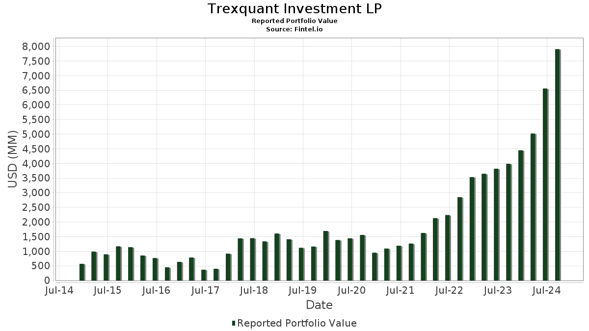

Trexquant Investment is a prominent player in the financial sector, recognized for its innovative approach to algorithmic trading. In a landscape characterized by rapid technological advancements and data-driven decision-making, Trexquant distinguishes itself by leveraging sophisticated algorithms to optimize trading operations. The firm employs quantitative strategies that integrate financial data and cutting-edge technology to execute trades with precision and speed, fundamentally transforming traditional trading paradigms.

Algorithmic trading, or algo trading, represents a significant evolution in financial markets, enabling organizations like Trexquant to automate complex trading strategies using computer programs. These algorithms are designed to monitor market conditions and execute orders based on predefined criteria with minimal human intervention. The significance of algo trading lies in its ability to enhance market liquidity, reduce transaction costs, and improve the efficiency of financial markets. Consequently, algo trading has become indispensable in contemporary finance, reshaping the dynamics of global trading activities.

The purpose of this article is to explore Trexquant Investment's distinctive approach to algorithmic trading. We aim to shed light on how the firm utilizes technology and data to create competitive trading advantages. By emphasizing the integral role of modern computational techniques and statistical models in their strategies, Trexquant continues to capitalize on market opportunities through innovations in machine learning and artificial intelligence. Understanding their methods provides valuable insights into how technology reshapes the trading landscape.

In today's fast-paced markets, the ability to process large volumes of data and execute transactions at high speed is crucial. Trexquant's reliance on technological infrastructure stands as a testament to the transformative power of data-driven methodologies in achieving superior performance. By contextualizing the importance of algorithmic trading, we underscore its pivotal role in contemporary markets, offering a glimpse into the future of financial trading dominated by algorithmic precision and strategic data use.

## Table of Contents

## What is Trexquant Investment?

Trexquant Investment is a quantitative hedge fund specializing in algorithmic trading. The firm was established in 2012 by Guofei Zhou, who serves as a pivotal figure in steering its strategic initiatives. With a foundation rooted in leveraging scientific and mathematical methodologies, Trexquant focuses on developing sophisticated trading algorithms that systematically analyze market data and execute trades.

The core operations of Trexquant Investment are centered around quantitative research and technology-driven trading. The firm uses advanced statistical models and machine learning algorithms to predict asset price movements and generate alpha. Their focus spans global markets, allowing them to diversify their portfolio and minimize risk through a broad spectrum of financial instruments. This strategic spread enhances the scalability and robustness of their trading operations.

Trexquant has carved a significant niche in the financial industry, gaining repute for its innovative approach and consistent performance. The firm's market presence is underscored by its ability to adapt quickly to changing market conditions, a testament to their robust research infrastructure and cutting-edge technological capabilities. Trexquant's reputation as a trailblazer in [algorithmic trading](/wiki/algorithmic-trading) is further solidified by their transparent and systematic approach to investing.

The expertise behind Trexquant Investment is composed of a team of distinguished professionals from various disciplines including finance, mathematics, computer science, and engineering. This interdisciplinary team is pivotal in developing and refining sophisticated trading models that capitalize on market inefficiencies. Their collective expertise allows Trexquant to maintain a competitive edge at the forefront of financial innovation. The firm emphasizes a culture of continuous learning and adaptation, which is vital in the rapidly evolving landscape of quantitative finance.

## Understanding Algorithmic Trading

Algorithmic trading, often referred to as algo trading, is a method of executing trades using pre-programmed instructions based on variables such as timing, price, and [volume](/wiki/volume-trading-strategy). The core principle involves leveraging computer algorithms to automate trading decisions, thereby minimizing human intervention and enhancing efficiency. These algorithms can handle an intricate array of variables and execute strategies at speeds and frequencies beyond human capability.

The fundamental difference between algorithmic and traditional trading lies in automation and precision. Traditional trading relies on human judgment and decision-making, often leading to delayed execution and potential for emotional bias. In contrast, algorithmic trading uses sophisticated statistical and mathematical models to execute trades after pre-specified criteria are met. 

### Advantages of Algorithmic Trading

One of the primary advantages of algorithmic trading is speed. Algorithms can analyze multiple markets simultaneously and execute orders at a pace impossible for human traders. This speed enables the capturing of price inefficiencies promptly. 

Efficiency is another benefit. Algorithms execute trades with better accuracy, reducing transaction costs and minimizing market impact through optimal order routing. For example, a well-designed algorithm prevents significant price changes by splitting large orders into smaller lots and executing them over time.

Consistent strategy adherence is also a notable advantage, as algorithms follow a strict set of criteria, eliminating the emotional decision-making involved in conventional trading.

### Challenges and Risks

Despite its advantages, algorithmic trading is not without challenges and risks. One significant concern is the risk of programming errors, which could lead to substantial financial losses. Algorithms need extensive testing and validation to ensure reliability under various market conditions.

Market [volatility](/wiki/volatility-trading-strategies) presents another risk. Algorithms are designed based on historical data, and unforeseen market events can lead to unanticipated behavior. This reliance on historical data can also result in overfitting, where the algorithm becomes too tailored to past data and performs poorly in real-time scenarios.

Additionally, algorithmic trading contributes to market phenomena such as flash crashes, where rapid price declines occur due to automated trading systems reacting to market signals. Such events underscore the importance of incorporating robust risk management protocols in the design of trading algorithms.

In conclusion, understanding the complexities and intricacies of algorithmic trading is essential for practitioners. While offering considerable advantages in speed and efficiency, the method demands caution and rigorous testing to mitigate inherent risks.

## Trexquant's Approach to Algorithmic Trading

Trexquant Investment employs a distinctive approach to algorithmic trading, integrating advanced technologies and sophisticated strategies to gain competitive advantages in the financial markets. At the core of their strategy is the utilization of [machine learning](/wiki/machine-learning) and [artificial intelligence](/wiki/ai-artificial-intelligence) (AI), which are pivotal in developing predictive models that can process and analyze vast amounts of data more efficiently than traditional manual methods. These models are designed to uncover patterns and signals in market data that can inform trading decisions, making the process faster and more accurate.

Machine learning algorithms employed by Trexquant are capable of learning from new data and adapting to changing market conditions without explicit programming. This flexibility allows Trexquant to continuously refine their strategies by incorporating new information and insights gained from the market. These algorithms are often structured to optimize trading strategies by evaluating various indicators and metrics, thereby enabling the execution of trades based on probabilistic assessments.

Proprietary technologies stand at the forefront of Trexquant's trading operations. These technologies are specifically tailored to enhance the speed and accuracy of data processing, allowing the firm to efficiently manage large volumes of data from diverse sources. By integrating custom-built software and state-of-the-art computing infrastructure, Trexquant ensures that their trading systems operate with minimal latency, which is crucial in high-frequency trading environments where trade execution speed can significantly affect profitability.

Risk management is integral to Trexquant's trading strategies, as it allows them to mitigate potential losses while maximizing returns. Trexquant employs a variety of risk management techniques, including diversification across asset classes and markets, as well as sophisticated hedging strategies designed to limit exposure to adverse market movements. By systematically assessing risk factors and adjusting their algorithms accordingly, Trexquant is able to maintain robust risk profiles.

Furthermore, Trexquant's approach focuses on maintaining a delicate balance between automation and human oversight. While automated systems handle the bulk of trading activities, experienced analysts and risk managers oversee these operations to ensure that strategic objectives align with real-world market conditions. This synergy between technology and human expertise enables Trexquant to adapt to unforeseen market fluctuations, ensuring that their trading strategies remain effective and resilient.

## The Impact of Technology on Trexquant’s Success

Trexquant Investment has strategically harnessed technology to bolster its success in algorithmic trading. At the core of its operations are critical technological solutions that enhance the speed, efficiency, and sophistication of its trading systems. These technologies primarily revolve around machine learning, artificial intelligence, and advanced data analytics, which together form the pillars of Trexquant's trading strategies.

Machine learning algorithms are pivotal in identifying patterns and trends within vast data sets that may not be apparent to traditional analytical methods. These algorithms are designed to learn and adapt from historical data, thus improving their predictive accuracy over time. Artificial intelligence further supplements this by enabling autonomous decision-making processes that can execute trades at optimal times with minimal human intervention. Such advanced technologies provide a competitive edge by optimizing trade execution and improving profitability.

Fintech innovations have had a profound impact on Trexquant's operations. The advent of cloud computing, for instance, has revolutionized how data is stored and processed, allowing Trexquant to handle enormous volumes of data with greater efficiency and reduced latency. Furthermore, blockchain technology ensures data integrity and transparency, which are essential in maintaining trust and reliability in financial transactions.

Trexquant's application of technology can be exemplified through several successful trades that leverage real-time data analysis. One such example could include the use of a [neural network](/wiki/neural-network) model that predicts market movements with a high degree of accuracy, allowing the firm to exploit market inefficiencies quickly. This model might analyze factors such as trading volumes, price movements, and even social media sentiment to make informed trading decisions.

Staying ahead of technological advancements is another critical strategy for Trexquant. The firm invests heavily in research and development to integrate the latest technological breakthroughs into its trading systems. Collaborations with technology providers and academic institutions are part of these efforts, fostering innovation and ensuring that Trexquant remains at the forefront of algorithmic trading.

In conclusion, technology plays an indispensable role in Trexquant's success, driving its algorithmic trading capabilities and securing its position as a leader in the financial sector. By continually leveraging cutting-edge technological solutions, Trexquant not only enhances its operational efficiency but also firmly positions itself to capture future growth opportunities in the dynamic landscape of financial markets.

## Regulatory Considerations in Algorithmic Trading

Algorithmic trading has become a cornerstone of modern financial markets, harnessing the power of computer algorithms to execute trades with precision and speed. However, the rapid evolution of this trading method presents challenges from a regulatory perspective. 

### Overview of the Regulatory Landscape for Algorithmic Trading

The regulatory framework for algorithmic trading is designed to ensure market integrity, fairness, and stability. Various regulatory bodies globally have established rules and guidelines to supervise firms engaged in automated trading. In the United States, the Securities and Exchange Commission (SEC) and the Commodity Futures Trading Commission (CFTC) lead regulatory oversight, focusing on aspects such as market manipulation, transparency, and systemic risk. Regulations like MiFID II in Europe impose stringent requirements on algorithmic trading, including pre-trade transparency, order-to-trade ratios, and testing of algorithms to prevent market abuse.

### Navigating Compliance and Regulatory Challenges

Trexquant Investment operates within this complex regulatory environment by implementing robust compliance programs. The firm invests in sophisticated monitoring systems to ensure that all trading activities adhere to regulatory standards. This involves continuously updating their algorithms to comply with new rules, conducting thorough testing for stability, and maintaining detailed records of trading activities. Trexquant employs a dedicated compliance team to oversee these processes, ensuring real-time adjustments to any regulatory changes.

### Importance of Ethical Considerations in Algo Trading

Ethical considerations are paramount in algorithmic trading, given its potential impact on market dynamics. Trexquant Investment places significant emphasis on ethical trading practices. This includes designing trading algorithms that do not exploit market inefficiencies in a way that could lead to unethical outcomes. For instance, high-frequency trading strategies are scrutinized to avoid unfair advantages that could result in market manipulation or undue volatility. Maintaining trust with clients and stakeholders is integral to Trexquant’s ethical governance framework.

### Future Regulatory Trends and Potential Impact

Looking ahead, the regulatory environment is likely to evolve in response to technological advancements and emerging trading practices. Future trends may involve stricter scrutiny of algorithmic transparency, requiring firms to disclose the underlying logic of their algorithms. The integration of artificial intelligence and machine learning in trading strategies also raises questions about accountability and bias, potentially prompting new regulatory measures. Trexquant Investment remains at the forefront by proactively engaging with regulatory bodies, participating in industry discussions, and adapting swiftly to regulatory shifts.

As the landscape of algorithmic trading continues to evolve, firms like Trexquant Investment must remain vigilant in their compliance efforts, balancing innovation with responsibility. Through ongoing commitment to regulatory adherence and ethical practices, Trexquant sets a standard in the industry, contributing to a stable and fair trading environment.

## Conclusion

Trexquant Investment has established a notable presence in the sphere of algorithmic trading, demonstrating both innovation and leadership. The firm's contributions lie in its ability to harness advanced quantitative strategies, supported by cutting-edge technology and data analytics. By leveraging machine learning and artificial intelligence, Trexquant has effectively implemented complex trading algorithms that capitalize on market inefficiencies, optimizing trading performance while maintaining robust risk management protocols.

The future of algorithmic trading in financial markets holds significant promise as technological advancements continue to evolve at a rapid pace. With the growing integration of big data, AI, and predictive analytics, algo trading is expected to become even more prevalent, driving efficiency and [liquidity](/wiki/liquidity-risk-premium) in the markets. This environment presents opportunities for both established institutions and new entrants to reap benefits from improved accuracy, speed, and cost-efficiency in trading.

Investors are encouraged to recognize both the advantages and potential risks associated with algorithmic trading. While the potential for high-frequency, automated decision-making offers substantial returns, it also necessitates stringent oversight to mitigate risks such as algorithmic errors, market volatility, and cybersecurity threats. Understanding these dynamics is crucial for capitalizing on the evolving landscape of financial trading while safeguarding investments.

In conclusion, Trexquant stands at the forefront of this transformative shift in trading methodologies. Its proactive approach in embracing technological innovations and maintaining rigorous ethical and regulatory standards places it as a leader in the algorithmic trading domain. As the financial industry progresses, Trexquant's strategic insights and expertise will continue to shape the future of trading, underscoring its pivotal role in redefining market practices for years to come.

## References & Further Reading

[1]: ["Algorithmic Trading: The Basics and How It Works"](https://www.investopedia.com/articles/active-trading/101014/basics-algorithmic-trading-concepts-and-examples.asp) by James Chen on Investopedia

[2]: ["Quantitative Trading: How to Build Your Own Algorithmic Trading Business"](https://www.amazon.com/Quantitative-Trading-Build-Algorithmic-Business/dp/1119800064) by Ernest P. Chan

[3]: ["Advances in Financial Machine Learning"](https://www.amazon.com/Advances-Financial-Machine-Learning-Marcos/dp/1119482089) by Marcos Lopez de Prado

[4]: ["Machine Learning for Asset Managers"](https://www.amazon.com/Machine-Learning-Managers-Elements-Quantitative/dp/1108792898) by Marcos Lopez de Prado

[5]: ["Evidence-Based Technical Analysis: Applying the Scientific Method and Statistical Inference to Trading Signals"](https://books.google.com/books/about/Evidence_Based_Technical_Analysis.html?id=MeoJAQAAMAAJ) by David Aronson

[6]: Esser, A., & Herrman, C. (2020). ["Regulatory Implications of Algorithmic and High-Frequency Trading"](https://academic.oup.com/book/27407/chapter/197229790) OECD Working Papers.