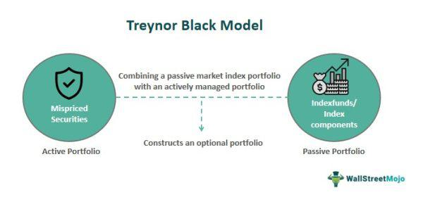

## Table of Contents

## What is the Treynor-Black Model?

The Treynor-Black Model is a way to mix active and passive investing. It helps investors decide how much to put in a few stocks they think will do well, and how much to put in a big group of stocks, like an index fund. The model uses something called "alpha" to figure out how much better a stock might do compared to the whole market. If a stock has a high alpha, it means the investor thinks it will do much better than average.

The model also looks at how risky these stocks are compared to the market. This is called "beta." If a stock's beta is high, it means it moves a lot more than the market. The Treynor-Black Model tries to balance the potential extra returns from these stocks (the alpha) with their extra risk (the beta). By doing this, it helps investors find the best mix of their special picks and the safer, broader market investments.

## Who developed the Treynor-Black Model and when was it introduced?

The Treynor-Black Model was developed by Jack L. Treynor and Fischer Black. Jack Treynor was a financial economist known for his contributions to the field of investment management, and Fischer Black was an influential economist famous for his work on the Black-Scholes model. Together, they created the Treynor-Black Model to help investors combine their specific stock picks with broader market investments.

The model was introduced in the early 1970s. It came at a time when investors were looking for ways to improve their investment strategies by balancing the potential high returns from individual stocks with the stability of the overall market. The Treynor-Black Model provided a systematic approach to this challenge, making it easier for investors to decide how much to invest in their carefully chosen stocks and how much to invest in a diversified portfolio.

## What are the key components of the Treynor-Black Model?

The Treynor-Black Model has two main parts: the active portfolio and the passive portfolio. The active portfolio is made up of a few stocks that the investor thinks will do better than the market. These stocks are chosen because they have a high "alpha," which means the investor believes they will give higher returns than what you would expect from the market. The model calculates how much better these stocks might do and uses this information to decide how much money to put into them.

The passive portfolio, on the other hand, is a big group of stocks, like an index fund, that represents the whole market. This part of the portfolio is less risky because it is spread out over many different stocks. The model also looks at how risky the stocks in the active portfolio are compared to the market, which is called "beta." If a stock's beta is high, it means it can go up or down a lot more than the market. The Treynor-Black Model helps investors figure out the best way to mix these two portfolios to get the best return for the amount of risk they are willing to take.

## How does the Treynor-Black Model differ from the Capital Asset Pricing Model (CAPM)?

The Treynor-Black Model and the Capital Asset Pricing Model (CAPM) are both used in investing, but they have different goals and ways of working. The CAPM is all about figuring out what return an investor should expect from a stock based on how risky it is compared to the market. It uses something called "beta" to show this risk. The CAPM says that the expected return of a stock should be the risk-free rate (like what you get from government bonds) plus a bit extra based on the stock's beta. It's a simple way to see if a stock is a good deal by comparing its expected return to its risk.

On the other hand, the Treynor-Black Model is more about mixing active and passive investing. It helps investors decide how much to put into a few special stocks they think will do better than the market, and how much to put into a big group of stocks, like an index fund. This model uses "alpha" to show how much better a stock might do compared to the market. It then looks at both the alpha and the beta of these special stocks to find the best mix with the market portfolio. So, while CAPM focuses on expected returns based on risk, the Treynor-Black Model tries to boost returns by smartly mixing a few high-alpha stocks with a broad market investment.

## What is the role of alpha in the Treynor-Black Model?

In the Treynor-Black Model, alpha is super important. It's like a special score that shows how much better a stock might do compared to the whole market. When investors find stocks with a high alpha, it means they think these stocks will give them extra returns, more than what they would get just from the market going up. The Treynor-Black Model uses this alpha to decide which stocks to pick for the active part of the portfolio.

The model then looks at how much alpha these stocks have and figures out how much money to put into them. The idea is to mix these high-alpha stocks with a bigger, safer group of stocks that represent the market. By doing this, the model tries to get the best of both worlds: the extra returns from the special stocks and the stability from the market. So, alpha is the key that helps investors find the right balance in their investments.

## How is the Treynor-Black Model used to construct an optimal portfolio?

The Treynor-Black Model helps investors build the best mix of their investments by combining a few special stocks with a big group of stocks that represent the whole market. The special stocks are chosen because they have a high "alpha," which means the investor thinks they will do much better than the market. The model looks at how much better these stocks might do and decides how much money to put into them. It also checks how risky these stocks are compared to the market, which is called "beta." If a stock's beta is high, it means it can go up or down a lot more than the market.

By figuring out the alpha and beta of the special stocks, the Treynor-Black Model helps find the right balance between these stocks and the market. The idea is to get extra returns from the special stocks while keeping the investment safe with the market. The model calculates the best amount to invest in the special stocks and the market to make the whole portfolio as good as it can be. This way, investors can have a mix that gives them the best chance for higher returns without taking too much risk.

## Can you explain the concept of 'mispricing' as used in the Treynor-Black Model?

In the Treynor-Black Model, 'mispricing' means that some stocks are not priced right by the market. This happens when a stock's price is different from what it should be, based on how well the company is doing. If a stock is cheaper than it should be, it's called underpriced, and if it's more expensive than it should be, it's called overpriced. The Treynor-Black Model looks for these mispriced stocks because they can give investors a chance to make more money.

The model uses something called 'alpha' to find out if a stock is mispriced. Alpha shows how much better a stock might do compared to the whole market. If a stock has a high alpha, it means the investor thinks it's underpriced and will do better than the market expects. The Treynor-Black Model helps investors pick these underpriced stocks for their portfolio and mix them with a big group of stocks that represent the market. This way, they can try to get extra returns from the mispriced stocks while keeping their investment safe with the market.

## What are the steps involved in applying the Treynor-Black Model in practice?

To use the Treynor-Black Model, you first need to find some stocks that you think are mispriced. This means you believe these stocks are cheaper or more expensive than they should be. You do this by looking at each stock's alpha, which shows how much better the stock might do compared to the whole market. If a stock has a high alpha, it means you think it's underpriced and will do better than expected. You also need to check the stock's beta, which tells you how risky it is compared to the market. Once you have these numbers, you can pick the stocks with the best alpha and beta for your active portfolio.

Next, you need to figure out how much money to put into these special stocks and how much to put into a big group of stocks, like an index fund, that represents the whole market. This is called the passive portfolio. The Treynor-Black Model helps you find the right mix by looking at the alpha and beta of your special stocks. It calculates how much to invest in each part to get the best return without taking too much risk. By balancing the potential extra returns from the special stocks with the safety of the market, you can build a portfolio that gives you the best chance for higher returns.

## How does the Treynor-Black Model handle risk and return?

The Treynor-Black Model helps investors balance risk and return by mixing a few special stocks with a big group of stocks that represent the whole market. The special stocks are chosen because they have a high alpha, which means the investor thinks they will do much better than the market. The model looks at how much better these stocks might do and decides how much money to put into them. It also checks how risky these stocks are compared to the market, which is called beta. If a stock's beta is high, it means it can go up or down a lot more than the market.

By figuring out the alpha and beta of the special stocks, the Treynor-Black Model finds the best way to mix these stocks with the market. The idea is to get extra returns from the special stocks while keeping the investment safe with the market. The model calculates the best amount to invest in the special stocks and the market to make the whole portfolio as good as it can be. This way, investors can have a mix that gives them the best chance for higher returns without taking too much risk.

## What are some limitations and criticisms of the Treynor-Black Model?

One big problem with the Treynor-Black Model is that it can be hard to find stocks that are really mispriced. The model depends a lot on finding these special stocks with high alpha, which means they are expected to do better than the market. But figuring out if a stock is mispriced can be tricky and might need a lot of research and guessing. If investors make mistakes about which stocks are mispriced, their portfolio might not do as well as they hoped. Also, the model assumes that investors can find these mispriced stocks easily, but in real life, it's not that simple.

Another issue is that the Treynor-Black Model assumes that the market portfolio is a good way to measure risk. But the market can be risky too, and if it goes down, the whole portfolio could lose money. The model also depends a lot on the idea that alpha and beta can be measured accurately, but these numbers can change over time and might not always be right. Critics say that because the model uses these numbers to make decisions, it might not work well if they are not accurate. So, while the Treynor-Black Model can help investors mix active and passive investing, it has some big challenges that can make it hard to use in the real world.

## How can the Treynor-Black Model be integrated with other investment strategies?

The Treynor-Black Model can be mixed with other ways of investing to make a better plan for your money. One way to do this is by using it with something called [factor](/wiki/factor-investing) investing. Factor investing is about [picking](/wiki/asset-class-picking) stocks based on certain things like how big the company is, how much it grows, or how much it costs compared to its earnings. By using the Treynor-Black Model to find stocks that are priced wrong and then looking at these factors, you can make smarter choices about which stocks to pick for the active part of your portfolio. This can help you find stocks that not only have a high alpha but also fit well with your other investment ideas.

Another way to use the Treynor-Black Model with other strategies is by mixing it with something called tactical asset allocation. This means changing how much you invest in different kinds of things, like stocks, bonds, or cash, based on what's happening in the market. You can use the Treynor-Black Model to pick the special stocks for your active portfolio, and then use tactical asset allocation to decide when to put more money into stocks or other investments. This way, you can try to get the best returns from the special stocks while also adjusting your overall investment plan to fit what's going on in the market. By combining these strategies, you can make a plan that works well in different situations.

## What are some real-world applications and case studies of the Treynor-Black Model?

The Treynor-Black Model has been used by many big investment companies to help them make better choices about where to put their money. For example, a big pension fund might use the model to pick a few special stocks that they think will do better than the market. They would look at the alpha and beta of these stocks to see how much better they might do and how risky they are. Then, they would mix these special stocks with a big group of stocks, like an index fund, to keep their investment safe. This way, the pension fund can try to get extra returns from the special stocks while also making sure their money is spread out and not too risky.

Another real-world use of the Treynor-Black Model is in hedge funds. Hedge funds often try to find stocks that are priced wrong and then use the model to decide how much to invest in these stocks. A famous case study is how some hedge funds used the model during the tech boom in the late 1990s. They picked tech stocks that they thought were underpriced and mixed them with a broader market investment. By doing this, they were able to make a lot of money when the tech stocks went up. But, they also had to be careful because the model depends a lot on getting the alpha and beta right, and if they were wrong, they could lose money too.

## What is the Understanding of the Treynor-Black Model?

The Treynor-Black Model is a pioneering portfolio optimization framework that adeptly combines active and passive management strategies to optimize returns. Designed by Jack Treynor and Fischer Black in the 1970s, the model acknowledges that while most investors struggle to consistently outperform the market due to its inherent efficiency, there exist skilled investors capable of identifying mispriced securities—those whose market prices deviate from their intrinsic values. This capability to spot discrepancies provides such investors with the opportunity to earn excess returns, or "alpha".

At its core, the Treynor-Black Model advocates for a dual-portfolio strategy that enhances overall returns by integrating two distinct components: an active portfolio of selected mispriced securities and a passive portfolio that replicates a broad market index. The active portfolio focuses on exploiting the market inefficiencies found within selected securities. To construct this portfolio, investors evaluate the risk-adjusted expected returns of individual securities, seeking those with the potential for substantial alpha generation.

The passive component, typically mirroring a market index like the S&P 500, provides broad market exposure. This component capitalizes on the Efficient Market Hypothesis (EMH), which suggests that major stock indices capture the overall market's risk and return characteristics effectively. By maintaining a passive segment, investors keep a baseline of expected returns consistent with overall market performance, thereby reducing idiosyncratic risk.

A key objective of the Treynor-Black Model is to achieve higher risk-adjusted returns. This is accomplished through a strategic balance between the active and passive segments of the portfolio. The model provides guidance on the optimal weighting of the two segments to maximize the Sharpe Ratio, which measures the excess return per unit of risk. The formula for the Sharpe Ratio is:

$$
\text{Sharpe Ratio} = \frac{E(R_p) - R_f}{\sigma_p}
$$

where $E(R_p)$ is the expected return of the portfolio, $R_f$ is the risk-free rate, and $\sigma_p$ is the standard deviation of the portfolio's returns.

The Treynor-Black Model's innovative approach allows for systematic exploitation of market inefficiencies while maintaining a solid foundation through passive investment, aiding investors in navigating the complexities of modern markets. The strategic interplay between active and passive management within this framework positions investors to potentially exceed market averages in a disciplined, risk-aware manner.

## How do you calculate expected returns and risk?

Accurately calculating expected returns and assessing associated risks is fundamental to the Treynor-Black Model, a tool that enhances portfolio optimization by combining active and passive investment strategies. The expected returns within this framework are predicated on the alpha of securities, representing the excess return of an investment relative to a benchmark index. The calculation begins with identifying securities believed to be mispriced, a process that requires in-depth analysis of both market conditions and firm-specific factors. The formula to calculate expected return ($E(R_i)$) in this context is:

$$
E(R_i) = R_f + \beta_i (E(R_m) - R_f) + \alpha_i
$$

where $R_f$ is the risk-free rate, $\beta_i$ is the beta of the ith security, $E(R_m)$ is the expected market return, and $\alpha_i$ is the alpha of the security.

Risk assessment involves quantifying both systematic risk, which affects the entire market, and unsystematic risk, which is unique to individual securities. Systematic risk is captured through the beta coefficient, while unsystematic risk is represented by the variance or standard deviation of a security’s returns. The overall risk ($\sigma^2_p$) of the portfolio is calculated by considering the variance of the active portfolio and the variance of the market portfolio, weighted according to the proportionate investments:

$$
\sigma^2_p = w^2_a \sigma^2_{a} + w^2_m \sigma^2_{m} + 2w_aw_m\sigma_{a,m}
$$

where $w_a$ and $w_m$ are the weights of the active and market portfolios, respectively, and $\sigma_{a,m}$ is the covariance between the active and market portfolios.

For the model to guide dual-portfolio strategy construction effectively, investors must integrate these risk assessments into the optimization process. This requires balancing risk tolerance with the strategic selection and weighting of securities to maximize risk-adjusted returns. Techniques such as mean-variance optimization are typically employed to achieve this balance, allowing investors to allocate capital efficiently between the active and market portfolios to optimize the Sharpe ratio or another risk-return trade-off measure.

In practice, this balance involves iteratively adjusting portfolio allocations in response to changing market conditions and new information about security performance, emphasizing the importance of dynamic portfolio management. The use of algorithmic tools can aid this process, offering the speed and precision needed to continuously refine risk and return estimations, ensuring that investors are positioned to respond effectively to both anticipated and unforeseen market shifts.

## What is the Performance Evaluation of the Combined Portfolio?

Evaluating the performance of a combined portfolio that leverages the Treynor-Black Model involves a meticulous assessment of several key metrics. Central to this evaluation is the metric of risk-adjusted return, which provides insights into how well a portfolio performs relative to the risk it assumes. The Sharpe Ratio, calculated as 

$$
\text{Sharpe Ratio} = \frac{R_p - R_f}{\sigma_p}
$$

where $R_p$ is the portfolio return, $R_f$ is the risk-free rate, and $\sigma_p$ is the portfolio's standard deviation, is commonly used to measure this aspect. A higher Sharpe Ratio indicates superior risk-adjusted performance.

Alpha generation, another critical indicator, focuses on the portfolio's ability to outperform its benchmark. It quantifies the excess return achieved through active management, providing evidence of successful security selection and timing strategies. Alpha ($\alpha$) is typically expressed as:

$$
\alpha = R_p - [R_f + \beta(R_m - R_f)]
$$

where $\beta$ represents the portfolio's sensitivity to market movements, and $R_m$ is the market return.

Diversification benefits also play an integral role, helping to mitigate unsystematic risk and improve the portfolio's overall stability. The extent of diversification can be assessed by examining the correlation coefficients among portfolio assets. A well-diversified portfolio should display minimal correlations, thereby reducing the impact of individual asset [volatility](/wiki/volatility-trading-strategies) on the entire portfolio's performance.

Understanding how asset allocation, security selection, and market timing contribute to performance is essential. Asset allocation determines the strategic distribution across different asset classes, whereas security selection focuses on the choice of individual securities within those classes. Market timing involves initiatives to capitalize on macroeconomic changes, all together forming the foundation for the portfolio's potential to generate returns.

Ongoing evaluation is crucial to ensure alignment with the investor's goals and the prevailing market conditions. This can involve periodic reviews of the portfolio's performance metrics, adjustments to the asset mix, or rebalancing the weightings between active and passive components in response to evolving market dynamics.

Automating portfolio analysis using tools like Python can enhance precision and efficiency. Libraries such as NumPy, Pandas, and SciPy facilitate complex calculations required for evaluating performance metrics and conducting rebalancing operations. Employing these technologies allows investors to respond swiftly to performance insights and maintain a portfolio that meets their objectives over time.

This comprehensive assessment ensures that the combined portfolio remains robust and tailored to achieve optimal outcomes, leveraging the Treynor-Black Model’s strengths in balancing active and passive investment strategies.

## References & Further Reading

[1]: Treynor, J. L., & Black, F. (1973). ["How to Use Security Analysis to Improve Portfolio Selection."](https://www.jstor.org/stable/2351280) Financial Analysts Journal, 30(3), 7-20.

[2]: Elton, E. J., Gruber, M. J., Brown, S. J., & Goetzmann, W. N. (2009). ["Modern Portfolio Theory and Investment Analysis."](https://books.google.com/books/about/Modern_Portfolio_Theory_and_Investment_A.html?id=181CEAAAQBAJ) John Wiley & Sons.

[3]: Fabozzi, F. J., & Markowitz, H. M. (2002). ["The Theory and Practice of Investment Management."](https://onlinelibrary.wiley.com/doi/book/10.1002/9781118267028) John Wiley & Sons.

[4]: Fama, E. F. (1970). ["Efficient Capital Markets: A Review of Theory and Empirical Work."](https://www.jstor.org/stable/2325486) The Journal of Finance, 25(2), 383-417.

[5]: Black, F. (1992). ["Beta and Return."](https://www.semanticscholar.org/paper/Beta-and-Return-Black/aac33577a67e836cf9422e4e97cdf22914095c81) The Journal of Portfolio Management, 20(1), 8-18.

[6]: Lopez de Prado, M. (2018). ["Advances in Financial Machine Learning."](https://www.amazon.com/Advances-Financial-Machine-Learning-Marcos/dp/1119482089) Wiley.

[7]: Aronson, D. R. (2006). ["Evidence-Based Technical Analysis: Applying the Scientific Method and Statistical Inference to Trading Signals."](https://www.amazon.com/Evidence-Based-Technical-Analysis-Scientific-Statistical/dp/0470008741) Wiley.

[8]: Chan, E. P. (2009). ["Quantitative Trading: How to Build Your Own Algorithmic Trading Business."](https://github.com/ftvision/quant_trading_echan_book) Wiley.

[9]: Jansen, S. (2018). ["Machine Learning for Algorithmic Trading."](https://github.com/stefan-jansen/machine-learning-for-trading) Packt Publishing.

[10]: Sharpe, W. F. (1994). ["The Sharpe Ratio."](https://web.stanford.edu/~wfsharpe/art/sr/SR.htm) The Journal of Portfolio Management, 21(1), 49-58.