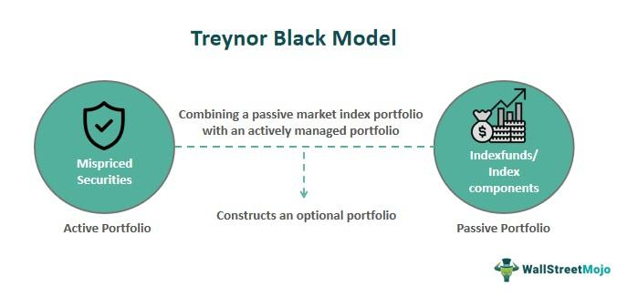

## Table of Contents

## What is the Treynor–Black model?

The Treynor-Black model is a way to mix active and passive investing. It helps investors decide how much to invest in a few stocks they think will do better than the market, and how much to invest in the whole market. The model uses something called "alpha" to figure out which stocks might do better. Alpha is a measure of how much a stock's return is better than what you would expect from the market.

The model also uses a measure called "beta" to see how much a stock moves with the market. If a stock has a high beta, it moves a lot with the market. The Treynor-Black model tries to balance the risk and reward of picking individual stocks with the safety of investing in the whole market. By using both alpha and beta, the model helps investors make a portfolio that could beat the market but is still safe enough.

## Who developed the Treynor–Black model and when?

The Treynor-Black model was developed by Jack Treynor and Fischer Black. Jack Treynor was a famous thinker in finance, and Fischer Black was known for his work on the Black-Scholes model, which is used to price options. They came up with the Treynor-Black model in the early 1970s.

This model was first talked about in a paper that Jack Treynor wrote in 1976. The paper was called "The Economics of the Stock Market." In it, Treynor explained how investors could use the model to mix their investments in individual stocks with investments in the whole market. This way, they could try to do better than the market while still being safe.

## What are the key components of the Treynor–Black model?

The Treynor-Black model has two main parts: active and passive investing. Active investing means [picking](/wiki/asset-class-picking) a few stocks that you think will do better than the market. Passive investing means investing in the whole market, like buying an index fund. The model helps you decide how much to put in each part. It looks at something called "alpha" to see which stocks might do better. Alpha is how much a stock's return is better than what you would expect from the market.

The other important part of the model is "beta." Beta tells you how much a stock moves with the market. If a stock has a high beta, it moves a lot with the market. The Treynor-Black model uses both alpha and beta to balance the risk and reward of picking individual stocks with the safety of investing in the whole market. By mixing these two parts, the model helps you make a portfolio that could beat the market but is still safe enough.

## How does the Treynor–Black model differ from the Capital Asset Pricing Model (CAPM)?

The Treynor-Black model and the Capital Asset Pricing Model (CAPM) both help investors figure out how to invest their money, but they do it in different ways. CAPM is a simpler model that says the return you expect from a stock depends on how risky it is compared to the whole market. It uses something called "beta" to measure this risk. If a stock's beta is high, it's riskier, and you expect a higher return. CAPM suggests that you should invest in a mix of stocks that match the market, so you get the average market return without trying to beat it.

The Treynor-Black model, on the other hand, mixes active and passive investing. It says you should pick a few stocks you think will do better than the market, which is called "active" investing. At the same time, you should also invest in the whole market, which is "passive" investing. The model uses both "alpha" and "beta." Alpha tells you which stocks might do better than expected, and beta tells you how much a stock moves with the market. By using both alpha and beta, the Treynor-Black model helps you create a portfolio that tries to beat the market while still being safe.

## What is the purpose of the Treynor–Black model in portfolio management?

The purpose of the Treynor-Black model in portfolio management is to help investors find the best way to mix picking individual stocks with investing in the whole market. It tries to beat the market's return while keeping the risk low. The model does this by looking at which stocks might do better than expected, called "alpha," and how much those stocks move with the market, called "beta." By using both alpha and beta, the model helps investors decide how much to put into a few special stocks and how much to put into the whole market.

This model is useful because it lets investors try to get a higher return without taking on too much risk. Instead of just following the market, the Treynor-Black model encourages a bit of active investing. This means picking a few stocks that you think will do really well. At the same time, it suggests keeping most of your money in the market to stay safe. By balancing these two parts, the model helps you make a portfolio that aims to do better than the market but is still safe enough.

## How is the Treynor–Black model used to optimize a portfolio?

The Treynor-Black model helps investors make their portfolio better by mixing picking a few special stocks with investing in the whole market. It looks at which stocks might do better than expected, called "alpha," and how much those stocks move with the market, called "beta." By using both alpha and beta, the model figures out how much money to put into the special stocks and how much to keep in the market. This way, the model tries to get a higher return without taking on too much risk.

For example, if an investor finds a few stocks with a high alpha, meaning they think these stocks will do better than the market, the Treynor-Black model will tell them how much to invest in these stocks. At the same time, the model suggests keeping most of the money in the whole market to stay safe. By balancing these two parts, the model helps create a portfolio that aims to beat the market but is still safe enough. This mix of active and passive investing is what makes the Treynor-Black model useful for optimizing a portfolio.

## What is the role of alpha in the Treynor–Black model?

In the Treynor-Black model, alpha is really important. It tells you which stocks might do better than the market. Think of alpha as a way to find special stocks that could make you more money than just following the market. The model uses alpha to figure out which stocks to pick for the part of your portfolio that you actively manage.

By using alpha, the Treynor-Black model helps you decide how much money to put into these special stocks. It mixes this with the part of your portfolio that just follows the market, which is safer. So, alpha helps you try to beat the market while still keeping your investments safe.

## How does the Treynor–Black model incorporate both active and passive investment strategies?

The Treynor-Black model helps investors by mixing two ways of investing: active and passive. Active investing means picking a few special stocks that you think will do better than the market. The model looks at something called "alpha" to find these stocks. Alpha tells you how much better a stock might do compared to what you expect from the market. By using alpha, the model helps you decide how much money to put into these special stocks.

Passive investing, on the other hand, means investing in the whole market, like buying an index fund. This is safer because it follows the market's average return. The Treynor-Black model also uses something called "beta" to see how much a stock moves with the market. By looking at both alpha and beta, the model figures out how much money to keep in the market to stay safe. So, the model mixes the excitement of picking special stocks with the safety of following the market, helping you make a portfolio that tries to beat the market but is still safe enough.

## What are the assumptions underlying the Treynor–Black model?

The Treynor-Black model makes some guesses to help investors mix picking special stocks with following the market. It assumes that markets are mostly efficient, meaning most stocks are priced right most of the time. But it also thinks that some investors can find a few stocks that are not priced right, which means they can do better than the market. The model also guesses that these special stocks have a good "alpha," which is how much better they do than expected. It also assumes that the risk of these stocks, measured by "beta," can be figured out and used to balance the portfolio.

Another guess the model makes is that investors can tell the difference between the part of their portfolio that they actively manage and the part that they just let follow the market. The model thinks that by mixing these two parts in the right way, investors can get a higher return without taking on too much risk. It also assumes that the math used to figure out how much to put into each part of the portfolio is right, and that the information used to find alpha and beta is good enough to make smart choices.

## Can you explain the mathematical formula used in the Treynor–Black model?

The Treynor-Black model uses a special formula to help investors decide how to mix picking special stocks with following the market. The formula looks at something called "alpha," which is how much better a stock might do than expected, and "beta," which is how much a stock moves with the market. The model figures out how much to put into the special stocks by using alpha and beta together. It also decides how much to keep in the market to stay safe. The formula helps find the best mix of these two parts to try to beat the market without taking on too much risk.

The math in the Treynor-Black model can be a bit tricky, but it's really about balancing the special stocks with the market. The formula says to put more money into stocks with a high alpha because they could make you more money. But it also says to think about the beta of these stocks because high beta means more risk. By using both alpha and beta, the model helps you figure out how much to invest in each stock and how much to keep in the market. This way, you can try to get a higher return while still being safe.

## What are the limitations and criticisms of the Treynor–Black model?

The Treynor-Black model has some problems that people talk about. One big issue is that it assumes markets are mostly efficient but also that some investors can find special stocks that are not priced right. This can be hard to do in real life because finding these special stocks is not easy. Also, the model depends a lot on the idea of "alpha," which is how much better a stock might do than expected. But figuring out alpha is tricky and can be wrong a lot of the time. If you guess wrong about alpha, your whole plan can go off track.

Another problem with the Treynor-Black model is that it assumes you can tell the difference between the part of your portfolio that you pick yourself and the part that just follows the market. But in real life, it's not always clear which stocks are special and which ones are just following the market. The model also uses math to figure out how much to put into each part of your portfolio, but this math can be wrong if the information you use to find alpha and beta is not good. So, while the Treynor-Black model tries to help you beat the market safely, it can be hard to use it right because of these limitations.

## How can the Treynor–Black model be applied in real-world investment scenarios?

In real-world investment scenarios, the Treynor-Black model helps investors by mixing the excitement of picking special stocks with the safety of following the market. Imagine you are an investor who thinks you can find a few stocks that will do better than the market. The model helps you figure out how much money to put into these special stocks. It looks at something called "alpha," which tells you how much better these stocks might do than expected. By using alpha, the model helps you decide how much to invest in these stocks to try to beat the market.

At the same time, the Treynor-Black model also tells you to keep most of your money in the whole market to stay safe. It uses something called "beta" to see how much these special stocks move with the market. By balancing the risk and reward of picking individual stocks with the safety of investing in the whole market, the model helps you create a portfolio that tries to do better than the market but is still safe enough. So, in real life, you can use the Treynor-Black model to mix your own stock picks with a broad market investment, aiming to get a higher return without taking on too much risk.

## What are the Mathematical Foundations of the Treynor–Black Model?

The Treynor–Black model is a significant advancement in portfolio management, blending insights from both passive and active investment strategies to optimize portfolio construction. At its core, the model seeks to enhance returns by integrating a market index fund with a superior active portfolio, thereby creating a combined portfolio that seeks to outperform the market.

### Formula and Components of the Treynor–Black Model

Central to the Treynor–Black model is the expression:

$$
P = \omega A + (1 - \omega) M
$$

Where:
- $P$ represents the overall portfolio.
- $\omega$ is the weight of the active portfolio $A$.
- $M$ symbolizes the market index fund.

The key objective of the model is to determine the optimal weight $\omega$, relying heavily on the concepts of alpha, beta, and residual risk to achieve this.

#### Concepts of Alpha, Beta, and Residual Risk

1. **Alpha ($\alpha$)**: Alpha is a measure of the active portfolio's ability to generate returns above the expected risk-adjusted returns of the market. It represents the active manager's predictive skills.

2. **Beta ($\beta$)**: Beta measures the sensitivity of the active portfolio to movements in the overall market. A beta greater than one indicates higher volatility compared to the market, while a beta less than one signifies lower volatility.

3. **Residual Risk ($\sigma^2_e$)**: This is the unsystematic risk inherent in the active portfolio, representing the risk that is uncorrelated with the market index and can be diversified away.

### Calculation of Portfolio Weights

The determination of the optimal weight for the active portfolio $\omega^*$ involves balancing the trade-off between the expected excess return from alpha and the additional risk imparted by the active portfolio. The formula for calculating $\omega^*$ is given by:

$$
\omega^* = \frac{\alpha}{\sigma^2_e} \left(\frac{1}{\sigma_m^2 + (\alpha / \sigma_e)^2}\right)
$$

where $\sigma_m^2$ is the variance of the market returns.

This formula indicates that the allocation to the active portfolio is directly proportional to its expected risk-adjusted excess returns (alpha adjusted by residual risk) and inversely proportional to the risks associated with both the active portfolio and the market index.

### Python Code for Calculating $\omega^*$

The following Python code illustrates how to compute the optimal weight $\omega^*$ for the active portfolio using the Treynor–Black model:

```python
def calculate_optimal_weight(alpha, sigma_e, sigma_m):
    omega_star = (alpha / sigma_e**2) / (sigma_m**2 + (alpha / sigma_e)**2)
    return omega_star

# Example values for the calculation
alpha = 0.05  # Expected alpha
sigma_e = 0.02  # Residual risk
sigma_m = 0.01  # Market variance

omega_star = calculate_optimal_weight(alpha, sigma_e, sigma_m)
print("Optimal weight for the active portfolio:", omega_star)
```

The Treynor–Black model's mathematical framework provides a structured method for achieving superior portfolio performance by leveraging an active manager's forecasting capabilities. By balancing between alpha, beta, and residual risk, the model assists in optimizing portfolio weights, ensuring a strategic allocation between passive and active investments.

## What are the challenges and limitations?

The Treynor–Black model, while pioneering in its approach to combining passive and active portfolio management, presents certain challenges when applied to real-world trading scenarios. One of the most pronounced issues is the model's tendency to suggest unrealistic portfolio weights. This arises from the model’s assumption of perfect forecasting and the sometimes extreme alphas it generates for securities. When these alphas are plugged into the model, the resulting weights can be excessively large or even infeasible given real-world constraints like [liquidity](/wiki/liquidity-risk-premium) and transaction costs.

Mathematically, the model calculates the portfolio weights by minimizing the portfolio variance while maximizing the expected excess return. The formula can lead to large allocations in the active portfolio when the estimated alphas are high, as expressed by:

$$
w_i = \frac{\alpha_i}{\sigma^2(\epsilon_i)}
$$

where $w_i$ is the weight of the active portfolio component, $\alpha_i$ is the stock's alpha, and $\sigma^2(\epsilon_i)$ is the residual variance. In practice, this can suggest putting a disproportionate part of the portfolio in a few high-alpha stocks.

A possible solution to this problem is implementing constraints on the portfolio weights. Practitioners can impose limits on how much of the total portfolio a single security can occupy. This is typically done using quadratic programming, allowing incorporation of constraints:

```python
import cvxpy as cp

# Example using cvxpy
n = 10  # number of securities
alpha = cp.Parameter(n)
sigma_epsilon = cp.Parameter(n)
weights = cp.Variable(n)

# Constraints
constraints = [cp.sum(weights) == 1, weights >= 0, weights <= 0.1]

# Objective function
objective = cp.Maximize(alpha.T @ weights - cp.quad_form(weights, cp.diag(sigma_epsilon)))

# Problem definition
problem = cp.Problem(objective, constraints)

# Solving the problem
problem.solve()
```

By including realistic constraints, one can mitigate extreme allocations, ensuring the portfolio is diversified and manageable within common trading limits.

Another adjustment involves refining the estimation of alpha and residual risk to make them more robust. This may include leveraging [machine learning](/wiki/machine-learning) for more accurate predictions or adopting Bayesian methods to integrate prior information on security performance.

In sum, while the Treynor–Black model offers a robust framework for blending active and passive strategies, its practical application requires mindful adjustments. Addressing weight constraints and improving prediction accuracy can enhance the model’s real-world applicability, making it a valuable tool for traders and portfolio managers.

## References & Further Reading

[1]: Treynor, J. L., & Black, F. (1973). ["How to Use Security Analysis to Improve Portfolio Selection,"](https://www.semanticscholar.org/paper/How-to-Use-Security-Analysis-to-Improve-Portfolio-Treynor-Black/fd655bf8e1fb8b018c78188d8c32636ec8c7b3b6) The Journal of Business, 46(1), 66-86.

[2]: Black, F., & Litterman, R. (1992). ["Global Portfolio Optimization,"](https://people.duke.edu/~charvey/Teaching/BA453_2006/Black_Litterman_Global_Portfolio_Optimization_1992.pdf) Financial Analysts Journal, 48(5), 28-43.

[3]: Bodie, Z., Kane, A., & Marcus, A. J. (2014). ["Investments"](https://www.amazon.com/Investments-Portfolio-Management-Zvi-Bodie/dp/0071289143). McGraw-Hill Education.

[4]: Elton, E. J., Gruber, M. J., Brown, S. J., & Goetzmann, W. N. (2009). ["Modern Portfolio Theory and Investment Analysis"](https://elearn.daffodilvarsity.edu.bd/pluginfile.php/913300/mod_label/intro/Modern%20Portfolio%20Theory%20and%20Investment%20Analysis.pdf), 9th Edition, Wiley.

[5]: Lo, A. W., & MacKinlay, A. C. (1999). ["A Non-Random Walk Down Wall Street"](http://assets.press.princeton.edu/chapters/s6558.pdf). Princeton University Press.