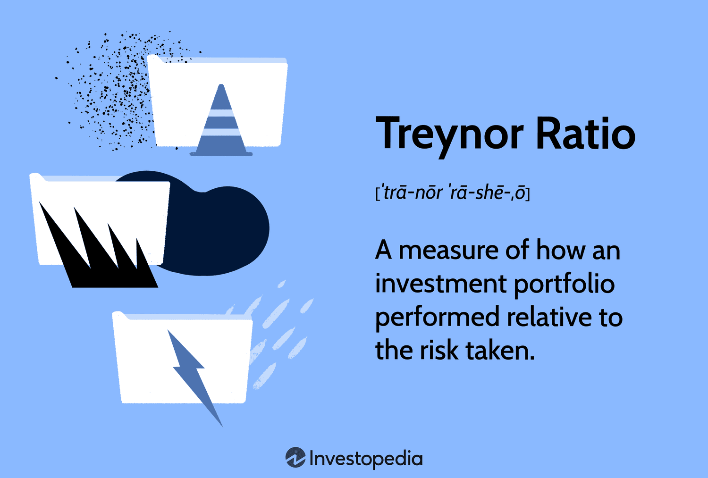

## Table of Contents

## What is the Treynor Index?

The Treynor Index, also known as the Treynor Ratio, is a measure used to evaluate the performance of an investment portfolio. It was developed by Jack Treynor and helps investors understand how well a portfolio is doing compared to the risk it takes. The index calculates the returns of a portfolio above the risk-free rate, divided by the portfolio's beta, which measures its sensitivity to market movements. In simple terms, it shows how much return an investor gets for each unit of market risk they take on.

This index is particularly useful for comparing the performance of different portfolios or funds that might have different levels of risk. If two portfolios have the same return but different betas, the one with the lower beta (less market risk) will have a higher Treynor Index, indicating better risk-adjusted performance. However, the Treynor Index is most effective when used to assess well-diversified portfolios, as it focuses on systematic risk (market risk) rather than unsystematic risk (specific to individual investments).

## Who developed the Treynor Index and when?

The Treynor Index was developed by a man named Jack Treynor. He came up with this idea in the 1960s. Jack Treynor was a smart person who worked on how to measure how good investments are.

The Treynor Index helps people see if their investments are doing well compared to the risks they take. It looks at how much money an investment makes above a safe investment, like a government bond, and then divides that by how much the investment moves with the market. This way, people can see if they are getting a good return for the risks they are taking.

## How is the Treynor Index calculated?

The Treynor Index is calculated by taking the difference between the return of a portfolio and the risk-free rate, then dividing that by the portfolio's beta. The risk-free rate is usually the return you get from a very safe investment, like a government bond. The portfolio's return is how much money the portfolio made over a certain time. Beta shows how much the portfolio moves with the market. If a portfolio has a beta of 1, it moves exactly with the market. If it's more than 1, it moves more than the market, and if it's less than 1, it moves less.

To find the Treynor Index, you first subtract the risk-free rate from the portfolio's return. This tells you how much extra return the portfolio made compared to a safe investment. Then, you divide that number by the portfolio's beta. This gives you the Treynor Index, which shows how much return you got for each unit of market risk you took. A higher Treynor Index means the portfolio did a better job of making money for the risk it took.

## What does the Treynor Index measure?

The Treynor Index measures how well an investment does compared to the risk it takes. It looks at how much more money an investment makes compared to a very safe investment, like a government bond. Then, it divides that extra money by how much the investment moves with the market. This helps people see if they are getting a good return for the risk they are taking.

The index is useful because it shows how much return you get for each unit of market risk. If two investments make the same amount of money but one is less risky, it will have a higher Treynor Index. This means it did a better job of making money for the risk taken. The Treynor Index works best for investments that are spread out across many different things, because it focuses on the risk that comes from the whole market, not just from one investment.

## How does the Treynor Index differ from the Sharpe Ratio?

The Treynor Index and the Sharpe Ratio both help people see how well their investments are doing compared to the risks they take. But they look at risk in different ways. The Treynor Index focuses on how much an investment moves with the market. It uses something called "beta" to measure this. Beta shows how much the investment goes up or down when the market goes up or down. The Treynor Index is good for looking at investments that are spread out across many different things because it only looks at the risk from the market, not from each individual investment.

On the other hand, the Sharpe Ratio looks at all kinds of risk, not just the risk from the market. It uses something called "standard deviation" to measure how much the investment's returns go up and down. This means the Sharpe Ratio can be used for any kind of investment, whether it's spread out or not. If you have an investment that's not spread out across many things, the Sharpe Ratio might be a better choice because it looks at all the risk, not just the market risk.

So, the main difference is that the Treynor Index is better for well-diversified investments and focuses on market risk, while the Sharpe Ratio is better for any type of investment and looks at total risk. Both are useful, but which one you use depends on what kind of investment you have and what kind of risk you want to measure.

## Why is the Treynor Index important for investors?

The Treynor Index is important for investors because it helps them see if their investments are doing a good job compared to the risks they are taking. It looks at how much more money an investment makes compared to a very safe investment, like a government bond. Then, it divides that extra money by how much the investment moves with the market. This tells investors if they are getting a good return for the risk they are taking. If one investment has a higher Treynor Index than another, it means the first investment is doing a better job of making money for the risk taken.

The Treynor Index is especially useful for investors who have their money spread out across many different investments. This is because it focuses on the risk that comes from the whole market, not just from one investment. By using the Treynor Index, investors can compare different portfolios or funds to see which one is performing better when you think about the market risk. This helps investors make smarter choices about where to put their money, so they can get the best return for the risk they are willing to take.

## Can you provide an example of how to use the Treynor Index in investment analysis?

Imagine you have two investment portfolios, Portfolio A and Portfolio B. Portfolio A made a return of 12% last year, while Portfolio B made a return of 10%. At first glance, Portfolio A looks like the better choice because it made more money. But to really understand which one is better, you need to look at the risk they took. Let's say the risk-free rate, which is what you'd get from a very safe investment like a government bond, was 2% last year. Portfolio A has a beta of 1.2, meaning it moves 20% more than the market, while Portfolio B has a beta of 0.8, meaning it moves 20% less than the market.

To use the Treynor Index, you first subtract the risk-free rate from each portfolio's return. For Portfolio A, that's 12% - 2% = 10%. For Portfolio B, it's 10% - 2% = 8%. Then, you divide these numbers by their betas. For Portfolio A, the Treynor Index is 10% / 1.2 = 8.33. For Portfolio B, it's 8% / 0.8 = 10. This means Portfolio B has a higher Treynor Index. Even though Portfolio A made more money, Portfolio B did a better job of making money for the risk it took. So, if you care about getting the best return for the risk you're taking, Portfolio B might be the better choice.

## What are the limitations of the Treynor Index?

The Treynor Index is really useful, but it has some limitations. One big problem is that it only looks at how much an investment moves with the market. This is called market risk or systematic risk. It doesn't look at other kinds of risk that might affect just one investment, like a company going bankrupt or a new law changing how a business works. These other risks are called unsystematic risk. So, if you have an investment that isn't spread out across many different things, the Treynor Index might not give you a full picture of the risk you're taking.

Another limitation is that the Treynor Index depends a lot on the beta of the investment. Beta is supposed to show how much an investment moves with the market, but it can be hard to measure accurately. Sometimes, the beta you use might not be right because it's based on past data, and the future might be different. Also, the Treynor Index assumes that investors can easily borrow and lend at the risk-free rate, which isn't always true in real life. So, while the Treynor Index is helpful, it's important to remember these limitations and maybe use it along with other tools to get a better understanding of your investments.

## How can the Treynor Index be used to compare different investment portfolios?

The Treynor Index is a great tool for comparing different investment portfolios because it shows how well each portfolio is doing compared to the risk it takes. It does this by looking at how much more money a portfolio makes compared to a very safe investment, like a government bond. Then, it divides that extra money by how much the portfolio moves with the market. This number is the Treynor Index. If one portfolio has a higher Treynor Index than another, it means that portfolio is doing a better job of making money for the risk it took. So, if you have two portfolios, you can use their Treynor Indexes to see which one is performing better when you think about the market risk.

For example, let's say you have two portfolios. Portfolio A made a return of 10% last year, and Portfolio B made a return of 8%. The risk-free rate was 2% last year. Portfolio A has a beta of 1.5, meaning it moves 50% more than the market, while Portfolio B has a beta of 1.0, meaning it moves exactly with the market. To compare them using the Treynor Index, you first subtract the risk-free rate from each portfolio's return. For Portfolio A, that's 10% - 2% = 8%. For Portfolio B, it's 8% - 2% = 6%. Then, you divide these numbers by their betas. For Portfolio A, the Treynor Index is 8% / 1.5 = 5.33. For Portfolio B, it's 6% / 1.0 = 6. Even though Portfolio A made more money, Portfolio B has a higher Treynor Index, so it did a better job of making money for the risk it took. This helps you decide which portfolio might be a better choice if you care about getting the best return for the risk you're taking.

## What role does beta play in the Treynor Index?

Beta is a very important part of the Treynor Index. It shows how much an investment moves with the market. If an investment has a beta of 1, it moves exactly the same as the market. If it's more than 1, like 1.5, it moves more than the market. If it's less than 1, like 0.5, it moves less than the market. The Treynor Index uses beta to measure the risk of an investment, but only the risk that comes from the whole market, not from just one investment. This is why the Treynor Index is good for investments that are spread out across many different things.

In the Treynor Index, you take the return of the investment and subtract the return of a very safe investment, like a government bond. Then, you divide that number by the beta of the investment. This tells you how much extra money you got for each unit of market risk you took. If two investments have the same return but different betas, the one with the lower beta will have a higher Treynor Index. This means it did a better job of making money for the risk it took. So, beta helps you see if you're getting a good return compared to the risk from the market.

## How can the Treynor Index be applied in the context of modern portfolio theory?

The Treynor Index fits really well with modern portfolio theory, which is all about how to build the best mix of investments. Modern portfolio theory says that you should think about how much risk you're taking when you choose where to put your money. The Treynor Index helps with this because it shows how much more money an investment makes compared to a very safe one, and then divides that by how much the investment moves with the market. This helps investors see if they are getting a good return for the risk they are taking. So, when you're building a portfolio using modern portfolio theory, you can use the Treynor Index to compare different investments and see which ones are doing a better job of making money for the risk they take.

In the context of modern portfolio theory, the Treynor Index is especially useful because it focuses on market risk, which is what modern portfolio theory cares about the most. This theory says that you can't get rid of all risk, but you can spread your money out to lower the risk that comes from just one investment. The Treynor Index helps you see how well your portfolio is doing at this. By using the Treynor Index, you can choose investments that have a good balance of risk and return, which is exactly what modern portfolio theory is all about. So, the Treynor Index can be a big help when you're trying to build a portfolio that follows the ideas of modern portfolio theory.

## What advanced considerations should be taken into account when using the Treynor Index for sophisticated investment strategies?

When using the Treynor Index for sophisticated investment strategies, it's important to consider how it works with other measures of risk and return. The Treynor Index looks at market risk, but it doesn't tell you about other kinds of risk, like the risk that comes from just one investment. So, if you're building a fancy investment plan, you might want to use the Treynor Index along with other tools, like the Sharpe Ratio, which looks at all kinds of risk. This way, you get a fuller picture of how risky your investments are. Also, the Treynor Index depends a lot on the beta of the investment, which can be hard to measure accurately. So, you might need to think about how reliable your beta numbers are and maybe use different ways to figure out beta to make sure you're getting the right information.

Another thing to think about is how the Treynor Index fits into your overall investment goals. If you're trying to build a portfolio that's spread out across many different investments, the Treynor Index can help you see which ones are doing a good job of making money for the market risk they take. But if your strategy involves investing in things that aren't well-diversified, the Treynor Index might not be the best tool to use alone. You might need to consider other factors, like how much the investments go up and down over time, or how they fit with your other investments. By using the Treynor Index as part of a bigger plan, you can make smarter choices about where to put your money and how to balance risk and return in a way that fits your investment goals.

## What is the Treynor Index?

The Treynor Index is an essential metric in finance, used to gauge the risk-adjusted performance of an investment by focusing on excess return per unit of market risk. Excess return is defined as the surplus return an investment provides over a risk-free alternative, such as government bonds or treasury bills. This measure is crucial as it highlights how well an investment compensates for its inherent risks, providing a benchmark against risk-free returns.

Central to the Treynor Index is the concept of beta, a statistical measure that represents the sensitivity or volatility of an investment in relation to the overall market movements. Beta indicates the degree to which a portfolio’s returns are expected to move in response to market changes. A higher beta implies more significant market-related risk, whereas a lower beta suggests relative stability against market fluctuations.

The Treynor Index is calculated using the formula:

$$
\text{Treynor Index} = \frac{\text{Portfolio Return} - \text{Risk-Free Rate}}{\text{Portfolio Beta}}
$$

where:
- **Portfolio Return** denotes the total return generated by the investment.
- **Risk-Free Rate** represents the theoretical return on an investment with zero risk, usually derived from government bonds or similar instruments.
- **Portfolio Beta** quantifies the portfolio's exposure to market risk.

A higher Treynor Index value signifies superior risk-adjusted performance, making it an effective tool for comparing investments with varying risk profiles. By isolating systematic or market risk, this index provides a consistent measure, allowing investors to evaluate how efficiently a portfolio rewards them for assuming market-related risks. This approach is advantageous when assessing the performance of diversified portfolios, where unsystematic risks are minimized.

## What is the Role of the Treynor Index in Investment Performance?

The Treynor Index provides a compelling approach to evaluating investment performance by concentrating on systematic risk, which represents the inherent risk associated with the entire market. This focus distinguishes it from other performance metrics like the Sharpe Ratio, which considers both systematic and unsystematic risks. The Treynor Index is primarily advantageous for investors with well-diversified portfolios where unsystematic risk has been minimized. In this context, the Treynor Index measures how efficiently a portfolio compensates investors for bearing market risk.

The Treynor Index is defined by the formula:

$$
T = \frac{R_p - R_f}{\beta_p}
$$

where $T$ is the Treynor Index, $R_p$ is the portfolio return, $R_f$ is the risk-free rate, and $\beta_p$ is the portfolio's beta.

This focus on systematic risk makes the Treynor Index particularly valuable for portfolio managers who seek to understand the relationship between portfolio returns and market risk. By emphasizing the excess return per unit of systematic risk, the Treynor Index allows fund managers to benchmark and compare the performance of various portfolios with differing levels of market exposure. This capability is crucial for optimizing portfolio management strategies.

Managers can utilize the Treynor Index to allocate resources more effectively. For instance, in a mutual fund, recognizing which portfolios yield higher Treynor Index values can guide the allocation of funds toward investments that offer superior risk-adjusted returns. This can lead to enhanced portfolio performance by focusing on the systematic risk-return tradeoff.

Incorporating the Treynor Index into performance analysis contributes to more informed investment decisions. Investors who use this index can better assess the potential returns relative to the market risks undertaken. By integrating the Treynor Index along with other financial metrics, investors can achieve a holistic view of portfolio performance, aiding in the development of robust investment strategies that optimize returns while managing risk effectively.

## What is the relationship between Algorithmic Trading and the Treynor Index?

Algorithmic trading employs sophisticated algorithms to automate and optimize trading decisions, necessitating robust performance metrics to gauge strategy effectiveness. The Treynor Index stands out as a pivotal tool in this context, as it assesses how trading strategies perform relative to market risks. By focusing on systematic risks through the beta coefficient, the Treynor Index measures the excess return per unit of market risk, providing insights into the efficacy of a trading strategy within an algorithmic framework.

In the development of [algorithmic trading](/wiki/algorithmic-trading) strategies, the Treynor Index assists in identifying configurations that optimize returns relative to market risk. The formula used to calculate the Treynor Index is:

$$
\text{Treynor Index} = \frac{\text{Portfolio Return} - \text{Risk-Free Rate}}{\text{Portfolio Beta}}
$$

This formula helps algorithmic traders to refine their strategies by emphasizing those that provide higher risk-adjusted returns. 

Backtesting is an essential component of algorithmic trading, allowing traders to simulate a strategy's performance using historical data. Incorporating the Treynor Index in [backtesting](/wiki/backtesting) processes enables traders to pinpoint strategies that not only generate high returns but also exhibit superior risk-adjusted performance. As a result, algorithmic strategies can be fine-tuned based on Treynor Index outcomes, enhancing overall trading model efficacy.

By analyzing these outcomes, traders can adjust algorithm parameters to better align with desired risk-return profiles. These adjustments might involve re-calibrating beta sensitivity, modifying asset selection criteria, or altering risk management protocols to achieve superior market risk compensation. As algorithmic trading continually evolves, the Treynor Index serves as a valuable compass for navigating the complex landscape of market risk evaluation and strategy optimization.

## What are the practical applications and can you provide a real-world example?

Hedge funds and portfolio managers frequently utilize the Treynor Index as a critical tool in evaluating fund performance. By focusing on risk-adjusted returns, it allows for a deeper understanding of how a particular investment is compensating investors for the risks they are taking. 

To illustrate how the Treynor Index can impact fund assessment, consider a fund that posts high returns. While impressive on the surface, if the fund's beta is also considerably high, indicating substantial [volatility](/wiki/volatility-trading-strategies) and market correlation, its Treynor Index score may not reflect favorable performance. This apparent paradox arises because the index assesses performance by accounting for market risk—the cornerstone of its evaluative measure—rather than solely relying on return figures, thereby offering a more sophisticated analysis of performance linked with inherent systematic risk.

For example, imagine two portfolios: Portfolio A exhibits high returns but is subjected to significant market fluctuations, resulting in a high beta. Conversely, Portfolio B presents moderate returns but with lower market risk, reflected in a lower beta. Calculating the Treynor Index for both scenarios provides a clear insight:

$$
Treynor \ Index = \frac{\text{Portfolio Return} - \text{Risk-Free Rate}}{\text{Portfolio Beta}}
$$

If Portfolio A has a return of 15%, a risk-free rate of 2%, and a beta of 1.8, its Treynor Index will be:

$$
Treynor \ Index_A = \frac{15\% - 2\%}{1.8} = 7.22\%
$$

For Portfolio B with a return of 8%, the same risk-free rate, and a beta of 0.9, the calculation is:

$$
Treynor \ Index_B = \frac{8\% - 2\%}{0.9} = 6.67\%
$$

Despite having lower absolute returns, Portfolio B achieves a competitive Treynor Index score relative to risk undertaken.

This detailed analysis via the Treynor Index aids investors in discerning which portfolio is more efficiently compensating for market risk. Consequently, such insights help in identifying investments that optimize returns concerning the level of market risk. Portfolio managers are thereby empowered to make strategic decisions that align with their risk management objectives and investor expectations.

## References & Further Reading

[1]: ["Portfolio Theory and Capital Markets"](https://www.gsb.stanford.edu/faculty-research/books/portfolio-theory-capital-markets) by William F. Sharpe

[2]: ["Investment Valuation: Tools and Techniques for Determining the Value of Any Asset"](https://archive.org/details/investmentvaluat0000damo_n6k9) by Aswath Damodaran

[3]: Treynor, J. L. (1965). ["How to Rate Management of Investment Funds"](https://onlinelibrary.wiley.com/doi/10.1002/9781119196679.ch10). Harvard Business Review.

[4]: Jensen, M. C. (1968). ["The Performance of Mutual Funds in the Period 1945–1964"](https://onlinelibrary.wiley.com/doi/full/10.1111/j.1540-6261.1968.tb00815.x). Journal of Finance.

[5]: Black, F., & Scholes, M. (1973). ["The Pricing of Options and Corporate Liabilities."](https://www.cs.princeton.edu/courses/archive/fall09/cos323/papers/black_scholes73.pdf) Journal of Political Economy.

[6]: ["Modern Portfolio Theory and Investment Analysis"](https://www.amazon.com/Modern-Portfolio-Theory-Investment-Analysis/dp/1118469941) by Edwin J. Elton, Martin J. Gruber, Stephen J. Brown, and William N. Goetzmann