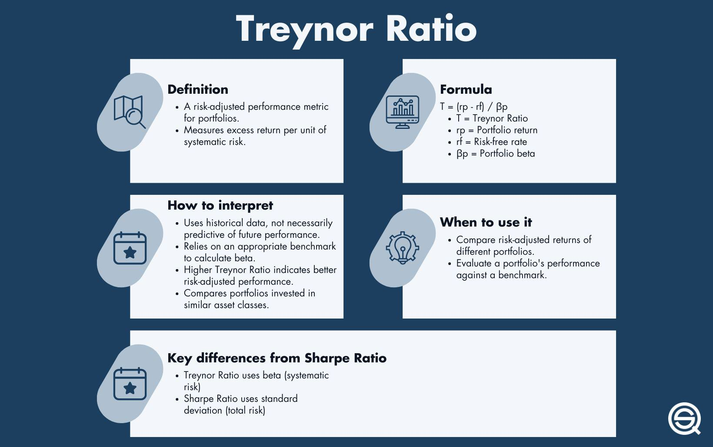

The finance and investment sectors are continuously transforming, with a heightened emphasis on risk measurement and performance evaluation, which are becoming essential for both investors and traders. Amidst various metrics used to assess investment performance, the Treynor Ratio stands out, especially in the context of algorithmic trading. This article aims to shed light on the Treynor Ratio, elaborating on its importance and functionality in assessing risk-adjusted returns. We will examine how the Treynor Ratio plays a crucial role in evaluating investment performance and how it is applied in algorithmic trading strategies. By comprehending these aspects, investors can improve portfolio management and enhance investment strategies.

## Table of Contents



## Understanding the Treynor Ratio

The Treynor Ratio, also known as the reward-to-volatility ratio, is a prominent financial metric used to evaluate the risk-adjusted return of an investment portfolio. It measures how much excess return is achieved per unit of market risk, which is quantified using a portfolio's beta. The Treynor Ratio is calculated with the following formula:

$$
\text{Treynor Ratio} = \frac{\text{Portfolio Return} - \text{Risk-Free Rate}}{\beta}
$$

Here, the **Portfolio Return** represents the average return of the portfolio over a specific period, and the **Risk-Free Rate** is the return on an investment with zero risk, typically represented by government treasury rates. The **beta (β)** is an indicator of the portfolio's systematic risk, reflecting its volatility in relation to overall market movements.

A key characteristic of the Treynor Ratio is its exclusive focus on systematic risk, which is the risk inherent to the entire market or a market segment. Unlike unsystematic risk, which can be mitigated through diversification, systematic risk is unavoidable and affects all investments. The Treynor Ratio, therefore, provides insight into how well a manager or strategy compensates for this type of risk.

Higher Treynor Ratios are indicative of a better risk-adjusted performance. A higher ratio suggests that an investment is yielding a higher return per unit of market risk, making it particularly attractive for investors with diversified portfolios who are concerned primarily with systematic risk. By utilizing this ratio, investors can compare different portfolios or assess the same portfolio over different periods to evaluate its performance in terms of compensating against market [volatility](/wiki/volatility-trading-strategies).

The practical use of the Treynor Ratio lies in its ability to inform strategic investment decisions. By quantifying performance relative to market risk, it aids in optimizing portfolio management and guiding investors toward choices that align with their risk tolerance and return expectations.

## The Role of the Treynor Ratio in Investment Performance

The Treynor Ratio plays a critical role in evaluating the risk-adjusted returns of a portfolio, especially in distinguishing between systematic and total risk. Systematic risk, also known as market risk, is inherent to the entire market or market segment, and cannot be eliminated through diversification. This metric is useful because it isolates the compensation an investor receives for taking on systematic risk, as opposed to total risk, which includes unsystematic risk that can be mitigated by holding a diversified portfolio.

The formula for the Treynor Ratio is:

$$
\text{Treynor Ratio} = \frac{R_p - R_f}{\beta_p}
$$

Here, $R_p$ represents the portfolio return, $R_f$ is the risk-free rate of return, and $\beta_p$ is the portfolio's beta, reflecting its sensitivity to market movements. A higher Treynor Ratio indicates a more favorable risk-adjusted return, signifying that the portfolio is generating greater excess returns relative to the market risk it assumes.

Investors utilize the Treynor Ratio to benchmark the performance of portfolios or mutual funds against others with similar market risk profiles. This comparison is essential for determining which investments offer a better return for their exposure to market swings. The emphasis on systematic risk means the Treynor Ratio is particularly beneficial for investors aiming to discern how well a manager or strategy compensates for market-wide risks.

In selecting investment opportunities, an investor can employ the Treynor Ratio to rank funds or portfolios with similar beta values, prioritizing those with higher ratios. This strategy ensures the selected investments are providing adequate returns for the inherent market risks, thereby optimizing the investment process through a more informed allocation of resources.

## Implementing the Treynor Ratio in Algorithmic Trading

Algorithmic trading utilizes pre-defined rules and sophisticated algorithms to execute trades efficiently and at speeds unattainable by human traders. Within this framework, the Treynor Ratio becomes an invaluable tool for measuring the risk-adjusted performance of trading strategies. The Treynor Ratio is calculated as follows:

$$
\text{Treynor Ratio} = \frac{\text{Portfolio Return} - \text{Risk-Free Rate}}{\beta}
$$

This measure focuses on systematic risk, represented by beta ($\beta$), assessing the portfolio's sensitivity to market movements. In [algorithmic trading](/wiki/algorithmic-trading), the Treynor Ratio is critical for ensuring that trading strategies are adequately compensated for the risks undertaken. A higher Treynor Ratio indicates superior risk-adjusted returns, which is crucial for evaluating the efficacy of algorithmic strategies.

By analyzing historical trading data through the lens of the Treynor Ratio, traders can enhance their algorithmic models. This involves adjusting the algorithms to maintain an optimal balance between risk and reward. For instance, traders can backtest their strategies using historical market data, computing the Treynor Ratio to evaluate past performance. This retrospective analysis enables the identification of periods where the algorithm performed well or poorly, guiding modifications to the algorithm to better adapt to market conditions.

Here's a simple example in Python demonstrating how to calculate the Treynor Ratio using historical return data and beta:

```python
def treynor_ratio(portfolio_returns, risk_free_rate, beta_value):
    average_return = sum(portfolio_returns) / len(portfolio_returns)
    return (average_return - risk_free_rate) / beta_value

# Example data
returns = [0.08, 0.10, 0.12]  # Portfolio returns
risk_free = 0.03  # Risk-free rate
beta = 0.9  # Portfolio beta

ratio = treynor_ratio(returns, risk_free, beta)
print(f'The Treynor Ratio is: {ratio}')
```

Incorporating the Treynor Ratio into algorithmic trading strategies can provide a quantitative basis for assessing performance, revealing insights that enhance decision-making processes. This approach not only optimizes current strategies but also facilitates the development of new models that align closely with investors' risk-return profiles, ultimately leading to more informed and strategically sound trading operations.

## Addressing Negative Treynor Ratios

A negative Treynor Ratio indicates that the returns generated by an investment strategy do not justify the risk exposure, pointing to potential inefficiencies within the strategy. In such scenarios, it becomes crucial for traders to reassess their approach, paying particular attention to risk management and alignment with current market dynamics.

Firstly, traders should evaluate their risk management protocols. These protocols should be tailored to respond to market conditions effectively, ensuring that the strategies employed are not only reactive but also proactive in mitigating identified risks. One way to achieve this is through diversification, which spreads risk across different asset classes or securities, thereby reducing the impact of any single underperforming investment on the overall portfolio.

Regular [backtesting](/wiki/backtesting) is another essential strategy for addressing a negative Treynor Ratio. By simulating how strategies would have performed based on historical data, traders can identify weaknesses and inefficiencies in their risk management approaches. Backtesting not only validates the robustness of existing strategies but also provides insights into potential adjustments that could enhance risk-adjusted returns. This iterative process of strategy testing and refinement is central to avoiding adverse outcomes in real-world trading environments.

In summary, negative Treynor Ratios serve as a signal for traders to scrutinize and refine their strategies. Through effective diversification and routine backtesting, they can better manage risk exposure and improve the overall efficiency of their investment approaches. Adopting these measures helps ensure that a strategy's returns are commensurate with the risks undertaken, leading to a more balanced and effective investment framework.

## Applications and Limitations of the Treynor Ratio

The Treynor Ratio is a valuable metric for evaluating the risk-adjusted performance of investment portfolios, especially when assessing systematic risk, which is the inherent risk associated with the overall market. Despite its utility, the Treynor Ratio does present certain limitations, primarily stemming from its focus on systematic risk while overlooking unsystematic or idiosyncratic risk, which arises from specific components of the portfolio such as individual stocks or sectors.

Unsystematic risk can significantly impact a portfolio's overall performance, and it is not captured by the Treynor Ratio because it uses beta to measure the portfolio's sensitivity to market movements. Consequently, a well-diversified portfolio that minimizes unsystematic risk could still be at risk if the Treynor Ratio is used in isolation. To address this limitation, investors should assess a portfolio's unsystematic risk exposure alongside systematic risk to gain a comprehensive understanding of its risk profile.

To achieve a holistic view of investment performance, it is crucial to complement the Treynor Ratio with other performance metrics such as the Sharpe Ratio and Jensen's Alpha. The Sharpe Ratio helps evaluate both systematic and unsystematic risks by considering the portfolio's standard deviation in its calculation. Jensen's Alpha, on the other hand, provides insight into a manager's stock-[picking](/wiki/asset-class-picking) capabilities by measuring the excess return of a portfolio over that predicted by the Capital Asset Pricing Model (CAPM). By using these metrics in conjunction with the Treynor Ratio, investors can better understand and manage both types of risks.

Here's a Python code snippet that shows how you might calculate these additional metrics alongside the Treynor Ratio:

```python
def treynor_ratio(portfolio_return, risk_free_rate, beta):
    return (portfolio_return - risk_free_rate) / beta

def sharpe_ratio(portfolio_return, risk_free_rate, portfolio_std_dev):
    return (portfolio_return - risk_free_rate) / portfolio_std_dev

def jensens_alpha(portfolio_return, risk_free_rate, market_return, beta):
    expected_return = risk_free_rate + beta * (market_return - risk_free_rate)
    return portfolio_return - expected_return

# Example values
portfolio_return = 0.15
risk_free_rate = 0.03
beta = 1.2
portfolio_std_dev = 0.25
market_return = 0.10

treynor = treynor_ratio(portfolio_return, risk_free_rate, beta)
sharpe = sharpe_ratio(portfolio_return, risk_free_rate, portfolio_std_dev)
alpha = jensens_alpha(portfolio_return, risk_free_rate, market_return, beta)

print(f"Treynor Ratio: {treynor}")
print(f"Sharpe Ratio: {sharpe}")
print(f"Jensen's Alpha: {alpha}")
```

Understanding the limitations of the Treynor Ratio helps investors and traders use it more effectively as part of their overall risk management strategies. By integrating multiple performance metrics, they can make more informed decisions that account for the complete spectrum of risks influencing their portfolios.

## Conclusion

The Treynor Ratio remains a fundamental metric in finance, offering a lens through which risk-adjusted performance can be effectively measured. This ratio’s primary strength lies in its focus on systematic risk, making it particularly valuable for evaluating investment portfolios and individual assets that are part of broader market movements.

In algorithmic trading, where rapid, data-driven decisions are essential, the Treynor Ratio provides a vital tool for assessing and enhancing trading strategies. By focusing on the relationship between excess returns and market risk, algorithmic traders can ensure that their strategies are balanced, providing optimal returns for the level of risk inherent in their trading models. The systematic application of this metric facilitates fine-tuning algorithms to maintain a competitive edge in various market conditions.

Furthermore, the Treynor Ratio's integration into portfolio management underscores its strategic importance. By providing insights into how a portfolio’s performance correlates with market risk, investors can make informed decisions, enhancing risk management practices and maximizing returns.

Ultimately, understanding and applying the Treynor Ratio allows investors and traders to refine their approaches to risk management. By optimizing investment strategies with this metric, financial professionals can achieve a balanced and advantageous risk-reward profile, ensuring that their portfolios are well-positioned to capitalize on market opportunities while mitigating unnecessary risks. This enhances the sustainability and profitability of investment strategies over the long term.

## References & Further Reading

[1]: Treynor, J. L. (1965). ["How to Rate Management of Investment Funds."](https://onlinelibrary.wiley.com/doi/10.1002/9781119196679.ch10) Harvard Business Review, 43(1), 63-75.

[2]: Bodie, Z., Kane, A., & Marcus, A. J. (2014). ["Investments and Portfolio Management."](https://books.google.com/books/about/EBOOK_Investments_Global_edition.html?id=BMsvEAAAQBAJ) McGraw-Hill Education.

[3]: Fabozzi, F. J. & Markowitz, H. M. (2011). ["Portfolio Theory and Risk Management."](https://onlinelibrary.wiley.com/doi/book/10.1002/9781118267028) Wiley.

[4]: Sharpe, W. F. (1966). ["Mutual Fund Performance."](https://www.scirp.org/reference/ReferencesPapers?ReferenceID=1451307) Journal of Business, 39(1), 119-138.

[5]: Grinold, R. C., & Kahn, R. N. (2000). ["Active Portfolio Management."](https://www.amazon.com/Active-Portfolio-Management-Quantitative-Controlling/dp/0070248826) McGraw-Hill Education.