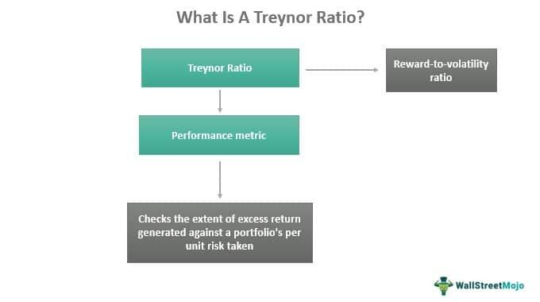

Algorithmic trading has transformed financial markets by enabling traders to leverage pre-defined rules and sophisticated algorithms for decision-making. This shift necessitates efficient performance metrics to evaluate strategy effectiveness. The Treynor Ratio stands as a pivotal metric in this domain, assessing the risk-adjusted performance of investment portfolios. This ratio measures the returns earned above the risk-free rate relative to the market risk, encapsulated by beta. In mathematical terms, it is expressed as:

$$
\text{Treynor Ratio} = \frac{R_p - R_f}{\beta}
$$

where $R_p$ represents the portfolio return, $R_f$ is the risk-free rate, and $\beta$ denotes the portfolio's beta, which indicates systematic risk exposure.

A negative Treynor Ratio, particularly within algorithmic trading, often signals issues with a trading strategy and its risk exposure. It suggests that the strategy may not adequately compensate for the risk undertaken, prompting a reassessment of its effectiveness. This article explores the implications of a negative Treynor Ratio in algorithmic trading and discusses how traders can address these challenges effectively.

## Table of Contents

## Understanding the Treynor Ratio

The Treynor Ratio is a key measure in the evaluation of portfolio performance, especially for assessing risk-adjusted returns. Named after Jack Treynor, one of the pioneers in the field of finance, this ratio specifically quantifies the returns generated over and above the risk-free rate of return, in relation to the unit of market risk, commonly represented by beta. 

Beta ($\beta$) quantifies a portfolio’s sensitivity to market movements, with a beta of 1 indicating that the portfolio’s price will move with the market. A beta greater than 1 indicates more risk than the market, while a beta less than 1 indicates less risk than the market. The Treynor Ratio formula is represented as follows:

$$

\text{Treynor Ratio} = \frac{R_p - R_f}{\beta}
$$

Where:
- $R_p$ is the return of the portfolio.
- $R_f$ is the risk-free rate of return.
- $\beta$ is the market risk measure or beta of the portfolio.

Unlike the Sharpe Ratio, which evaluates returns against total risk encompassing both systematic and unsystematic risks, the Treynor Ratio narrows its focus to systematic risk alone. Systematic risk, also known as market risk, refers to the inherent risk that affects the entire market or sector, making it unavoidable through diversification. This distinct focus makes the Treynor Ratio particularly useful for investors or portfolio managers who are interested in understanding how well a portfolio compensates its investors for market risks, as opposed to risks that can be mitigated through diversification.

By isolating this market-specific risk element, the Treynor Ratio allows for a clearer analysis and comparison of performance across various portfolios, especially those that share similar market exposures but differ in their allocation and strategic focus. Such precision in evaluating performance per unit of market risk can aid in identifying which portfolios are maximizing returns relative to their exposure to unavoidable market fluctuations.

## What Does a Negative Treynor Ratio Indicate?

A negative Treynor Ratio is a clear indicator that a portfolio or trading strategy has not managed to outperform the risk-free rate when considering the amount of market risk undertaken, as measured by beta. The Treynor Ratio is expressed mathematically as:

$$
\text{Treynor Ratio} = \frac{R_p - R_f}{\beta_p}
$$

where $R_p$ is the return of the portfolio, $R_f$ is the risk-free rate, and $\beta_p$ is the beta of the portfolio. When the result is negative, it implies that the excess return over the risk-free rate is negative, or the portfolio has demonstrated negative returns relative to the risk taken.

This situation signals that the compensation for the risk employed in the strategy is inadequate, urging a reassessment of the adopted trading strategy. For instance, if high market risks are not paired with commensurate returns, the strategy may be flawed or misaligned with current market conditions.

In [algorithmic trading](/wiki/algorithmic-trading), a negative Treynor Ratio becomes particularly troubling. Algorithms, by design, should adeptly handle market fluctuations and exploit market opportunities. However, a negative ratio suggests inefficiencies, possibly due to the algorithm's failure in adjusting to [volatility](/wiki/volatility-trading-strategies) or market changes. Algorithms are built to exploit predictable patterns; if these predictions result in underperformance relative to their risk exposure, it urges a reevaluation of algorithmic parameters, risk management approach, or overall strategic alignment.

## Implications of a Negative Treynor Ratio in Algo Trading

Algorithmic strategies with a negative Treynor Ratio potentially expose portfolios to elevated levels of market risk without achieving commensurate returns. This outcome can underscore significant concerns for traders relying on automated systems, as these strategies are fundamentally designed to adeptly manage and exploit market fluctuations.

When a Treynor Ratio is negative, it implies that the portfolio's returns do not justify the market risk undertaken, as measured by beta. Beta quantifies the portfolio's sensitivity to market movements, and if the associated returns fail to surpass the risk-free rate, the strategy's effectiveness is called into question. For example, if the risk-free rate is denoted as $R_f$, portfolio return as $R_p$, and beta as $\beta$, the Treynor Ratio is calculated as:

$$
\text{Treynor Ratio} = \frac{R_p - R_f}{\beta}
$$

A negative result indicates that the strategy is underperforming relative to the expected return from risk-free investments.

The negative Treynor Ratio forces traders to evaluate the volatility and unpredictability that may stem from the algorithmic models. In high-volatility markets, the inability of a strategy to deliver returns proportional to its risk exposure necessitates a reassessment. The algorithm's performance metrics must be closely scrutinized to determine if there is a mismatch between the model's assumptions and real-world conditions.

Effective risk management and strategic alignment are imperative for algorithmic trading strategies. Traders must consider whether the algorithm requires recalibration to better address the identified risk factors. This may involve modifying the algorithm to improve its responsiveness to market risk or rebalancing investment allocations to mitigate exposure.

In addressing a negative Treynor Ratio, other strategic considerations include modifying risk management frameworks and possibly revising the algorithm to accommodate broader market conditions. Implementing more dynamic risk controls may also be necessary to adapt to market variability efficiently.

Overall, achieving a balanced risk-reward profile through continuous monitoring and adjustment of algorithms ensures that strategies are robust and aligned with market dynamics.

## Possible Causes of a Negative Treynor Ratio

Market conditions play a crucial role in affecting the performance of algorithmic trading strategies, leading to a potentially negative Treynor Ratio. Changes in market dynamics, such as increased volatility, shifts in interest rates, or geopolitical events, can impact asset prices and market behavior. These external factors can diminish the performance of a trading strategy, particularly if the strategy is not well-equipped to handle such fluctuations, thereby affecting the overall risk-return profile and resulting in a negative Treynor Ratio.

Overfitting is a significant concern in the development of algorithmic trading strategies. When algorithms are overly tailored to historical data, they may incorporate noise instead of underlying patterns, leading to poor performance in real-world scenarios. This occurs when the model fits the data too closely, capturing specific instances rather than general trends. Such overfitting can cause the strategy to falter in changing market conditions, as it may not adapt well to new data or scenarios, contributing to a negative Treynor Ratio. Detecting overfitting can be achieved through proper validation techniques, such as cross-validation, and employing regularization methods to prevent the model from becoming too complex.

Moreover, inadequate diversification within a trading strategy can increase its vulnerability to specific risks, reflected by a higher beta. Beta measures the sensitivity of a portfolio's returns to market movements; a higher beta indicates greater systematic risk. When an algorithmic strategy concentrates on a narrow segment of the market, it may experience increased beta, leading to disproportionate effects from market changes. This lack of diversification can skew the Treynor Ratio, as it fails to account for other market segments that could mitigate risk exposure.

Addressing these causes involves several approaches. Ensuring that algorithms accommodate changing market conditions through adaptive mechanisms can help maintain performance consistency. Techniques such as regular [backtesting](/wiki/backtesting) with updated data and applying [machine learning](/wiki/machine-learning) models that adjust to new information can enhance robustness. Diversification can be achieved by expanding the range of assets and sectors that the algorithm targets, thus reducing reliance on a single market segment and evening out beta influences across different investments.

## Strategies to Address Negative Treynor Ratio

To address a negative Treynor Ratio in algorithmic trading strategies, several key approaches can be implemented to enhance performance and risk management. These approaches are pivotal for readjusting strategies to better align returns with the market risks assumed.

1. **Reassessing Risk Factors**:
   - A crucial step is to thoroughly review the risk factors embedded within the algorithm. This involves scrutinizing the model's inputs that contribute to its risk exposure. If certain elements predominantly drive the portfolio's beta, adjustments may be necessary to redefine or recalibrate these inputs.
   - This might entail modifying the parameters that dictate trading signals or altering the weights assigned to volatile assets that disproportionately influence the strategy's performance relative to market risk.

2. **Enhancing Diversification**:
   - Diversification is a fundamental strategy in mitigating unsystematic risk and stabilizing returns. For algorithms, it means expanding the range of market segments they engage in and not confining the strategy to single asset types or sectors, which can exaggerate risk.
   - By increasing the portfolio's scope, the algorithm can capture a wider array of opportunities, thereby smoothing out performance inconsistencies that contribute to a negative Treynor Ratio.

3. **Regular Backtesting and Forward-Testing**:
   - Consistent backtesting on historical data helps ensure that algorithms perform as expected over various market conditions. This process involves simulating different market scenarios to assess strategy robustness.
   - Forward-testing, or paper trading, offers a more dynamic evaluation by applying the strategy in real time without financial risks. It validates the adaptability of the algorithm to current market trends and conditions.
   - Both testing phases are integral in identifying overfitting—where the algorithm is too closely tailored to past data—and adjusting the strategy to remain effective without succumbing to past biases.

By implementing these strategies, algorithmic traders can mitigate the issues signaled by a negative Treynor Ratio, leading to more resilient trading systems capable of achieving balanced risk-adjusted returns.

## Conclusion

A negative Treynor Ratio serves as a crucial indicator for algorithmic traders, highlighting potential challenges in capturing adequate returns for the risk taken. This metric's negative value suggests that the risk-adjusted performance of an investment could be underwhelming, which necessitates a closer examination of the strategy deployed. Understanding the underlying causes, such as excessive risk exposure or inefficiencies within the algorithm, allows traders to implement appropriate corrections and improve the overall performance of their strategies.

To address these issues, traders should consider revisiting the risk factors integrated into their algorithms and recalibrating them to ensure they align accurately with current market conditions. Enhancing diversification within the algorithm can also help manage beta effectively and reduce exposure to concentrated risks. Moreover, conducting regular backtesting and forward-testing can help in identifying whether the algorithm is adapting well to live data without succumbing to overfitting issues.

By consistently assessing performance metrics like the Treynor Ratio, traders can safeguard against inefficient strategies. This not only ensures better risk management but also facilitates efficient, risk-adjusted decision-making in algorithmic trading environments. Regular evaluation and adaptation based on quantitative data can significantly enhance a trader's ability to navigate a complex and dynamic market landscape successfully.

## References & Further Reading

[1]: Bergstra, J., Bardenet, R., Bengio, Y., & Kégl, B. (2011). ["Algorithms for Hyper-Parameter Optimization."](https://papers.nips.cc/paper/4443-algorithms-for-hyper-parameter-optimization) Advances in Neural Information Processing Systems 24.

[2]: ["Advances in Financial Machine Learning"](https://www.amazon.com/Advances-Financial-Machine-Learning-Marcos/dp/1119482089) by Marcos Lopez de Prado

[3]: ["Evidence-Based Technical Analysis: Applying the Scientific Method and Statistical Inference to Trading Signals"](https://www.amazon.com/Evidence-Based-Technical-Analysis-Scientific-Statistical/dp/0470008741) by David Aronson

[4]: ["Machine Learning for Algorithmic Trading"](https://github.com/stefan-jansen/machine-learning-for-trading) by Stefan Jansen

[5]: ["Quantitative Trading: How to Build Your Own Algorithmic Trading Business"](https://books.google.com/books/about/Quantitative_Trading.html?id=j70yEAAAQBAJ) by Ernest P. Chan