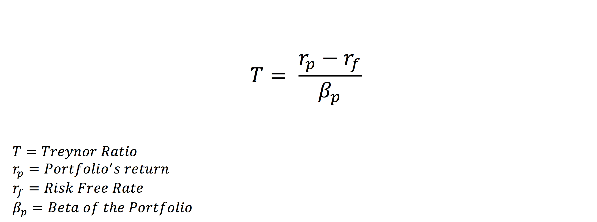

## Table of Contents

## What is the Treynor Ratio and why is it important in finance?

The Treynor Ratio is a measure used in finance to see how well an investment has done compared to the risk it took to get those returns. It was created by Jack Treynor. The ratio looks at the extra return an investment gives over a safe investment like a government bond, and then divides that by the investment's beta. Beta is a number that shows how much the investment's price moves compared to the overall market. A higher Treynor Ratio means the investment did a better job of earning more money for the risk it took.

This ratio is important because it helps investors understand if the risk they are taking is worth it. By comparing the Treynor Ratios of different investments, investors can see which ones are giving them the best return for the amount of market risk they are taking. This is really useful for people who want to make sure their money is working hard but also want to keep an eye on how much risk they are taking. It's a tool that helps balance the desire for high returns with the need to manage risk wisely.

## How is the Treynor Ratio calculated?

The Treynor Ratio is calculated by taking the difference between the return of an investment and the risk-free rate, then dividing that by the investment's beta. The return of the investment is how much money it made over a certain time. The risk-free rate is usually the return you'd get from a very safe investment like a government bond. Beta is a number that shows how much an investment moves with the market. If an investment has a beta of 1, it moves exactly with the market. A beta higher than 1 means it moves more than the market, and a beta less than 1 means it moves less.

For example, if an investment made a 10% return and the risk-free rate was 2%, the difference would be 8%. If the investment's beta was 1.5, you would divide 8% by 1.5 to get the Treynor Ratio. This would be about 5.33. A higher Treynor Ratio means the investment did a good job of earning more money for the risk it took. By comparing the Treynor Ratios of different investments, investors can see which ones are giving them the best return for the amount of market risk they are taking.

## What does a higher Treynor Ratio indicate about an investment?

A higher Treynor Ratio means that an investment is doing a good job of earning more money for the risk it took. It shows that the investment is giving you a better return compared to how much it moves with the market. If two investments have the same return, the one with the higher Treynor Ratio is better because it took less market risk to get that return.

This is important for people who want to make sure their money is working hard but also want to keep an eye on how much risk they are taking. By looking at the Treynor Ratio, you can compare different investments and see which one is giving you the best bang for your buck in terms of market risk. It helps you decide if the risk you are taking is worth the extra return you are getting.

## Can you explain the difference between the Treynor Ratio and the Sharpe Ratio?

The Treynor Ratio and the Sharpe Ratio are both ways to see how well an investment is doing compared to the risk it took. But they look at risk in different ways. The Treynor Ratio uses something called beta to measure risk. Beta shows how much an investment moves with the market. So, the Treynor Ratio is good for comparing investments that you can't easily buy and sell, like stocks in a mutual fund, because it focuses on how the whole market moves.

The Sharpe Ratio, on the other hand, uses something called standard deviation to measure risk. Standard deviation shows how much an investment's returns go up and down over time. This makes the Sharpe Ratio good for comparing all kinds of investments, even ones you can buy and sell easily, like stocks you can trade every day. So, if you want to know how an investment is doing compared to how much it could go up and down, you would use the Sharpe Ratio.

In simple terms, the Treynor Ratio is about how an investment does compared to the market's ups and downs, while the Sharpe Ratio is about how it does compared to its own ups and downs. Both are useful, but they give you different information about risk and return.

## How does beta factor into the Treynor Ratio?

Beta is a key part of the Treynor Ratio. It shows how much an investment moves when the market moves. If an investment has a beta of 1, it moves exactly with the market. If the beta is more than 1, the investment moves more than the market, and if it's less than 1, it moves less. The Treynor Ratio uses this beta to measure the risk of an investment, but only the risk that comes from the market moving.

In the Treynor Ratio, you take the return of the investment and subtract the return you could get from a safe investment, like a government bond. Then, you divide that number by the investment's beta. This tells you how much extra return you're getting for the market risk you're taking. A higher Treynor Ratio means the investment is giving you a better return for the amount of market risk it's taking. So, beta is really important because it helps you see if the risk you're taking is worth the extra return you're getting.

## What are the limitations of using the Treynor Ratio to evaluate investments?

The Treynor Ratio has some problems when you use it to look at investments. One big problem is that it only looks at the risk that comes from the market moving, which is called systematic risk. It doesn't care about other kinds of risk, like how much the price of the investment might go up and down on its own. This can be a problem if you want to know the total risk of an investment, not just how it moves with the market.

Another issue is that the Treynor Ratio depends a lot on the beta of the investment. But figuring out the right beta can be hard, and different ways of calculating it can give you different numbers. This means the Treynor Ratio might not be very accurate if the beta is not right. Also, the Treynor Ratio is best for looking at investments that you can't easily buy and sell, like stocks in a mutual fund. If you want to compare all kinds of investments, you might need to use something else, like the Sharpe Ratio, which looks at the total risk, not just the market risk.

## How can the Treynor Ratio be used in portfolio management?

In portfolio management, the Treynor Ratio helps managers figure out how well their investments are doing compared to the risk they are taking. It looks at the extra return an investment gives over a safe investment, like a government bond, and then divides that by the investment's beta. Beta tells you how much an investment moves when the market moves. By using the Treynor Ratio, portfolio managers can see if their choices are giving them good returns for the market risk they are taking. This helps them decide which investments to keep, which to get rid of, and which new ones to add to the portfolio.

The Treynor Ratio is also useful for comparing different portfolios. If a portfolio manager is looking after several portfolios, they can use the Treynor Ratio to see which one is doing the best job of earning more money for the market risk it's taking. This can help them explain to their clients why one portfolio might be doing better than another. It's a tool that helps balance the need for high returns with the need to manage risk carefully. By focusing on the Treynor Ratio, managers can make smarter choices about how to build and adjust their portfolios to meet their clients' goals.

## What are some real-world examples where the Treynor Ratio has been effectively used?

One real-world example where the Treynor Ratio has been effectively used is in the management of mutual funds. A fund manager at a big investment company wanted to see which of their funds were doing a good job of earning money for the risk they were taking. They used the Treynor Ratio to compare the different funds. By looking at the ratio, they found out that one fund had a much higher Treynor Ratio than the others. This meant it was giving better returns for the market risk it was taking. So, they decided to put more money into that fund and tell their clients about it.

Another example is when a pension fund used the Treynor Ratio to check how well their investments were doing. The people in charge of the pension fund wanted to make sure they were getting good returns without taking too much risk. They calculated the Treynor Ratio for all their investments and found that some were not doing as well as they should. By using the Treynor Ratio, they were able to see which investments were worth keeping and which ones they should sell. This helped them make their pension fund stronger and safer for the people who would get the money later.

## How does the Treynor Ratio adjust for systematic risk compared to other risk-adjusted performance measures?

The Treynor Ratio is special because it only looks at the risk that comes from the market moving up and down, which is called systematic risk. It does this by using something called beta. Beta shows how much an investment moves when the market moves. If an investment has a beta of 1, it moves exactly with the market. If the beta is more than 1, the investment moves more than the market, and if it's less than 1, it moves less. The Treynor Ratio takes the extra return an investment gives over a safe investment, like a government bond, and divides that by the investment's beta. This way, it tells you how much extra return you're getting for the market risk you're taking.

Other risk-adjusted performance measures, like the Sharpe Ratio, look at risk in a different way. The Sharpe Ratio uses something called standard deviation to measure risk. Standard deviation shows how much an investment's returns go up and down over time. This means the Sharpe Ratio looks at all the risk, not just the risk from the market moving. Another measure, the Sortino Ratio, also uses standard deviation but only looks at the bad risk, or the risk of losing money. So, while the Treynor Ratio focuses just on market risk, other measures like the Sharpe and Sortino Ratios give you a broader look at risk, including how much an investment might go up and down on its own.

## What are the common pitfalls when interpreting the Treynor Ratio?

One common pitfall when using the Treynor Ratio is that it only looks at the risk that comes from the market moving, which is called systematic risk. It doesn't care about other kinds of risk, like how much the price of the investment might go up and down on its own. This means that if you want to know the total risk of an investment, the Treynor Ratio might not give you the full picture. It's good for comparing how different investments do when the market moves, but it won't tell you about the risk that comes from the investment itself.

Another pitfall is that the Treynor Ratio depends a lot on the beta of the investment. But figuring out the right beta can be tricky, and different ways of calculating it can give you different numbers. If the beta is not right, then the Treynor Ratio might not be very accurate. This can make it hard to trust the ratio when you're trying to decide if an investment is worth it. Also, the Treynor Ratio is best for looking at investments that you can't easily buy and sell, like stocks in a mutual fund. If you want to compare all kinds of investments, you might need to use something else, like the Sharpe Ratio, which looks at the total risk, not just the market risk.

## How can investors use the Treynor Ratio in conjunction with other metrics to make better investment decisions?

Investors can use the Treynor Ratio along with other metrics to make smarter choices about their investments. The Treynor Ratio looks at how much extra return an investment gives for the market risk it takes. By using it with other measures, like the Sharpe Ratio, investors can see both the market risk and the total risk of their investments. The Sharpe Ratio tells you how much return you're getting for all the risk you're taking, not just the market risk. By comparing these two ratios, investors can get a fuller picture of how well their investments are doing and whether the risk they're taking is worth it.

Another useful metric to use with the Treynor Ratio is the Sortino Ratio. The Sortino Ratio looks at how much return you're getting for the risk of losing money, which is different from the Treynor Ratio's focus on market risk. By looking at the Sortino Ratio, investors can see if their investments are good at avoiding big losses. Using all these metrics together helps investors understand if an investment is giving them good returns for the different kinds of risk they are taking. This way, they can make better decisions about which investments to keep and which ones to sell.

## What advanced techniques can be applied to refine the use of the Treynor Ratio in quantitative finance?

In quantitative finance, one advanced technique to refine the use of the Treynor Ratio is to use more accurate ways of figuring out beta. Beta is a big part of the Treynor Ratio because it shows how much an investment moves with the market. Instead of using a simple way to find beta, like looking at past data, you can use something called multifactor models. These models look at many things that can affect how an investment moves, not just the market. By using these models, you can get a better and more accurate beta, which makes the Treynor Ratio more useful for making smart investment choices.

Another technique is to use the Treynor Ratio along with other risk measures in a process called risk attribution. This means you break down the risk of an investment into different parts, like market risk, sector risk, and other kinds of risk. By doing this, you can see how much of the return comes from taking market risk, which is what the Treynor Ratio looks at, and how much comes from other risks. This helps you understand if the market risk you're taking is worth it and if there are other risks you should think about. Using the Treynor Ratio this way, along with other measures, gives you a fuller picture of your investments and helps you make better decisions.

## What is the Treynor Ratio and how can it be understood?

The Treynor Ratio is a key measure in the evaluation of portfolio performance, especially for assessing risk-adjusted returns. Named after Jack Treynor, one of the pioneers in the field of finance, this ratio specifically quantifies the returns generated over and above the risk-free rate of return, in relation to the unit of market risk, commonly represented by beta. 

Beta ($\beta$) quantifies a portfolio’s sensitivity to market movements, with a beta of 1 indicating that the portfolio’s price will move with the market. A beta greater than 1 indicates more risk than the market, while a beta less than 1 indicates less risk than the market. The Treynor Ratio formula is represented as follows:

$$

\text{Treynor Ratio} = \frac{R_p - R_f}{\beta}
$$

Where:
- $R_p$ is the return of the portfolio.
- $R_f$ is the risk-free rate of return.
- $\beta$ is the market risk measure or beta of the portfolio.

Unlike the Sharpe Ratio, which evaluates returns against total risk encompassing both systematic and unsystematic risks, the Treynor Ratio narrows its focus to systematic risk alone. Systematic risk, also known as market risk, refers to the inherent risk that affects the entire market or sector, making it unavoidable through diversification. This distinct focus makes the Treynor Ratio particularly useful for investors or portfolio managers who are interested in understanding how well a portfolio compensates its investors for market risks, as opposed to risks that can be mitigated through diversification.

By isolating this market-specific risk element, the Treynor Ratio allows for a clearer analysis and comparison of performance across various portfolios, especially those that share similar market exposures but differ in their allocation and strategic focus. Such precision in evaluating performance per unit of market risk can aid in identifying which portfolios are maximizing returns relative to their exposure to unavoidable market fluctuations.

## What does a negative Treynor Ratio indicate?

A negative Treynor Ratio is a clear indicator that a portfolio or trading strategy has not managed to outperform the risk-free rate when considering the amount of market risk undertaken, as measured by beta. The Treynor Ratio is expressed mathematically as:

$$
\text{Treynor Ratio} = \frac{R_p - R_f}{\beta_p}
$$

where $R_p$ is the return of the portfolio, $R_f$ is the risk-free rate, and $\beta_p$ is the beta of the portfolio. When the result is negative, it implies that the excess return over the risk-free rate is negative, or the portfolio has demonstrated negative returns relative to the risk taken.

This situation signals that the compensation for the risk employed in the strategy is inadequate, urging a reassessment of the adopted trading strategy. For instance, if high market risks are not paired with commensurate returns, the strategy may be flawed or misaligned with current market conditions.

In [algorithmic trading](/wiki/algorithmic-trading), a negative Treynor Ratio becomes particularly troubling. Algorithms, by design, should adeptly handle market fluctuations and exploit market opportunities. However, a negative ratio suggests inefficiencies, possibly due to the algorithm's failure in adjusting to [volatility](/wiki/volatility-trading-strategies) or market changes. Algorithms are built to exploit predictable patterns; if these predictions result in underperformance relative to their risk exposure, it urges a reevaluation of algorithmic parameters, risk management approach, or overall strategic alignment.

## What are the implications of a negative Treynor Ratio in algorithmic trading?

Algorithmic strategies with a negative Treynor Ratio potentially expose portfolios to elevated levels of market risk without achieving commensurate returns. This outcome can underscore significant concerns for traders relying on automated systems, as these strategies are fundamentally designed to adeptly manage and exploit market fluctuations.

When a Treynor Ratio is negative, it implies that the portfolio's returns do not justify the market risk undertaken, as measured by beta. Beta quantifies the portfolio's sensitivity to market movements, and if the associated returns fail to surpass the risk-free rate, the strategy's effectiveness is called into question. For example, if the risk-free rate is denoted as $R_f$, portfolio return as $R_p$, and beta as $\beta$, the Treynor Ratio is calculated as:

$$
\text{Treynor Ratio} = \frac{R_p - R_f}{\beta}
$$

A negative result indicates that the strategy is underperforming relative to the expected return from risk-free investments.

The negative Treynor Ratio forces traders to evaluate the volatility and unpredictability that may stem from the algorithmic models. In high-volatility markets, the inability of a strategy to deliver returns proportional to its risk exposure necessitates a reassessment. The algorithm's performance metrics must be closely scrutinized to determine if there is a mismatch between the model's assumptions and real-world conditions.

Effective risk management and strategic alignment are imperative for algorithmic trading strategies. Traders must consider whether the algorithm requires recalibration to better address the identified risk factors. This may involve modifying the algorithm to improve its responsiveness to market risk or rebalancing investment allocations to mitigate exposure.

In addressing a negative Treynor Ratio, other strategic considerations include modifying risk management frameworks and possibly revising the algorithm to accommodate broader market conditions. Implementing more dynamic risk controls may also be necessary to adapt to market variability efficiently.

Overall, achieving a balanced risk-reward profile through continuous monitoring and adjustment of algorithms ensures that strategies are robust and aligned with market dynamics.

## References & Further Reading

[1]: Bergstra, J., Bardenet, R., Bengio, Y., & Kégl, B. (2011). ["Algorithms for Hyper-Parameter Optimization."](https://papers.nips.cc/paper/4443-algorithms-for-hyper-parameter-optimization) Advances in Neural Information Processing Systems 24.

[2]: ["Advances in Financial Machine Learning"](https://www.amazon.com/Advances-Financial-Machine-Learning-Marcos/dp/1119482089) by Marcos Lopez de Prado

[3]: ["Evidence-Based Technical Analysis: Applying the Scientific Method and Statistical Inference to Trading Signals"](https://www.amazon.com/Evidence-Based-Technical-Analysis-Scientific-Statistical/dp/0470008741) by David Aronson

[4]: ["Machine Learning for Algorithmic Trading"](https://github.com/stefan-jansen/machine-learning-for-trading) by Stefan Jansen

[5]: ["Quantitative Trading: How to Build Your Own Algorithmic Trading Business"](https://books.google.com/books/about/Quantitative_Trading.html?id=j70yEAAAQBAJ) by Ernest P. Chan