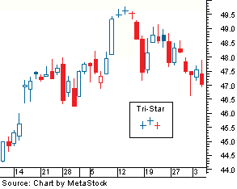

## Table of Contents

## What is the Tri-Star Pattern in trading?

The Tri-Star Pattern is a rare candlestick pattern used in technical analysis to predict a possible reversal in the market trend. It consists of three consecutive Doji candles, which are candles with very small bodies that show indecision in the market. The first Doji appears after a strong trend, either up or down. The second Doji gaps away from the first one, showing a continuation of the indecision. The third Doji then gaps in the opposite direction of the second Doji, signaling that the market might be ready to reverse its previous trend.

This pattern is considered significant because it shows a strong shift in market sentiment over three sessions. Traders look for the Tri-Star Pattern as a signal to enter or exit trades, depending on the direction of the potential reversal. However, because it is so rare, traders should use other indicators and analysis tools to confirm the pattern before making trading decisions. The Tri-Star Pattern can be a powerful tool when used correctly, but it should not be relied upon as the sole basis for trading decisions.

## How does the Tri-Star Pattern form on a chart?

The Tri-Star Pattern forms on a chart when you see three Doji candles in a row. A Doji is a candle with a very small body, showing that the market is unsure about which way to go. The first Doji comes after a strong trend, either up or down. This Doji shows that the market is starting to hesitate about the current trend.

The second Doji in the Tri-Star Pattern gaps away from the first one. This gap means the market is still unsure and the trend might be weakening. The third Doji then gaps in the opposite direction of the second Doji. This final Doji suggests that the market might be ready to change direction completely. When you see these three Doji candles in this specific order, it's called the Tri-Star Pattern, and it can signal a big change in the market trend.

## What are the key characteristics of a Tri-Star Pattern?

The Tri-Star Pattern is a special pattern on a trading chart that shows up when there are three Doji candles in a row. A Doji is a candle with a very small body, which means the market can't decide which way to go. The first Doji comes after the market has been going up or down strongly. This Doji tells us that the market is starting to think twice about the current trend.

The second Doji in the pattern gaps away from the first one. This gap shows that the market is still unsure and the trend might be getting weaker. The third Doji then gaps in the opposite direction of the second Doji. This last Doji is a big hint that the market might be ready to switch directions completely. When you see these three Doji candles in this order, it's called the Tri-Star Pattern, and it can signal a big change in the market trend.

## Can you explain the difference between a bullish and bearish Tri-Star Pattern?

A bullish Tri-Star Pattern happens when the market has been going down for a while. After a strong downward trend, you see the first Doji candle. This Doji shows that the market is starting to doubt the downward trend. The second Doji gaps down from the first one, showing more uncertainty. Then, the third Doji gaps up from the second one, suggesting that the market might be ready to start going up instead. So, a bullish Tri-Star Pattern signals that a downtrend might be ending and an uptrend could be starting.

A bearish Tri-Star Pattern is the opposite. It appears after the market has been going up for a while. The first Doji comes after this strong upward trend, indicating that the market is beginning to question the upward movement. The second Doji gaps up from the first one, showing continued uncertainty. The third Doji then gaps down from the second one, hinting that the market might be ready to start going down. Therefore, a bearish Tri-Star Pattern suggests that an uptrend might be ending and a downtrend could be starting.

## What does the Tri-Star Pattern indicate about market trends?

The Tri-Star Pattern tells us that the market might be ready to change direction. It shows up after the market has been going up or down strongly for a while. When you see three Doji candles in a row, it means the market is unsure and can't decide which way to go. The first Doji comes after the strong trend and shows that the market is starting to doubt the current direction. The second Doji gaps away from the first one, showing more uncertainty. The third Doji then gaps in the opposite direction of the second one, suggesting that a big change in the market trend might be coming.

If the market has been going down and you see a Tri-Star Pattern, it's called a bullish Tri-Star Pattern. This means the market might be ready to start going up instead. On the other hand, if the market has been going up and you see a Tri-Star Pattern, it's called a bearish Tri-Star Pattern. This suggests that the market might be ready to start going down. So, the Tri-Star Pattern is a strong hint that the market trend could be about to reverse, but it's important to use other tools to make sure before making any trading decisions.

## How reliable is the Tri-Star Pattern as a trading signal?

The Tri-Star Pattern can be a helpful sign for traders, but it's not always reliable on its own. It's a rare pattern, which means it doesn't show up very often. When it does appear, it can be a strong hint that the market might be ready to change direction. But because it's so rare, traders should not just rely on it without looking at other signs too.

To make better trading decisions, it's a good idea to use the Tri-Star Pattern along with other tools and indicators. Things like moving averages, volume, and other chart patterns can help confirm if the Tri-Star Pattern is really signaling a change in the market trend. By using more than one tool, traders can feel more confident about their decisions and avoid making big mistakes based on just one signal.

## What are the best practices for confirming a Tri-Star Pattern?

To confirm a Tri-Star Pattern, it's important to look at other signs on the chart too. After you see the three Doji candles in a row, check the volume of trades. If the volume is high when the pattern forms, it can make the signal stronger. Also, look at other chart patterns or indicators like moving averages. If they also show that the market might be changing direction, it can help confirm the Tri-Star Pattern.

Another good practice is to wait for a few more candles after the Tri-Star Pattern to see if the market really does change direction. If the price starts moving in the opposite direction of the previous trend, it can give you more confidence in the pattern. Remember, the Tri-Star Pattern is rare, so using other tools and waiting a bit can help you make better trading decisions.

## How should traders use the Tri-Star Pattern in their trading strategy?

Traders should use the Tri-Star Pattern as a part of their overall trading strategy, not as the only thing they look at. When they see the three Doji candles in a row, it's a good idea to check other signs on the chart too. They should look at the volume of trades to see if it's high when the pattern forms. High volume can make the signal stronger. Also, traders should check other chart patterns or indicators like moving averages. If these other signs also show that the market might be changing direction, it can help confirm the Tri-Star Pattern.

After seeing the Tri-Star Pattern, traders should wait for a few more candles to see if the market really does change direction. If the price starts moving in the opposite direction of the previous trend, it can give them more confidence in the pattern. Because the Tri-Star Pattern is rare, using other tools and waiting a bit can help traders make better decisions. They should always use the Tri-Star Pattern along with other indicators to feel more sure about their trades.

## What are common mistakes traders make when using the Tri-Star Pattern?

One common mistake traders make when using the Tri-Star Pattern is relying on it too much. The Tri-Star Pattern is rare, so it doesn't show up often. If traders only look for this pattern and ignore other signs on the chart, they might miss out on other important information. It's better to use the Tri-Star Pattern along with other tools like moving averages and volume to make sure the signal is strong.

Another mistake is not waiting long enough after seeing the Tri-Star Pattern. Traders might get excited and jump into a trade right away, but it's important to wait for a few more candles to see if the market really changes direction. If they don't wait, they might end up making a trade based on a signal that doesn't lead to the expected result. Patience can help traders make better decisions and avoid big mistakes.

## Can the Tri-Star Pattern be used in conjunction with other technical indicators?

Yes, the Tri-Star Pattern can be used with other technical indicators to make trading decisions more reliable. When traders see the three Doji candles in a row, they should also look at other signs on the chart. For example, checking the volume of trades can help. If the volume is high when the Tri-Star Pattern forms, it can make the signal stronger. Also, looking at other chart patterns or indicators like moving averages can help confirm if the market might be changing direction.

Using the Tri-Star Pattern along with other tools is a good idea because it's a rare pattern. By waiting for a few more candles after seeing the Tri-Star Pattern, traders can see if the market really does change direction. If the price starts moving in the opposite direction of the previous trend, it can give them more confidence in the pattern. This way, traders can feel more sure about their trades and avoid making big mistakes based on just one signal.

## How does the Tri-Star Pattern perform in different market conditions?

The Tri-Star Pattern can work differently depending on whether the market is moving up, down, or staying the same. In a strong trend, either up or down, the Tri-Star Pattern can be a good sign that the market might be ready to change direction. For example, if the market has been going down for a while and you see the Tri-Star Pattern, it could mean the market is getting ready to start going up. The same goes for an upward trend; if you see the Tri-Star Pattern, it might mean the market is about to start going down. But because the pattern is rare, it's important to look at other signs on the chart too.

In a market that's not moving much, the Tri-Star Pattern might not be as useful. When the market is just going sideways, the pattern might not mean as much because there's no strong trend to reverse. In these cases, traders should be careful and use other tools like moving averages and volume to see if the Tri-Star Pattern is really signaling a change. By looking at more than just the Tri-Star Pattern, traders can make better decisions no matter what the market is doing.

## What advanced techniques can be applied to enhance the effectiveness of the Tri-Star Pattern?

To make the Tri-Star Pattern work better, traders can use something called "multiple time frame analysis." This means looking at the pattern on different time frames, like daily, hourly, or even 15-minute charts. If the Tri-Star Pattern shows up on more than one time frame, it can make the signal stronger. For example, if you see the pattern on both the daily and hourly charts, it's a good sign that the market might really be ready to change direction. This way, traders can feel more sure about their trades.

Another advanced technique is to use "price action confirmation." After seeing the Tri-Star Pattern, traders should wait for a few more candles to see if the price starts moving in the opposite direction of the previous trend. If the price does change direction and breaks through important levels like support or resistance, it can confirm that the Tri-Star Pattern is a good signal. By waiting for this confirmation, traders can avoid jumping into trades too early and make better decisions based on what the market is actually doing.

## References & Further Reading

[1]: ["Japanese Candlestick Charting Techniques"](https://drive.google.com/file/d/0B_CADMk621uLNDEyZTEzZjYtMmZjOS00ZmUyLTlhYmYtN2E1YTViOWRiOTdi/view) by Steve Nison

[2]: ["Technical Analysis of the Financial Markets: A Comprehensive Guide to Trading Methods and Applications"](https://www.amazon.com/Technical-Analysis-Financial-Markets-Comprehensive/dp/0735200661) by John J. Murphy

[3]: ["Candlestick Charting Explained: Timeless Techniques for Trading Stocks and Futures"](https://www.amazon.com/Candlestick-Charting-Explained-Timeless-Techniques/dp/007146154X) by Gregory L. Morris

[4]: Linton, O. (2019). ["The Making of a Great Conjecture in Finance: Historical Reflection on the Decision-Making Process"](https://www.cambridge.org/core/journals/industrial-and-organizational-psychology/article/ethical-decision-making-in-the-21st-century-a-useful-framework-for-industrialorganizational-psychologists/C96E6FDEE99600FA87CC54FCFACF8478). International Review of Financial Analysis.

[5]: ["Quantitative Trading: How to Build Your Own Algorithmic Trading Business"](https://www.amazon.com/Quantitative-Trading-Build-Algorithmic-Business/dp/1119800064) by Ernest P. Chan