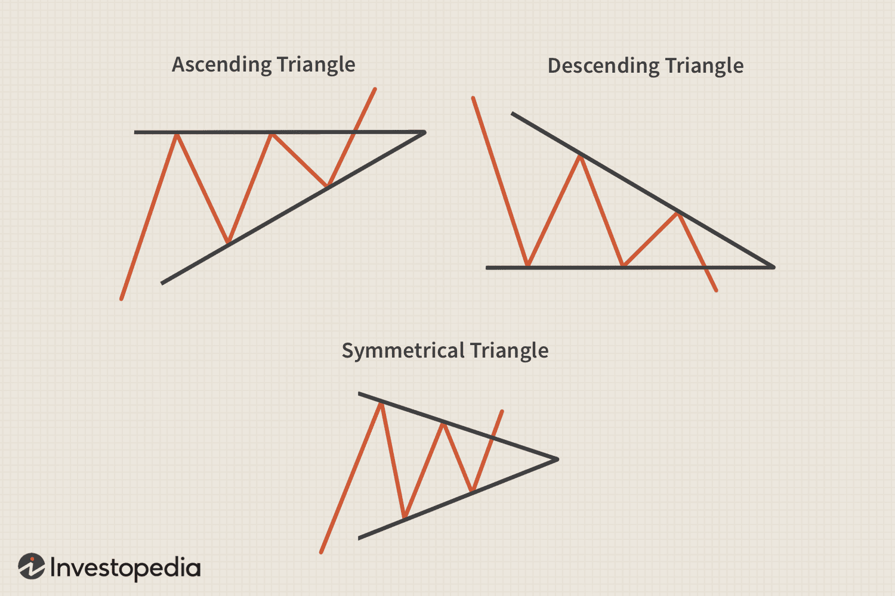

The world of trading is complex, offering a plethora of strategies and tools for analyzing financial markets. Among these, technical analysis holds a significant place due to its use of historical price data to forecast future movements. Within technical analysis, chart patterns are pivotal, with triangle chart patterns standing out as one of the foundational models employed by traders.

Triangle chart patterns are instrumental in predicting future price movements of securities. These patterns emerge as a result of price consolidating within two converging trendlines, forming a triangular shape. Recognizing these patterns can provide traders with insights into potential market shifts, assisting in timing trades effectively. This capability is crucial for both manual traders and those using automated, algorithmic trading systems.



Understanding triangle chart patterns is beneficial for any trader, as these formations can signal either continuation or reversal of a trend. This signifies potential breakout scenarios, where price may move sharply away from the pattern. The patterns are defined into three primary categories: ascending, descending, and symmetrical. Each type provides distinct signals and can be used strategically to make well-informed trading decisions.

The significance of triangle patterns extends beyond simple price prediction. In algorithmic trading, these patterns can be programmed into trading algorithms to automate the recognition and trading process. Algorithmic trading systems can quickly detect and respond to triangle patterns, thereby enhancing trading efficiency and minimizing the influence of human emotions on decision-making.

The following article will explore the mechanics of triangle chart patterns, their role within technical analysis, and their application in algorithmic trading strategies. This understanding will equip traders with a practical edge in navigating the financial markets.

## Table of Contents

## Understanding Triangle Chart Patterns

Triangle patterns are graphical representations created by plotting trendlines along converging price points, ultimately forming a triangular shape. These patterns manifest in a market when the trading range of an asset gradually narrows. This narrowing indicates a reduction in volatility, often preceding a significant price movement.

The value of triangle patterns lies in their ability to signal potential price movements, including both continuation and reversal of prevailing trends. By analyzing these formations, traders can make educated predictions about future price directions. Triangle patterns' predictive capacity stems from the way they encapsulate market consolidation and imminent [breakout](/wiki/breakout-trading) points.

There are three primary types of triangle patterns: ascending, descending, and symmetrical. Each type offers unique insights and can be strategically utilized in trading decisions:

1. **Ascending Triangle:** This pattern is characterized by a rising lower trendline and a horizontal upper trendline. Typically, it indicates building bullish momentum, suggesting the price may break upwards once it surpasses the resistance level established by the horizontal line. 

2. **Descending Triangle:** Conversely, a descending triangle features a descending upper trendline and a horizontal lower trendline. This configuration is often interpreted as bearish, signaling potential downward price movement as the support level may eventually give way.

3. **Symmetrical Triangle:** This pattern consists of two trendlines converging towards a point, but neither is horizontal. The symmetrical triangle does not inherently suggest a direction bias, making it a neutral pattern suitable for trading opportunities aligned with the pre-existing trend. Once the price breaks out, it commonly continues in the direction of the prior trend, whether upward or downward.

Understanding these patterns equips traders with tools to identify consolidation phases and potential breakouts. By interpreting the triangle patterns, traders can develop effective strategies to optimize their entry and [exit](/wiki/exit-strategy) points in the market.

## Types of Triangle Chart Patterns

Triangle chart patterns are essential components in technical analysis, representing specific price movements that often signal potential breakouts. There are three primary types of triangle patterns: ascending, descending, and symmetrical. Each type of pattern provides insights into market sentiment and potential price movement directions.

### Ascending Triangle

The ascending triangle is characterized by a rising lower trendline and a horizontal upper trendline, reflecting a pattern where the price experiences higher lows while encountering resistance at a consistent high level. The pattern typically indicates a bullish market sentiment, suggesting that buyers are gaining strength. This formation often leads to a potential upward breakout when the resistance level is surpassed.

#### Characteristics:
- **Trendlines**: The lower trendline is ascending, connecting a series of higher lows.
- **Resistance Level**: The upper trendline remains horizontal, indicating strong resistance.
- **Breakout Direction**: Typically upward, as the pattern suggests accumulating buying pressure.

Financial analysts often monitor the [volume](/wiki/volume-trading-strategy) during the formation of an ascending triangle. Increasing volume as the pattern progresses towards the apex can indicate a stronger breakout likelihood. 

### Descending Triangle

Opposite to the ascending triangle, the descending triangle comprises a descending upper trendline and a horizontal lower trendline. It represents a bearish pattern, as it suggests that sellers are gaining control, making lower highs while support remains unchanged.

#### Characteristics:
- **Trendlines**: The upper trendline descends, indicating decreasing peaks.
- **Support Level**: The lower trendline stays horizontal, signifying persistent support.
- **Breakout Direction**: Typically downward, as the pattern reflects mounting selling pressure.

The descending triangle is generally considered a signal of a forthcoming downward breakout, particularly if the volume decreases during the formation and then increases on the breakout.

### Symmetrical Triangle

The symmetrical triangle is formed by two converging trendlines that slope towards a point, with neither being horizontal. This formation reflects a period of indecision in the market, where neither buyers nor sellers dominate.

#### Characteristics:
- **Trendlines**: Both trendlines converge, one descending from the highs and the other ascending from the lows.
- **Neutral Position**: The price moves towards the apex within the converging trendlines, but without a directional bias.
- **Breakout Direction**: The breakout can occur in the direction of the preceding trend, but it may need confirmation by volume or other indicators, as it lacks a clear directional signal.

Symmetrical triangles are unique as they can serve as either continuation or reversal patterns, depending on the preceding trend and breakout confirmation. Traders often rely on additional indicators to interpret the market sentiment accurately.

In conclusion, understanding the characteristics of each triangle pattern type can enhance a trader’s ability to make strategic decisions. Accurately identifying these patterns and their potential breakout directions assists traders in optimizing their entry and exit timing.

## Triangle Patterns in Technical Analysis

Triangle patterns are widely recognized in technical analysis as pivotal tools for predicting upcoming price movements. These patterns typically serve as continuation patterns, reinforcing the direction of the prevailing trend. However, in certain circumstances, they can also function as reversal indicators, particularly when the anticipated continuation fails. The key to harnessing triangle patterns in technical analysis is identifying breakout signals, which generally occur near the apex where trendlines converge.

The breakout signal, an essential component of triangle patterns, often indicates the next phase of price movement. In an ascending triangle, for example, a breakout above the horizontal resistance line suggests a continuation of the upward trend. Conversely, in a descending triangle, a breakdown below the horizontal support line points towards a continuation of the downward trend. Symmetrical triangles require a more nuanced approach, as the breakout direction aligns with the preceding trend.

For technical analysts, recognizing these breakout signals is crucial for making informed predictions about future price movements. The application of triangle patterns involves meticulous chart analysis and a sound understanding of market dynamics. Analysts often focus on volume patterns in conjunction with price movements to confirm breakouts. A genuine breakout is typically accompanied by increased trading volume, signifying market agreement with the price direction.

By leveraging triangle patterns, technical analysts aim to optimize trade entry and exit points. Effective timing is essential, as it determines a trader's ability to capitalize on predicted price moves. An entry point is strategically set following a confirmed breakout, ensuring that the trade aligns with the demonstrated market direction. Similarly, setting exit points based on price target calculations derived from the triangle's formation aids in maximizing potential gains while managing risk.

In conclusion, triangle patterns are invaluable in technical analysis for their ability to signal significant price movements. Their incorporation into trading strategies enhances the precision and efficacy of market predictions, providing traders with a robust framework for decision-making. To utilize triangle patterns effectively, analysts must carefully monitor breakout signals, volume confirmations, and market conditions to ensure alignment with predicted trends.

## Algorithmic Trading with Triangle Patterns

Algorithmic trading leverages computing power to execute trading strategies, incorporating technical patterns like triangle patterns into decision-making processes. By automating pattern recognition, [algorithmic trading](/wiki/algorithmic-trading) systems identify predefined triangle chart patterns and automatically execute trades, thereby reducing the impact of human error and emotional influences typically associated with manual trading.

When implementing triangle patterns in algorithmic trading, systems are designed to detect key features of these patterns — such as price convergence and breakout points. Sophisticated algorithms can assess whether an ascending, descending, or symmetrical triangle is forming, and anticipate potential breakout directions and timing. For example, in an ascending triangle, the algorithm would monitor for a breakout above the horizontal resistance line, signaling a buy opportunity.

The efficiency of algorithmic trading is enhanced by the speed and accuracy with which these patterns are recognized and acted upon. Automated systems can process vast amounts of historical and real-time data to spot these geometric configurations more rapidly than a human trader. This advantage allows for faster reaction times to market movements, optimizing trade entry and exit points.

Here's a simplified Python snippet illustrating how an algorithm might be designed to detect an ascending triangle pattern:

```python
def detect_ascending_triangle(prices):
    lower_trendline = [min(prices[i:i+2]) for i in range(len(prices) - 2)]
    resistance_level = max(lower_trendline)

    for i in range(len(prices) - 2, len(prices)):
        if prices[i] > resistance_level:
            return "Ascending Triangle Detected: Potential Breakout"
    return "No Ascending Triangle"

# Example usage
prices = [30, 32, 34, 35, 34, 36, 37, 38, 37, 39]
result = detect_ascending_triangle(prices)
print(result)
```

The function `detect_ascending_triangle` checks for the presence of a rising trendline and a consistent resistance level, indicating an ascending triangle. On detecting a breakout above the resistance level, an automated trade could be triggered according to the trader's predefined strategy.

In summary, the integration of triangle patterns into algorithmic trading systems brings enhanced precision and efficiency to trading strategies. By enabling quick identification and execution, traders benefit from optimized decision-making and improved opportunities to capitalize on market trends. As financial markets continue to evolve, the reliance on such automated systems is expected to increase, underscoring the importance of advanced pattern recognition in technical analysis.

## Conclusion

Triangle chart patterns play a pivotal role in technical analysis by providing traders with insights into potential market movements. These patterns are invaluable tools for identifying opportunities in both rising and falling markets. Mastering the identification and use of triangle patterns can give traders a significant advantage, allowing for more informed decision-making and strategic trades.

Incorporating triangle patterns into trading strategies—whether in manual trading or through algorithmic systems—enables traders to better anticipate price breakouts and effectively time their trades. The precise nature of these patterns, defined by trendlines that can predict market directionality, gives traders a tangible method to gauge market sentiment and potential shifts.

With the advancement of technology, algorithmic trading has become an integral part of modern financial markets, thanks to its capacity for high-speed data analysis and execution. This technology allows for the automatic recognition and exploitation of triangle patterns, enhancing trading efficiency. Algorithms can process vast amounts of data to detect these patterns in real-time, significantly reducing the likelihood of human error and the influence of emotional bias.

The scalability and precision offered by algorithmic trading systems are becoming increasingly essential as financial markets grow more complex and volatile. Incorporating triangle chart patterns into these systems represents a convergence of traditional technical analysis with modern technological advancements, offering traders the tools they need to succeed in ever-evolving markets. As such, the integration of triangle patterns into both manual and algorithmic strategies is likely to become an essential component of professional trading practices moving forward.

## References & Further Reading

[1]: Bulkowski, T. (2005). ["Encyclopedia of Chart Patterns."](https://books.google.com/books/about/Encyclopedia_of_Chart_Patterns.html?id=tIwlEAAAQBAJ) Wiley.

[2]: Murphy, J.J. (1999). ["Technical Analysis of the Financial Markets."](https://archive.org/details/technicalanalysi0000murp) New York Institute of Finance.

[3]: Elder, A. (2002). ["Come Into My Trading Room: A Complete Guide to Trading."](https://www.amazon.com/Come-Into-My-Trading-Room/dp/0471225347) Wiley.

[4]: Pring, M.J. (1991). ["Technical Analysis Explained: The Successful Investor's Guide to Spotting Investment Trends and Turning Points."](https://archive.org/details/technicalanalysi00prin) McGraw-Hill.

[5]: Kirkpatrick, C.D., & Dahlquist, J.R. (2010). ["Technical Analysis: The Complete Resource for Financial Market Technicians."](https://ptgmedia.pearsoncmg.com/images/9780134137049/samplepages/9780134137049.pdf) FT Press.