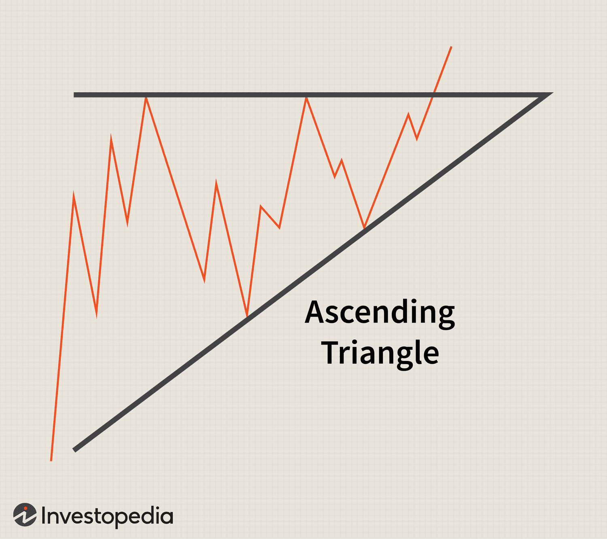

The world of trading and investments encompasses a vast array of strategies and tools designed to analyze and interpret market trends. Among these strategies, technical analysis holds a prominent position due to its focus on historical price movements and patterns. Within technical analysis, chart patterns serve as vital indicators for predicting price direction and market behavior. One significant category of these patterns is the triangle pattern, which forms part of the continuation patterns used by traders to forecast future price movements.

Triangle patterns are especially important as they help traders anticipate and strategize around potential breakouts and trend continuations. This article provides an in-depth examination of triangle patterns, focusing on their mechanics within technical analysis and their relevance in algorithmic trading. By exploring the different types of triangles, traders can gain insights into their function as continuation patterns and understand how these can be integrated into automated trading systems.



A strong grasp of these patterns allows traders to optimize their entry and exit points in the markets, leveraging both manual and algorithmic trading strategies effectively. Whether for beginners or seasoned traders, proficiency in interpreting these common chart patterns provides a competitive advantage, enhancing trading outcomes.

We aim to explain how triangle patterns can be identified and used, improving trading efficiency and profit potential in a variety of market conditions. Understanding these patterns not only contributes to a trader's toolkit but also facilitates more informed, timely trading decisions, ultimately leading to successful financial outcomes.

## Table of Contents

## Understanding Triangle Chart Patterns

Triangle patterns are graphical formations that emerge on price charts as the result of converging trendlines, forming a geometric triangle shape. These patterns are considered essential in technical analysis due to their representation of market consolidation — a phase during which price movement becomes confined, narrowing as buyers and sellers reach a temporary equilibrium. Typically, this consolidation precedes a significant breakout, where the price breaks through one of the trendlines and resumes its previous trajectory or reverses direction.

The predictive power of triangle patterns lies in their ability to signal upcoming price movements, aiding traders in identifying whether trends are likely to continue or reverse. Three primary types of triangle patterns, each with distinct characteristics and implications, facilitate this analysis:

1. **Ascending Triangle:** This pattern is typified by a steadily rising lower trendline and a horizontal upper trendline. It suggests an accumulation of buying pressure as buyers are consistently willing to purchase at higher prices, even as resistance at the upper boundary persists. Consequently, ascending triangles are generally considered bullish patterns, anticipating an upward breakout upon the resolution of the pattern.

2. **Descending Triangle:** In contrast, descending triangles are characterized by a declining upper trendline and a constant lower trendline. This arrangement indicates mounting selling pressure, with sellers ready to accept progressively lower prices while support remains stable. Therefore, descending triangles often forecast bearish continuations, where the price is expected to break downward once the pattern concludes.

3. **Symmetrical Triangle:** Composed of converging trendlines that slope toward the point of convergence or apex, symmetrical triangles suggest a neutral stance. Without a definitive horizontal trendline, this pattern indicates an equilibrium in which neither buyers nor sellers have a prevailing force. The breakout direction can be unpredictable, although it commonly follows the prior trend direction, thus requiring keen observation for cues.

Traders employ triangle patterns to set strategic entry and [exit](/wiki/exit-strategy) points by analyzing the expected direction of the [breakout](/wiki/breakout-trading). This involves careful monitoring of [volume](/wiki/volume-trading-strategy) and other supporting indicators as the price approaches the apex. A noticeable increase in trading volume typically accompanies a breakout, serving as additional confirmation of the pattern's resolution. Identifying triangle formations accurately and understanding their implications can greatly enhance a trader's ability to capitalize on market movements strategically.

## Types of Triangle Chart Patterns

Triangle chart patterns are significant tools in technical analysis, providing traders with insights into potential price movements through their distinctive shapes formed by trendlines. Recognizing the different types of triangle patterns—ascending, descending, and symmetrical—is fundamental for making informed trading decisions.

### Ascending Triangle
The ascending triangle pattern is distinguished by a rising lower trendline and a flat upper trendline. This formation reflects a bullish sentiment in the market. As demands push prices higher over time, the lower trendline slopes upward, indicating increased buying interest. The horizontal upper trendline shows resistance, but repeated testing typically suggests a potential breakout in the upward direction once enough buying pressure accumulates. Traders often view this pattern as a signal of bullish [momentum](/wiki/momentum), anticipating an upward breakout.

In mathematical or algorithmic terms, the ascending triangle can be modeled to detect a consistent minimum increase in the lower trendline $y = mx + c$ where $m > 0$, and a consistently equal high at the upper trendline $y = c$. 

### Descending Triangle
Conversely, the descending triangle features a falling upper trendline and a flat lower trendline. This pattern typically signals bearish market sentiment with potential downward price movement. The descending upper trendline indicates increasing selling pressure, while the lower horizontal line serves as support. Persistent testing of this support level may lead to a breakdown, suggesting further price declines. Traders often view descending triangles as opportunities for short positions, anticipating a downward breakout.

For algorithmic detection, a descending triangle can be represented by a decreasing equation for the upper trendline $y = mx + c$ where $m < 0$, and a constant support level for the lower trendline $y = c$.

### Symmetrical Triangle
The symmetrical triangle pattern consists of two converging trendlines sloping towards an apex, neither of which is horizontal. This convergence indicates a period of consolidation where market forces of supply and demand are closely aligned, often leading to a neutral position in the prevailing market trend. However, upon reaching the apex, a breakout is expected, generally continuing in the direction of the existing trend prior to the formation.

Unlike the ascending and descending triangles, both trendlines in a symmetrical triangle have slopes $y = m_1x + c_1$ and $y = m_2x + c_2$ with $m_1$ and $m_2$ showing the rate of convergence. The breakout occurs when the price surpasses the boundaries established by these converging lines.

### Conclusion
Each triangle pattern reflects different market sentiment cues, enabling traders to strategize their entry and exit points effectively. Understanding and identifying these patterns can be crucial for optimizing trade decisions and maximizing profit potential. Integrating these insights into both manual trading strategies and automated systems enhances precision and reduces the influence of emotional biases in trading.

## Triangle Patterns in Technical Analysis

Triangle patterns are crucial components within technical analysis, frequently functioning as continuation signals. These patterns suggest that the prevailing trend will likely persist once the formation is complete, offering traders valuable foresight into future price movements. Typically, the formation of a triangle pattern is characterized by the convergence of two trendlines that create a triangle shape on price charts. This structure signals a period of market consolidation, followed by an expected breakout.

Technical analysts prioritize identifying breakout signals, which occur when the price decisively moves out of the triangle's boundaries. These signals are pivotal as they indicate a possible shift in market momentum, confirming the continuation of the trend. A key aspect of confirming such breakouts is analyzing trading volume. Increased volume during a breakout not only reaffirms the breakout's validity but also strengthens the anticipated direction of the market movement. High volume signifies strong market interest and greater reliability in the signal's strength.

The efficacy of triangle patterns in technical analysis hinges on accurate identification and precise timing of entries and exits. Achieving success involves recognizing the pattern's completion phase and detecting breakout signals promptly. An example of detecting a breakout can be automated using Python libraries, such as `pandas` for data manipulation and `matplotlib` for visualization, by calculating moving averages and monitoring price action around the triangle boundaries.

```python
import pandas as pd
import matplotlib.pyplot as plt

# Sample data
data = {'Price': [110, 112, 115, 113, 116, 118, 117, 119, 121, 120]}
df = pd.DataFrame(data)

# Calculate moving averages
df['SMA_5'] = df['Price'].rolling(window=5).mean()

# Identify breakout
breakout = df['Price'] > df['SMA_5']

# Plot the data
plt.plot(df['Price'], label='Price')
plt.plot(df['SMA_5'], label='5-SMA', linestyle='--')
plt.scatter(df.index[breakout], df['Price'][breakout], color='red', label='Breakout')
plt.legend()
plt.title('Triangle Pattern Breakout Detection')
plt.xlabel('Time')
plt.ylabel('Price')
plt.show()
```

The script above exemplifies how traders can visualize price movements and highlight potential breakout points by comparing the price against a moving average. In practice, more sophisticated techniques, including the use of [machine learning](/wiki/machine-learning) algorithms, can be employed to enhance the accuracy of triangle pattern detection.

Ultimately, successful exploitation of triangle patterns in technical analysis depends on a combination of accurate identification, timing, and robust confirmation through volume analysis. By optimizing these elements, traders can effectively capitalize on market trends, maximizing trading efficiency and profitability.

## Algorithmic Trading with Triangle Patterns

Algorithmic trading systems utilize automated processes to recognize triangle patterns and execute trades with enhanced precision, reducing the influence of emotional biases. These systems leverage predefined parameters to accurately detect key features of triangle patterns, such as price points and trendline formations. The rapid analysis capabilities of algorithms allow them to process large datasets more swiftly than manual observation, leading to increased trading efficiency.

Incorporating triangle patterns into [algorithmic trading](/wiki/algorithmic-trading) involves setting specific criteria for pattern recognition and breakout prediction. For instance, an algorithm might be programmed to identify an ascending triangle when it detects a series of higher lows combined with a relatively consistent resistance level. Once this pattern is confirmed, the algorithm can anticipate a potential breakout to the upside.

Python, with its rich ecosystem of data analysis libraries like Pandas and NumPy, provides a powerful platform for implementing these algorithms. For instance, traders can use Pandas to manage historical price data, employing techniques like moving averages to smooth out [volatility](/wiki/volatility-trading-strategies) and better identify patterns. Here's a simple example of how one might begin setting up such a detection system:

```python
import pandas as pd
import numpy as np

# Example function to identify potential ascending triangles
def identify_ascending_triangle(data, period=14):
    data['Highs'] = data['High'].rolling(window=period).max()
    data['Lows'] = data['Low'].rolling(window=period).min()

    # Conditions for ascending triangle
    conditions = (
        (data['Close'] > data['Lows'].shift(1)) &
        (data['Close'] <= data['High']) &
        (data['Lows'] > data['Lows'].shift(1))
    )

    # Mark potential pattern
    data['AscendingTriangle'] = np.where(conditions, 1, 0)
    return data

# Example usage
historical_data = pd.DataFrame({
    'Close': [105, 107, 110, 112, 109, 111, 113],
    'High': [106, 108, 111, 113, 110, 112, 114],
    'Low': [102, 105, 107, 109, 106, 108, 111]
})

triangle_data = identify_ascending_triangle(historical_data)
print(triangle_data)
```

This approach facilitates the monitoring of market conditions and strategic decision-making, enabling timely trade execution based on anticipated breakout directions. Moreover, the speed and consistency of algorithmic trading make it suitable for capturing opportunities in fast-moving markets where delays in manual trading could result in missed trades.

Automation also plays a critical role in maintaining consistent responses to market scenarios. By predefining actions to be taken upon the identification of a triangle pattern, such as setting stop-loss or take-profit levels, algorithmic systems minimize the possibility of human error or emotional decision-making.

Ultimately, the integration of triangle patterns into algorithmic trading strategies allows traders to exploit market trends systematically, improving overall trading performance. As technology advances, the tools available for developing and refining these algorithms will continue to expand, providing ever-greater opportunities for optimizing trading strategies.

## Conclusion

Triangle chart patterns provide significant value in technical analysis, empowering traders to gain crucial insights and strategic opportunities across various financial markets. By mastering these patterns, traders can anticipate price movements more effectively, enabling them to make informed and timely trading decisions. This proficiency is essential for optimizing market positions and enhancing profitability.

The rise of algorithmic trading has notably improved the capacity to utilize triangle patterns by leveraging automation to reduce the potential for human error. Algorithms can process vast amounts of data quickly and with precision, offering a strategic advantage in recognizing and acting on these chart patterns. By establishing predefined parameters, algorithms can automatically detect key features of triangles, facilitating decision-making about potential breakouts.

As the financial landscape continues to evolve, the integration of triangle patterns into trading strategies remains vital, especially when combining both manual and automated approaches. The adaptability of these patterns to different market conditions makes them a valuable tool for traders seeking consistent success. By harnessing both traditional techniques and modern technological advancements, traders can enhance their overall trading strategy, maximizing the benefits offered by triangle chart patterns.

## References & Further Reading

[1]: Bulkowski, T. N. (2005). ["Encyclopedia of Chart Patterns."](https://www.amazon.com/Encyclopedia-Chart-Patterns-Thomas-Bulkowski/dp/0471668265) Wiley Trading.

[2]: Murphy, J. J. (1999). ["Technical Analysis of the Financial Markets: A Comprehensive Guide to Trading Methods and Applications."](https://archive.org/details/technicalanalysi0000murp) New York Institute of Finance.

[3]: Neftci, S. N. (1991). ["Naive Trading Rules in Financial Markets and Wiener-Kolmogorov Prediction Theory: A Study of 'Technical Analysis'."](https://www.jstor.org/stable/pdf/2353293.pdf) Journal of Business & Economic Statistics, 5(1), 55-67.

[4]: Pring, M. J. (2002). ["Technical Analysis Explained: The Successful Investor's Guide to Spotting Investment Trends and Turning Points."](https://www.amazon.com/Technical-Analysis-Explained-Fifth-Successful/dp/0071825177) McGraw-Hill Education.

[5]: Kirkpatrick, C. D., & Dahlquist, J. R. (2010). ["Technical Analysis: The Complete Resource for Financial Market Technicians."](https://ptgmedia.pearsoncmg.com/images/9780134137049/samplepages/9780134137049.pdf) FT Press.