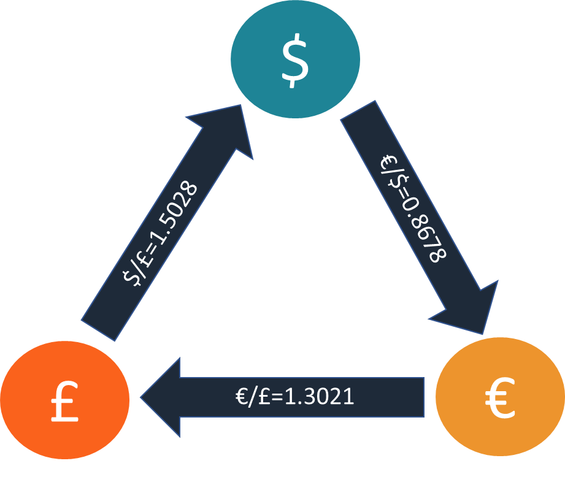

Triangular arbitrage is a sophisticated yet essential concept in the foreign exchange (Forex) market, where traders exploit pricing discrepancies that exist among three different currencies. Fundamentally, it involves the simultaneous buying and selling of three currency pairs to capitalize on the differences in their exchange rates. This strategy is grounded in the principle that currencies should maintain consistent cross-exchange rates as determined by their respective pairs. When these rates deviate, it presents an arbitrage opportunity.

To understand triangular arbitrage, consider a currency triangle involving three currencies: Currency A, Currency B, and Currency C. If the exchange rate between A and B, B and C, and A and C are not aligned according to market expectations, a trader can profit by converting an initial amount in one currency through these three exchanges back to the original currency, ending up with more than they started. 

For instance, let's say you start with USD, and you notice discrepancies in the exchange rates:
1. USD to EUR 
2. EUR to GBP 
3. GBP back to USD 

If the product of exchange rates allows you to end up with more than your initial US dollars, an arbitrage opportunity exists. Mathematically, if:
$$
(USD/EUR) \times (EUR/GBP) \times (GBP/USD) > 1
$$
Then this indicates a profitable [arbitrage](/wiki/arbitrage) situation.

Arbitrageurs, or traders specializing in detecting these inefficiencies, leverage sophisticated algorithms and high-speed trading platforms to execute these trades swiftly. By doing so, they not only profit from discrepancies but also contribute to the efficiency and [liquidity](/wiki/liquidity-risk-premium) of the Forex market by realigning currency prices to their 'correct' levels. However, this is a race against time as these discrepancies are typically ephemeral, vanishing in seconds with the actions of efficient markets and continuous trading.

## Table of Contents

## How Triangular Arbitrage Works

Triangular arbitrage is an advanced trading strategy that leverages price discrepancies between three different currencies in the foreign exchange ([forex](/wiki/forex-system)) market. The core idea is to exploit inefficiencies between these rates before the market can correct them, thereby securing a risk-free profit.

The mechanics behind triangular arbitrage involve three key currencies and the respective exchange rates between them. Let's say we have three currencies: Currency A, Currency B, and Currency C. An investor would look to exploit the misalignment in the exchange rates A/B, B/C, and C/A. The fundamental steps involved in executing a triangular arbitrage trade are as follows:

1. **Initial Conversion**: Begin with a specific amount in the base currency, Currency A. Convert this amount into Currency B using the existing market exchange rate A/B.

2. **Second Conversion**: Take the amount of Currency B obtained and convert it into Currency C using the B/C exchange rate.

3. **Final Conversion**: Finally, convert the amount of Currency C back into Currency A using the C/A exchange rate.

The arbitrage is successful if the final amount in Currency A is greater than the initial amount, taking transaction costs like the bid-ask spread into account. If the discrepancy is in favor of the arbitrageur, a profit can be realized without actual currency exposure.

### Example Scenario:
Consider an example involving USD (Currency A), EUR (Currency B), and GBP (Currency C). Let's assume the following exchange rates:

- USD/EUR = 0.85
- EUR/GBP = 1.15
- GBP/USD = 1.30

Suppose you start with $10,000:

1. **First Conversion (USD to EUR)**: $10,000 × 0.85 = €8,500
2. **Second Conversion (EUR to GBP)**: €8,500 × 1.15 = £9,775
3. **Final Conversion (GBP to USD)**: £9,775 × 1.30 = $12,707.50

In this case, you end up with $12,707.50, which means a profit of $2,707.50 after completing the round trip of conversions. This profit can be attributed to the temporary inefficiency in how the exchange rates aligned. In reality, transaction costs and fees need to be subtracted, but the underlying principle of profit through exploitation of rate discrepancies remains the same.

Triangular arbitrage opportunities are slim and fleeting, as they often require quick and automated execution to capitalize on them before the market self-corrects. Technology and [algorithmic trading](/wiki/algorithmic-trading) play a crucial role in identifying and acting on these opportunities efficiently.

## Cross Exchange Rate Discrepancies

Implicit cross exchange rates are the rates at which two currencies can be exchanged indirectly through a third currency. These are calculated by using the direct exchange rates of the three currencies involved. For example, if you have three currencies: USD, EUR, and GBP, and you know the exchange rates USD/EUR and USD/GBP, you can calculate the implicit cross rate for EUR/GBP. This is done using the formula:

$$
\text{EUR/GBP} = \frac{\text{USD/GBP}}{\text{USD/EUR}}
$$

This implicit rate should ideally match the market rate for EUR/GBP. However, discrepancies often occur due to market inefficiencies, leading to triangular arbitrage opportunities.

Triangular arbitrage opportunities arise when the implicit cross exchange rate differs from the direct market exchange rate. Traders can exploit these discrepancies by simultaneously buying and selling equivalent amounts of currencies to lock in a risk-free profit. For instance, if the implicit EUR/GBP rate calculated from USD pairs is different from the market rate, an arbitrageur can exchange USD to EUR, then EUR to GBP, and finally GBP back to USD. The key is that the sequence exploits discrepancies while ensuring the trades result in the same starting currency, ideally at a profit.

Bank-quoted rates and market rates can significantly influence these arbitrage opportunities. Banks might not update their quoted rates as frequently as the market rates change due to various [factor](/wiki/factor-investing)s like transaction [volume](/wiki/volume-trading-strategy)s and liquidity conditions. As a result, the discrepancy between static bank rates and dynamic market rates can create arbitrage openings. However, these opportunities are typically short-lived as the market adjusts to correct the mispricing, with algorithmic traders rapidly detecting and acting upon inefficiencies.

The persistence of such discrepancies hinges on several factors, including how quickly banks update their rates and how swiftly market participants react. Despite the potential for profit, the prevalence of algorithmic trading in modern forex markets has made it increasingly challenging to capitalize on these arbitrage opportunities, as automated systems can execute trades in milliseconds, often outpacing human traders.

## Market Mechanics and Influence

International banks and market makers play a vital role in the mechanism of triangular arbitrage within the foreign exchange market. These entities are responsible for providing liquidity and price quotations, which are crucial for executing trades efficiently. Triangular arbitrage exploits price discrepancies among three different currencies, and international banks are often the institutions setting these preliminary prices. Their ability to process high volumes of transactions quickly means they can capitalize on, or alternatively, swiftly eliminate any arbitrage possibilities through updated rate quotations.

The bid-ask spread is another critical element impacting arbitrage opportunities. The spread represents the difference between the price at which a bank or market maker will sell a currency (ask) and the price it will buy the same currency (bid). For an arbitrage opportunity to be profitable, the combined transaction costs, which heavily depend on the bid-ask spreads associated with each currency conversion, must be smaller than the profit potential from the rate discrepancies. Narrow spreads can therefore make arbitrage opportunities more viable, whereas wider spreads can erode or completely nullify potential profits. 

Bank quoted rates and cross rates are essential in identifying arbitrage possibilities. Cross rates, which define the exchange rate between two currencies derived from their common exchange rate with a third currency, can reveal discrepancies when compared to directly quoted rates. For instance, if the direct exchange rates between USD/EUR, EUR/GBP, and USD/GBP are inconsistent, an arbitrage opportunity may exist. A trader could theoretically exchange USD for EUR, EUR for GBP, and then GBP back to USD, and profit if the cross rates misaligned relative to market rates.

The participation of banks and market makers creates a constantly shifting landscape where exchange rates are continuously adjusted in response to supply, demand, and external economic indicators. These adjustments can create fleeting windows during which rate inefficiencies occur. Despite their brief duration, these inefficiencies are what arbitrageurs seek to exploit, underscoring the importance of the roles these banking entities play in the dynamics of currency valuation and arbitrage.

In conclusion, international banks and market makers not only facilitate currency exchange but also inadvertently affect the presence and disappearance of triangular arbitrage opportunities. Their influence over bid-ask spreads and currency rates contributes to the complexity and ephemeral nature of arbitrage in today's fast-paced forex market.

## Evidence of Triangular Arbitrage

Triangular arbitrage in currency markets exploits inefficiencies arising from mispricing among three different currencies. Research has demonstrated that these discrepancies, although often fleeting, can present profitable opportunities under the right conditions. The occurrence of mispricing is typically linked to the microstructure of the foreign exchange market, where different market participants may cause price variances through the simultaneous buying and selling of currencies.

In analyzing the opportunities in foreign exchange markets, researchers have found that the window for arbitrage is often quite narrow. Arbitrage opportunities tend to last only a matter of seconds due to the high liquidity and competition in foreign exchange trading. During this brief window, the interconnected nature of currency prices allows arbitrageurs to capitalize on deviations between quoted exchange rates and their implied cross rates. Specifically, these opportunities frequently occur when the implied cross rate (derived from two currency pairs) differs from the directly quoted market rate for the third currency pair involved. 

An example of this can be illustrated when considering three currencies: USD, EUR, and JPY. Suppose the USD/EUR rate is 0.85, EUR/JPY is 130, and USD/JPY is quoted at 110. The implied USD/JPY rate can be calculated by multiplying the USD/EUR and EUR/JPY rates (0.85 * 130 = 110.5). If the market is quoting USD/JPY as 110, an arbitrage opportunity arises because the implied rate and the market rate diverge.

Furthermore, empirical studies suggest that these arbitrage opportunities become more frequent during periods of market [volatility](/wiki/volatility-trading-strategies) or when there's significant market activity, particularly when high volumes cause discrepancies due to differing operational latencies across trading platforms. Such scenarios can temporarily impede the regular rapid adjustment of prices, uncovering arbitrage possibilities.

The correlation between exchange rates and the appearance of arbitrage opportunities signifies that market inefficiencies, although rare, are still possible, particularly in emerging markets or under strain in developed markets. Transaction speeds and technological advancements have increasingly narrowed these opportunities; however, for swift traders equipped with advanced algorithms capable of executing trades within milliseconds, these discrepancies still provide profitable ventures. 

In conclusion, while mispricings in currency exchange do occasionally occur, their profit potential is closely tied to the rapid and precise execution of trades, alongside a deep understanding of market dynamics and the usage of state-of-the-art technology.

## Role of Algorithmic Trading

Algorithmic trading has fundamentally transformed the landscape of triangular arbitrage, enhancing both its feasibility and efficiency. Electronic trading platforms facilitate faster access to currency markets, enabling traders to quickly identify and exploit arbitrage opportunities. These platforms integrate real-time data feeds, sophisticated analytics, and automated execution systems, allowing for the immediate recognition and swift execution of trades with minimal latency.

The rise of algorithmic trading has, however, contributed to a notable decline in the availability of traditional arbitrage opportunities. With the integration of algorithms that can instantly assess exchange rates and execute complex trades, pricing discrepancies in forex markets are quickly corrected. An algorithmic trading system can simultaneously monitor multiple currency pairs and execute trades when a profitable arbitrage opportunity is detected, sometimes within microseconds. This capability dramatically reduces the window of opportunity for arbitrage, making it difficult for manual traders to compete.

Moreover, technology plays a pivotal role in enhancing the execution speed of arbitrage trades. Algorithms use sophisticated predictive models and statistical analyses to identify potential mismatches in quoted rates, executing a series of coordinated trades across different currencies and exchanges. For example, if discrepancies exist in the EUR/USD, USD/JPY, and EUR/JPY exchange rates, algorithms can automatically compute the cross rates and execute the appropriate buy and sell orders required for arbitrage. This rapid execution minimizes the risks associated with price fluctuations and market volatility, which are critical challenges in foreign exchange trading.

In conclusion, while algorithmic trading has increased the technical feasibility of executing triangular arbitrage, it has also led to a reduction in the profitability and frequency of such opportunities. The continuous advancement in trading technologies underscores the importance of speed and precision, making it crucial for traders to leverage these tools to maintain a competitive edge in modern markets.

## Profitability and Challenges

Triangular arbitrage, while offering opportunities for profit in the foreign exchange market, presents several challenges that affect its profitability. Understanding these factors is crucial for traders pursuing this strategy.

**Factors Affecting Profitability**: 

1. **Execution Speed**: The profitability of triangular arbitrage heavily relies on swift execution due to the fleeting nature of pricing discrepancies. Currency markets are highly liquid and operate continuously, meaning any arbitrage opportunity usually exists for a very short period. High-frequency trading (HFT) systems, which utilize advanced algorithms and cutting-edge technology, are designed to execute trades within milliseconds. Without this level of speed, human traders often lose potential profit opportunities to these automated systems.

2. **Transaction Costs**: The transaction costs involved in executing multiple trades across different currency pairs can significantly erode profits. These costs include the bid-ask spread, which is the difference between the buying and selling price, as well as brokerage fees and potential taxes. When these costs outweigh the potential gains from arbitrage, traders find the opportunity less attractive. For example:
$$
   \text{Net Profit} = \left( \frac{\text{Initial amount} \times \text{profit percentage}}{100} \right) - \text{Transaction Costs}

$$

   Consistently narrow profit margins require precise calculations to ensure that potential gains surpass all associated costs.

3. **Market Competition**: The foreign exchange market is highly competitive, with numerous participants vying for profit from the same inefficiencies. The presence of multiple traders trying to exploit the same arbitrage opportunities results in swift correction of price discrepancies, reducing the duration of arbitrage conditions. This reduced timeframe makes it imperative for traders to act quickly, as even a slight delay can nullify profit chances.

**The 'Electronic Trading Arms Race'**:

The term 'electronic trading arms race' encapsulates the competitive environment traders find themselves in, due to technological advancements in trading systems. As technology evolves, it leads to an ongoing battle to achieve the lowest latency in trade execution. This race pushes traders to continuously invest in faster, more sophisticated hardware and software to keep pace with or surpass competitors. The implications of this arms race include:

- **Increased Costs**: The need for cutting-edge technology and faster connections translates into higher operational costs for traders. Investment in infrastructure such as dedicated servers, enhanced network connections, and specialized software becomes essential to staying competitive.

- **Reduced Opportunities**: As more traders leverage advanced technology, the window for profitable arbitrage shrinks. The market quickly assimilates information, leaving minimal discrepancies for manual or slower electronic trading methods.

- **Barrier to Entry**: For individual traders or smaller firms, the high cost of technology acts as a significant barrier to entry into the space of triangular arbitrage, effectively limiting this strategy to larger institutional players that can afford substantial investments in technology.

Triangular arbitrage, while theoretically appealing due to its risk-free nature, is constrained by practical challenges that diminish its profitability. Execution speed, transaction costs, and stiff competition are critical considerations that traders must address to succeed. The electronic trading arms race, driven by advancements in technology, further compounds these challenges, requiring substantial investment to remain competitive.

## Conclusion

Triangular arbitrage remains a fascinating strategy in the foreign exchange market, where traders exploit pricing discrepancies among three different currencies to secure profits. This process hinges on the accurate identification of arbitrage opportunities and the swift execution of trades. Our article explored key mechanics such as how discrepancies in cross-exchange rates can be advantageous, the market dynamics influencing these opportunities, and the role of international banks and market makers in setting the stage for arbitrage.

In today's fast-paced trading environment, however, the viability of triangular arbitrage faces significant challenges. Algorithmic trading platforms have transformed market landscapes, enhancing speed and accuracy, thus reducing the window for human arbitrage. The competitive nature of electronic trading has also increased the complexity and reduced the frequency of arbitrage opportunities, as algorithms quickly iron out discrepancies that would have been profitable.

Despite these challenges, the core concept of triangular arbitrage remains integral to understanding currency market efficiencies. Technological advancements continue to shape the future of trading, pushing toward even more sophisticated algorithms capable of instantaneously capturing subtle arbitrage opportunities. Going forward, traders and technology developers alike will need to adapt to these changes, focusing on leveraging cutting-edge technology to maintain competitiveness in a rapidly evolving market.

## References & Further Reading

[1]: Lyons, R. K. (2001). ["The Microstructure Approach to Exchange Rates."](http://faculty.haas.berkeley.edu/lyons/docs/bookch1.pdf) MIT Press.

[2]: Marshall, B. R., Treepongkaruna, S., & Young, M. (2008). ["An Analysis of Triangular Arbitrage Activity: Evidence from the Spot Foreign Exchange Market."](https://www.scirp.org/reference/referencespapers?referenceid=535839) Journal of Banking & Finance, 32(7), 1324-1336.

[3]: Harris, L. (2003). ["Trading and Exchanges: Market Microstructure for Practitioners."](https://www.acsu.buffalo.edu/~keechung/MGF743/Readings/Trading-Exchanges-Market-Microstructure-Practitioners%20Draft%20Copy.pdf) Oxford University Press.

[4]: Dacorogna, M. M., Müller, U. A., Nagler, R. J., Olsen, R. B., & Pictet, O. V. (2001). ["An Introduction to High-Frequency Finance."](https://scholar.google.ch/citations?user=qoIST1oAAAAJ&hl=en) Academic Press.

[5]: Gomber, P., Arndt, B., Lutat, M., & Uhle, T. (2011). ["High-frequency trading."](https://www.researchgate.net/publication/228261374_High-Frequency_Trading) IT Financial Communications, 6(1-2), 24-31.