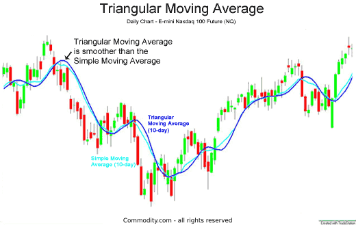

## Table of Contents

## What is a Triangular Moving Average (TMA)?

A Triangular Moving Average (TMA) is a type of moving average used in technical analysis to smooth out price data over a specific period of time. Unlike a simple moving average, which gives equal weight to all data points in its calculation, a TMA applies more weight to the middle portion of the data set, forming a triangular shape when the weights are plotted. This weighting scheme helps to reduce the impact of random fluctuations and provide a clearer trend signal.

To calculate a TMA, you first compute a simple moving average of the data over the chosen period. Then, you apply another simple moving average to the result of the first calculation, using the same period length. This double smoothing process creates the triangular weighting, emphasizing the central values of the time series. Traders often use TMAs to identify trends and potential reversal points in financial markets, as they can help filter out short-term noise and highlight longer-term movements.

## How does a Triangular Moving Average differ from a Simple Moving Average (SMA)?

A Triangular Moving Average (TMA) and a Simple Moving Average (SMA) both help smooth out price data, but they do it differently. An SMA takes the average of a set number of data points over a specific period. For example, a 10-day SMA adds up the closing prices of the last 10 days and divides by 10. Every data point in the period is given the same importance, or weight.

On the other hand, a TMA puts more weight on the middle part of the data set. To calculate a TMA, you first find an SMA over your chosen period, and then you take another SMA of that result using the same period. This double smoothing creates a triangular shape if you plot the weights, giving more importance to the central values of the time period. This helps reduce the effect of short-term ups and downs, making it easier to see the overall trend.

## What are the steps to calculate a Triangular Moving Average?

To calculate a Triangular Moving Average (TMA), you first need to decide on the period you want to use. Let's say you choose a 10-day period. Start by calculating a Simple Moving Average (SMA) for that period. For a 10-day SMA, you add up the closing prices of the last 10 days and then divide by 10. Do this for each day, moving forward one day at a time. This gives you a set of SMA values.

Next, you take those SMA values and calculate another SMA using the same period length. So, if you used a 10-day period for the first SMA, you'll now calculate a 10-day SMA of the first set of SMA values. This second calculation is what creates the triangular weighting, where the middle values of the original period get more importance. The result of this second SMA calculation is your TMA. It helps smooth out the data even more than a single SMA, making it easier to spot trends.

## Why is the Triangular Moving Average considered smoother than other moving averages?

The Triangular Moving Average (TMA) is considered smoother than other moving averages because it uses a double smoothing process. First, it calculates a Simple Moving Average (SMA) over a chosen period. Then, it takes another SMA of those SMA values. This double smoothing helps to reduce the impact of short-term price changes, making the trend easier to see.

The TMA gives more weight to the middle part of the data set, which forms a triangular shape when you plot the weights. This means the middle values of the period are more important than the values at the beginning or end. By focusing more on the central data, the TMA can filter out the noise and show a clearer picture of the trend over time.

## In what types of markets or scenarios is the TMA most useful?

The Triangular Moving Average (TMA) is really helpful in markets that have a lot of ups and downs, like the stock market or forex trading. It's good at smoothing out these quick changes, so you can see the bigger trend more clearly. If you're trading in a market where prices jump around a lot, using a TMA can help you make better decisions by showing you the overall direction of the market instead of getting caught up in the small, short-term changes.

In scenarios where you want to find the right time to buy or sell, the TMA can be a useful tool. For example, if you see the TMA line start to go up after it was going down, it might be a good time to buy. On the other hand, if the TMA line starts to go down after it was going up, it could be a sign to sell. This makes the TMA especially useful for people who are looking to follow trends over a longer period, rather than trying to make quick trades based on short-term movements.

## How can traders use the Triangular Moving Average in their trading strategy?

Traders can use the Triangular Moving Average (TMA) to help them spot trends in the market. By looking at the TMA line on a chart, traders can see if prices are generally going up or down over time. If the TMA line starts to go up, it might be a good time to buy, because it shows that the trend is turning positive. On the other hand, if the TMA line starts to go down, it could be a sign to sell, as the trend might be turning negative. This can help traders make decisions based on the bigger picture, rather than getting caught up in small, short-term price changes.

Another way traders use the TMA is to find good entry and exit points for their trades. For example, if the price of a stock is below the TMA line and starts to move up towards it, traders might see this as a chance to buy, expecting the price to keep going up. If the price is above the TMA line and starts to fall back towards it, traders might see this as a time to sell, expecting the price to keep going down. By using the TMA to guide their entry and exit points, traders can try to make the most of the trends they see in the market.

## What are the advantages of using a Triangular Moving Average over other types of moving averages?

The Triangular Moving Average (TMA) is really good at smoothing out the ups and downs in the market. It does this by using a double smoothing process. First, it calculates a Simple Moving Average (SMA), and then it takes another SMA of those values. This helps to make the trend clearer by focusing more on the middle part of the data. If you're trading in a market where prices change a lot, the TMA can help you see the bigger picture instead of getting confused by small changes.

Another advantage of the TMA is that it can help you find the best times to buy or sell. When the TMA line starts to go up after being down, it might be a good time to buy. When it starts to go down after being up, it could be a sign to sell. This can help you make better trading decisions based on longer trends, not just short-term movements. So, if you're looking to follow trends over time, the TMA can be a helpful tool in your trading strategy.

## Are there any specific technical indicators that work well in conjunction with the TMA?

Traders often use the Triangular Moving Average (TMA) along with other technical indicators to make better trading decisions. One popular indicator to use with the TMA is the Relative Strength Index (RSI). The RSI helps you see if a stock is overbought or oversold. If the RSI shows a stock is overbought and the TMA line starts to go down, it might be a good time to sell. If the RSI shows a stock is oversold and the TMA line starts to go up, it could be a good time to buy.

Another useful indicator to pair with the TMA is the Moving Average Convergence Divergence (MACD). The MACD helps you see when a trend might be changing. When the MACD line crosses above the signal line, it can signal that it's time to buy, especially if the TMA line is also going up. When the MACD line crosses below the signal line, it can signal that it's time to sell, particularly if the TMA line is going down. Using the TMA with the MACD can help you catch trend changes early and make more informed trades.

## Can the Triangular Moving Average be applied to different time frames, and how does the choice of time frame affect its effectiveness?

Yes, the Triangular Moving Average (TMA) can be used on different time frames, like daily, weekly, or even hourly charts. The time frame you choose changes how the TMA works. If you use a shorter time frame, like an hourly chart, the TMA will be more sensitive to quick changes in the market. This can be good if you want to make quick trades, but it might also show more ups and downs, making it harder to see the big trend.

On the other hand, if you use a longer time frame, like a weekly chart, the TMA will be smoother and show you the bigger trend more clearly. This can be helpful if you're looking to hold onto your trades for a longer time. The choice of time frame depends on what you're trying to do with your trading. If you want to catch short-term moves, a shorter time frame might work better. But if you're more interested in the overall direction of the market, a longer time frame could be more effective.

## How does the length of the period used in calculating the TMA impact its sensitivity and lag?

The length of the period you use to calculate the Triangular Moving Average (TMA) affects how sensitive it is to price changes and how much it lags behind the current price. If you use a shorter period, like 5 days, the TMA will be more sensitive. It will react quickly to price changes, which can be good if you want to catch short-term movements in the market. But, because it reacts so quickly, it might also show more ups and downs, making it harder to see the overall trend.

On the other hand, if you use a longer period, like 20 days, the TMA will be less sensitive and will lag more behind the current price. It will take longer to change direction, which can help smooth out the short-term ups and downs and show you the bigger trend more clearly. This can be helpful if you're looking to hold onto your trades for a longer time and want to focus on the overall direction of the market, rather than getting caught up in the day-to-day changes.

## What are some common mistakes traders make when using the Triangular Moving Average?

One common mistake traders make when using the Triangular Moving Average (TMA) is choosing the wrong time frame for their trading strategy. If a trader uses a short time frame like an hourly chart but is actually looking to hold trades for weeks, the TMA will be too sensitive and show too many ups and downs, making it hard to see the bigger trend. On the other hand, if a trader uses a long time frame like a weekly chart for quick trades, the TMA will lag too much and they might miss out on short-term opportunities.

Another mistake is relying too much on the TMA alone without using other indicators. The TMA is good at smoothing out price changes and showing trends, but it doesn't give all the information a trader needs. For example, a trader might see the TMA line start to go up and decide to buy, but if they also checked the Relative Strength Index (RSI) and saw that the stock was overbought, they might have waited for a better entry point. Using the TMA along with other indicators like the RSI or Moving Average Convergence Divergence (MACD) can help traders make more informed decisions.

## How can one optimize the settings of a Triangular Moving Average for better performance in algorithmic trading?

To optimize the settings of a Triangular Moving Average (TMA) for better performance in algorithmic trading, you need to think about the time frame you're using and the length of the period. If you're trading quickly and want to catch short-term moves, use a shorter time frame like an hourly chart and a shorter period like 5 or 10 days. This will make the TMA react faster to price changes, but it might also show more ups and downs. On the other hand, if you're holding trades for a longer time and want to see the bigger trend, use a longer time frame like a daily or weekly chart and a longer period like 20 or 50 days. This will make the TMA smoother and help you focus on the overall direction of the market.

Another way to optimize the TMA is to use it along with other indicators. For example, you can use the Relative Strength Index (RSI) to see if a stock is overbought or oversold, and the Moving Average Convergence Divergence (MACD) to spot when a trend might be changing. By combining the TMA with these other indicators, you can make better trading decisions. You might also want to test different TMA settings using historical data to see which ones work best for your strategy. This can help you find the right balance between sensitivity and lag, so your TMA performs well in your algorithmic trading system.

## How is a Triangular Moving Average Calculated?

The Triangular Moving Average (TMA) is calculated by performing a double smoothing process on price data. This involves averaging the Simple Moving Average (SMA) values over a specified period. The process is twofold:

1. **Calculate the Simple Moving Average (SMA):** The SMA is the average of a selected range of prices, usually closing prices, over a set period $N$. The formula for SMA is:
$$
   \text{SMA} = \frac{P_1 + P_2 + \ldots + P_N}{N}

$$

   where $P_1, P_2, \ldots, P_N$ are the price points.

2. **Calculate the Triangular Moving Average (TMA):** Once the SMA values are obtained, a second average is computed over the SMA values. This additional step smooths the data further, producing the TMA:
$$
   \text{TMA} = \frac{\text{SMA}_1 + \text{SMA}_2 + \ldots + \text{SMA}_N}{N}

$$

The TMA places more weight on the middle points of the data set, reducing the noise from short-term fluctuations and providing a clearer indication of long-term trends. This double averaging technique is designed to highlight these trends more effectively than single averaging methods.

Most modern trading platforms are equipped to perform these calculations automatically, offering user-friendly interfaces for traders. This means traders can focus on strategy rather than on the computational aspects of calculating TMAs.

## References & Further Reading

[1]: "Moving Averages: Simplified, Hyped Up, and Popular – Technical Indicators." Investopedia. [Link](https://www.investopedia.com/articles/trading/09/moving-average-types.asp)

[2]: Kaufman, P. J. (1998). "Trading Systems and Methods." John Wiley & Sons.

[3]: Murphy, J. J. (1999). "Technical Analysis of the Financial Markets: A Comprehensive Guide to Trading Methods and Applications." New York Institute of Finance.

[4]: Brock, W., Lakonishok, J., & LeBaron, B. (1992). "Simple Technical Trading Rules and the Stochastic Properties of Stock Returns." Journal of Finance, 47(5), 1731-1764.

[5]: "Algorithmic Trading: Winning Strategies and Their Rationale." (2013) by Ernest P. Chan.