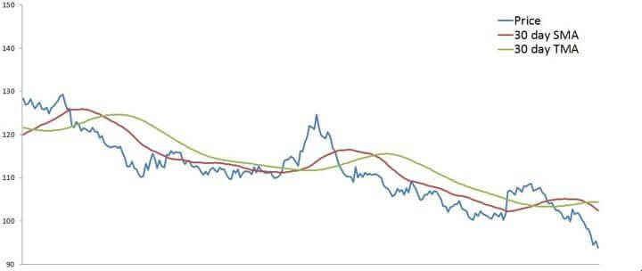

In algorithmic trading, the Triangular Moving Average (TMA) serves as a noteworthy, yet frequently underutilized, analytical tool. This article seeks to highlight the role and importance of TMA within trading strategies, offering a comprehensive guide to its unique characteristics, methods of calculation, and practical applications in trading. The TMA is known for its advanced smoothing abilities, allowing traders to mitigate short-term fluctuations and better recognize prolonged market trends. As we progress, we will examine how TMA is determined and how it may be leveraged to enhance trading performance, providing aficionados of algorithmic trading with a deeper understanding of its potential benefits and limitations.

## Table of Contents



## What is a Triangular Moving Average (TMA)?

The Triangular Moving Average (TMA) is a form of moving average that provides an additional level of smoothing by averaging the data twice. Unlike the more traditionally used Simple Moving Average (SMA) or Exponential Moving Average (EMA), TMA takes its smoothing process a step further. This additional averaging helps to eliminate the noise of short-term fluctuations in data, making it an effective tool for traders aiming to discern more persistent trends in financial markets.

The TMA's primary function is to filter out transient volatility in price movements, thereby offering a clearer view of the longer-term trend. This characteristic makes it particularly useful in markets that are subject to high volatility. By focusing on longer-term trends, the TMA assists traders in identifying underlying market movements that may not be readily apparent with other types of moving averages. This capacity to highlight enduring trends can be advantageous for traders looking to make decisions based on more stable data, avoiding potential misdirection caused by short-lived price spikes.

## How is a Triangular Moving Average Calculated?

The Triangular Moving Average (TMA) is calculated by performing a double smoothing process on price data. This involves averaging the Simple Moving Average (SMA) values over a specified period. The process is twofold:

1. **Calculate the Simple Moving Average (SMA):** The SMA is the average of a selected range of prices, usually closing prices, over a set period $N$. The formula for SMA is:
$$
   \text{SMA} = \frac{P_1 + P_2 + \ldots + P_N}{N}

$$

   where $P_1, P_2, \ldots, P_N$ are the price points.

2. **Calculate the Triangular Moving Average (TMA):** Once the SMA values are obtained, a second average is computed over the SMA values. This additional step smooths the data further, producing the TMA:
$$
   \text{TMA} = \frac{\text{SMA}_1 + \text{SMA}_2 + \ldots + \text{SMA}_N}{N}

$$

The TMA places more weight on the middle points of the data set, reducing the noise from short-term fluctuations and providing a clearer indication of long-term trends. This double averaging technique is designed to highlight these trends more effectively than single averaging methods.

Most modern trading platforms are equipped to perform these calculations automatically, offering user-friendly interfaces for traders. This means traders can focus on strategy rather than on the computational aspects of calculating TMAs.

## Why Use a Triangular Moving Average?

The Triangular Moving Average (TMA) offers a significant advantage to traders who focus on long-term trends due to its smoothing effect, which efficiently reduces short-term [volatility](/wiki/volatility-trading-strategies). This characteristic allows traders to better anticipate sustained directional movements in price.

The process of double-averaging inherent in the TMA helps filter out the noise typically associated with short-term fluctuations. In volatile markets, price data can often be erratic, potentially leading to misleading signals when using standard moving averages. By filtering these short-term variations, the TMA emphasizes the more substantial, underlying trends.

This smoothing process can be particularly advantageous for trend-following strategies, where identifying the true direction of the market is crucial. Trend-following traders use TMAs to confirm trends, ensuring that the movements they are observing are not merely temporary anomalies or the result of market noise. The TMA provides a clearer perspective of the market by highlighting the more persistent trends, which are less likely to be influenced by short-lived swings.

In addition to trend-following, the TMA's ability to present a clearer picture of market trends can aid in constructing mean-reversion strategies. By identifying periods when the market has deviated too far from the norm, traders can make judgments about potential reversals or corrections. The TMA line acts as a reference point around which price actions are evaluated, helping traders discern overbought or oversold conditions relative to long-term market behavior.

Conclusively, the TMA's effectiveness at filtering short-term market noise and enhancing the visibility of genuine long-term trends makes it a valuable tool for traders who prioritize stability and sustained direction in their strategic decision-making. This capability allows them to focus on the broader market movements, reducing the risk of being misled by temporary market volatility.

## Implementing TMA in Trading Strategies

Triangular Moving Average (TMA) can be effectively integrated into various trading strategies due to its unique smoothing properties. It serves both trend-following and mean-reversion strategies, providing traders with a robust tool for analyzing market trends and conditions.

In trend-following strategies, TMA assists traders by offering a clear visualization of the underlying trend, which can be crucial for deciding entry and [exit](/wiki/exit-strategy) points. When the price maintains above the TMA line, it suggests a bullish trend, whereas a price consistently below the TMA line indicates a bearish trend. By reducing the noise of short-term price fluctuations, TMA helps traders concentrate on the broader market movements, allowing for more confident trend confirmation. This smoothing effect is particularly beneficial for medium to long-term traders, who focus on capturing large market moves rather than short-term corrections.

Regarding mean-reversion strategies, TMA can be used as a benchmark for identifying potential overbought or oversold conditions. The mean-reversion approach is based on the idea that prices will eventually revert to their mean or average level. By observing the distance between the price and the TMA line, traders can gauge the degree of deviation from the average. If the price deviates significantly from the TMA, it may indicate an overbought or oversold condition. For instance, when the price is substantially above the TMA line, it might be overbought, suggesting a potential sell opportunity. Conversely, if it's far below, it may be oversold, indicating a potential buy opportunity.

Implementing TMA in these strategies can be further enhanced by combining it with other technical indicators or tools, such as Relative Strength Index (RSI) for confirming overbought or oversold states, or with [volume](/wiki/volume-trading-strategy) indicators to strengthen trend confirmation. Python libraries such as `pandas` and `ta` can be utilized to compute and visualize TMA alongside other indicators, allowing for comprehensive strategy development and testing.

Here is a sample Python code snippet to calculate TMA using `pandas`:

```python
import pandas as pd

# Sample data: 'df' is a DataFrame with a 'Close' column
df = pd.DataFrame({
    'Close': [....]  # List of closing prices
})

# Calculate the initial Simple Moving Average (SMA)
df['SMA'] = df['Close'].rolling(window=period).mean()

# Calculate the Triangular Moving Average (TMA)
df['TMA'] = df['SMA'].rolling(window=period).mean()
```

In practice, the selected period for the TMA can be adjusted according to the trader’s strategy and the market conditions being targeted. Longer periods result in smoother TMA lines, suitable for identifying major trends, while shorter periods may offer more timely signals but with less noise reduction.

## Drawbacks of Using a Triangular Moving Average

The Triangular Moving Average (TMA) is known for its smoothing capabilities, which offer significant advantages for identifying consistent trends in trading. However, one major drawback is its inherent lag, a consequence of the double averaging process that characterizes TMA. This lag becomes evident when the moving average's response to price changes is notably slower than that of other types of moving averages, such as the Simple Moving Average (SMA) or the Exponential Moving Average (EMA).

The lag in TMA is caused by its two-step calculation process. Initially, a Simple Moving Average is computed, and then a second averaging of these SMA values is performed over the same period. While this double averaging leads to a smoother line, it also means that the TMA is based on past price information, potentially resulting in delayed signals. The delay in reacting to price changes can be a critical disadvantage, especially in fast-paced trading environments where swift decision-making is crucial.

For traders operating in high-frequency or volatile markets, the lag introduced by TMA might lead to missed opportunities or delayed exit and entry points. In these scenarios, the inability of TMA to react swiftly to short-term price movements might hinder performance, making it less suitable compared to moving averages that are designed to be more responsive, like the EMA. These alternatives apply weight to more recent prices, thereby reducing lag and improving reactivity to short-term fluctuations.

Python code to visualize TMA and its lag compared to other moving averages can be insightful. An example code snippet might look like this:

```python
import matplotlib.pyplot as plt
import pandas as pd
import numpy as np

# Sample data: 100 random prices
np.random.seed(0)
prices = np.cumsum(np.random.randn(100)) + 100

# Calculate Simple Moving Average
def calculate_sma(data, period):
    return pd.Series(data).rolling(window=period).mean()

# Calculate Triangular Moving Average
def calculate_tma(data, period):
    sma = calculate_sma(data, period)
    return calculate_sma(sma, period)

# Calculate Triangular and Simple Moving Averages
period = 5
sma = calculate_sma(prices, period)
tma = calculate_tma(prices, period)

# Plotting
plt.figure(figsize=(10, 6))
plt.plot(prices, label='Price')
plt.plot(sma, label='SMA')
plt.plot(tma, label='TMA', linestyle='dashed')
plt.title('Price, SMA, and TMA')
plt.legend()
plt.show()
```

In conclusion, the TMA's lag is both an asset for highlighting long-term trends and a drawback in agile trading environments. Therefore, traders must assess their strategy's suitability for TMA, balancing its noise-reduction merits against the necessity for timely market responses.

## Backtesting Triangular Moving Averages

Backtesting is a critical process in evaluating the viability of the Triangular Moving Average (TMA) as part of a trading strategy. It involves simulating the trading logic on historical data to assess performance. In the case of TMA, it is particularly beneficial to test it against historical market data such as the S&P 500 to understand its behavior under various market conditions.

The Triangular Moving Average is renowned for its smoothing capabilities, making it potentially advantageous for longer-term investments. When backtested on instruments like the S&P 500, TMA typically demonstrates its strength in less volatile and trending environments. Its ability to smooth out short-term noise allows it to capture long-term trends more effectively than some other types of moving averages.

One of the primary considerations when [backtesting](/wiki/backtesting) TMA is its lag effect, which is a result of the double averaging process. The lag might cause the TMA to react more slowly to rapid price changes, which can be a disadvantage in volatile markets. However, this same lag can be beneficial in minimizing false signals and focusing on significant price movements over a prolonged period.

The success of TMA in backtesting, therefore, often hinges on market conditions. In more stable, trending markets, TMA tends to reflect robust profitability. For this reason, investors utilizing TMA might favor sectors or periods demonstrating long-term trends with less short-term volatility.

For those interested in implementing TMA backtesting, a simple Python code might look like this:

```python
import pandas as pd

# Assuming market_data is a pandas DataFrame with 'Close' prices
def calculate_sma(data, period):
    return data.rolling(window=period).mean()

def calculate_tma(data, period):
    sma = calculate_sma(data, period)
    tma = calculate_sma(sma, period)
    return tma

# Sample S&P 500 data
market_data = pd.DataFrame({
    'Close': [ /* historical close prices */ ]
})

period = 20  # Example period
market_data['TMA'] = calculate_tma(market_data['Close'], period)

# Backtesting logic here comparing 'Close' prices with 'TMA' values
```

The code snippet demonstrates how to compute the TMA using historical closing prices, allowing traders to apply the TMA strategy and analyze its effectiveness against market performance data like the S&P 500.

## FAQs on Triangular Moving Average

What differentiates the Triangular Moving Average (TMA) from other moving averages lies in its double-smoothing characteristic, which sets it apart from more traditional moving averages like the Simple Moving Average (SMA) and Exponential Moving Average (EMA). While both SMA and EMA involve single-layer averaging of data points, TMA involves two stages of averaging. This two-step process involves first calculating a Simple Moving Average over the desired period, and then computing another SMA over the values obtained in the first step. This yields a smoother curve, significantly reducing short-term fluctuations and providing a clearer view of long-term trends.

The smoothing benefit of TMA is particularly advantageous for long-term trading strategies. By effectively minimizing short-term volatility, TMA enables traders to focus on sustained price trends, thereby aiding in the identification of longer-term [momentum](/wiki/momentum). This enhanced clarity in trend visibility can assist traders in making more informed decisions regarding entry and exit points in their trading activities, ultimately supporting a slow and steady approach to capitalizing on sustained market movements.

Despite its advantages, the TMA has limitations in high-frequency trading ([HFT](/wiki/high-frequency-trading-strategies)) environments. Due to its inherent lag from the double-smoothing process, TMA tends to delay signals, which can be problematic for high-frequency traders who require rapid responses to market changes. In the swift dynamics of HFT, such lag can lead to missed opportunities or suboptimal decisions, as traders may not react quickly enough to capitalize on short-lived price movements. Consequently, TMAs are generally less suitable for strategies that demand quick and frequent adjustments, making them a better fit for long-term trading approaches.

## Conclusion

The Triangular Moving Average (TMA) stands out among moving averages primarily because of its enhanced smoothing properties. These properties make it exceptionally useful for traders focusing on long-term trends. Its unique calculation method involves double averaging, which provides an additional layer of noise reduction when compared to other moving averages like the Simple Moving Average (SMA) or Exponential Moving Average (EMA).

Despite its strengths, TMA does not react swiftly to rapid price changes. This lag is a direct consequence of its smoothing nature, which, while beneficial for highlighting sustained trends, might delay signals that are crucial in fast-moving markets. This delay can be a disadvantage in high-frequency trading scenarios where quick responses are essential.

For traders who prioritize long-term strategies over short-term gains, TMA offers a significant advantage. By filtering out the short-term fluctuations and focusing on the overarching trend, the TMA allows traders to make more informed decisions that align with broader market movements. Its ability to focus on the bigger picture makes it a valuable component of a trader's toolkit, especially for those aiming to capitalize on long-term market trends.

## References & Further Reading

[1]: "Moving Averages: Simplified, Hyped Up, and Popular – Technical Indicators." Investopedia. [Link](https://www.investopedia.com/articles/trading/09/moving-average-types.asp)

[2]: Kaufman, P. J. (1998). "Trading Systems and Methods." John Wiley & Sons.

[3]: Murphy, J. J. (1999). "Technical Analysis of the Financial Markets: A Comprehensive Guide to Trading Methods and Applications." New York Institute of Finance.

[4]: Brock, W., Lakonishok, J., & LeBaron, B. (1992). "Simple Technical Trading Rules and the Stochastic Properties of Stock Returns." Journal of Finance, 47(5), 1731-1764.

[5]: "Algorithmic Trading: Winning Strategies and Their Rationale." (2013) by Ernest P. Chan.