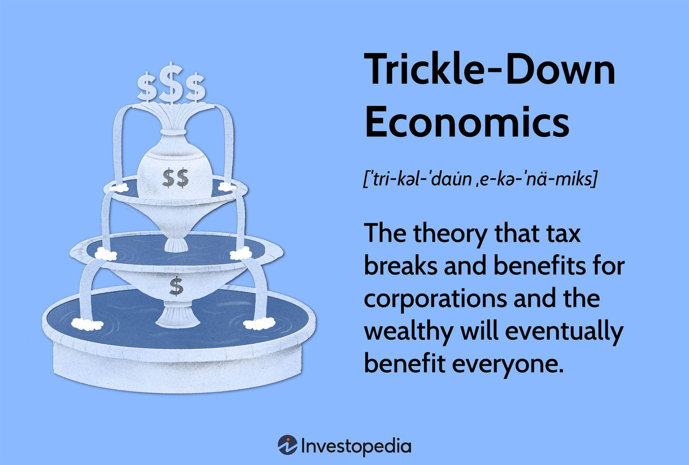

Trickle-down economics, often intertwined with supply-side economics, operates on the principle that providing tax cuts and financial benefits to corporations and high-income individuals will eventually lead to advantages for the broader population. This theory suggests that affluent sectors of society will reinvest their gains into the economy, driving growth, creating jobs, and ultimately enhancing the standard of living for all economic strata. 

For decades, this economic ideology has been the epicenter of rigorous debates among economists, policymakers, and the general public. Advocates argue that by incentivizing the wealth creators—namely businesses and entrepreneurs—through reduced taxes and minimal regulation, a conducive environment is fostered for investment and innovation, spurring economic expansion. Critiques, however, highlight the propensity of trickle-down economics to disproportionately favor the wealthy, often leading to increased income inequality and insufficient distribution of wealth across society.

In this article, we will examine the core components of trickle-down economics, evaluating both the historical and contemporary arguments supporting and contesting its efficacy. We aim to conduct a thorough analysis, scrutinizing empirical evidence to gauge the theory's impact on economic growth and societal welfare. Furthermore, the advent of algorithmic trading—a modern mechanism powered by advanced technology—introduces new dimensions to these discussions. Algorithmic trading utilizes artificial intelligence and machine learning to execute trades at lightning speeds and vast scales, potentially altering the influence of economic policies, including those rooted in trickle-down principles.

By understanding the juxtaposition and interaction between traditional economic principles and modern technological tools like algorithmic trading, we can better assess the relevance and adaptability of trickle-down theories in today's rapidly evolving economic landscape. This examination will aid in forming balanced economic strategies that accommodate both technological advancements and the objective of inclusive growth.

## Table of Contents

## Understanding Trickle-Down Economics

Trickle-down economics posits that economic benefits provided to the wealthy and corporations will eventually benefit the wider population. This theory is rooted in the belief that when high-income earners and businesses receive tax cuts and face fewer regulations, they are more likely to invest their surplus wealth in productive activities. Such activities could include expanding businesses, increasing research and development, or enhancing employee skills, all of which are expected to drive economic growth. 

Proponents of trickle-down economics argue that such growth leads to job creation and increased consumer spending, thus benefiting the entire economy. For instance, by reducing the tax burden on corporations, they might have more capital to invest in expanding operations or developing new products, thereby creating more jobs. Additionally, the increase in disposable income for high-income earners is expected to result in higher consumption, which can spur demand for goods and services, potentially leading to further economic expansion.

However, criticism of trickle-down economics centers around its tendency to disproportionately favor the wealthy, often resulting in increased income inequality. Critics argue that tax cuts primarily benefit those at the top, with only marginal improvements for lower and middle-income earners. The assumption that benefits automatically filter down to the wider economy is often debated, as some argue that without redistributive mechanisms, the rich might not necessarily reinvest their gains into the domestic economy.

Research has shown mixed evidence about the efficacy of trickle-down policies. While some studies indicate a positive correlation between reduced taxes on the wealthy and economic growth, others highlight that such policies can lead to a concentration of wealth and reduced public revenue, thereby affecting public services and infrastructure negatively. The effectiveness of trickle-down economics largely depends on the specific economic context and accompanying policies that can either enhance or mitigate its broader societal impact.

## Policy Implementation and Critique

Trickle-down economic policies have been a prominent feature of some Republican administrations in the United States, notably under Presidents Ronald Reagan and Donald Trump. These policies typically emphasize tax cuts for corporations and the wealthy, alongside deregulation, with the expectation that such measures will spur investment, economic growth, and by extension, job creation.

During Ronald Reagan's presidency, the Economic Recovery Tax Act of 1981 was a significant implementation of trickle-down theory. This legislation reduced the top marginal tax rate from 70% to 50% and aimed to incentivize higher-income individuals and corporations to reinvest their tax savings into the economy. Supporters of Reaganomics argued that these policies led to the longest peacetime economic expansion in American history. However, critics point out that income inequality widened during this period, with wealth becoming increasingly concentrated among the top earners.

Similarly, President Donald Trump enacted policies reflecting trickle-down principles through the Tax Cuts and Jobs Act of 2017. This law reduced the corporate tax rate from 35% to 21% and lowered personal income tax rates for individuals in higher tax brackets. Proponents claimed these measures would invigorate the economy by encouraging corporations to increase wages and expand operations. Critics, however, highlighted that the benefits predominantly accrued to shareholders and executives, rather than resulting in significant wage increases for average workers.

A key concept frequently associated with such tax policies is the Laffer Curve, which posits that there exists an optimal tax rate to maximize government revenue. The Laffer Curve suggests that overly high tax rates can discourage investment and work, thus reducing taxable income and, consequently, actual tax revenues. Conversely, reducing excessive tax rates could theoretically increase revenues by fostering economic activity. The practical applicability of the Laffer Curve is contentious, with debates centering on the position of the peak tax rate.

Empirical studies evaluating the impact of trickle-down economics present mixed results. Some research suggests limited evidence that tax cuts for higher-income individuals drive significant increases in economic growth or employment. For instance, a study published in the American Economic Journal analyzed major tax cuts across advanced economies and found minimal long-term impacts on economic growth or unemployment. Such findings reinforce the perspective that trickle-down economics may exacerbate income inequality without delivering substantial economic benefits to the broader population.

Overall, while trickle-down economics remains a guiding principle for certain policymakers, its efficacy and impact continue to be subjects of extensive debate and analysis. The discussion of this economic theory persists, with calls for a reevaluation of its role in shaping equitable and sustainable economic policies.

## Algorithmic Trading: A Modern Economic Tool

Algorithmic trading represents a revolutionary shift in the way financial markets operate, utilizing advanced technologies such as [artificial intelligence](/wiki/ai-artificial-intelligence) (AI) and [machine learning](/wiki/machine-learning) to automate and optimize trading decisions. Unlike traditional trading methods, [algorithmic trading](/wiki/algorithmic-trading) enables high-frequency trading, allowing millions of trades to be executed within milliseconds. This speed is achieved through complex algorithms that analyze vast datasets, identify market trends, and execute trades without human intervention.

One of the key advantages of algorithmic trading lies in its ability to process enormous volumes of data and perform real-time analysis. Traders can use these systems to detect market patterns and signals, generating strategies that adapt quickly to changing market conditions. The algorithms are capable of parsing information from various sources, including news articles, financial reports, and social media trends, to make informed trading decisions. This data-driven approach can enhance accuracy and efficiency, reducing the risks associated with human errors.

Incorporating algorithmic trading into economic policies has the potential to amplify or mitigate the effects of traditional economic theories, such as trickle-down economics. For instance, reducing taxes and regulatory burdens on corporations could increase market [liquidity](/wiki/liquidity-risk-premium), making markets more attractive for algorithmic traders. This increased activity can potentially stimulate economic growth by enhancing market efficiency and lowering transaction costs.

However, there are risks associated with the widespread adoption of algorithmic trading. High-frequency trading can lead to increased market [volatility](/wiki/volatility-trading-strategies) and has been linked to events such as the Flash Crash of 2010, where the Dow Jones Industrial Average dropped by about 1,000 points in mere minutes before rebounding. To address these concerns, a balanced regulatory framework is essential to ensure the stability and integrity of financial markets while harnessing the technological benefits of algorithmic trading.

Algorithmic trading continues to reshape the financial landscape, driving a need for economic policies that accommodate these technological advancements while minimizing systemic risks. As this form of trading evolves, understanding its implications and integrating cutting-edge technologies into economic frameworks will be crucial for fostering sustainable and inclusive market growth.

## Interplay Between Trickle-Down Economics and Algorithmic Trading

Algorithmic trading, which leverages advanced technologies such as artificial intelligence and machine learning, is significantly influenced by economic policies, including those proposed by trickle-down economics. Reduced taxes and regulations, key tenets of trickle-down policies, are intended to create a more conducive environment for capitalists and enterprises, thereby promoting investment in technology-driven sectors. This regulatory relaxation can enhance liquidity by enabling more efficient trading mechanisms, as algorithmic trading systems can operate at higher volumes and speeds. Such an environment can lead to more efficient market pricing, reduce bid-ask spreads, and increase overall market participation.

However, while the efficiencies afforded by algorithmic trading are notable, there is a potential downside. The rapid and complex nature of algorithmic trades can contribute to increased market volatility. Events such as the 2010 Flash Crash and more recent instances have illustrated how algorithmic trading can lead to rapid, large-scale market disruptions. In such situations, massive trades are executed in fractions of a second, potentially creating cascading effects that traditional oversight mechanisms struggle to manage. The systemic risk posed by algorithmic trading thus necessitates a framework of balanced regulatory oversight. Without adequate controls, the market's stability might be compromised, leading to broader economic implications.

The intersection of trickle-down economics and algorithmic trading serves to challenge traditional economic theories. While both aim to foster growth—trickle-down by empowering the financial elite and algorithmic trading by enhancing market functions—their confluence presents a test of resilience for economic models developed in a pre-digital age. This scenario invites reconsideration of how these economic theories adapt to and are shaped by technological advancements. Policymakers must examine whether existing models account for the complex, automated landscape introduced by algorithmic trading and consider integrating technological foresight into economic strategies to mitigate unintended consequences. Thus, understanding the synergy and potential discord between trickle-down economics and algorithmic trading is essential for evolving financial markets.

## Criticism and Alternatives

Critics of trickle-down economics argue that the policy exacerbates economic disparities, benefiting the wealthy more than the general population. The primary criticism lies in its assumption that benefits provided to high-income earners will eventually disseminate through the economy to lower-income individuals. Empirical evidence often challenges this premise, indicating that wealth accumulation remains concentrated at the top, leading to increased income inequality.

One of the primary alternatives to trickle-down economics is the implementation of direct economic interventions. These interventions can include government spending in critical sectors such as healthcare, education, and infrastructure. By targeting investments towards areas that directly affect the lower and middle-income classes, governments can stimulate broad-based economic growth and employment opportunities. Furthermore, these interventions can help reduce income inequality by making essential services more accessible to all citizens.

Progressive taxation is another proposed alternative, which seeks to levy taxes based on individuals' ability to pay. This system contrasts with the tax cuts often advocated under trickle-down policies. By increasing tax rates for the wealthy and reducing them for lower-income earners, governments can redistribute wealth more equitably. The additional revenue generated can fund social programs that benefit the broader population, thereby boosting overall economic well-being.

Technological advancements in finance necessitate a reevaluation of economic policy frameworks. The rise of digital platforms and algorithmic trading shifts traditional economic dynamics, affecting market liquidity and volatility. These changes underscore the importance of revisiting existing policies to ensure they account for modern financial realities. This reevaluation should prioritize regulations that mitigate the risks associated with advanced trading technologies while promoting their potential to enhance financial inclusivity and economic stability.

These critiques and alternatives to trickle-down economics highlight the necessity for policies that directly address income inequality while adapting to the evolving financial landscape. By considering these factors, policymakers can devise strategies that promote sustainable and inclusive economic growth.

## Conclusion

Trickle-down economics remains a contentious concept with varied outcomes across different economies. It has been praised by some for potentially spurring investment and economic growth through policies that favor tax cuts for high-income earners and reduced regulations for corporations. However, these benefits are often disputed, as critics argue that such approaches may exacerbate income inequality and fail to deliver widespread economic prosperity.

In tandem with economic theory, the advent of algorithmic trading introduces new dynamics in financial markets. This technologically advanced form of trading offers both challenges and opportunities for modern economic policy. On one hand, algorithmic trading can enhance market efficiency and liquidity, potentially complementing trickle-down policies by facilitating capital flow and investment. On the other hand, it poses risks such as increased market volatility and the potential for systemic instability. These complexities necessitate a reevaluation of regulatory frameworks to mitigate negative impacts while harnessing positive outcomes.

As economic frameworks advance, future strategies must consider technological breakthroughs to promote more inclusive growth. This includes reshaping traditional economic models to better align with contemporary market operations and social objectives. Emphasizing direct interventions and progressive taxation could potentially offer more equitable distributions of wealth, addressing criticisms levied against trickle-down economics.

Ongoing discourse and investigation are vital to decoding the multifaceted interaction between classical economic theories and new-age financial technologies. Continuous learning and adaptation will be crucial in evolving policies that not only account for technological advancements but also strive for equitable and sustained economic development.

## References & Further Reading

[1]: ["Capitalist Investment and Institutions: Trickling Up or Down?"](https://academic.oup.com/oxrep/article/37/4/664/6423494) - Oxford Academic

[2]: ["The Trickle-Down Delusion: How Republican Economics Don't Work and How What Does"](https://www.amazon.com/Trickle-Down-Delusion-John-Seip/dp/0761866973) by John Seip

[3]: ["The Laffer Curve: Past, Present, and Future"](https://laffercenter.org/the-laffer-curve-past-present-and-future/) - Tax Foundation

[4]: ["The Impact of Algorithmic Trading on Market Liquidity: Evidence from the Tokyo Stock Exchange"](https://www.sciencedirect.com/science/article/pii/S0927538X16300956) - JSTOR

[5]: ["High-frequency trading: A Stock Market Catch-22"](https://www.schwab.com/learn/story/high-frequency-algorithmic-trading) - Federal Reserve Bank of San Francisco

[6]: ["The Effects of the 1981 and 1986 Tax Cuts on Income Distribution"](https://www.academia.edu/52880940/The_1981_Personal_Income_Tax_Cuts_A_Retrospective_Look_at_Their_Effects_on_the_Federal_Tax_Burden) - JSTOR

[7]: ["Algorithmic Trading: Winning Strategies and Their Rationale"](https://onlinelibrary.wiley.com/doi/pdf/10.1002/9781118676998.fmatter) by Ernest P. Chan