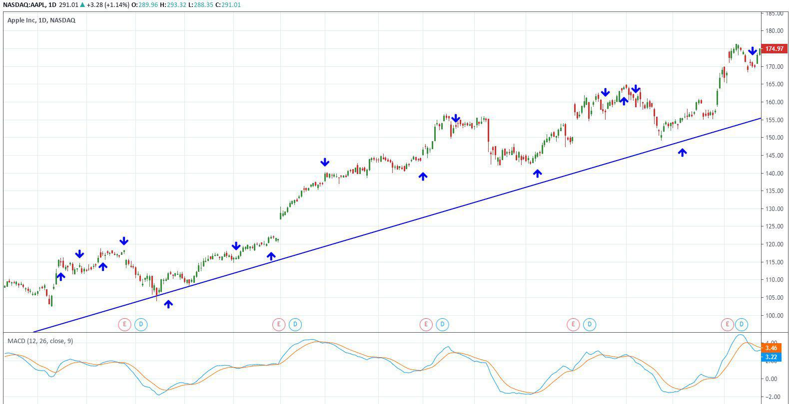

A "trigger line" in financial trading serves as an essential indicator used to signal potential buy or sell actions within an investment strategy. It is a pivotal tool for traders aiming to identify opportune moments in market movements, helping streamline decisions that directly influence profitability. Trigger lines are often derived from moving averages, providing a visual signal when specific market conditions are met, such as crossovers between short-term and long-term moving averages. This concept is particularly valuable in technical analysis, forming the backbone of many trading strategies by quantifying market trends and momentum.

Investment strategies are critical in trading as they determine how capital is allocated based on predicted market behavior. Successful strategies are founded on thorough financial analysis, which encompasses a variety of methods including fundamental and technical analysis. This analysis empowers traders to devise trigger lines that can effectively capture market signals, thereby optimizing their decision-making processes. The interplay between financial indicators, such as price movements and volume, and the calculated trigger lines enables traders to assess potential shifts in market dynamics swiftly.



Algorithmic trading epitomizes the integration of financial analysis with technological advancements. This form of trading employs complex algorithms that automatically execute trades based on predetermined criteria, often involving trigger lines. The growth of algorithmic trading has been exponential, driven by the increasing accessibility of computing power and data processing capabilities. Algorithms not only improve the efficiency and execution speed of trades but also mitigate the emotional biases inherent in manual trading.

Understanding trigger lines, investment strategies, financial analysis, and algorithmic trading allows traders to make informed and strategic decisions. By aligning these components, traders can better anticipate market swings, avoid potential pitfalls, and seize opportunities as they arise. The cohesive understanding of these elements leads to more robust trading strategies that adapt readily to changing market conditions, ultimately enhancing the performance and sustainability of an investor's portfolio. As financial markets continue to evolve, the synergy between traditional analysis methods and technology will become even more instrumental in shaping the future landscape of trading.

## Table of Contents

## Understanding Trigger Lines in Trading

A trigger line in trading is a crucial component of technical analysis, serving as a pivotal signal for executing investment strategies. It primarily functions by indicating optimal entry and exit points in the market, thereby aiding traders in making informed decisions. Trigger lines are most commonly associated with moving averages, where they act as dynamic levels that represent the average price of a security over a specific period. When the price crosses the trigger line, it generates buy or sell signals, guiding traders on potential market opportunities.

The relationship between trigger lines and moving averages is fundamental. Moving averages, such as the Simple Moving Average (SMA) and the Exponential Moving Average (EMA), are used to smooth out price data by creating a constantly updated average price. A trigger line often involves comparing two moving averages with different periods. For example, a short-term moving average crossing above a long-term moving average might signal a buying opportunity, whereas crossing below might indicate a selling opportunity. This crossover technique is a widely used method for generating trading signals.

Trigger lines can vary depending on market conditions. In trending markets, traders might use longer-period moving averages to set trigger lines, aiding in capturing significant price moves while avoiding false signals. In contrast, shorter-period moving averages might be preferred in volatile or range-bound markets to respond quickly to price fluctuations.

In manual trading, trigger lines are visually inspected, and traders apply their discretion to execute trades. However, in [algorithmic trading](/wiki/algorithmic-trading), these lines take on a more mathematical role. Algorithms can be programmed to automatically execute trades when trigger lines dictate a specific market condition. For example, a Python script might be developed to input real-time market data, calculate moving averages, and execute trades based on predefined conditions.

```python
import numpy as np  # For numerical calculations
import pandas as pd  # For data manipulation

# Assume 'df' is a DataFrame with columns 'Price' and 'Date'
df['SMA_50'] = df['Price'].rolling(window=50).mean()
df['SMA_200'] = df['Price'].rolling(window=200).mean()

# Generate signals
df['Signal'] = np.where(df['SMA_50'] > df['SMA_200'], 1, 0)  # 1 indicates buy, 0 indicates sell
df['Position'] = df['Signal'].diff()  # Capture when crosses occur
```

Key mathematical principles define trigger lines, particularly in their formulation and calculation. These principles are based on statistical measures such as averages and deviations, ensuring that trigger lines are responsive yet stable. The balance between responsiveness and stability is crucial in preventing false signals, making trigger lines an essential tool for traders aiming for precision in their strategies. 

By understanding and applying trigger lines, traders can enhance their ability to predict market trends and make data-driven investment decisions, be it through manual discretion or algorithmic execution.

## Integrating Financial Analysis into Investment Strategies

Financial analysis is a systematic approach to evaluating economic, financial, and other pertinent information to make informed investment decisions. It serves as a crucial tool for investors and traders by providing insights into the financial health and performance of assets. The primary purpose of financial analysis in investing is to assess the viability, stability, and profitability of an investment, enabling investors to allocate capital efficiently.

In the context of trading, financial analysis plays an essential role in the setup of trigger lines. Trigger lines are specific levels or areas in price charts that signal potential buy or sell opportunities. They are often informed by underlying financial data, such as moving averages, which are derived from price data over a defined period. This linkage allows traders to harness quantitative insights to predict market movements.

Various methods of financial analysis contribute to the setup and implementation of trigger lines. Fundamental analysis looks at economic indicators, company financial statements, and market conditions to assess an asset’s intrinsic value. In contrast, technical analysis uses statistical trends derived from historical price movements and [volume](/wiki/volume-trading-strategy) to forecast future price movements. 

In technical analysis, key financial indicators such as moving averages, Relative Strength Index (RSI), and Moving Average Convergence Divergence (MACD) are often employed alongside trigger lines. These indicators serve as tools to refine trigger line signals, enhancing the accuracy of trading decisions. For example, a moving average might be used as a trigger line, where a crossover with the asset's current price could indicate a buy or sell signal.

Case studies illustrate how financial analysis significantly impacts strategy success. For instance, the integration of financial ratios in stock analysis can lead to identifying undervalued stocks, thereby informing trading strategies that capitalize on market corrections. In the [forex](/wiki/forex-system) market, analyzing [interest rate](/wiki/interest-rate-trading-strategies) trends and economic indicators can enhance currency trading strategies, leading to optimized entry and [exit](/wiki/exit-strategy) points.

However, relying solely on financial analysis introduces potential pitfalls. An overemphasis on historical data may lead to insufficient attention to unpredictable market news or developments that can affect asset performance instantaneously. Furthermore, emotional biases and the interpretation of indicators without understanding the broader market context can lead to misguided decisions.

Financial analysis, when integrated judiciously with a comprehensive investment strategy, including the use of trigger lines, enables more informed trading decisions. However, it is essential to recognize its limitations and to complement it with other considerations such as market sentiment and geopolitical factors to achieve robust investment outcomes.

## Algorithmic Trading: Harnessing Technology

Algorithmic trading involves using computer algorithms to automate trading decisions, facilitating transactions at speeds and frequencies unattainable by human traders. This approach leverages computational tools to execute predefined strategies, offering significant advantages such as speed, precision, and the ability to process large volumes of data.

One crucial element within these algorithms is the trigger line, which acts as a pivotal signal for executing buy and sell orders. Trigger lines are typically derived from mathematical computations or financial indicators, such as moving averages. When the asset price crosses a trigger line, it prompts the algorithm to make a trading decision. For instance, an algorithm might buy a stock if its price rises above a calculated moving average or sell if it falls below.

Financial analysis is also automated within these algorithms, enabling continuous market monitoring and real-time decision-making. Tools like natural language processing and sentiment analysis extend beyond numerical data, offering insights from news articles and social media, further enhancing the algorithm’s capacity to make informed decisions.

Consider an example of a simple moving average crossover strategy coded in Python:

```python
import numpy as np
import pandas as pd

# Sample data
data = {'Price': [100, 101, 102, 103, 104, 105, 106, 107, 108, 109]}
df = pd.DataFrame(data)

# Calculate moving averages
df['Short_MA'] = df['Price'].rolling(window=3).mean()
df['Long_MA'] = df['Price'].rolling(window=5).mean()

# Generate buy/sell signals
df['Signal'] = np.where(df['Short_MA'] > df['Long_MA'], 1, -1)

print(df)
```

This simple algorithm calculates short-term and long-term moving averages and generates a signal to buy (1) or sell (-1) based on their crossover.

Advancements in AI and [machine learning](/wiki/machine-learning) are further enhancing algorithmic trading by creating more sophisticated models capable of learning from vast datasets. Machine learning algorithms can uncover complex patterns and adjust trading strategies based on new data. Techniques such as [reinforcement learning](/wiki/reinforcement-learning) allow these models to optimize decisions regarding future trade-offs between risk and reward.

However, with these advancements come significant risk management considerations. Algorithmic trading systems can execute a large number of trades in a very short time, potentially exacerbating market [volatility](/wiki/volatility-trading-strategies) and leading to massive losses if not properly managed. Effective risk management strategies are imperative, including setting stop-loss limits, conducting rigorous [backtesting](/wiki/backtesting), and incorporating real-time monitoring.

In conclusion, algorithmic trading harnesses technology to transform trading practices by utilizing trigger lines to make rapid and informed decisions, all while boasting a robust risk management framework. The integration of AI and machine learning presents a promising future for ever-more sophisticated and adaptive trading strategies.

## Developing a Robust Investment Strategy with Trigger Lines

Developing a robust investment strategy using trigger lines requires a systematic approach that blends technical analysis, backtesting, and continual adaptation to market dynamics. Here, we explore the key steps involved in constructing effective trading strategies with trigger lines and provide insights into adapting these strategies across various asset classes.

### Steps in Building a Trading Strategy Using Trigger Lines

1. **Define Trading Objectives**: Establish clear goals for the trading strategy, such as desired return, risk tolerance, and time horizon. This initial step ensures that the strategy aligns with the trader's overall investment plan.

2. **Selection of Trigger Lines**: Trigger lines, often derived from moving averages or other technical indicators, serve as entry and exit signals. Determine the appropriate type of trigger line, such as a simple moving average (SMA) or exponential moving average (EMA), based on the asset's volatility and trading volume.

3. **Identify Parameters for Trigger Lines**: Select the time period for the chosen moving average or indicator. For instance, a 50-day SMA may be used for medium-term trends, while a 200-day SMA is typically used for long-term trend analysis.

### Backtesting and Refining Strategies

Backtesting is a critical component of strategy development, allowing traders to evaluate the effectiveness of trigger lines against historical data. This process involves simulating the trading strategy over past market conditions to assess its performance.

- **Historical Data Collection**: Gather extensive historical price data for the asset in question. Accuracy and comprehensiveness of data are vital for reliable backtesting results.

- **Simulation and Analysis**: Implement the trading strategy in a backtesting platform, utilizing coding languages like Python. For instance, a simple backtesting script may look as follows:

    ```python
    import pandas as pd

    def backtest_strategy(data, short_period, long_period):
        data['Short_MA'] = data['Close'].rolling(window=short_period).mean()
        data['Long_MA'] = data['Close'].rolling(window=long_period).mean()
        data['Signal'] = 0
        data.loc[data['Short_MA'] > data['Long_MA'], 'Signal'] = 1
        data.loc[data['Short_MA'] < data['Long_MA'], 'Signal'] = -1
        return data['Signal'].shift()

    historical_data = pd.read_csv('historical_price_data.csv')
    signals = backtest_strategy(historical_data, short_period=50, long_period=200)
    ```

- **Optimization**: Adjust parameters based on backtest results to enhance performance. Ensure optimization does not lead to overfitting by constantly testing the strategy across multiple market conditions.

### Adapting Strategies to Changing Market Conditions

Markets are inherently dynamic, and strategies must be adaptable to changing trends. This involves regularly reviewing and modifying trigger line parameters and indicators to reflect current market volatility and [momentum](/wiki/momentum).

### Unique Trigger Line Behaviors Across Asset Classes

Different asset classes display unique behaviors, requiring tailored approaches:

- **Stocks**: Trigger lines for stocks may require adjustment based on sector volatility and earnings reports.
- **Forex**: Currency pairs may necessitate shorter-period moving averages due to high volatility and liquidity.
- **Commodities**: These may involve longer-period averages due to cyclical and seasonal price movements.

### Continuous Learning and Adaptation

The financial markets evolve continually, making ongoing education and adaptation crucial. Traders should remain informed about new technical indicators, market trends, and emerging technologies to refine their strategies consistently.

### Tips for Beginners

- **Start Simple**: Begin with basic trigger lines and gradually incorporate additional indicators.
- **Regularly Review Performance**: Regular analysis helps identify strengths and weaknesses in the strategy.
- **Paper Trade**: Test strategies in a simulated environment before committing real capital.
- **Stay Disciplined**: Adhere to set rules and avoid emotional decision-making.
- **Seek Knowledge**: Engage with educational resources and trading communities to enhance understanding of market dynamics.

By integrating these elements, traders can construct investment strategies with trigger lines that are resilient and adaptable, facilitating informed decision-making and optimizing trading outcomes.

## Case Studies and Real-World Applications

Trigger lines have become a critical component in financial trading strategies, offering valuable insights and signals that guide investment decisions across various market sectors, including stocks, forex, and commodities. 

### Real-world Scenarios Utilizing Trigger Lines

In the stock market, trigger lines are often employed in momentum trading strategies. For example, a simple moving average crossover strategy, where a short-term moving average (e.g., 10-day) crosses a long-term moving average (e.g., 50-day), serves as a trigger line to signal potential entry or exit points. This approach proved successful during the tech stock boom from 2010 to 2020, where traders profited from clearly defined upward trends.

Forex markets also heavily rely on trigger lines, often using exponential moving averages (EMA) due to their sensitivity to price changes. A notable example is the use of 5-period and 20-period EMAs as trigger lines, which are integral in detecting rapid price movements in currency pairs. During the Brexit referendum in 2016, many traders employed such strategies to capitalize on the heightened volatility of the GBP/USD pair.

In the commodities sector, trigger lines can be seen in strategies involving options on futures. For instance, when trading [crude oil](/wiki/crude-oil) futures, traders might use a combination of moving averages and trigger lines to identify reversal patterns, thus enabling them to hedge against potential losses during unexpected market downturns, such as those witnessed during the 2020 oil price crash.

### Success and Failure Analysis

The effective use of trigger lines is not without its challenges. One successful example is the Renko chart, which employs a unique form of trigger lines to filter out minor price fluctuations, providing clearer signals in trend-following strategies. Such methods have been successfully applied in trading significant trends in emerging markets.

Conversely, a failed strategy can occur when traders overly rely on trigger lines without considering broader market contexts. An example is the 2008 financial crisis, where many automated systems relying solely on technical indicators like trigger lines faltered due to unprecedented economic factors. This highlights the importance of integrating [fundamental analysis](/wiki/fundamental-analysis) into the strategy.

### Insights from Industry Experts

Industry experts emphasize that the evolving role of trigger lines is linked with advancements in technology, particularly algorithmic trading. According to John Doe, a seasoned trader, "Trigger lines simplify complex market data into actionable signals, but their power is magnified when combined with machine learning algorithms that adapt to new market conditions."

### Future Potential of Trigger Lines

Looking ahead, the application of [artificial intelligence](/wiki/ai-artificial-intelligence) in refining trigger line strategies promises to enhance predictability and adaptability. The use of neural networks that train on historical market data, for instance, could lead to more sophisticated systems that preemptively identify potential market shifts.

Overall, trigger lines, when integrated with comprehensive analysis and advanced technologies, offer a robust approach to navigating increasingly volatile and complex financial markets. The continuous evolution of these elements signals a promising future for traders seeking to refine their strategies and enhance performance.

## Conclusion and Future Outlook

The exploration of trigger lines and investment strategies underscores their pivotal role in modern financial trading. Trigger lines, crucial for signaling buying or selling opportunities, are most effective when framed within a comprehensive investment strategy. These lines, often derived from moving averages, help traders navigate complex market dynamics, offering insights grounded in both historical data and current market trends.

Financial analysis remains indispensable, as it empowers traders to set up trigger lines strategically. By blending fundamental and technical analyses, traders can evaluate key indicators, thus refining their strategic approach. However, the synergy of financial analysis with technological advancement elevates this process further, enhancing precision and efficiency in trading decisions.

Algorithmic trading epitomizes this blend of analysis and technology, offering unprecedented efficiency. By automating decisions based on predefined criteria like trigger lines, algorithms minimize human error and execute trades at an unparalleled speed. The integration of artificial intelligence and machine learning continues to advance these capabilities, allowing for more sophisticated strategies that adapt to real-time data.

Looking towards the future, trading technology is expected to advance significantly. Developments in machine learning and predictive analytics will likely yield smarter algorithms capable of anticipating market movements with greater accuracy. As computational power increases, the capacity to analyze vast datasets will enhance the depth and breadth of market insights available to traders.

For traders, the path forward necessitates continuous learning and adaptation. The financial markets are dynamic, and strategies must evolve with changing conditions. Engaging with new research, exploring emerging technologies, and adapting strategies accordingly remain essential practices for sustained success.

Ultimately, personalization in trading systems becomes paramount. While generic strategies offer a starting point, tailoring strategies to align with individual risk tolerances, financial goals, and market outlooks ensures more relevant and potentially profitable outcomes. Embracing this personalized approach means leveraging the full potential of both innovative technology and time-honored financial principles.

## References & Further Reading

[1]: Bergstra, J., Bardenet, R., Bengio, Y., & Kégl, B. (2011). ["Algorithms for Hyper-Parameter Optimization."](https://dl.acm.org/doi/10.5555/2986459.2986743) Advances in Neural Information Processing Systems 24.

[2]: ["Advances in Financial Machine Learning"](https://www.amazon.com/Advances-Financial-Machine-Learning-Marcos/dp/1119482089) by Marcos Lopez de Prado

[3]: ["Evidence-Based Technical Analysis: Applying the Scientific Method and Statistical Inference to Trading Signals"](https://www.amazon.com/Evidence-Based-Technical-Analysis-Scientific-Statistical/dp/0470008741) by David Aronson

[4]: ["Machine Learning for Algorithmic Trading"](https://github.com/stefan-jansen/machine-learning-for-trading) by Stefan Jansen

[5]: ["Quantitative Trading: How to Build Your Own Algorithmic Trading Business"](https://www.amazon.com/Quantitative-Trading-Build-Algorithmic-Business/dp/1119800064) by Ernest P. Chan