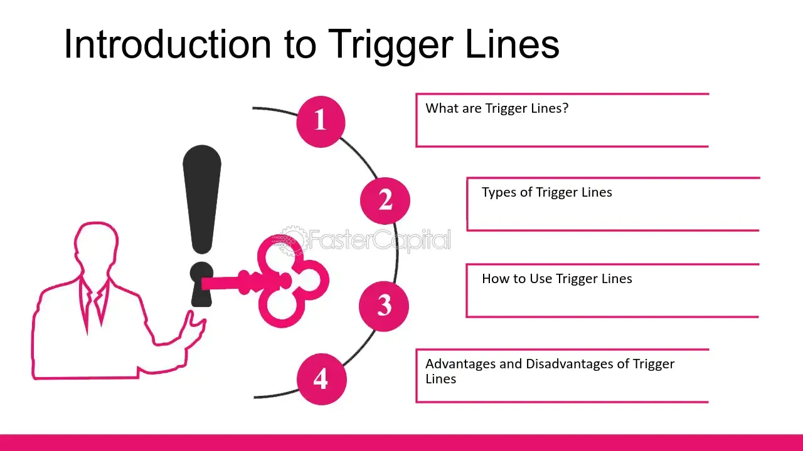

## Table of Contents

## What is a trigger line in technical analysis?

A trigger line in technical analysis is a specific price level or indicator value that signals a trader to take action, like buying or selling a stock. It helps traders make decisions based on clear rules, rather than emotions. For example, if a stock's price goes above a certain level, that could be a trigger line telling the trader to buy the stock.

Trigger lines are often used with other technical indicators, like moving averages or the Relative Strength Index (RSI). For instance, a common strategy might involve using a short-term moving average as a trigger line. When this short-term average crosses above a longer-term average, it might signal a good time to buy. This method helps traders spot trends and make timely decisions.

## How does a trigger line differ from a signal line?

A trigger line and a signal line are both used in technical analysis to help traders make decisions, but they serve slightly different purposes. A trigger line is a specific price or indicator level that tells a trader when to buy or sell. It's like a starting point for action. For example, if a stock's price hits a certain level, that's the trigger line telling the trader to buy.

A signal line, on the other hand, is often used with other indicators to confirm trends or changes in trends. It's usually a moving average that smooths out the data from another indicator, like the MACD (Moving Average Convergence Divergence). When the main indicator crosses the signal line, it can tell the trader if it's time to buy or sell. So, while a trigger line directly tells you to act, a signal line helps you understand the trend better before making a move.

## What are the common indicators used with trigger lines?

Common indicators used with trigger lines include moving averages, the Relative Strength Index (RSI), and the Moving Average Convergence Divergence (MACD). A moving average can act as a trigger line when a stock's price crosses above or below it. For example, if a stock's price goes above its 50-day moving average, that could be a trigger to buy. The RSI is another popular indicator; if it goes above 70, it might be a trigger to sell because the stock could be overbought, and if it drops below 30, it might be a trigger to buy because the stock could be oversold.

The MACD is also widely used with trigger lines. It involves two lines: the MACD line and the signal line. When the MACD line crosses above the signal line, it can be a trigger to buy, and when it crosses below, it can be a trigger to sell. These indicators help traders make decisions based on clear rules, reducing the influence of emotions. By using these indicators with trigger lines, traders can spot trends and make timely decisions to buy or sell stocks.

## How can a trigger line be used to generate buy or sell signals?

A trigger line can help traders decide when to buy or sell a stock by giving them a clear rule to follow. For example, if a trader uses a moving average as a trigger line, they might decide to buy a stock when its price goes above the moving average. This could mean the stock is starting to go up, and it's a good time to buy. On the other hand, if the stock's price drops below the moving average, that could be a signal to sell because the stock might be going down.

Another common way to use a trigger line is with the Relative Strength Index (RSI). If the RSI goes above 70, it might be a sign that the stock is overbought, and it's time to sell. If the RSI drops below 30, it could mean the stock is oversold, and it's a good time to buy. By using these trigger lines, traders can make decisions based on clear signals instead of guessing or letting emotions guide them.

## What are the advantages of using a trigger line in trading?

Using a trigger line in trading can help traders make decisions more easily. It gives them a clear rule to follow, like buying a stock when its price goes above a certain level or selling when it drops below another level. This can take away some of the guesswork and help traders avoid making choices based on feelings or emotions. Instead, they can rely on a set plan that tells them when to act.

Another advantage of using a trigger line is that it can help traders spot trends and changes in the market more quickly. For example, if a stock's price crosses a moving average, it might show that the stock is starting to go up or down. This can help traders get in or out of a trade at the right time. By using trigger lines, traders can make more informed decisions and possibly improve their chances of making money in the market.

## Can you explain the concept of a trigger line with a simple example?

Imagine you're watching the price of a toy you want to buy. You decide that if the price of the toy goes below $10, you'll buy it. That $10 price is your trigger line. When the price hits $10 or goes lower, it's like a signal telling you it's time to buy the toy.

In trading, a trigger line works the same way. Let's say you're looking at a stock and you decide to buy it if its price goes above $50. That $50 price is your trigger line. When the stock's price reaches or goes above $50, it's your signal to buy the stock. This helps you make a clear decision without guessing or getting too emotional about it.

## How do you set up a trigger line on a trading chart?

To set up a trigger line on a trading chart, you first need to decide what kind of trigger line you want to use. A common choice is a moving average, which is just a line that shows the average price of a stock over a certain time. You can pick a time period like 50 days or 200 days, depending on what you're looking for. Once you've chosen your time period, you can add this moving average to your chart. Most trading platforms let you do this easily by selecting the moving average from a list of indicators and setting the time period.

After you've added the moving average to your chart, it becomes your trigger line. You can then use it to make decisions about buying or selling. For example, if you want to buy a stock when its price goes above the moving average, you'll watch the chart and wait for the price to cross over the line. When it does, that's your signal to buy. If you want to sell when the price drops below the moving average, you'll wait for the price to go under the line and then sell. This way, the trigger line helps you make clear, rule-based decisions without getting too emotional.

## What are the potential pitfalls or limitations of using a trigger lines?

Using trigger lines can sometimes lead to mistakes because the market can be unpredictable. A trigger line might tell you to buy or sell a stock, but the price can still go the other way. This can happen if something unexpected happens in the market, like a big news event. Also, trigger lines work best when the market is moving in a clear direction. If the market is moving up and down a lot without a clear trend, using a trigger line might make you buy and sell too often, which can cost you money because of fees and taxes.

Another problem with trigger lines is that they don't consider everything that might affect a stock's price. They just look at the price or an indicator, but they don't think about other important things like the company's news, the economy, or what other people are saying about the stock. So, if you only use a trigger line, you might miss out on important information that could help you make better decisions. It's good to use trigger lines as part of a bigger plan, but don't rely on them too much.

## How can the effectiveness of a trigger line be measured?

The effectiveness of a trigger line can be measured by looking at how well it helps you make money. If you follow the trigger line and it leads to more winning trades than losing trades, then it's working well. You can also see if the trigger line helps you buy at lower prices and sell at higher prices. If it does, that's a good sign that the trigger line is effective.

Another way to measure the effectiveness is by comparing it to other methods. If using the trigger line gives you better results than not using it or using a different method, then it's doing its job. It's also important to keep track of how often the trigger line gives you false signals, which are times when it tells you to buy or sell but the price doesn't go the way you expected. If the trigger line gives too many false signals, it might not be very effective.

## Are there any advanced techniques for optimizing trigger line settings?

One way to make your trigger line work better is by trying different time periods for your moving average. You can start with a common time like 50 days, but then try shorter or longer times to see what works best. For example, a shorter time period might help you catch quick changes in the market, while a longer time period might help you see bigger trends. You can test these different settings by looking at past data to see which one would have made you the most money.

Another advanced technique is to use more than one trigger line at the same time. You could use a short-term moving average and a long-term moving average together. When the short-term average crosses above the long-term average, it might be a strong signal to buy. This can help you make sure the trend is real before you act. Also, you can mix trigger lines with other indicators like the RSI or MACD to get a fuller picture of what's happening in the market. By combining these tools, you can make smarter decisions and maybe improve your trading results.

## How do trigger lines integrate with other technical analysis tools?

Trigger lines work well with other technical analysis tools to help traders make better decisions. For example, you can use a trigger line with the Relative Strength Index (RSI). The RSI tells you if a stock is overbought or oversold. If the RSI goes above 70, it might be a good time to sell because the stock could be overbought. If it drops below 30, it might be a good time to buy because the stock could be oversold. By using the RSI with a trigger line, you can wait for the RSI to hit these levels and then look for the price to cross the trigger line before making a move. This can help you make sure the trend is strong before you buy or sell.

Another way to use trigger lines with other tools is with the Moving Average Convergence Divergence (MACD). The MACD has two lines: the MACD line and the signal line. When the MACD line crosses above the signal line, it can be a sign to buy. When it crosses below, it can be a sign to sell. You can use a trigger line, like a moving average, to confirm these signals. If the MACD line crosses the signal line and the price also crosses the trigger line, it can give you more confidence in your decision. By combining these tools, you can get a clearer picture of what's happening in the market and make smarter trading choices.

## What are some real-world case studies where trigger lines significantly impacted trading decisions?

One real-world case where trigger lines made a big difference was with a trader named Sarah. She used a 50-day moving average as her trigger line for trading a popular tech stock. When the stock's price went above the 50-day moving average, Sarah saw it as a signal to buy. The stock kept going up after she bought it, and she made a good profit. Later, when the price dropped below the 50-day moving average, she sold the stock and avoided losing money when the price kept falling. Using the trigger line helped Sarah make clear decisions and stay calm during the ups and downs of the market.

Another example is a trading firm that used trigger lines with the RSI to trade a big company's stock. They set their trigger line at the 200-day moving average and used the RSI to check if the stock was overbought or oversold. When the RSI went below 30 and the stock's price crossed above the 200-day moving average, the firm bought the stock. The price went up a lot after that, and they made a lot of money. When the RSI went above 70 and the price dropped below the 200-day moving average, they sold the stock and kept their profits. By using the trigger line and RSI together, the firm was able to make smart trades and do well in the market.

## References & Further Reading

[1]: Bergstra, J., Bardenet, R., Bengio, Y., & Kégl, B. (2011). ["Algorithms for Hyper-Parameter Optimization."](https://dl.acm.org/doi/10.5555/2986459.2986743) Advances in Neural Information Processing Systems 24.

[2]: ["Advances in Financial Machine Learning"](https://www.amazon.com/Advances-Financial-Machine-Learning-Marcos/dp/1119482089) by Marcos Lopez de Prado

[3]: ["Evidence-Based Technical Analysis: Applying the Scientific Method and Statistical Inference to Trading Signals"](https://www.amazon.com/Evidence-Based-Technical-Analysis-Scientific-Statistical/dp/0470008741) by David Aronson

[4]: ["Machine Learning for Algorithmic Trading"](https://github.com/stefan-jansen/machine-learning-for-trading) by Stefan Jansen

[5]: ["Quantitative Trading: How to Build Your Own Algorithmic Trading Business"](https://www.amazon.com/Quantitative-Trading-Build-Algorithmic-Business/dp/1119800064) by Ernest P. Chan