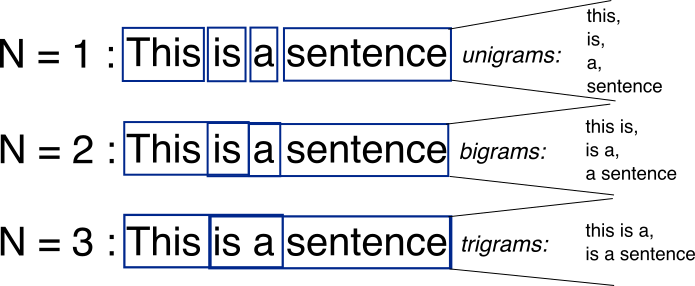

## Table of Contents

## What is a trigram in the context of machine learning?

In machine learning, a trigram is a sequence of three consecutive words or tokens from a given text. It is used in natural language processing (NLP) to understand and generate language by looking at patterns of words that commonly appear together. For example, in the sentence "The cat is sleeping," the trigrams would be "The cat is" and "cat is sleeping." Trigrams help in tasks like text prediction, where knowing that "The cat is" often comes before "sleeping" can help predict the next word.

Trigrams are a part of a broader concept called n-grams, where 'n' represents the number of words in the sequence. While unigrams (single words) and bigrams (two-word sequences) are also used, trigrams provide a bit more context, which can improve the accuracy of language models. For instance, if you're trying to autocomplete a sentence, knowing the last two words as well as the current word can give a better guess about what might come next. This makes trigrams useful in applications like speech recognition, machine translation, and text generation.

## How do trigrams differ from unigrams and bigrams?

Trigrams are groups of three words in a row from a text, while unigrams are single words and bigrams are pairs of words. Think of it like this: if you have a sentence, a unigram looks at each word by itself, a bigram looks at two words together, and a trigram looks at three words together. For example, in the sentence "I like to eat," the unigrams are "I," "like," "to," and "eat." The bigrams are "I like," "like to," and "to eat." The trigrams are "I like to" and "like to eat."

Using trigrams gives more context than unigrams or bigrams because it considers more words at once. This can help in understanding and predicting language better. For instance, if you're trying to guess the next word in a sentence, knowing the last two words as well as the current word can give a better clue about what might come next. So, trigrams are often used in things like autocomplete features on your phone or in translating languages, where understanding the flow of words is important.

## What are the basic applications of trigrams in natural language processing?

Trigrams are used in many ways in natural language processing. One big use is in text prediction. When you type on your phone and it guesses the next word, it often uses trigrams. By looking at the last two words you typed, the software can guess what word might come next. For example, if you type "I like to," the phone might suggest "eat" because "I like to eat" is a common phrase. This makes typing faster and easier.

Another use of trigrams is in machine translation. When translating text from one language to another, understanding the context is important. Trigrams help by looking at groups of three words, which gives more information about the meaning than just looking at single words or pairs of words. This can make the translation more accurate and sound more natural. For example, if the phrase "I like to eat" is common in English, a translation system might use this information to better translate similar phrases in other languages.

Trigrams also help in language modeling, which is used in things like speech recognition. When you speak to a device and it turns your speech into text, it uses language models to figure out what you're saying. Trigrams can make these models better because they consider more of the context. If you say "I like to," the system can use trigrams to guess that you might say "eat" next, which helps it understand your speech more accurately.

## How are trigrams used in language modeling?

In language modeling, trigrams help predict what word might come next in a sentence. They do this by looking at the last two words and using them to guess the next word. For example, if the sentence so far is "I like to," a language model using trigrams might predict that "eat" could come next because "I like to eat" is a common phrase. This makes the model better at understanding and generating text because it considers more of the context than just looking at one or two words.

Trigrams are also used to improve the accuracy of speech recognition systems. When you speak to a device and it turns your speech into text, the system uses language models to figure out what you're saying. By using trigrams, the model can better predict the next word based on the last two words spoken. This makes the system more accurate because it can understand the flow of your speech better. For example, if you say "I like to," the system might expect "eat" to follow, helping it to correctly transcribe your speech.

## What is the process of extracting trigrams from text data?

Extracting trigrams from text data involves breaking down a piece of text into sequences of three consecutive words. You start by going through the text from left to right. For each position, you take the current word and the two words that follow it. This creates a trigram. For example, in the sentence "The cat is sleeping," you would start with "The," then take "cat" and "is" to form the trigram "The cat is." You then move to the next word, "cat," and take "is" and "sleeping" to form the trigram "cat is sleeping." This process continues until you reach the end of the text.

Once you have all the trigrams, you can use them for various tasks in natural language processing, like predicting the next word in a sentence or improving the accuracy of speech recognition systems. To extract trigrams, you can write a simple program that goes through the text and creates these three-word sequences. For example, in Python, you could use a loop to go through the words in a list and combine them into trigrams. This makes it easier to analyze and work with the text data.

## How can trigrams improve the accuracy of text classification?

Trigrams can improve the accuracy of text classification by providing more context about the text. When classifying text, like figuring out if an email is spam or not, looking at just one word at a time (unigrams) or two words together (bigrams) might not give enough information. Trigrams look at three words in a row, which can help understand the meaning better. For example, if you see the trigram "free money now," it might suggest the email is spam. By using trigrams, the classification system can make better guesses about what the text is about, leading to more accurate results.

In practice, using trigrams in text classification involves counting how often certain trigrams appear in different types of text. If you're classifying emails, you might find that certain trigrams appear more often in spam emails than in regular ones. By keeping track of these patterns, the system can use them to decide if a new email is likely to be spam. This way, trigrams help the system learn from past examples and make better predictions, improving the overall accuracy of text classification.

## What are the challenges of using trigrams in large datasets?

Using trigrams in large datasets can be tricky because it takes a lot of computer power and memory. When you have a huge amount of text, like all the [books](/wiki/algo-trading-books) in a library or all the posts on a website, you need to go through every word and make lots of trigrams. This means your computer has to work harder and store more information. If you don't have a powerful enough computer, it might take a long time or even crash.

Another challenge is that trigrams might not always be the best way to understand the text. Sometimes, looking at three words together can miss the bigger picture or important details. For example, if you're trying to understand a long story, just looking at groups of three words might not tell you the whole story. Also, rare trigrams might not show up often enough in the data to be useful, which can make the results less accurate. So, while trigrams can help, they need to be used carefully and with other methods to get the best results.

## How does smoothing affect trigram models?

Smoothing helps make trigram models work better by fixing a problem where some trigrams might never show up in the data. Imagine you're trying to predict the next word in a sentence. If the trigram you're looking at has never been seen before, the model might say there's no chance of any word following it. This isn't helpful because new trigrams can appear in new texts. Smoothing fixes this by giving a small chance to all possible next words, even if they haven't been seen before. This way, the model can still make good guesses even with new or rare trigrams.

There are different ways to do smoothing, like adding-one smoothing or using more complex methods like Kneser-Ney smoothing. Adding-one smoothing, also called Laplace smoothing, adds a small number to the count of every trigram. This means that even if a trigram hasn't been seen, it still has a chance of happening. More advanced methods, like Kneser-Ney smoothing, look at how often words appear in different contexts, which can make the model even better at guessing the next word. By using smoothing, trigram models become more useful and accurate for understanding and predicting language.

## Can trigrams be effectively used in languages with different grammatical structures?

Trigrams can be used in languages with different grammatical structures, but they work better in some languages than others. In languages like English, where word order is important and fixed, trigrams can capture a lot of useful information. For example, the trigram "I like to" often comes before "eat" in English, helping predict the next word. But in languages like Latin, where word order can change a lot, trigrams might not be as helpful because the same meaning can be expressed in different ways.

Even though trigrams might not work as well in languages with flexible word order, they can still be useful if used with other methods. For example, you can combine trigrams with other n-grams or use more advanced language models that understand the grammar better. This way, trigrams can still help predict words and understand text, even in languages with different grammatical structures.

## What advanced techniques exist for optimizing trigram-based models?

One advanced technique for optimizing trigram-based models is using smoothing methods like Kneser-Ney smoothing. This helps deal with trigrams that are rare or never seen before. Kneser-Ney smoothing looks at how often words appear in different contexts, which can make the model better at guessing the next word. For example, if a trigram hasn't been seen before, the model can still give a good guess by looking at how often the words in the trigram appear in other places. This makes the model more accurate and useful, especially when working with new or rare text.

Another technique is to combine trigrams with other n-grams, like unigrams and bigrams, in a technique called interpolation. This means the model uses information from different lengths of word sequences to make better predictions. For example, if the trigram "I like to" is not very common, the model can also look at the bigram "like to" or the unigram "to" to help guess the next word. This way, the model can use all the available information to make the best guess possible. By combining different n-grams, the model becomes more flexible and accurate.

A third technique involves using neural networks to enhance trigram models. Neural networks can learn complex patterns in language that simple trigram models might miss. For example, a [neural network](/wiki/neural-network) can look at the context of the whole sentence, not just the last two words, to predict the next word. This can be especially helpful in languages with flexible word order or in understanding long-distance dependencies in text. By using neural networks alongside trigrams, the model can capture more of the nuances of language, leading to better performance in tasks like text prediction and language understanding.

## How do trigrams contribute to the performance of speech recognition systems?

Trigrams help speech recognition systems by giving them a better idea of what words might come next in a sentence. When you speak into a device, it turns your words into text. By looking at the last two words you said, the system can use trigrams to guess the next word. For example, if you say "I like to," the system might expect "eat" to follow because "I like to eat" is a common phrase. This makes the system more accurate because it can understand the flow of your speech better.

However, trigrams alone might not be enough for very accurate speech recognition, especially in large datasets or with different languages. To make the system even better, you can use smoothing techniques like Kneser-Ney smoothing. This helps deal with words or phrases that are rare or never seen before. By using trigrams with other methods, like neural networks that can understand the whole sentence, the speech recognition system can become more accurate and handle different kinds of language better.

## What are the current research trends in trigram applications for machine learning?

Current research trends in trigram applications for [machine learning](/wiki/machine-learning) focus on improving the accuracy and flexibility of language models. One trend is the integration of trigrams with neural networks to capture more complex language patterns. For example, researchers are using trigrams as part of the input to neural networks, which can then understand the broader context of a sentence. This helps in tasks like speech recognition and text prediction, making the models more accurate by considering not just the immediate three words but also the overall structure of the text.

Another trend is the use of advanced smoothing techniques to handle rare or unseen trigrams more effectively. Techniques like Kneser-Ney smoothing are being refined to better estimate the probability of new trigrams. This is crucial for languages with flexible word orders or for handling large datasets where certain trigrams might be rare. By improving these smoothing methods, researchers aim to make trigram-based models more robust and adaptable to different linguistic contexts.

## References & Further Reading

[1]: Jurafsky, D., & Martin, J. H. (2021). ["Speech and Language Processing: An Introduction to Natural Language Processing, Computational Linguistics, and Speech Recognition"](https://www.researchgate.net/publication/200111340_Speech_and_Language_Processing_An_Introduction_to_Natural_Language_Processing_Computational_Linguistics_and_Speech_Recognition) (3rd ed.). Prentice Hall.

[2]: Manning, C. D., Raghavan, P., & Schütze, H. (2009). ["Introduction to Information Retrieval"](https://nlp.stanford.edu/IR-book/information-retrieval-book.html). Cambridge University Press.

[3]: Chen, S. F., & Goodman, J. (1999). ["An Empirical Study of Smoothing Techniques for Language Modeling."](https://www.sciencedirect.com/science/article/pii/S0885230899901286) Computer Speech & Language, 13(4), 359-394.

[4]: Mikolov, T., et al. (2010). ["Recurrent neural network based language model."](https://gwern.net/doc/ai/nn/rnn/2010-mikolov.pdf) INTERSPEECH.

[5]: Brown, P. F., Della Pietra, V. J., deSouza, P. V., Lai, J. C., & Mercer, R. L. (1992). ["Class-based n-gram models of natural language."](https://aclanthology.org/J92-4003/) Computational Linguistics, 18(4), 467-479.