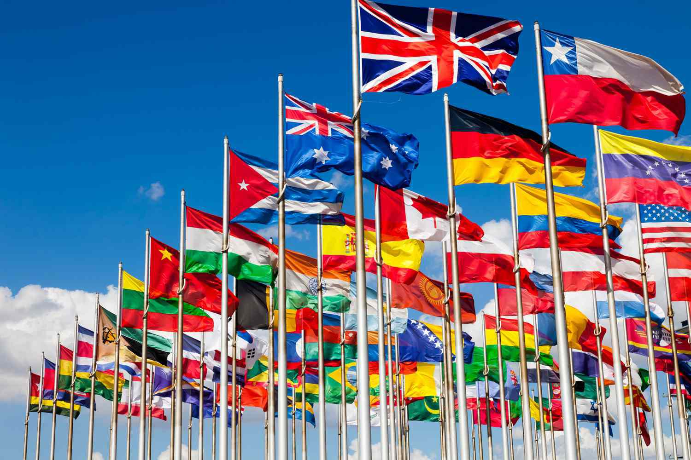

In the increasingly interconnected world, geopolitical organizations and think tanks play a critical role in shaping global policies. Among these influential entities is the Trilateral Commission, a non-governmental forum that has become pivotal in discussing international policy issues. Established in 1973, the Commission acts as a platform facilitating cooperation among North America, Europe, and Asia-Pacific, addressing global challenges and promoting dialogue among business leaders, academics, and non-profit organizations.

The relevance of global think tanks extends beyond traditional policy-making; they increasingly intersect with technological advancements and modern financial practices such as algorithmic trading. This form of trading, executed through sophisticated computer algorithms, has transformed financial markets, reflecting broader trends in financial technology and globalization. Here, global economic policies shaped by think tanks can significantly influence trading strategies and market behaviors.



Understanding these dynamics is crucial for comprehending the broader context of international economics and politics. As policies and strategies devised by organizations like the Trilateral Commission have profound implications on global economics, they also indirectly influence financial practices such as algorithmic trading. This exploration offers insights into future economic and political shifts, highlighting the need to grasp the multifaceted interactions between policy, economics, and technology in today's world.

## Table of Contents

## Understanding the Trilateral Commission

The Trilateral Commission is a notable entity in the landscape of global policy formation, initially conceived in 1973 by David Rockefeller. Its foundational purpose was to enhance collaborative interaction among three significant geopolitical regions: North America, Europe, and Asia-Pacific. In an era where economic and political challenges are increasingly global in nature, such a platform for dialogue is instrumental.

The commission brings together influential individuals from various sectors, including business leaders, scholars, and representatives from non-profit organizations. This diversity ensures that a wide array of perspectives contributes to discussions on crucial global topics. By assembling these varied voices, the commission aims to address complex issues surrounding globalization, economic policies, and geopolitical strategies in a holistic manner.

One of the core objectives of the Trilateral Commission is to cultivate improved cooperation among its member nations. The organization recognizes that interdependence among countries necessitates concerted efforts to tackle transnational issues. It provides a neutral ground where policymakers and key stakeholders can discuss ways to synchronize policies that will benefit the global community.

Moreover, the commission tackles the multifaceted challenges posed by globalization—a phenomenon characterized by the intricate interweaving of economies, cultures, and governance. Topics such as trade imbalances, currency valuation, and international regulatory standards are a focal point of their agenda. By facilitating open dialogue, the Trilateral Commission contributes to more cohesive approaches to managing the dynamics of an interconnected world.

The Trilateral Commission also addresses economic policies by analyzing trends and proposing strategic responses to emerging economic paradigms. Its discussions often cover fiscal policies, trade agreements, and the implications of economic powers' policies on global markets. This strategic analysis assists in the development of sustainable economic frameworks and strategies that preemptively address potential crises.

In terms of geopolitical strategies, the commission plays a critical role in identifying and responding to shifts in global power dynamics. The increasing prominence of Asia-Pacific in international affairs, as well as evolving relations between traditional and emerging powers, are subjects that benefit from the commission's assessments and recommendations. By fostering understanding and encouraging cooperative initiatives, the Trilateral Commission acts as a catalyst for stabilizing geopolitical relations.

The Trilateral Commission's influence extends beyond its internal deliberations, impacting policy formation even outside its formal agreements. Its role in shaping the discourse around key issues makes it a powerful player in international relations, as it not only facilitates high-level dialogue but also often sets the tone for global policy considerations.

Through its concerted efforts, the Trilateral Commission exemplifies the potential of thoughtfully structured collaboration in confronting the pressing challenges of our time.

## Influence and Criticism of Global Think Tanks

Global think tanks have become instrumental in shaping both economic and foreign policy decisions on an international scale. These organizations provide a platform for dialogue and exchange among business leaders, scholars, and policymakers. The Trilateral Commission is one such entity that operates with the objective of fostering greater cooperation among North America, Europe, and the Asia-Pacific region. However, the influence wielded by these think tanks is not without controversy.

Critics of organizations like the Trilateral Commission often highlight a perceived lack of transparency and accountability. They argue that these bodies function in relative secrecy, holding closed-door meetings and discussions that may not be accessible to the public. This opacity can lead to concerns that policy recommendations and decisions could favor elite, vested interests rather than the broader public good. The exclusion of broader societal participation can lead to the perception that these think tanks serve to entrench existing power structures.

Despite these criticisms, proponents of global think tanks emphasize their role in facilitating international cooperation and understanding. They assert that these forums allow for the cross-pollination of ideas and provide a space for addressing complex global challenges that require multinational collaboration. Through rigorous research and dialogue, think tanks contribute to fostering mutual understanding and crafting strategies that can lead to more stable and prosperous international relations.

The debate over think tanks' operational transparency and accountability is ongoing. While some argue for increased public access and oversight, others maintain that confidentiality can be necessary for frank discussions and effective policy formulation. Balancing these competing needs remains a critical challenge for ensuring that think tanks continue to be relevant and effective in promoting international dialogue without compromising their integrity and objectives.

## Global Policy Think Tanks and Economic Strategy

Global policy think tanks are pivotal entities in shaping the economic strategies that influence global markets. These organizations conduct extensive research that serves as a valuable resource for governments and corporations in their policy-making and strategic planning efforts. Think tanks generate insights by analyzing complex economic situations, evaluating policy options, and forecasting future trends, thereby aiding stakeholders in crafting informed responses to economic challenges.

Think tanks such as the Council on Foreign Relations, the Brookings Institution, and the Chatham House have established themselves as prominent players in the provision of economic analyses. They produce reports, host discussions, and engage in policy advocacy, often influencing significant economic strategies on a global scale. The research provided by these institutions covers a wide array of topics, including trade policies, monetary strategies, fiscal measures, and the implications of technological advancements in the global economy.

For instance, a think tank might analyze the potential impacts of a new trade agreement between major economies, dissecting how such an agreement could affect global supply chains, labor markets, and economic growth. By forecasting economic scenarios and evaluating potential risks, think tanks enable policymakers and business leaders to anticipate challenges and capitalize on opportunities. This foresight is crucial in navigating the intricacies of international markets and in formulating strategic responses that bolster economic resilience.

In addition, the collaboration between academia, industry experts, and policymakers within think tanks fosters an interdisciplinary approach to economic strategy formulation. By leveraging diverse expertise, these organizations can offer holistic solutions that address multiple facets of economic issues, thus enhancing the effectiveness of policy interventions.

The role of think tanks in shaping economic strategies is increasingly significant in the face of globalization and technological advancements. As economies become more interconnected, the insights provided by think tanks help in understanding the ripple effects of economic policies across different regions. This global perspective is essential for aligning national strategies with international objectives, ensuring that economic policies contribute to sustainable global growth.

In summary, global policy think tanks are integral to the development of economic strategies that impact markets worldwide. Their research efforts provide critical guidance for policymakers and corporations, enabling informed decision-making in addressing international economic challenges. By fostering a comprehensive understanding of economic dynamics, these think tanks contribute to the formulation of strategies that support global economic stability and growth.

## The Rise of Algorithmic Trading

Algorithmic trading, commonly referred to as algo trading, employs computer programs to execute financial trades at remarkably high speeds and volumes. These systems leverage algorithms—precise sets of rules—to make decisions about buying or selling stocks, currencies, or other financial instruments. The rapid execution capabilities of [algorithmic trading](/wiki/algorithmic-trading) have fundamentally transformed financial markets.

At its core, algorithmic trading automates the trading process by analyzing market conditions, identifying trading opportunities, and executing trades without human intervention. This automation leads to increased efficiency and reduced transaction costs. One popular type of algo trading is high-frequency trading ([HFT](/wiki/high-frequency-trading-strategies)), which conducts a large number of trades in fractions of a second by capitalizing on small price discrepancies across markets.

Global economic policies have significantly influenced the development and adoption of algorithmic trading. With the integration of global financial markets and the rise of electronic trading platforms, algo trading has expanded rapidly. Changes in regulatory environments, interest rates, and monetary policies can impact algorithmic trading strategies, as these algorithms often incorporate macroeconomic indicators into their decision-making processes.

Furthermore, the growth of algorithmic trading mirrors the broader trends in financial technology (fintech) and globalization. Financial institutions are increasingly employing sophisticated technologies such as [machine learning](/wiki/machine-learning), natural language processing, and big data analytics to enhance their trading algorithms. The global nature of modern financial markets necessitates the use of these advanced tools to analyze vast amounts of data from various regions and asset classes, enabling traders to make more informed decisions.

This evolution in trading practices reflects the convergence of technology and finance. As a result, algorithmic trading continues to adapt to technological advancements, regulatory changes, and evolving market dynamics, underscoring its role as a critical component of contemporary financial systems.

## The Intersection of Policy and Trading

Global policy decisions significantly impact financial markets, both directly and indirectly, by shaping the economic environment in which these markets operate. Algorithmic trading, a contemporary financial practice, is particularly sensitive to changes in policy as these alterations can influence key market parameters such as interest rates, currency values, and trade regulations.

Algorithmic trading models are designed to respond rapidly to market conditions, making them particularly responsive to political and economic events. These events are often influenced by discussions and decisions from global think tanks, including organizations like the Trilateral Commission. Algorithmic models process vast amounts of data, which includes news feeds, economic indicators, and policy changes, to make split-second trading decisions. For instance, an announcement of a change in interest rates by a central bank, which may be influenced by recommendations from think tanks, could lead to immediate adjustments in these models. 

These models utilize various techniques, such as statistical [arbitrage](/wiki/arbitrage) and machine learning, to predict price movements. One way they might do this is by employing time series analysis to forecast future market trends based on past data. A simple example could involve using a moving average crossover strategy, where two moving averages of different time frames are used to generate buy and sell signals. While basic, such strategies can be part of more complex models that [factor](/wiki/factor-investing) in geopolitical and economic indicators derived from policy decisions.

```python
import numpy as np

# Example of a simple moving average crossover strategy
prices = np.array([100, 101, 102, 103, 104, 105, 106])  # hypothetical price data
short_window = 2
long_window = 5

# Calculate moving averages
short_mavg = np.convolve(prices, np.ones(short_window)/short_window, mode='valid')
long_mavg = np.convolve(prices, np.ones(long_window)/long_window, mode='valid')

# Generate signals
signals = np.where(short_mavg[-len(long_mavg):] > long_mavg, 1, 0)
print("Trade Signals:", signals)
```

This intersection of policy and trading emphasizes the necessity for market participants to stay informed about policy discussions and technological developments. As algorithmic trading becomes more prominent, the feedback loop between policy changes and market dynamics becomes more pronounced. Consequently, a deep understanding of both global policy and technological advancements in trading is essential for market analysts and traders to navigate modern financial markets successfully. This blend of information allows them to better anticipate and respond to [volatility](/wiki/volatility-trading-strategies) triggered by sudden or anticipated policy shifts, potentially leading to more robust trading strategies and improved market stability.

## Conclusion

Understanding geopolitical organizations like the Trilateral Commission is crucial for navigating today's complex global landscape. This non-governmental forum has shaped critical dialogues on international policy issues, influencing economic policies and trading practices. By fostering enhanced cooperation among regions such as North America, Europe, and Asia-Pacific, the Trilateral Commission contributes significantly to shaping strategic global economic structures. These interactions extend beyond policy-making, deeply affecting modern markets, particularly as they intersect with technological advancements like algorithmic trading.

Algorithmic trading systems have redefined financial markets through high-speed transactions influenced by global economic policies. As these systems are sensitive to geopolitical shifts and policy updates, understanding the decision-making processes of forums like the Trilateral Commission becomes essential. Such forums influence the development of regulations and frameworks that govern economic activities, which in turn affect how algorithmic models are constructed and optimized.

Analyzing these interactions not only provides valuable insights into current global economic practices but also aids in forecasting future economic and political shifts. By understanding the strategic directions set by organizations like the Trilateral Commission, stakeholders can better anticipate changes in the global market landscape, aligning their strategies to better accommodate or capitalize on forthcoming trends. This capacity for foresight is invaluable in an era of rapid technological advancement and geopolitical complexity.

## References & Further Reading

[1]: Gill, S. (1991). [American Hegemony and the Trilateral Commission](https://archive.org/details/americanhegemony0000gill). Cambridge University Press.

[2]: Rockefeller, D. (1999). [Memoirs](https://www.penguinrandomhouse.com/books/156361/memoirs-by-david-rockefeller/). Random House.

[3]: Basu, K. (2018). ["The Rise of Algorithmic Trading: Opportunities and Challenges."](https://kaushikbasu.org/papers/) ResearchGate.

[4]: Keller, M. (2017). [The Influence of Think Tanks on EU Foreign Policy and Public Discourse.](https://api.pageplace.de/preview/DT0400.9781317010661_A27750249/preview-9781317010661_A27750249.pdf) Springer.

[5]: Janeway, W. H. (2018). [Doing Capitalism in the Innovation Economy: Reconfiguring the Three-Player Game between Markets, Speculators and the State](https://www.amazon.com/Doing-Capitalism-Innovation-Economy-Reconfiguring/dp/1108471277). Cambridge University Press.