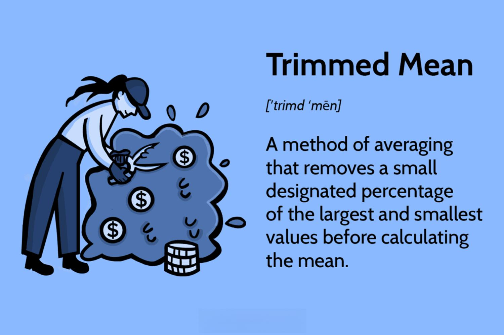

Algorithmic trading has transformed the landscape of financial markets by leveraging computational power to analyze vast quantities of data and execute trades at speeds beyond human capability. Central to this process is data analysis, which underpins the development of trading algorithms that are both accurate and effective. Utilizing statistical measures to refine this data analysis is imperative to gaining an advantage in the competitive market environment.

Among the various statistical techniques available, the trimmed mean stands out as a particularly useful tool. The trimmed mean is a method by which a specified percentage of the extreme values in a data set is removed prior to calculating the average. This approach is particularly advantageous in financial markets, where data sets often contain anomalies or extreme values—known as outliers—that can skew results and potentially lead to suboptimal trading decisions.



This article provides an exploration of the trimmed mean and its application within statistical measures relevant to algorithmic trading. By understanding and implementing the trimmed mean, traders and analysts can enhance their trading strategies through more precise and reliable data analysis. In environments where precision and speed are crucial, such as financial markets, incorporating a trimmed mean can be the key to optimizing trading operations and achieving better financial outcomes. As traders strive to maintain a competitive edge, the effective use of the trimmed mean becomes an essential component of their data analysis toolkit.

## Table of Contents

## What is a Trimmed Mean?

Trimmed mean is a statistical technique utilized to improve the accuracy of average measurements by excluding outliers from a data set. It involves removing a fixed percentage of the lowest and highest values before calculating the mean. This approach mitigates the influence of extreme values that may distort the results, providing a more reliable measure of central tendency, particularly in distributions that exhibit significant anomalies.

The formula for calculating the trimmed mean can be expressed as follows:

1. Arrange the data set in ascending order.
2. Determine the percentage of data to be trimmed from each end. For instance, in a 10% trimmed mean, 10% of the smallest and 10% of the largest values are removed.
3. Calculate the arithmetic mean of the remaining data.

This method is advantageous when dealing with data sets that contain outliers or extreme values, which can lead to biased results. By focusing on the "core" values, the trimmed mean offers a more robust central measure. In practice, the trimmed mean can be expressed in Python as follows:

```python
import numpy as np

def trimmed_mean(data, trim_fraction):
    sorted_data = np.sort(data)
    n = len(sorted_data)
    trim_count = int(n * trim_fraction)
    trimmed_data = sorted_data[trim_count:n-trim_count]
    return np.mean(trimmed_data)

data = [1, 2, 2, 3, 4, 100, 101]  # Sample data with outliers
result = trimmed_mean(data, 0.1)   # Calculating a 10% trimmed mean
print("Trimmed Mean:", result)
```

In the contexts of data analysis and trading, utilizing the trimmed mean can provide a clearer picture of market trends by offering a more stable view of data, especially in volatile environments. This makes it a valuable tool for analysts and traders who seek to enhance the reliability of their insights and decision-making processes. By discarding extreme anomalies, they can derive conclusions that are more representative of typical market conditions, thereby refining their trading strategies and improving outcomes.

## Importance of Trimmed Mean in Data Analysis

Data analysis is indispensable for extracting meaningful insights from extensive financial datasets, and the presence of outliers within these datasets can skew results, leading to misleading conclusions. Outliers are data points that differ significantly from other observations and can corrupt the mean, which is sensitive to such extremes. One effective method to address this challenge is the use of trimmed means, which refine the dataset by removing a specified percentage of the extreme values before calculating the average. This results in a more robust measure of central tendency that reflects more accurately the general trend of the data.

The trimmed mean is calculated by first ordering the data points from smallest to largest, then removing a set percentage of the largest and smallest data points, and finally computing the mean of the remaining data. For example, in Python, the trimmed mean can be implemented as follows:

```python
import numpy as np

def trimmed_mean(data, percentage):
    n = len(data)
    trim_count = int(n * percentage / 100)
    trimmed_data = sorted(data)[trim_count:n-trim_count]
    return np.mean(trimmed_data)
```

In [algorithmic trading](/wiki/algorithmic-trading), where decisions rely heavily on the accuracy of predictive models, using trimmed means can substantially enhance the quality of these models by mitigating the distortions caused by anomalies and sudden spikes in market data. This statistical robustness is vital in ensuring that trading algorithms produce reliable forecasts and responsive trading signals, thereby allowing traders and analysts to make more informed and calculated decisions.

Moreover, incorporating trimmed means into data processing workflows can significantly advance the precision of trend analyses and pattern recognition in financial markets. By filtering out the noise introduced by outliers, the trimmed mean enables a clearer view of underlying market trends. Consequently, traders and analysts equipped with this refined data analysis tool are better positioned to optimize trading strategies, manage risks effectively, and capitalize on emerging opportunities in the financial markets.

## Application of Trimmed Mean in Algorithmic Trading

Algorithmic trading is fundamentally driven by statistical models that analyze massive amounts of market data, seeking to identify profitable opportunities with precision and speed. Integrating the trimmed mean into these statistical models can significantly enhance their effectiveness by reducing noise and ensuring more reliable predictions. The trimmed mean, by removing a predetermined percentage of extreme values from a dataset, focuses on the 'core' data, which often represents typical market conditions more accurately. This allows the algorithms to respond more consistently and efficiently to standard market behaviors, enhancing trade execution.

When [backtesting](/wiki/backtesting) trading strategies, utilizing trimmed mean can provide traders with a clearer view of historical performance by eliminating anomalies that could skew results. Backtesting is a critical process in algorithmic trading, as it involves simulating trades using historical data to evaluate the viability of a trading strategy. By applying the trimmed mean, traders can discount the influence of outlier events, obtaining a better understanding of how a strategy might perform under normal market conditions.

Incorporating the trimmed mean into algorithmic trading models also supports improved risk management practices. By filtering out noise and anomalies, trading algorithms become more stable and less susceptible to erratic market movements which could lead to significant losses. This contributes to a more robust risk management framework, as it limits the potential impact of extreme market events on trading decisions.

Furthermore, traders can refine and optimize their trading strategies by utilizing trimmed means. By focusing on typical data points and minimizing the distortion caused by outliers, trading strategies become more adaptable to changing market environments. This adaptability can lead to more stable returns over time, as algorithms make decisions based on data that more accurately reflects sustained market trends rather than temporary fluctuations.

In summary, the integration of trimmed means in algorithmic trading not only enhances the precision of predictive models but also plays a crucial role in developing more reliable and adaptive trading strategies. By leaning on this statistical measure, traders can potentially achieve improved performance metrics and maintain a competitive edge in fast-paced financial markets.

## Benefits of Using Trimmed Mean in Trading Algorithms

The trimmed mean is a statistical tool that enhances the accuracy and reliability of algorithmic trading models by focusing on 'normal' data points while mitigating the influence of erratic market movements. By excluding extreme values from the calculation of the mean, trading algorithms become less prone to erroneous signals that may arise from transient market anomalies, thus maintaining more consistent performance across varying market conditions.

The robustness of algorithmic strategies is markedly enhanced through the use of the trimmed mean. This approach provides a buffer against significant market fluctuations, making the algorithms more adaptable to changes in the trading environment. By honing in on the core data, rather than being distracted by outliers, traders can improve the predictive power of their models.

The trimmed mean also contributes to achieving more stable returns by minimizing the disruptive effects of extreme market events. This statistical technique smooths out the erratic peaks and troughs that can lead to misguided trading decisions. The resultant stability helps in achieving a steady growth trajectory rather than suffering from volatile swings that can impact profitability. 

From a broader perspective, incorporating the trimmed mean into algorithmic trading algorithms results in more efficient and profitable operations. By enhancing model precision and adapting more readily to market changes, traders can optimize their strategies for risk management and return maximization. The detachment from outlier-driven distortions allows for a clearer interpretation of market dynamics, supporting informed decision-making. 

Overall, utilizing the trimmed mean creates opportunities for traders to refine their strategies, thereby improving trading outcomes and reducing exposure to market risks. This methodological advantage underscores the importance of integrating such statistical measures in trading algorithms to elevate operational efficiency and profitability.

## Challenges and Considerations

Choosing the correct percentage of data to trim when utilizing a trimmed mean is a pivotal step that necessitates careful analysis. One of the primary challenges lies in determining the appropriate level of trimming. Excessive trimming can potentially eliminate valuable data points that reflect genuine market trends or conditions, which could be crucial for making informed trading decisions. On the contrary, insufficient trimming might fail to adequately mitigate the impact of outliers, leading to skewed data analysis results. A pragmatic approach often involves gradually adjusting the trimming percentage while monitoring the stability and accuracy of the trading algorithms.

Finding the right balance between reducing the impact of outliers and maintaining data integrity is critical. This balance ensures that the core informational content of the data set remains intact without being distorted by extreme values. Traders need to analyze their data sets meticulously to optimize this balancing act. For example, employing tools like Python's SciPy library can facilitate experimentation with different trimming percentages:

```python
import numpy as np
from scipy.stats import trim_mean

# Sample data
data = np.array([1, 2, 2, 3, 3, 4, 4, 100])

# Calculate trimmed mean with 10% trimming
trimmed_mean = trim_mean(data, proportiontocut=0.1)
print(f"Trimmed Mean: {trimmed_mean}")
```

In this example, the proportion of data to trim is defined by `proportiontocut`, which can be adjusted based on the data characteristics and trading goals. 

Ensuring that the application of the trimmed mean aligns with overall trading goals is paramount. Traders should regularly evaluate how trimmed mean influences their trading strategies and outcomes. The process might involve backtesting and forward testing of trading models with various trimming levels to find the optimal setting that improves predictive accuracy without losing critical data signals. Additionally, traders should continually reassess this parameter in response to changing market conditions to maintain the effectiveness of their trading algorithms.

Overall, while incorporating a trimmed mean can greatly enhance algorithmic trading strategies, it demands a judicious approach to ensure that it serves its intended purpose without compromising on the broader strategic objectives.

## Conclusion

The trimmed mean is a powerful tool for enhancing data analysis in algorithmic trading. This statistical method proves invaluable by mitigating the influence of outliers, which are data points that lie significantly outside the typical range of the data set. By calculating the mean after removing a specified percentage of these extreme values, the trimmed mean delivers a more accurate and reliable measure of central tendency. This accuracy translates into improved statistical modeling, which is critical for developing robust algorithmic trading strategies.

Integrating the trimmed mean into trading frameworks facilitates more informed decision-making, as traders can rely on analyses that reflect true market conditions rather than being skewed by anomalies. This optimization of trading outcomes is crucial for maintaining a competitive edge in the fast-paced environment of financial markets. The adaptability of the trimmed mean allows traders to refine their strategies to better respond to typical market behavior, enhancing both risk management and profitability.

Despite the evident benefits, challenges in the application of trimmed means do exist. The primary challenge lies in selecting the appropriate percentage to trim, ensuring enough data integrity while reducing outlier impact effectively. Nonetheless, by carefully assessing individual data sets and aligning the use of trimmed means with strategic trading objectives, traders can overcome these challenges. Thus, the trimmed mean stands as a valuable tool for those seeking to elevate their algorithmic trading operations and refine their data analysis techniques.

## References & Further Reading

[1]: ["Advances in Financial Machine Learning"](https://www.amazon.com/Advances-Financial-Machine-Learning-Marcos/dp/1119482089) by Marcos Lopez de Prado

[2]: ["Evidence-Based Technical Analysis: Applying the Scientific Method and Statistical Inference to Trading Signals"](https://www.amazon.com/Evidence-Based-Technical-Analysis-Scientific-Statistical/dp/0470008741) by David Aronson

[3]: ["Machine Learning for Algorithmic Trading"](https://github.com/stefan-jansen/machine-learning-for-trading) by Stefan Jansen

[4]: ["Quantitative Trading: How to Build Your Own Algorithmic Trading Business"](https://www.amazon.com/Quantitative-Trading-Build-Algorithmic-Business/dp/1119800064) by Ernest P. Chan

[5]: Hampel, F. R. (1974). ["The Influence Curve and Its Role in Robust Estimation."](https://www.jstor.org/stable/2285666) The Annals of Statistics, 2(3), 377-395.

[6]: Tukey, J. W. (1977). ["Exploratory Data Analysis."](https://archive.org/details/exploratorydataa0000tuke_7616) Addison-Wesley.