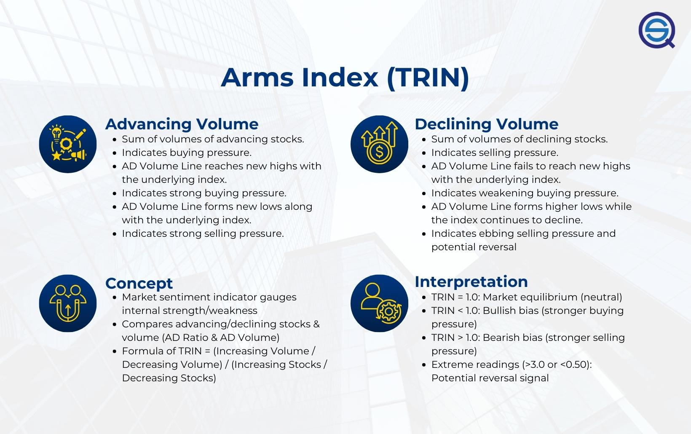

## Table of Contents

## What is the TRIN strategy?

The TRIN strategy, also known as the Arms Index, is a tool used by investors to measure the overall sentiment in the stock market. It compares the number of advancing stocks to the number of declining stocks and then divides this by the volume of advancing stocks compared to the volume of declining stocks. A TRIN value below 1 suggests that the market is bullish, meaning more stocks are advancing with less volume, indicating strong buying pressure. Conversely, a TRIN value above 1 indicates a bearish market, where more stocks are declining with higher volume, showing strong selling pressure.

Investors use the TRIN to help make decisions about buying or selling stocks. For example, if the TRIN is low, it might be a good time to buy stocks because the market seems optimistic. On the other hand, if the TRIN is high, it might be wise to sell or avoid buying stocks because the market appears pessimistic. By watching the TRIN, investors can get a quick snapshot of market sentiment and adjust their investment strategies accordingly.

## How does the TRIN indicator work?

The TRIN indicator, also called the Arms Index, helps investors understand if the stock market is feeling happy or worried. It does this by looking at two things: how many stocks are going up versus going down, and how much people are buying or selling those stocks. To find the TRIN number, you first divide the number of stocks going down by the number of stocks going up. Then, you divide the total volume of stocks going down by the total volume of stocks going up. Finally, you divide the first number by the second number to get the TRIN.

If the TRIN number is less than 1, it means more stocks are going up than down, but with less buying activity. This suggests that the market is feeling good, or bullish. People might see this as a good time to buy stocks because others are also buying, but not too aggressively. On the other hand, if the TRIN number is more than 1, it means more stocks are going down than up, and there's a lot of selling happening. This indicates that the market is feeling worried, or bearish. Investors might see this as a sign to sell their stocks or wait before buying new ones. By watching the TRIN, investors can get a quick idea of how the market is feeling and make their investment choices based on that.

## What does the TRIN acronym stand for?

The TRIN acronym stands for "TRading INdex." It's a simple way to see how people feel about the stock market.

TRIN looks at two things: how many stocks are going up or down, and how much people are buying or selling those stocks. By putting these together, TRIN gives a number that tells if the market is happy or worried.

## How is the TRIN calculated?

The TRIN, or TRading INdex, is a simple way to see if the stock market is happy or worried. To calculate it, you first count how many stocks are going up and how many are going down. Then, you find the total amount of buying and selling for those stocks. You divide the number of stocks going down by the number of stocks going up. After that, you divide the total amount of selling (volume of stocks going down) by the total amount of buying (volume of stocks going up). Finally, you divide the first number you got by the second number. This gives you the TRIN.

If the TRIN number is less than 1, it means more stocks are going up than down, but people are not buying as much. This suggests the market is feeling good, or bullish. If the TRIN number is more than 1, it means more stocks are going down than up, and there's a lot of selling happening. This indicates the market is feeling worried, or bearish. By watching the TRIN, investors can get a quick idea of how the market is feeling and make their investment choices based on that.

## What does a TRIN value above 1 indicate?

A TRIN value above 1 means that the stock market is feeling worried, or bearish. It shows that more stocks are going down than going up, and there's a lot of selling happening. When people are selling a lot, it can mean they think the prices might go down even more.

Investors look at a TRIN value above 1 as a sign that it might be a good time to sell their stocks or wait before buying new ones. It's like a warning that the market might not do well soon. By watching the TRIN, they can decide what to do with their money based on how other people are feeling about the market.

## What does a TRIN value below 1 indicate?

A TRIN value below 1 means that the stock market is feeling happy, or bullish. It shows that more stocks are going up than down, but people are not buying as much. When the TRIN is below 1, it suggests that there's a lot of confidence in the market, and investors might think it's a good time to buy stocks because others are also buying, but not too aggressively.

Investors look at a TRIN value below 1 as a sign that the market might keep doing well. It's like a green light that says it could be a good time to invest more money. By watching the TRIN, they can decide to buy stocks when the market seems to be in a good mood.

## How can the TRIN be used to predict market trends?

The TRIN, or TRading INdex, is a useful tool that investors use to guess what might happen next in the stock market. It helps by showing how people feel about the market right now. When the TRIN number is below 1, it means more stocks are going up than down, but people are not buying a lot. This can be a sign that the market might keep going up because people are feeling good about it. On the other hand, if the TRIN number is above 1, it means more stocks are going down than up, and there's a lot of selling happening. This can be a warning that the market might go down because people are worried.

By watching the TRIN over time, investors can spot patterns and make better guesses about where the market is headed. For example, if the TRIN stays below 1 for a while, it might mean the market will keep going up. But if it suddenly jumps above 1, it could be a sign that a downturn is coming. Investors use these signs to decide when to buy or sell stocks. While the TRIN isn't perfect and can't predict the future for sure, it gives a quick snapshot of market feelings that can help guide investment choices.

## What are the limitations of using the TRIN as a trading strategy?

Using the TRIN as a trading strategy has some limitations. One big problem is that the TRIN only shows how the market feels right now, not what will happen next. It can change quickly and might not always be a good guide for the future. Also, the TRIN looks at the whole market, but not every stock moves the same way. So, even if the TRIN says the market is happy, some stocks might still go down.

Another limitation is that the TRIN can give false signals. Sometimes, the TRIN might say the market is going to go up or down, but then it doesn't happen. This can trick investors into making bad choices. Also, the TRIN works best when used with other tools. By itself, it might not give enough information to make smart trading decisions. So, while the TRIN can be helpful, it's not perfect and should be used carefully.

## Can the TRIN be used effectively in different market conditions?

The TRIN can be useful in different market conditions, but it works better in some situations than others. In a stable market, where things are not changing a lot, the TRIN can give a good idea of how people feel about the market. It can help investors decide if it's a good time to buy or sell stocks. For example, if the TRIN stays below 1 for a while, it might mean the market will keep going up, and investors might want to buy more stocks.

However, in a very up-and-down market, the TRIN can be trickier to use. When the market is changing a lot, the TRIN can jump around and give false signals. This means it might say the market is going to go up or down, but then it doesn't happen. In these situations, the TRIN might not be as helpful, and investors should be careful and use other tools too. So, while the TRIN can be used in different market conditions, it's important to know its limits and use it wisely.

## How do experienced traders integrate the TRIN with other indicators?

Experienced traders often use the TRIN along with other indicators to get a better picture of the market. They might look at the TRIN to see how people feel about the market right now, and then use other tools like moving averages or the Relative Strength Index (RSI) to check if the market is overbought or oversold. For example, if the TRIN is below 1 and the RSI is also low, it might mean the market is about to go up. By combining these tools, traders can make smarter guesses about what might happen next.

Sometimes, traders also look at the TRIN over time to spot patterns. They might use charts to see if the TRIN is going up or down in a certain way, and then compare it with other indicators like the Moving Average Convergence Divergence (MACD) to see if the market is gaining or losing strength. This helps them decide when to buy or sell stocks. Using the TRIN with other indicators can make their trading strategy more reliable, but it's important to remember that no tool is perfect, and traders should always be careful.

## What are some historical examples where the TRIN successfully predicted market movements?

One famous time when the TRIN helped predict market movements was during the 1987 stock market crash, also known as Black Monday. In the days leading up to the crash, the TRIN started showing high values, which meant more stocks were going down than up, and there was a lot of selling happening. This was a warning sign that the market was feeling very worried. On October 19, 1987, the market crashed, and the TRIN spiked to very high levels, showing just how scared people were. Traders who paid attention to the TRIN might have sold their stocks before the crash, helping them avoid big losses.

Another example was during the early 2000s, around the time of the dot-com bubble burst. In the months before the bubble burst, the TRIN was often below 1, suggesting that the market was feeling very happy and confident. But as the bubble started to burst, the TRIN began to rise above 1, showing that more stocks were going down and people were starting to sell. This shift in the TRIN was a sign that the market was turning from happy to worried. Investors who noticed this change might have sold their stocks before the market fell even more, helping them protect their money.

## How can one backtest a trading strategy that uses the TRIN indicator?

To backtest a trading strategy that uses the TRIN indicator, you first need to get historical data for the TRIN and the stock market. You can find this data from financial websites or databases. Once you have the data, you set up rules for when to buy and sell based on the TRIN. For example, you might decide to buy stocks when the TRIN is below 1 and sell when it goes above 1. Then, you use a computer program or a spreadsheet to go through the historical data and see how your strategy would have worked in the past. You check if you would have made money or lost money by following these rules.

After running the backtest, you look at the results to see if your strategy was successful. You want to see if it made more money than it lost and if it worked better than just buying and holding stocks. You might also compare your TRIN strategy with other strategies to see which one is better. If the results are not good, you can change your rules and try the backtest again. This helps you find the best way to use the TRIN in your trading. Remember, past results don't guarantee future success, but backtesting can give you a good idea of how your strategy might work.

## What is the Arms Index (TRIN) and how does it work?

The Arms Index, often referred to as TRIN (Trading Index), serves as a critical barometer of market sentiment by comparing the number of advancing and declining stocks with the corresponding advancing and declining volumes. This dual comparison allows traders to gain a nuanced understanding of market dynamics, offering insight into whether market participants are exhibiting bullish or bearish behavior.

At its core, the Arms Index is calculated as follows:

$$
\text{TRIN} = \frac{\left(\frac{\text{Number of Advancing Stocks}}{\text{Number of Declining Stocks}}\right)}{\left(\frac{\text{Volume of Advancing Stocks}}{\text{Volume of Declining Stocks}}\right)}
$$

A TRIN value below 1.0 is indicative of bullish sentiment. This suggests that there is more [volume](/wiki/volume-trading-strategy) in advancing stocks relative to declining ones, meaning that advancing stocks are experiencing heavier trading activity, pointing towards positive market [momentum](/wiki/momentum). Conversely, a TRIN value above 1.0 is associated with bearish sentiment, indicating that declining stocks are more heavily traded, which could suggest a negative outlook among investors.

Additionally, the Arms Index plays a crucial role in determining the market's overbought and oversold conditions. An exceptionally high TRIN value, such as one above 3.0, may signal an oversold market condition where selling pressure is high, potentially pointing towards an impending market correction. On the other hand, a TRIN falling below 0.50 might suggest an overbought market, where buying pressure has possibly driven stock prices higher than their inherent value, again signaling a possible reversal or correction.

Through these interpretations, the Arms Index allows traders to anticipate potential shifts in market trends, making it a valuable tool in the arsenal of technical indicators used for decision-making in trading strategies.

## How do you calculate the Arms Index?

The calculation of the Arms Index, or TRIN, involves a straightforward process that traders use to measure market breadth and sentiment. The computation starts with determining the Advance-Decline Ratio (AD Ratio) and the Advance-Decline Volume Ratio (AD Volume).

1. **Advance-Decline Ratio (AD Ratio)**: This is calculated by dividing the number of advancing stocks by the number of declining stocks. Mathematically, it is represented as:
$$
   \text{AD Ratio} = \frac{\text{Number of Advancing Stocks}}{\text{Number of Declining Stocks}}

$$

2. **Advance-Decline Volume Ratio (AD Volume)**: This involves dividing the total volume of advancing stocks by the total volume of declining stocks:
$$
   \text{AD Volume} = \frac{\text{Volume of Advancing Stocks}}{\text{Volume of Declining Stocks}}

$$

3. **Calculating the Arms Index (TRIN)**: The final step in calculating the TRIN is to divide the AD Ratio by the AD Volume. This provides the Arms Index value:
$$
   \text{TRIN} = \frac{\text{AD Ratio}}{\text{AD Volume}}

$$

This value can be plotted over time to help traders visualize and analyze trends more effectively.

Platforms like Amibroker and Tradestation provide automated tools to calculate TRIN, allowing traders to focus on strategy development and [backtesting](/wiki/backtesting) without manually computing the index. This automation aids in efficiently integrating TRIN into broader [algorithmic trading](/wiki/algorithmic-trading) strategies. For those interested in programming, a Python snippet to compute TRIN might look like this:

```python
def calculate_trin(advancing_stocks, declining_stocks, advancing_volume, declining_volume):
    ad_ratio = advancing_stocks / declining_stocks
    ad_volume = advancing_volume / declining_volume
    trin = ad_ratio / ad_volume
    return trin

# Example usage
adv_stocks = 150
dec_stocks = 120
adv_volume = 200000
dec_volume = 180000

trin_value = calculate_trin(adv_stocks, dec_stocks, adv_volume, dec_volume)
print(f"The TRIN value is: {trin_value}")
```

This straightforward calculation and the availability of technology platforms ensure that traders can efficiently incorporate the Arms Index into their market analysis toolkit, thereby facilitating more nuanced and informed trading decisions.

## References & Further Reading

[1]: Arms, R. W. (1989). ["Volume Cycles in the Stock Market: How to Profit by Identifying Reversals and Trends"](https://books.google.com/books/about/Volume_cycles_in_the_stock_market.html?id=BXvQAAAAIAAJ) by Richard W. Arms Jr.

[2]: Arms, R. W. (1996). ["Trading Without Fear: Eliminating the Human Emotion"](https://www.amazon.com/Trading-Without-Fear-Eliminating-Strategies/dp/0471137480) by Richard W. Arms Jr.

[3]: Kirkpatrick, C. D., & Dahlquist, J. R. (2010). ["Technical Analysis: The Complete Resource for Financial Market Technicians"](https://ptgmedia.pearsoncmg.com/images/9780134137049/samplepages/9780134137049.pdf) by Charles D. Kirkpatrick II and Julie R. Dahlquist

[4]: Murphy, J. J. (1999). ["Technical Analysis of the Financial Markets: A Comprehensive Guide to Trading Methods and Applications"](https://archive.org/details/technicalanalysi0000murp) by John J. Murphy

[5]: Pring, M. J. (2002). ["Technical Analysis Explained: The Successful Investor's Guide to Spotting Investment Trends and Turning Points"](https://www.amazon.com/Technical-Analysis-Explained-Fifth-Successful/dp/0071825177) by Martin J. Pring